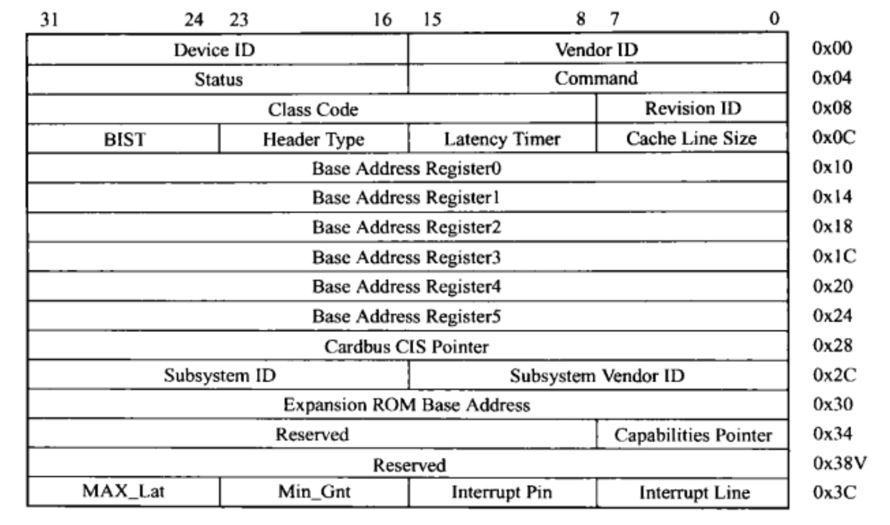
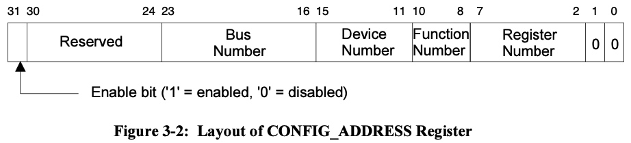
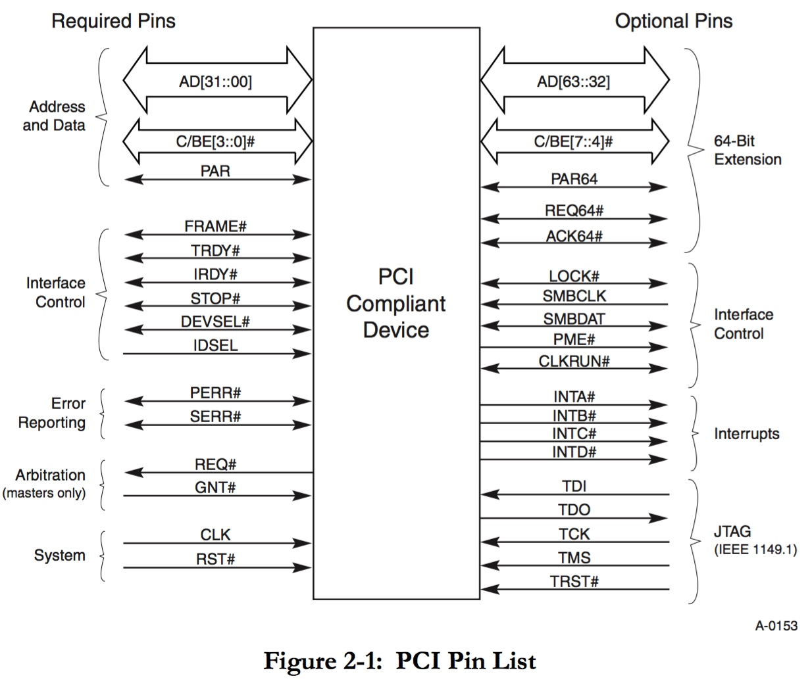
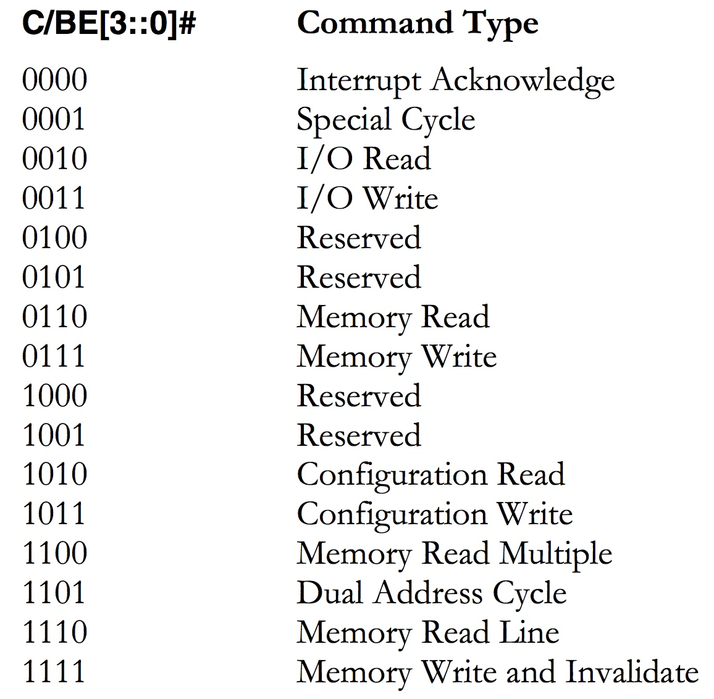
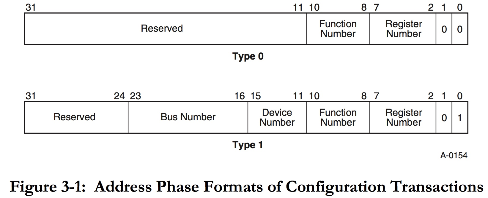
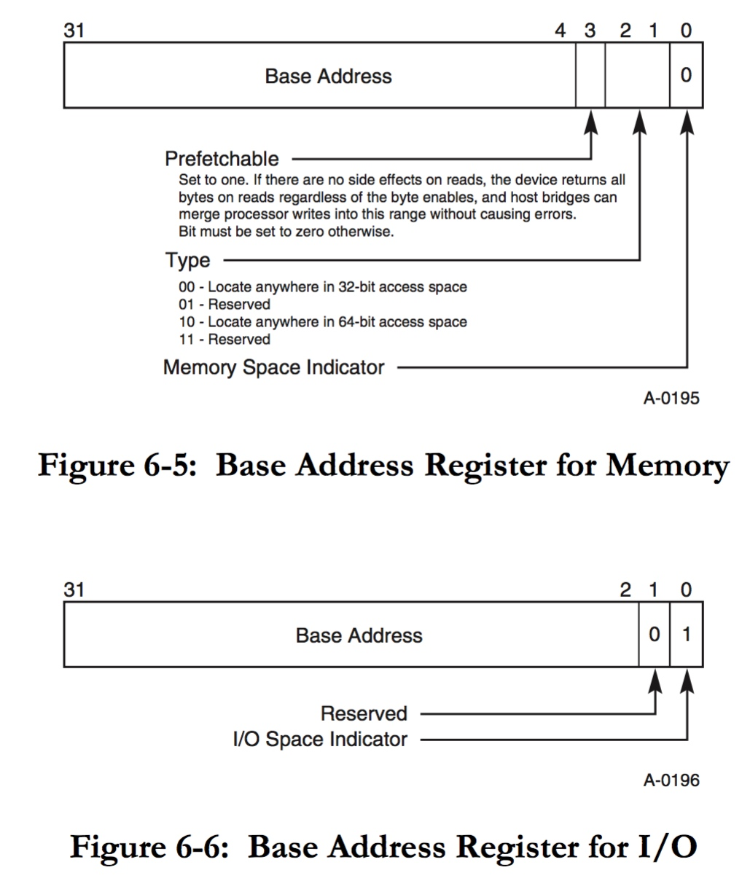

title:'Address Space'
## Address Space

PCI bus 实现三个 physical address space

- configuration address space
- port mapped IO address space，32 bit
- memory mapped IO address space，32 bit / 64 bit

其中

- configuration space 是必须的，包含 PCI 设备通用的寄存器
- port/memory mapped IO space 是可选的，可能用于访问其他 device-specific 的寄存器，也可能用于访问设备缓存


### Configuration Space

每个 PCI 设备都必须实现 256 字节的 configuration space，主要包含 PCI 设备通用的寄存器



CPU 域的地址空间和 PCI 总线的 configuration space 地址空间是完全分隔开的，CPU 通过设置 host bridge 的 CONFIG_ADDRESS 寄存器来指定 configuration space 空间的地址


本节描述 CPU 访问 PCI 设备的 configuration space 的全过程

#### 1. CPU: Access CONFIG_ADDRESS/CONFIG_DATA registers

每个 PCI bridge (或者称为 PCI controller) 内部都维护有两个寄存器：CONFIG_ADDRESS (0xcf8) 与 CONFIG_DATA (0xcfc)

当 CPU 需要访问某个 PCI 设备的 configuration space 中的某个寄存器时，就需要设置这个 PCI 设备所在的 PCI bridge (这里简化为 host bridge) 的 CONFIG_ADDRESS 寄存器



实际上就是将 host bridge 的 CONFIG_ADDRESS 寄存器的 b:d:f:r (bus number/device number/function number/register number) 字段设置为当前需要操作的 PCI 设备的 b:d:f:r 值


#### 2. host bridge: generate configuration transaction

当 host bridge (与 CPU 直接相连的 PCI bridge) 检测到 CONFIG_ADDRESS 寄存器被写入，同时寄存器的 Enable bit (bit[31]) 置位时，就会向与其相连的 PCI 总线发送一个 configuration transaction


所谓的 transaction，实际上就是 PCI 总线上一系列电气信号的组合，以下是 PCI 总线的硬件管脚的示意图




1. transaction type

PCI 总线分时复用 32 bit address/data bus (AD[31:0])，一个 bus transaction 通常包含一个 address phase 以及紧接着的一个或多个 data phase

- 在 address phase，address bus 用于传输 32 bit address
- 在 data phase，data bus 用于传输 32 bit data，其中 AD[7:0] 为 LSB data，AD[31:24] 为 MSB data


同时 PCI 总线分时复用 bus command 或 byte enable (C/BE[3:0]#)

- 在address phase，C/BE[3:0]# 描述当前传输的类型，因而 host bridge 需要发送 configuration transaction 的时候，C/BE[3:0]# 就会输出 b1010 或 b1011 信号，以表示当前是执行 configuration read/write 操作



- 在 data phase，C/BE[3:0]# 描述当前传输的 4 byte 数据中的有效数据的大小，其中 C/BE[0]# 对应于 LSB、C/BE[3]# 对应于 MSB，例如 BE[1] 为低电平时表示传输的 4 byte 数据中 byte[3:1] 为有效数据，即 byte[1] 为有效数据的 LSB


2. configuration transaction

当 host bridge 发送 configuration transaction 的时候，就会在 address bus 的 address phase 传输 32 bit address 信号，具体有以下两种 format

- Tyepe 0，AD[1:0] = 0，表示当前 configuration transaction 指向当前 PCI bus 的 local device
- Tyepe 1，AD[1:0] = 1，表示当前 configuration transaction 指向当前 PCI bus 上的 PCI bridge 之后的 PCI device




> Type0 configuration transaction

当传输 Type0 configuration transaction 时，address bus 只会传输 function/register number 这两个字段

device number 则是通过 IDSEL 管脚单独指定的，IDSEL 管脚即专门用于 configuration read/write 时的 chipselect 信号

PCI 总线上的 target device 的 IDSEL 信号线被拉高，同时解析 AD[1:0] 为 0、AD[10:8] 即 function number 为当前设备的 function number 时，该设备拉低 DEVSEL# 信号线以响应当前的 configuration transaction


> Type1 configuration transaction

当传输 Type1 configuration transaction 时，address bus 则分别传输 target device 的 bus/device/device/register number

当前 PCI bridge 会向其 PCI bus 下的所有 local bridge 广播 Type1 configuration transaction，PCI bridge 解析 AD[31::0] 中的 bus number，当该 bus numbe 落在该 PCI bridge 的 secondary number 以及 subordinate number 之间时，该 PCI bridge 即接收该 configuration transaction

- 当 bus number 等于该 PCI bridge 的 secondary number 时，该 PCI bridge 将接收的 Type1 configuration transaction 转化为 Type0 configuration transaction，并向下传输转化后的 configuration transaction，同时将对应 device number 处的 PCI device 的 IDSEL 拉高
- 当 bus number 大于该 PCI bridge 的 secondary number 时，该 PCI bridge 直接向下传输该 type1 configuration transaction


### Memory Mapped Space

PCI 总线拥有的另一地址空间是 memory mapped 地址空间

#### 1. enumerate memory mapped ranges

系统初始化阶段，会执行 PCI 设备的枚举，其中会扫描 host bridge 下所有 PCI 设备的 memory mapped 地址空间，将所有 PCI 设备的 memory mapped 地址空间的长度汇总起来，得到该 host bridge 所需要的 memory mapped 地址空间长度，最后向内核申请这段 memory mapped 地址空间，并分配给 host bridge

- enumerate memory mapped ranges

每个 PCI 设备的 configuration space 地址空间的 BAR (Base Address Register) 寄存器，描述了该 PCI 设备所需的 memory mapped 地址空间的长度与起始物理地址等信息

系统初始化阶段，在枚举所有 PCI 设备的 memory mapped 地址空间的时候，在这个阶段其实并不关心设备的 memory mapped 地址空间的起始物理地址，而只是关心该地址空间的长度，此时向设备的 BAR 寄存器写入全 1，再读出来的值就是设备的 memory mapped 地址空间的长度


- allocate memory mapped range to host bridge

在枚举阶段，将所有 PCI 设备的 memory mapped 地址空间的长度加起来，就得到了该 PCI 总线需要的 memory mapped 地址空间的总长度，向内核申请这段 memory mapped 地址空间，并分配给 host bridge

需要注意的是，以上步骤中分配的 memory mapped 地址空间是分配给 host bridge 的，而不是分配给该 PCI 总线上的一个个 PCI 设备的

这里的“分配”是指内核中通过 page table 描述映射返回的虚拟地址到 host bridge 占用的物理地址之间的映射关系

```
                        +-------------+
                        |     CPU     |
                        +-------------+
                              |
+-------------+               |              +-----------------+
|     RAM     | --------------+------------- | PCI host bridge |
+-------------+           local bus          +-----------------+
```

因为 host bridge 和内存一样都是连接到 local bus 上的，因而我们之前说的内存的物理地址实际上就是 local bus 上的物理总线地址；host bridge 同样占用一段 local bus 地址空间，上一个步骤中分配的 memory mapped 地址空间，实际上就是映射到 host bridge 占有的这一段 local bus 地址空间


- allocate memory mapped range to PCI device

接下来 host bridge 会为该 PCI 总线下的所有 PCI 设备“分配”对应的 memory mapped 地址空间

这里的“分配”实际上就是从 host bridge 的 memory mapped 地址空间切分出来一块，“分配”给相应的 PCI 设备，这一块切分出来的 memory mapped 地址空间的长度实际上就由分配的 PCI 设备的 BAR 寄存器指定

这一“分配”的过程实际上就是将分配给这个 PCI 设备的 memory mapped 地址空间的起始物理地址写入这个 PCI 设备的 BAR 寄存器，以表明该 PCI 设备对这段 memory mapped 地址空间的使用权


PCI 设备的 configuration space 地址空间最多可以实现 6 个 BAR 寄存器



bit [0] 描述 address space type，其值由硬件配置决定，0 描述 memory mapped IO，1 描述 port mapped IO


#### 2. access memory mapped space

之后当 CPU 对某个 PCI 设备的 memory mapped 地址空间进行访问时，MMU 会将 CPU 使用的虚拟地址转换为 local bus 上的物理地址，也就是 host bridge 占用的物理地址

host bridge 检测到该物理地址的访问时，就会向其连接的 PCI 总线广播发送该物理地址对应的 memory read/write transaction

此时 C/BE[3:0]# 信号线会输出 b0110 或 b0111 信号，以表示当前是执行 memory read/write 操作，同时 AD[31:2] 传输 30 bit 的 memory mapped 地址空间的物理地址

PCI 总线上的 PCI 设备会监测总线上的 memory transaction，当 AD[] 信号线传输的物理地址落在当前 PCI 设备的 memory mapped 地址空间（BAR 寄存器描述该 PCI 设备的 memory mapped 地址空间的起始物理地址）内的时候，该 PCI 设备就会拉低 DEVSEL# 信号以响应当前的 memory transaction
