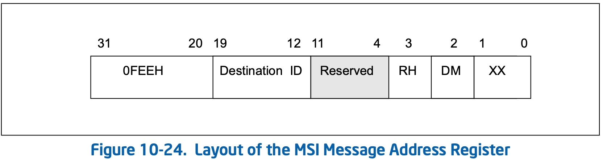
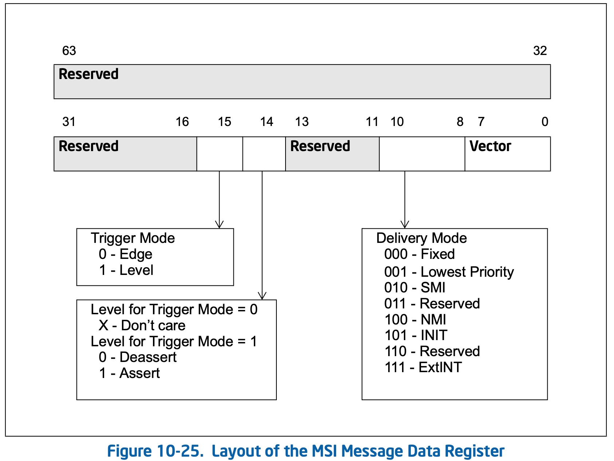

title:'MSI'
## MSI


### PCI

> PCI Local Bus Specification, Chpater 6 Configuration Space, 6.8 Message Signaled Interrupts

PCI 规范中使用 capability 机制来描述设备是否支持 MSI (Message Signaled Interrupts)

capability ID 字段为 05h，描述当前设备支持 MSI，此时 capability 的格式为


Message Address (32 bit) 和 Message Data (16 bit) 字段都是架构相关的

当设备发生中断的时候，设备就会向总线发起一次 memory write 操作，写操作的地址 (32 bit) 即为 Message Address 字段的值，写入的内容 (32 bit) 其低 16 bit 即为 Message Data 字段的值，高 16 bit 为 0


host bridge 监测到设备发起的 memory write 操作之后，就会将这个 memory write 总线操作翻译为内存操作，也就是对 Message Address 物理地址执行内存写操作，写入的数据即为 (低 16 bit 为 Message Data，高 16 bit 为 0)


### x86

> Intel 64 and IA-32 Architecture Software Developer Manual, Volume 3, Chapter 10 Advanced Programmable Interrupt Controller (APIC), 10.11 Message Signalled Interrupts

之前介绍过，PCI MSI capability 中的 Message Address (32 bit) 和 Message Data (16 bit) 字段都是架构相关的

在 x86 架构下，Message Address 具有以下格式



bit[31:20] 必须为 0FEEH

Destination ID (8 bit) 字段描述当前 MSI 中断应该发给哪个 CPU

这里暂不考虑 Redirection hint indication (RH) 与 Destination mode (DM) 字段，当 RH=0 时，当前 MSI 中断就会发给 Destination ID 字段描述的 CPU

-------

Message Data 具有以下格式



Vector (8 bit) 字段描述了当前 MSI 中断的 interrupt ID

------

我们知道 PCI host bridge 是通过 local bus 直接与 CPU 连接的

PCI 设备发生 MSI 中断的时候，实际上是向总线发起一次 memory write 操作，host bridge 会将这个 memory write 总线操作翻译为对 Message Address 物理地址处的内存写操作

```
                        +-------------+
                        |     CPU     |
                        +-------------+
                              |
+-------------+               |              +-----------------+
|     RAM     | --------------+------------- | PCI host bridge |
+-------------+           local bus          +-----------------+
```

而在 x86 架构下，对 0FEEH 起始的物理地址的内存写操作就会触发中断，准确地说是 Message Address 的 Destination ID 字段指定的 CPU 上会触发中断；当中断发生的时候，CPU 从写入的数据即 Message Data 的 Vector 字段获取当前 MSI 中断对应的 interrupt ID


### Routine

#### 1. setup interrupt domain

在 x86 架构下，使用以下两个 interrupt domain 来管理 MSI 中断，这两个 interrupt domain 实际上组成了一个 interrupt domain hierarchy，前者为后者的 parent 层级

```
arch/x86/kernel/apic/vector.c:x86_vector_domain
arch/x86/pci/init.c:x86_pci_msi_default_domain
```

系统初始化阶段在枚举 PCI 设备的过程中，当扫描到一个 PCI 设备的时候，会将该 PCI 设备绑定到 x86_pci_msi_default_domain

```sh
pci_set_bus_msi_domain
    dev_set_msi_domain // host bridge's domain = x86_pci_msi_default_domain
        # dev->msi_domain = d

pci_scan_single_device
pci_device_add
pcibios_add_device
    dev_set_msi_domain // every PCI device's domain = x86_pci_msi_default_domain
        # dev->msi_domain = d
```


#### 2. allocate MSI-X

PCI 设备 probe 过程中可以调用 pci_alloc_irq_vectors_affinity() 接口为一个 PCI 设备一次性分配多个 MSI-X 中断，并且可以由调用者指定分配的 MSI-X 中断的 CPU affinity

这一接口广泛应用于 virtio-blk/nvme 这些 mq 设备，在这些场景下设备往往有多个硬件队列，而每个硬件队列都需要分配对应的 MSI-X 中断，因而需要为一个设备分配多个 MSI-X 中断；同时这些设备往往还需要自己指定各个硬件队列的 CPU affinity，即指定分配的各个 MSI-X 中断的 CPU affinity

```c
int pci_alloc_irq_vectors_affinity(struct pci_dev *dev, unsigned int min_vecs,
				   unsigned int max_vecs, unsigned int flags,
				   struct irq_affinity *affd)
```

该函数为 @dev PCI 设备分配一定数量的 MSI-X 中断，其中请求分配的中断数量为 @max_vecs，分配的结果可能不足额，但是至少分配 @min_vecs 数量的中断

@affd 描述分配的这些中断的 CPU affinity，该参数可以为 NULL，此时分配的中断的 CPU affinity 实际为 irq_default_affinity，即默认与所有 CPU 绑定


例如 virtio 设备 probe 过程中的调用栈为

```sh
# virtio device probe
bus_type->probe(), that is, virtio_dev_probe
    virtio_driver->probe(), e.g. virtblk_probe
        virtio_find_vqs
            config->find_vqs(), i.e. vp_modern_find_vqs
                vp_find_vqs
                    vp_find_vqs_msix # Try MSI-X with one vector per queue
                        vp_request_msix_vectors
                            pci_alloc_irq_vectors_affinity
```


nvme 设备 probe 过程中的调用栈为

```sh
"nvme_reset_wq" worker
nvme_reset_work
    nvme_setup_io_queues
        nvme_setup_irqs // allocate MSI IRQ for IO queues
            pci_alloc_irq_vectors_affinity
```


##### 2.1 build CPU affinity

第一步是为需要分配的每个 MSI-X 中断计算其各自对应的 CPU affinity

pci_alloc_irq_vectors_affinity() 函数的调用者可以通过传入的 @affd 参数来描述这些中断的 CPU affinity 需求，之后函数就会根据 @affd 参数描述的辅助信息来计算各个 MSI-X 中断对应的 CPU affinity

```c
struct irq_affinity {
	int	pre_vectors;
	int	post_vectors;
};
```

该函数需要分配 @max_vecs 数量的中断，其中起始的 @pre_vectors 数量、以及末尾的 @post_vectors 数量的中断，不需要计算其 CPU affinity，此时这些中断的 CPU affinity 实际为 irq_default_affinity，即默认与所有 CPU 绑定；剩余的所有中断则需要根据 NUMA node、CPU topology 计算中断的 CPU affinity，从而让这些中断在所有的 possible CPU 中均匀分布


而如果传入的 @affd 参数为 NULL，同时传入的 @flags 参数包含 PCI_IRQ_AFFINITY 标志，那么在函数内部 @affd 参数会被设置为 msi_default_affd，即当前分配的所有中断，都需要按照 NUMA node、CPU topology 计算中断的 CPU affinity，即所有这些中断都需要在所有的 possible CPU 中均匀分布

```c
struct irq_affinity msi_default_affd = {
    pre_vectors = 0,
    post_vectors = 0
};
```

```sh
pci_alloc_irq_vectors_affinity
    __pci_enable_msix_range
        __pci_enable_msix
            msix_capability_init
                msix_setup_entries
                    irq_create_affinity_masks
                        irq_build_affinity_masks # build CPU affinity
```


> mapping algorithm

之前介绍过，分配的 @max_vecs 数量的中断中，除了起始的 @pre_vectors 数量、以及末尾的 @post_vectors 数量的中断，其余中断需要根据 NUMA node、CPU topology 计算中断的 CPU affinity，从而让这些中断在所有的 possible CPU 中均匀分布。以下举例介绍这些中断是如何在所有 possible CPU 中均匀分布的

假设一个设备申请分配 X 个 MSI-X 中断，而当前系统中只有一个 NUMA-node，同时系统中 CPU 的数量是 num_cpus，那么每个 MSI-X 中断就会与 (num_cpus/X) 数量的 CPU 相绑定

假设设备拥有 4 个硬件队列，那么设备会申请分配 4 个 MSI-X 中断，假设当前系统中 CPU 的数量是 16，那么每个 MSI-X 中断就会与 4 个 CPU 相绑定，其中维护一个 cpumask 来描述当前可用的 CPU，例如初始时该 cpumask 的值为 0xffff，表示当前 16 个 CPU 都可用

- 例如对于硬件队列 0
    - 首先从 cpumask 中取出 first set bit 即 bit 0，表示硬件队列 0 映射到 CPU 0 的 software queue，此时 cpumask 更新为 0xfffe
    - 由于一组 sibling 会优先映射到同一个硬件队列，因而 CPU 0 的 sibling 即 CPU 8 也会优先映射到硬件队列 0
    - 之后再重复以上的操作，从 cpumask 中取出 first set bit 即 bit 1，表示硬件队列 0 映射到 CPU 1 的 software queue，此时 cpumask 更新为 0xfffd
    - CPU 1 的 sibling 即 CPU 9 也会优先映射到硬件队列 0
    - 至此已经完成了硬件队列 0 到 4 个 software queue 的映射，即该硬件队列映射到 CPU 0/1/8/9
- 对于接下来的硬件队列 1 也是如此，会映射到 CPU 2/3/10/11


此外如果系统包含多个 NUMA-node，那么一个 MSI-X 中断映射的 CPU 也会在所有 NUMA-node 中均匀分布


> support for multi queue mapping

由于内核在 v5.0 版本引入 multi queue mapping 特性，@affd 参数也有一些调整，此时 @affd 参数的语义变为

```c
struct irq_affinity {
	unsigned int	pre_vectors;
	unsigned int	post_vectors;
	unsigned int	nr_sets;
	unsigned int	set_size[IRQ_AFFINITY_MAX_SETS];
	void		(*calc_sets)(struct irq_affinity *, unsigned int nvecs);
};
```

当前申请的所有中断划分为多个 set，例如其中一部分中断用于 HCTX_TYPE_DEFAULT，另一部分中断用于 HCTX_TYPE_READ，set 的数量由 @nr_sets 描述，各个 set 中包含的中断数量由 @set_size[] 数组描述

除了通过 @nr_sets、@set_size[] 字段指定中断的划分形式之外，还可以通过传入的 @calc_sets() 回调函数来指定。这是因为用户申请分配 @max_vecs 数量的中断，但是由于各种原因设备实际上可分配的中断数量 @nvecs 可能小于 @max_vecs 的值，函数在计算出设备实际可用的中断数量即 @nvecs 之后，就会调用 @affd->calc_sets() 回调函数，在该回调函数中用户可以根据传入的 @nvecs 参数重新计算并设置 @affd 的 @nr_sets、@set_size 字段


此时映射算法也作了相应的调整，当前需要分配的 @max_vecs 数量的中断被划分为多个 set，每个 set 的中断都会均匀映射到所有 CPU，例如

- 对于其中的第一个 set，其包含的中断数量为 @set_size[0]，这些数量的中断会均匀映射到所有 CPU
- 同时对于其中的第二个 set，其包含的中断数量为 @set_size[1]，这些数量的中断也会均匀映射到所有 CPU


##### 2.2 select IRQ destination CPU

上述介绍了用户可以调用 pci_alloc_irq_vectors_affinity() 为设备分配多个 MSI-X 中断，其中的 irq_build_affinity_masks() 会计算各个 MSI-X 中断的 CPU affinity

但是以上计算出来的 CPU affinity 只是软件层面的含义，落实到硬件上，一个 MSI-X 中断触发的时候，相应的中断信号只能路由到一个 CPU 处理器 (即对 Message Address 物理地址处写入的数据即 Message Data 的 Vector 字段)，由这个 CPU 来处理该 MSI-X 中断

因而在确定了各个 MSI-X 中断的 CPU affinity 之后，对于每个 MSI-X 中断，还需要从对应 CPU affinity 描述的所有 CPU 中选出一个 CPU，到时候由这个 CPU 来处理该 MSI-X 中断，也即所谓的 destination CPU，这一部分的工作位于 pci_msi_setup_msi_irqs()

```sh
pci_alloc_irq_vectors_affinity
    __pci_enable_msix_range
        __pci_enable_msix
            msix_capability_init
                msix_setup_entries
                    irq_create_affinity_masks
                        irq_build_affinity_masks # build CPU affinity
                pci_msi_setup_msi_irqs # program calculated CPU affinity
                    domain = pci_dev->dev->msi_domain, i.e., x86_pci_msi_default_domain
                    msi_domain_alloc_irqs
                        domain->host_data->ops->domain_alloc_irqs, i.e., __msi_domain_alloc_irqs
```


> 2.2.1 allocate interrupt descriptor

首先为当前 MSI 中断分配一个对应的中断描述符

```sh
__msi_domain_alloc_irqs
    __irq_domain_alloc_irqs
        irq_domain_alloc_descs
            __irq_alloc_descs // allocate irq descriptors & irq number
```

> 2.2.2 allocate destination cpu and vector

接下来就是为每个 MSI 中断从对应 CPU affinity 中选出一个 destination CPU

matrix_find_best_cpu() 描述了从 MSI 中断的 CPU affinity 中挑选出目标 CPU 的算法，x86/aarch64 架构下其主要逻辑都是按照 load balance 原则，在 CPU affinity 中挑选中断负载最轻的一个 CPU 作为最终的目标 CPU

例如 x86 架构中维护一个 per-CPU 变量 @vector_matrix.maps 来描述各个 CPU 上的中断分配情况

```c
static struct irq_matrix *vector_matrix;

struct irq_matrix {
	struct cpumap __percpu	*maps;
	...
} 

struct cpumap {
	unsigned int		available;
	unsigned long		alloc_map[IRQ_MATRIX_SIZE];
	...
};
```

@available 描述该 CPU 上剩余可用的（也就是未分配的）中断的数量，因而该字段的值越大，对应 CPU 上的中断负载也就越小，因而以上算法实际上就是在 CPU affinity 中寻找 @available 最大的那个 CPU


在确定目标 CPU 之后，还需要为当前 MSI 中断分配一个 interrupt ID (或者说是 vector number)，每个 CPU 都有一个独立的 vector number 域，之前介绍的 per-CPU 变量 @vector_matrix.maps 的 @alloc_map bitmap 描述了该 CPU 上已经分配的 vector number，因而当前只需要通过这个 bitmap 分配一个 vector number


最终以上描述的 (target CPU, vector number) 会暂时缓存在 apic_chip_data->hw_irq_cfg 中

```sh
__msi_domain_alloc_irqs
    ...  
    irq_domain_alloc_irqs_hierarchy
        x86_pci_msi_default_domain->ops->alloc(), i.e., msi_domain_alloc()
            irq_domain_alloc_irqs_parent     
                
                irq_domain_alloc_irqs_hierarchy
                    x86_vector_domain->ops->alloc(), i.e., x86_vector_alloc_irqs()
                        assign_irq_vector_policy
                            assign_irq_vector
                                assign_vector_locked
                                    irq_matrix_alloc
                                        matrix_find_best_cpu // find one cpu in terms of load balance
                                        matrix_alloc_area // allocate one vector in this cpu scope
                                    apic_update_vector
                                        per_cpu(vector_irq, cpu)[vec] = desc
                                    
                                    apic_update_irq_cfg
                                            apic_chip_data->hw_irq_cfg.vector = vector
                                            apic_chip_data->hw_irq_cfg.dest_apicid = apic->calc_dest_apicid(cpu), i.e., apic_flat_calc_apicid(), that is, "1U << cpu"
```


这里还需要注意的一点是，x86 下维护了一个 per-CPU 的数组 @vector_irq[]，来描述每个 CPU 上 vector number 与对应的中断描述符之间的映射关系，vector number 作为数组的 index，@vector_irq[vector number] 即为该 vector nunmber 对应的中断描述符

```c
typedef struct irq_desc* vector_irq_t[NR_VECTORS];
DECLARE_PER_CPU(vector_irq_t, vector_irq);
```

此时在确定 (target CPU, vector number) 之后，就会在 @vector_irq[] 数组中保存当前 MSI 中断对应的中断描述符


> 2.2.3 configure MSI capability

最后会配置该 PCI 设备的 MSI capability 的 Message Address 与 Message Data 字段

这两个字段的值实际上就来自之前计算的 (target CPU, vector number)

```sh         
__msi_domain_alloc_irqs
    ...       
    irq_domain_activate_irq
        __irq_domain_activate_irq
            x86_pci_msi_default_domain->ops->alloc(), i.e., msi_domain_activate()
                irq_chip_compose_msi_msg
                    chip->irq_compose_msi_msg(). i.e., lapic_controller->irq_compose_msi_msg(), i.e., x86_vector_msi_compose_msg()
                        __irq_msi_compose_msg
                            msg->arch_addr_lo.base_address = X86_MSI_BASE_ADDRESS_LOW, i.e., (0xfee00000 >> 20)
                            msg->arch_addr_lo.destid_0_7 = cfg->dest_apicid & 0xFF;
                            msg->arch_data.delivery_mode = APIC_DELIVERY_MODE_FIXED;
                            msg->arch_data.vector = cfg->vector;
                
                irq_chip_write_msi_msg
                    chip->irq_write_msi_msg(), i.e., lapic_controller->irq_write_msi_msg(), i.e., pci_msi_domain_write_msg()
                        __pci_write_msi_msg
                            // write msg->address_lo to PCI_MSI_ADDRESS_LO reg
                            // write msg->data to PCI_MSI_DATA_32 reg
```     

 
#### 3. MSI interrupt entry

最终当 MSI 中断发生时，CPU 处理器通过 Message Data 的 Vector 字段获取触发当前 MSI 中断的 vector number

MSI 中断的入口为 common_interrupt()，其中就会从 @vector_irq[] 数组获取该 vector number 对应的中断描述符，中断描述符中就保存了该 MSI 中断的所有信息，包括中断处理程序等

```sh
common_interrupt
	desc = __this_cpu_read(vector_irq[vector]);
```


