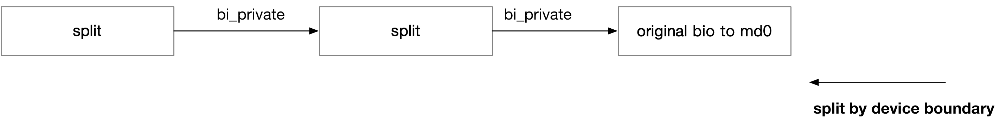

## md - 0 Base


### Concept

struct md_rdev 抽象 target device，@bdev 就指向对应的底层设备对应的 bdev

```c
struct md_rdev {
	struct block_device *bdev; /* block device handle */
	...
}
```


struct mddev 抽象一个 mapped device，@disks 链表就组织其映射的所有 target devices

```c
struct mddev {
	struct list_head		disks;
	...
}
```


### Routine

当调用 "mdadm --create /dev/md0 --level=0 --raid-devices=2 /dev/vd[bc]" 创建 raid 设备时，实际上拆解为以下几个步骤

1. new_array

向 `/sys/module/md_mod/parameters/new_array` 写入 "md0" 以创建 "/sys/block/md0/md" 设备


2. SET_ARRAY_INFO

向 `/sys/block/md0/dev` ("/dev/md0") 执行 SET_ARRAY_INFO ioctl


3. ADD_NEW_DISK

向 `/sys/block/md0/dev` ("/dev/md0") 执行 ADD_NEW_DISK ioctl

```sh
md_ioctl
    md_add_new_disk // create 'struct md_rdev'
```


4. RUN_ARRAY

向 `/sys/block/md0/dev` ("/dev/md0") 执行 RUN_ARRAY ioctl


```sh
md_ioctl
    do_md_run
        bioset_init(&mddev->bio_set, ...) // init @bio_set
        find_pers // find 'struct md_personality' using @clevel
        pers->run(mddev)
```


### IO routine

md_rdev->sectors 字段描述了对应的 target device 的大小

```c
struct md_rdev {
	sector_t sectors;		/* Device size (in 512bytes sectors) */
	...
}
```


mddev->chunk_sectors 字段描述了 stripe 的大小

```c
struct mddev {
	int				chunk_sectors;
	...
}
```


```sh
md_submit_bio
    md_handle_request
        mddev->pers->make_request(mddev, bio)
            bio_set_dev(bio, rdev->bdev);
            bio->bi_iter.bi_sector = ...
```



md 框架中会复用 original bio，即发往 target device 的 bio，实际上就是一开始发往 mapped device 的那个 original bio
