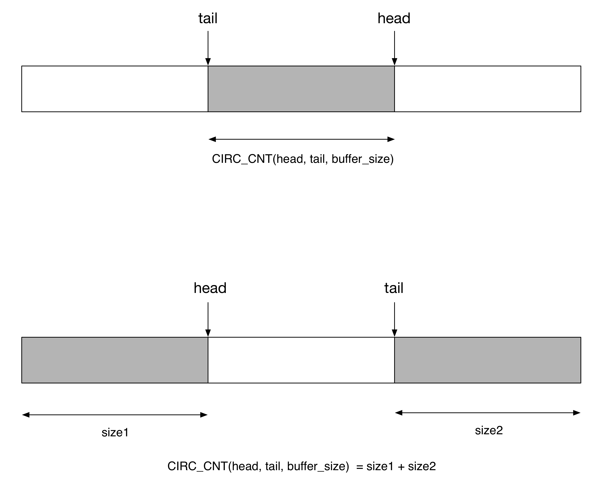
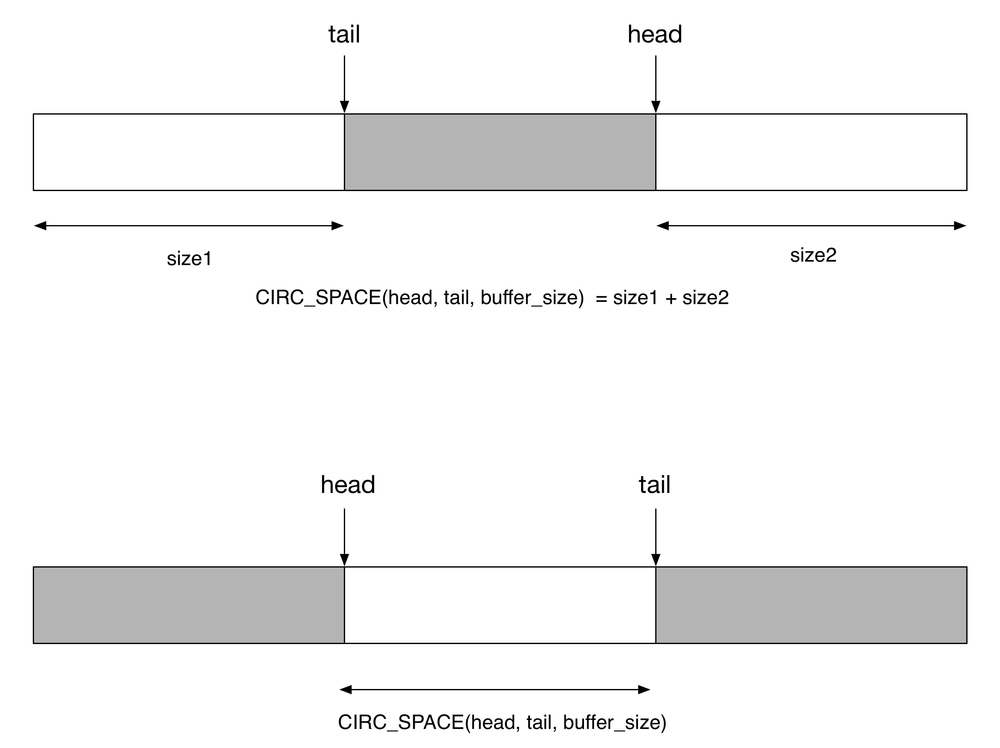
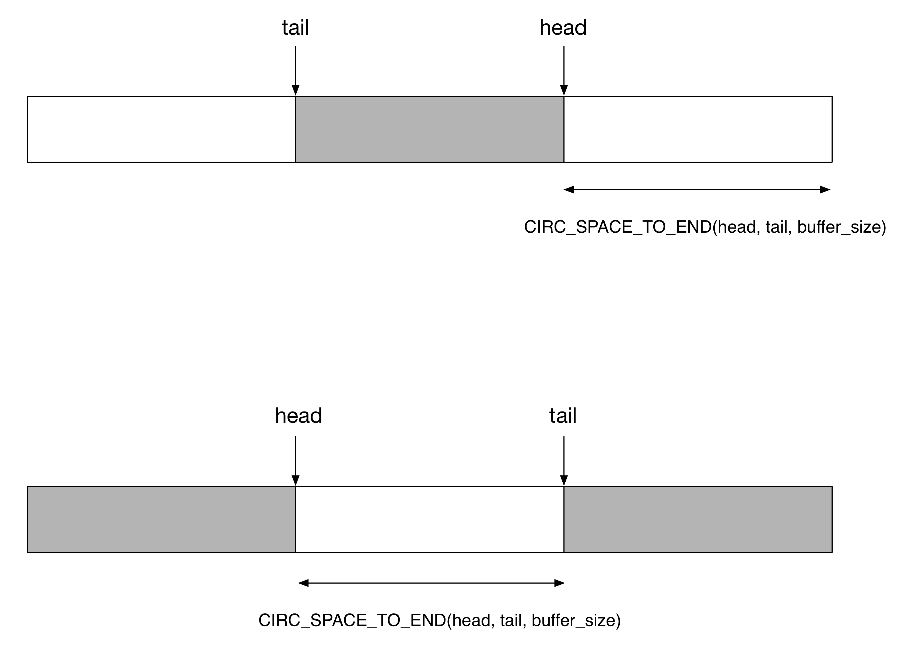
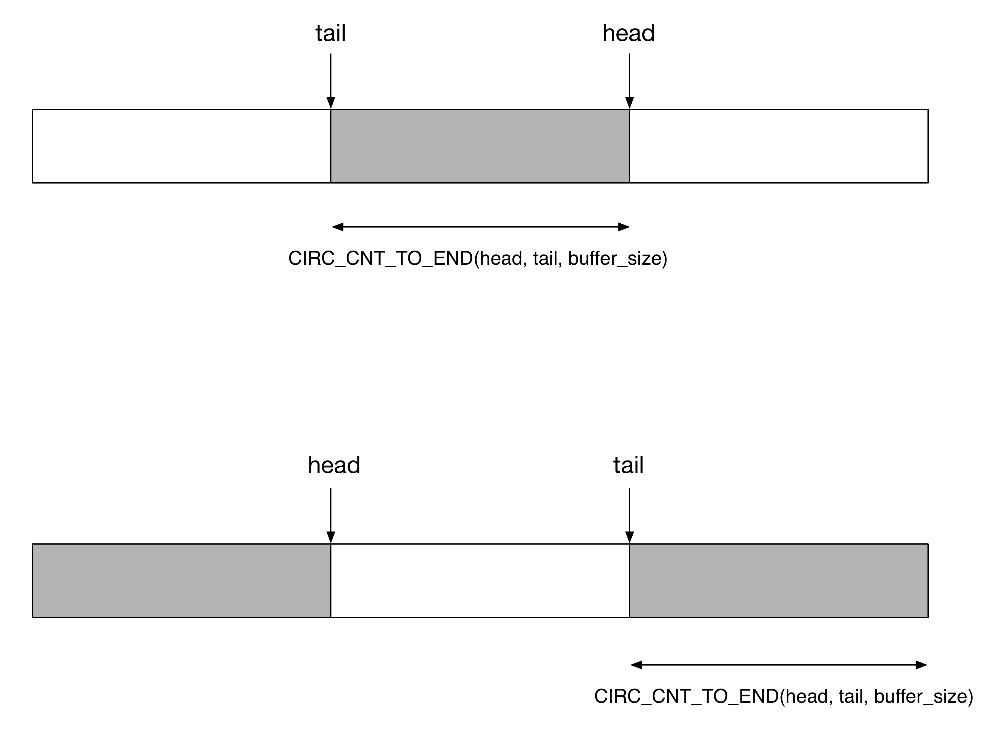

## FIFO - 1 circ_buf

### Concept

队列 (FIFO, First In First Out) 与循环缓冲区 (circular buffer) 在本质上是同一个东西，以下介绍 FIFO 的三种常用的实现方式

#### implementation 1

```c
struct cirbuf {
    char    *buf;
    size_t  size;
    
    size_t  head;
    size_t  tail;
};
```

循环缓冲区的实现中，至少需要一个指针描述缓冲区的地址，以及一个整数描述该缓冲区的大小

在此基础上，循环缓冲区最简单的一种实现是，使用两个指针或两个 index 描述缓冲区当前的使用状况，例如使用 index 描述缓冲区的使用状况时

- head 描述 (producer) 接下来可以写入的第一个元素的 index
- tail 描述 (consumer) 接下来可以读取的第一个元素的 index

那么

- 初始时，`head = tail = 0`
- head 与 tail 的取值范围都是 [0, size)，也就是说当 head/tail 到达 size 边界时，需要 wrap 回到 0，即 `index = (index+1) % size`
- 数据长度 `len = (head - tail + size) % size`


此时无论缓冲区空还是满，都有 `head == tail`，因而为了区分空与满这两种状态，在表示缓冲区满的状态时，会浪费一个 slot，即此时 head 指向的 slot 实际为空，但是整个缓冲区会显示已满，而无法将数据写入 head 指向的 slot

- `head == tail` 表示缓冲区空
- `(head + 1) % size == tail` 表示缓冲区满


#### implementation 2

另外一种实现方式是，将 head/tail 是永远单调递增的，其取值范围不局限在 [0, size)

```c
struct cirbuf {
    char    *buf;
    size_t  size;
    
    size_t  head;
    size_t  tail;
};
```

此时

- 数据长度 `len = head - tail`
- `head == tail` 表示缓冲区空
- `len = head - tail == size` 表示缓冲区满


#### implementation 3

另外一种实现为

```c
struct cirbuf {
    char    *buf;
    size_t  size;
    size_t  used;
    
    size_t  head;
};
```

此时 used 表示缓冲区中存储的元素的个数，此时可以计算

```
tail = (head + used) % size;
```

此时使用 used 自身的状态就可以描述缓冲区的使用状况

- `used == 0` 表示缓冲区空
- `used == size` 表示缓冲区满


### circ_buf

内核中定义了两个循环缓冲区的原语，circ_buf 与 kfifo，其中前者的实现更为底层，同时也暴露了更多的接口，其只是表示一个循环缓冲区，其中存储的什么元素其本身并不关心，用户可以用它存储规格化的元素，也可以存储 variable size 的元素；而后者封装、抽象的程度更高，它有元素的概念，即只能存储规格化的、大小一致的元素

本文首先介绍 circ_buf (circular buffer)

#### data structure

struct circ_buf 抽象 circular buffer

```c
struct circ_buf {
	char *buf;
	int head;
	int tail;
};
```

@buf 指向占用的内存空间

@head 指向下一个可写的位置，@tail 指向下一个可读的位置，两者的取值范围都是 [0, size)

- 当 head == tail 时，缓冲区为空
- 当 head + 1 == tail 时，缓冲区为满


#### buffer space mesaurement

circ_buf 的大小必须是 power-of-2 的，这样可以使用 & 操作快速计算缓冲区中已经被占用的区域或空闲区域的大小，内核定义了一系列的宏来计算循环缓冲区的大小

> CIRC_CNT

```c
#define CIRC_CNT(head,tail,size) (((head) - (tail)) & ((size)-1))
```

CIRC_CNT() 返回缓冲区中被占用区域的大小，其中 size 参数为 buffer size，必须为 power-of-2，该宏通常用于表示 consumer 可以使用的数据大小




> CIRC_SPACE

```c
#define CIRC_SPACE(head,tail,size) CIRC_CNT((tail),((head)+1),(size))
```

CIRC_SPACE() 返回缓冲区中剩余可用区域的大小，其中 size 参数为 buffer size，必须为 power-of-2，该宏通常用于表示 producer 可以继续生成的数据大小




> CIRC_SPACE_TO_END

```c
#define CIRC_SPACE_TO_END(head,tail,size) \
	({int end = (size) - 1 - (head); \
	  int n = (end + (tail)) & ((size)-1); \
	  n <= end ? n : end+1;})
```

CIRC_SPACE_TO_END() 返回缓冲区中最大连续可用区域的大小，即 producer 可以使用的最大连续数据大小




> CIRC_CNT_TO_END

```c
#define CIRC_CNT_TO_END(head,tail,size) \
	({int end = (size) - (tail); \
	  int n = ((head) + end)& ((size)-1); \
	  n < end ? n : end;})
```

CIRC_CNT_TO_END() 返回缓冲区中最大连续占用区域的大小，即 consumer 可以使用的最大连续数据大小




#### use pattern

##### single producer & single consumer

在 single producer - single consumer 场景下，不需要任何锁机制对 circ_buf 的操作进行保护，此时只需要 barrier barrier 对 head/tail 的更新进行保护即可

1. producer

producer 常用的模式为

```c
	unsigned long head = buffer->head;
	unsigned long tail = READ_ONCE(buffer->tail);

	if (CIRC_SPACE(head, tail, buffer->size) >= 1) {
		/* insert one item into the buffer */
		struct item *item = buffer[head];

		produce_item(item);

		smp_store_release(buffer->head,
				(head + 1) & (buffer->size - 1));

		/* wake_up() will make sure that the head is committed before
		 * waking anyone up */
		wake_up(consumer);
	}
```

producer 需要写 head，而 consumer 需要读 head

producer 需要在内存循环缓冲区中写入相应的内容之后，才能更新 head；但是这一顺序可能被处理器的乱序执行破坏，因而这里用一个 store release barrier 来确保两者的先后顺序不会被破坏

> store release barrier 能够确保，在此之后的 write 操作，不会与在此之前的 read/write 操作发生乱序


2. consumer

consumer 常用的模式为

```c
	/* Read index before reading contents at that index. */
	unsigned long head = smp_load_acquire(buffer->head);
	unsigned long tail = buffer->tail;

	if (CIRC_CNT(head, tail, buffer->size) >= 1) {

		/* extract one item from the buffer */
		struct item *item = buffer[tail];

		consume_item(item);

		/* Finish reading descriptor before incrementing tail. */
		smp_store_release(buffer->tail,
				  (tail + 1) & (buffer->size - 1));
	}
```

consumer 需要写 tail，而 producer 需要读 tail

consumer 需要从内存循环缓冲区读取相应的内容之后，才能更新 tail；但是这一顺序可能被处理器的乱序执行破坏，因而这里用一个 store release barrier 来确保两者的先后顺序不会被破坏


##### multi producer/consumer

在 single producer - single consumer 使用场景下，只需要使用 memory barrier 对 producer/consumer 的并行访问进行保护即可

- 一旦存在多个 producer，producer 侧必须使用相应机制将多个 producer 的操作串行化，例如

```c
	spin_lock(&producer_lock);
	/* producer operation described as above */
	spin_unlock(&producer_lock);
```

- 类似地，一旦存在多个 consumer，consumer 侧必须使用相应机制将多个 consumer 的操作串行化，例如

```c
	spin_lock(&consumer_lock);
	/* consumer operation described as above */
	spin_unlock(&consumer_lock);
```
