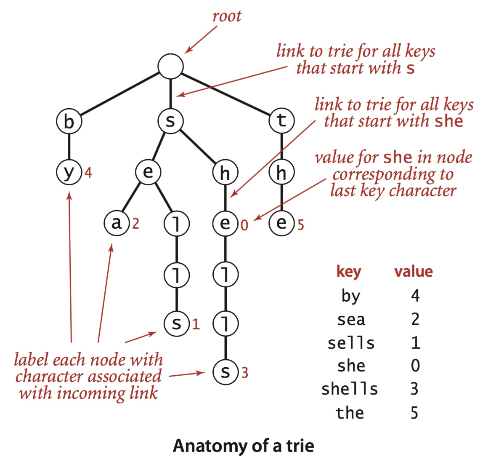
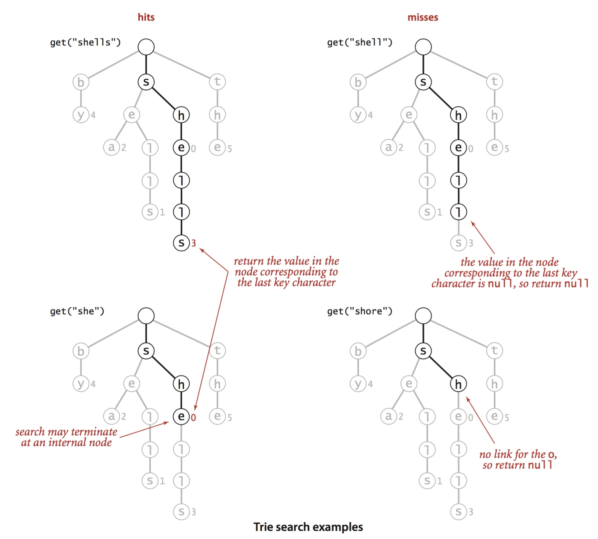
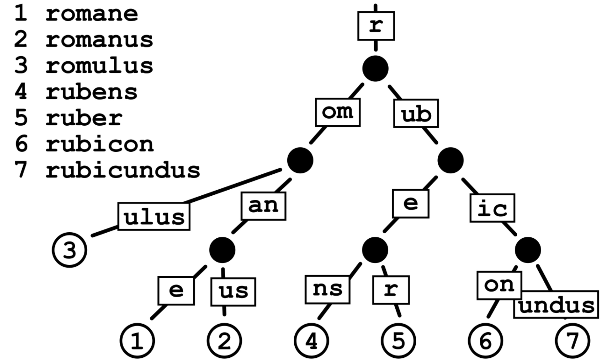

## Radix Tree - Base


### Trie

Trie (retrieval 检索) 是一种基于字符的查找树，trie 通常用于存储 dynamic set 或 associative array；trie 的 key 通常为字符串 string，即 string key，但节点并不存储 key-value pair，节点对应的 key 与节点在树中的位置相关，即节点只是存储一个字符，其中根节点存储 null 字符，一个节点对应的 key 为其父节点的 string 加上节点自身存储的字符，即每个节点继承其父节点的 string 作为前缀，因而 trie 也称为 prefix tree；同时对于中间节点的 key，可能并不存在相应的 value 与其对应，而对于叶子节点，必然存在相应的 value 与之对应




上例中存在的 key-value pair 有

```
   key  value
{"by",     4}
{"sea",    2}
{"sells",  1}
{"she",    0}
{"shells", 3}
{"the",    5}
```


> search




当需要存储一组 key-value pair，其中 key 为字符串时，若 key-value pair 的数量为 n，key 对应的字符串的长度为 k，则

- 使用 binary search tree 存储时，其查找的时间复杂度为 O(log n)
- 使用 trie 存储时，其查找的时间复杂度为 O(k)

因而当存储的 key-value pair 的数量很大时，trie 具有更高的查找速度


### Radix Tree

Radix Tree 是一种 compressed trie (space optimized)，若节点为其父节点的唯一一个子节点时，将该节点与其父节点合并，从而减小存储占用的内存空间




```
    e - l - l - o
  /
h - a - t
      \
       v - e
```


```
            *
           /
        (ello)
         /
* - h - * -(a) - * - (t) - *
                 \
                 (ve)
                   \
                    *
```


此外 Trie 的 key 通常为 string，实现 string 与 value 之间的映射，而 radix tree 的 key 通常为 long integer，实现 long integer 与 value 之间的映射


例如对于 32 bit 的 unsinged long，在每个节点中存储其中的 8 bit，下图中存储 0xffff3000、0xffffffff、0xfeffffff 这 3 个 unsigned long

``` 
                            -(0x30) - (0x00)    -> 0xffff3000
                          / 
        - (0xff) - (0xff) - (0xff) - (0xff)     -> 0xffffffff
root - |
        - (0xfe) - (0xff) - (0xff) - (0xff)     -> 0xfeffffff
```


当 radix tree 的一个节点可以存储 long integer 中的 m bit 时，对于 n bit 长的 long integer，其查找的时间复杂度即为 O(n/m)

