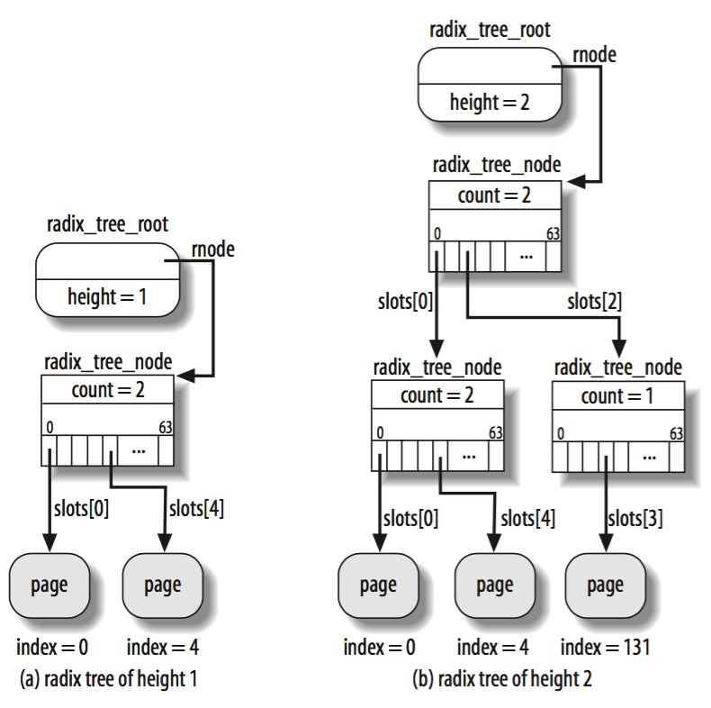
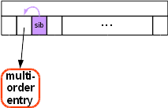
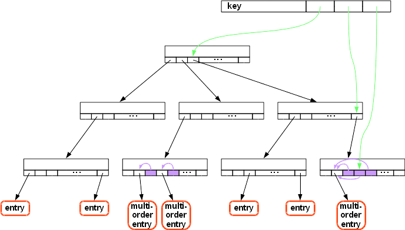

## Radix Tree - Radix Tree


radix tree 实现的 key-value 映射为 {index, item}，即 unsigned long (key) 到 void * pointer (value) 的映射

```c
unsigned long index, void *item
```

index 由节点在 radix tree 中的位置描述，而 item 则保存在对应节点的 @slots[] 数组中。对于中间节点，@slots[] 数组保存当前节点的子节点；而对于叶子节点，@slots[] 数组则存储对应的 item




### Concept

#### radix_tree_root

struct radix_tree_root 抽象 radix tree root

```c
struct radix_tree_root {
	...
	struct radix_tree_node	*rnode;
};
```

@rnode 即指向该 radix tree 的 level 1 node


#### radix_tree_node

radix tree 的每一层由一个或多个 radix_tree_node 构成，每个 radix_tree_node 最多可以包含 RADIX_TREE_MAP_SIZE 即 64 个子节点

```c
struct radix_tree_node {
	unsigned char	offset;	 /* Slot offset in parent */
	unsigned char	count;	 /* Total entry count */
	struct radix_tree_node *parent; /* Used when ascending tree */
	struct radix_tree_root *root;   /* The tree we belong to */
	void	*slots[RADIX_TREE_MAP_SIZE];
	...
};
```

@slots[] 数组即描述该节点的所有子节点，每个节点最多包含 RADIX_TREE_MAP_SIZE 即 64 个子节点
@count 描述 @slots[] 数组中实际使用的子节点的数量，即非 NULL slot 的数量

@parent 描述该节点的父节点 (不包括根节点)，即 level 1 节点的 @parent 字段的值为 NULL，此时 @root 字段就描述了当前节点的父节点；@offset 描述该节点在其父节点中的偏移


> height

每个节点包含 RADIX_TREE_MAP_SIZE 即 64 个 slot，因而 radix tree 中的每一层都需要 index 中的 6 bit 用于寻址

```c
struct radix_tree_node {
	unsigned char	shift;	 /* Bits remaining in each slot */
	...
}
```

@shift 描述当前节点的 subtree 的规模，即 @slots[] 数组中的任意一个 slot 指向的 subtree 最多可以包含 (2^shift) 个子节点，叶子节点的 @shift 字段即为 0

因而 @shift 实际上描述了，@slots[] 数组中的任意一个 slot 指向的 subtree，仍需要 index 的剩余 @shift bits 来进行寻址

@shift 实际上在一定程度上描述了当前节点在整棵树中的高度 (位置)，叶子节点的 @shift 字段为 0，越接近根节点 (即高度越高)，@shift 越大


当 index 小于 64 时，所有的 item 只需存在 level 1 node 即可，此时 radix tree 的高度只有 1；而当 index 大于等于 64 时，就必须构建多层的 radix tree

因而 index 最高的 6 bit 用于在 level 1 node 中寻址，之后的 6 bit 用于在 level 2 node 中寻址，以此类推，最后的 6 bit 则用于在对应的叶子节点中寻址


> slot type

此时 radix_tree_node->slot[] 数组中的一个 slot 可能指向一个 item (data entry)，也有可能指向下一级的 radix_tree_node (internal entry)

此时使用 slot 存储的指针的低 2 bits 来区分上述两种 entry，v4.19 中的实现为

```
 * 00 - data pointer
 * 01 - internal entry
```


#### multi-order entry

每个 inode 的 address space 都维护一棵 @page_tree radix tree 用于管理该 inode 下的所有 page cache，其中 value 为 page descriptor，key 即为该 page frame 在该 address space 中的 offset 即 @page->index

当系统支持 huge page 时，系统中同时存在 4KB small page 和 2MB huge page，而每个 slot 还是 4KB 大小，因而此时 radix tree 必须提供某种特性使得多个 slot 指向同一个 2MB page descriptor，这也就是 multi-order 特性

此时 multi-order entry 对应的第一个 slot 指向该 entry，其后的多个 slot (称为 sibling) 则指向第一个 slot




此时同一棵 radix tree 中普通的 entry 和 multi-order entry 共存




此时 sibling entry 需要与之前描述的 data entry、internal entry 进行区分

实际上 sibling entry 也算做是 internal entry，即其低 2 bits 为 01；同时考虑到 sibling entry 实际上指向同一个 slot[] 数组中的之前一个 slot，因而使用以下方法来区分 sibling entry

```c
/* Sibling slots point directly to another slot in the same node */
bool is_sibling_entry(const struct radix_tree_node *parent, void *node)
{
	void __rcu **ptr = node;
	return (parent->slots <= ptr) &&
			(ptr < parent->slots + RADIX_TREE_MAP_SIZE);
}
```


#### value entry (exceptional entry)

大部分情况下 radix tree 的 data entry 存储的都是指针，但是 shmem/tmpfs/fsdax 中 radix tree 的 data entry 存储的不是指针，而是一个整型数据

我们知道每个 inode 的 address space 维护一棵 @page_tree radix tree 用于管理该 inode 下的所有 page cache，在 fsdax 模式下文件不再存在 page cache，用户通过 mmap 将进程地址空间的虚拟地址区间直接映射到 NVDIMM 的物理地址区间，之后用户对 mmap 返回的虚拟地址的内存操作，会直接落盘保存到 NVDIMM 中而无需回写

但是由于处理器的多级缓存特性，写入的数据有可能保留在处理器缓存中，而没有下刷到 NVDIMM；因而用户必须调用 fsync() 才能确保之前写入的数据下刷到 NVDIMM

此时 fsdax 仍然需要在 address space 的 @page_tree radix tree 中维护该文件对应的所有 page，只是此时 radix tree 中保存的不再是 page 描述符，而是该 page 对应的 PFN (page frame number，即在 NVDIMM 中的 pfn offset)

此时 radix 中存储的就不再是指针，而是整型数据，v4.19 中这类 entry 称为 exceptional entry，同样通过 entry 的低 2 bits 进行区分

```
 * 00 - data pointer
 * 01 - internal entry
 * 10 - exceptional entry
```

在 v4.20 引入 xarray 时，这类 entry 更名为 value entry


#### RADIX_TREE_RETRY

radix_tree_shrink() 过程中，如果 @node 的 @slots[] 数组中只有 leftmost 的 slot 存储有有效值 (@child)，而其他 slot 都为空

```
# before shrinking
        
                                +-----------+
                                |   root    |
                                +-----------+
                                      |
                    rnode +-----------+
                          |
                    +-----------+
                    |   node    |
                    +-----------+
                      |
 slots[0] +-----------+
          |
    +-----------+
    |   child   |
    +-----------+
```

那么将移除中间的 @node 节点，而使得上层的节点直接指向 @child，同时不能简单地将 @node 节点的 @slots[0] 设置为 NULL，因为此时 lockless __radix_tree_lookup() 中可能有其他进程会访问到并引用 @node 节点，这些进程如果引用 @slots[0] 就会触发 NULL crash，因而此时将 @node 节点的 @slots[0] 设置为一个特殊的值 RADIX_TREE_RETRY

```
# after shrinking
        
                                +-----------+
                                |   root    |
                                +-----------+
                                      |
    rnode +---------------------------+
          |               
          |         +-----------+
          |         |   node    |
          |         +-----------+
          |           |
          |           RADIX_TREE_RETRY
          |
    +-----------+
    |   child   |
    +-----------+
```

RADIX_TREE_RETRY 的值相当于是 0b01，这个特殊的值可以区别于其他 internal inode

```sh
radix_tree_shrink
    root->rnode = (void __rcu *)child;
    node->slots[0] = (void __rcu *)RADIX_TREE_RETRY;
    radix_tree_node_free(node)
        call_rcu(&node->rcu_head, radix_tree_node_rcu_free)
```

之后在一个 RCU period 之后，即没有其他进程再引用 @node 节点时，就可以释放 @node 节点了


__radix_tree_lookup() 中遇到 RADIX_TREE_RETRY 的时候，就需要从 root 节点重新开始查找

```sh
__radix_tree_lookup
restart:
    # descending the radix tree
    if node == RADIX_TREE_RETRY:
        goto restart
```

afe0e395b6d1 radix-tree: fix several shrinking bugs with multiorder entries
858299544efc radix-tree: rewrite __radix_tree_lookup


### API


#### radix_tree_insert

radix_tree_insert() 向 radix tree 中插入 {index, item}

```c
int radix_tree_insert(struct radix_tree_root *root,
			unsigned long index, void *item)
```

插入过程中，若 root node 到 leave node 的路径中存在节点为空，则会创建该节点；
如果最终找到的 leave node 中的 slot 非空，说明该位置已经被占用，则返回 -EEXIST


而在支持 multi-order entry 之后，通常使用 __radix_tree_insert() 接口向 radix tree 中插入 {index, item}，此时插入可以是一个 multi-order entry，@order 描述了插入的 entry 的大小，即覆盖 2^order 个 slot

```c
int __radix_tree_insert(struct radix_tree_root *root, unsigned long index, unsigned order, void *item)
```

此时作插入操作的时候，如果 @order 不为 0，那么就会分配相应的 multi-order entry，即第一个 slot 存储 @item 指针，其后的所有 slot 均指向第一个 slot


#### radix_tree_delete

radix_tree_delete() 从 radix tree 中删除 {index, item}

```c
void *radix_tree_delete(struct radix_tree_root *root, unsigned long index)
```


#### radix_tree_lookup

radix_tree_lookup() 在 radix tree 中查找 index 对应的 item，函数返回该 item 的值

```c
void *radix_tree_lookup(struct radix_tree_root *root, unsigned long index)
```


类似的接口还有 radix_tree_lookup_slot()，只是返回的是 slot 所在的地址，之后用户可以将 slot 指向其它的 item，从而实现 modify 操作

```c
void **radix_tree_lookup_slot(struct radix_tree_root *root, unsigned long index)
```


#### radix_tree_gang_lookup

radix_tree_gang_lookup() 在 radix tree 中升序寻找 @first_index 起始的最多 @max_items 个 item，并保存在传入的 @results 参数中，函数返回实际在 @results 中存储的 item 的个数

```c
unsigned int
radix_tree_gang_lookup(struct radix_tree_root *root, void **results,
			unsigned long first_index, unsigned int max_items)
```


类似的接口还有 radix_tree_gang_lookup_slot() 与 radix_tree_gang_lookup() 类似，只是返回的是对应的 slot地址

```c
unsigned int
radix_tree_gang_lookup_slot(struct radix_tree_root *root,
			void ***results, unsigned long *indices,
			unsigned long first_index, unsigned int max_items)
```


#### pagevec_lookup_entries

VFS 常用的一个接口是 pagevec_lookup_entries()，用于在文件的 address space 中查找 @start page offset 起始的 @nr_entries 个 (page cache) slot；这里 @start 相当于是 radix tree 的 index，单位一般是 PAGE_SIZE

```c
unsigned pagevec_lookup_entries(struct pagevec *pvec,
				struct address_space *mapping,
				pgoff_t start, unsigned nr_entries,
				pgoff_t *indices)
```

最终找到的 slot 保存在传入的 @pvec.pages[] 数组中，@pvec.nr 描述 @pvec.pages[] 数组中实际保存的 slot 的数量

```c
struct pagevec {
	unsigned char nr;
	struct page *pages[PAGEVEC_SIZE];
	...
};
```

此外在传入的 @indices[] 数组中保存 @pvec.pages[] 数组中保存的各个 slot 对应的 index，例如 @pvec.pages[index] 保存的 slot 对应的 index 即为 @indices[index]


这里需要注意，引入 multi-order entry 后，上述接口的行为 (开启 fsdax 时，文件的 address space 中存储的 PMD entry 就是 multi-order entry)

此时 @pvec.pages[] 中整个 PMD entry 只占用一个元素，@indices[] 中对应的 index 实际上是该 PMD entry 的第一个 slot 对应的 index

```
start     index                                  index+5
--------+-------+-------+-------+-------+-------+-------+-------
   ...  |       |       |       |       |       |       |  ...     
--------+-------+-------+-------+-------+-------+-------+-------
           PTE  <---------- PMD entry ---------->  PTE
         entry 1                                 entry 2

pvec.pages[]:   PTE entry 1,    PMD entry,      PTE entry
indices[]:      index,          index+1,        index+5
```


如果 @start 指向 PMD entry 中间的某个 slot，那么 @pvec.pages[] 中还是会返回整个 PMD entry，同时 @indices[] 中对应的 index 是该 PMD entry 的第一个 slot 对应的 index

```
         index                                  index+5
--------+-------+-------+-------+-------+-------+-------+-------
   ...  |       |       |       |       |       |       |  ...     
--------+-------+-------+-------+-------+-------+-------+-------
                                        ^
                                        start
           PTE  <---------- PMD entry ---------->  PTE
         entry 1                                 entry 2

pvec.pages[]:   PMD entry,      PTE entry
indices[]:      index+1,        index+5
```
