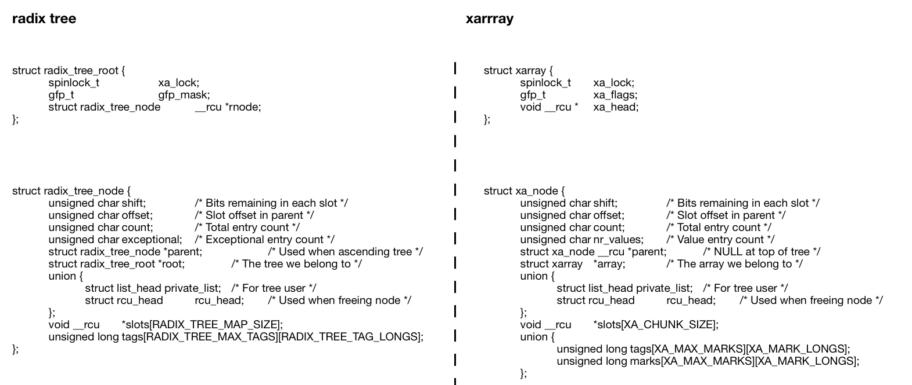
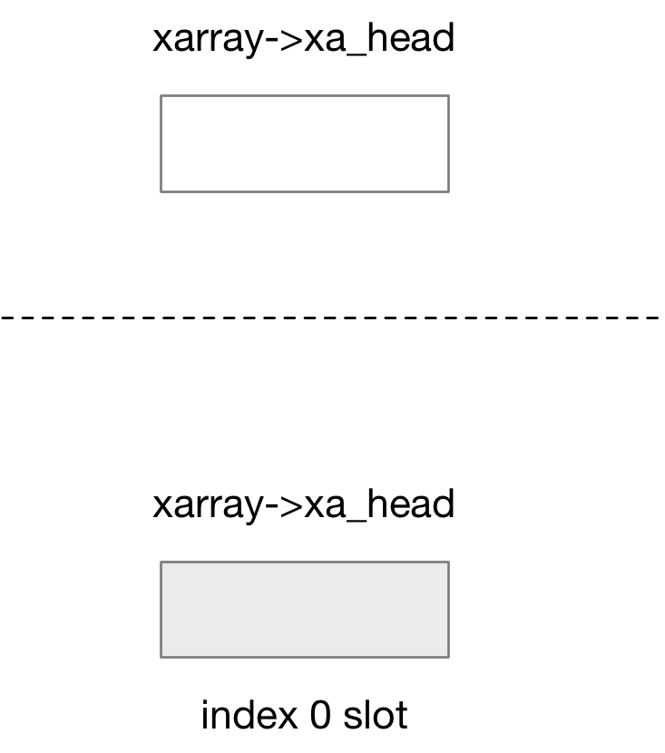
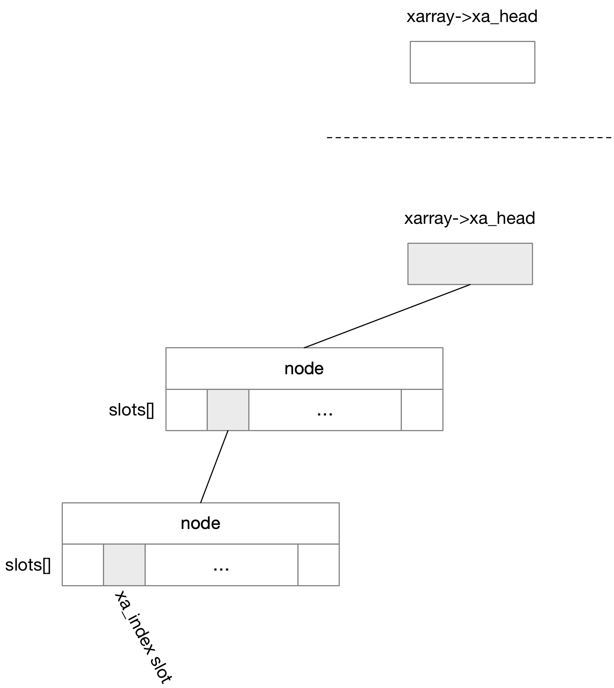
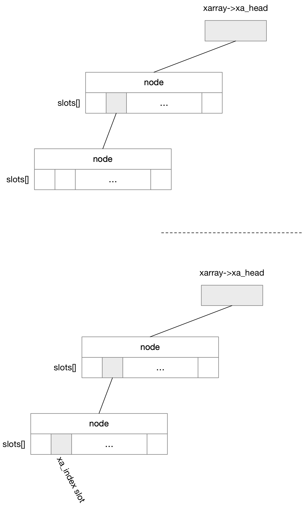
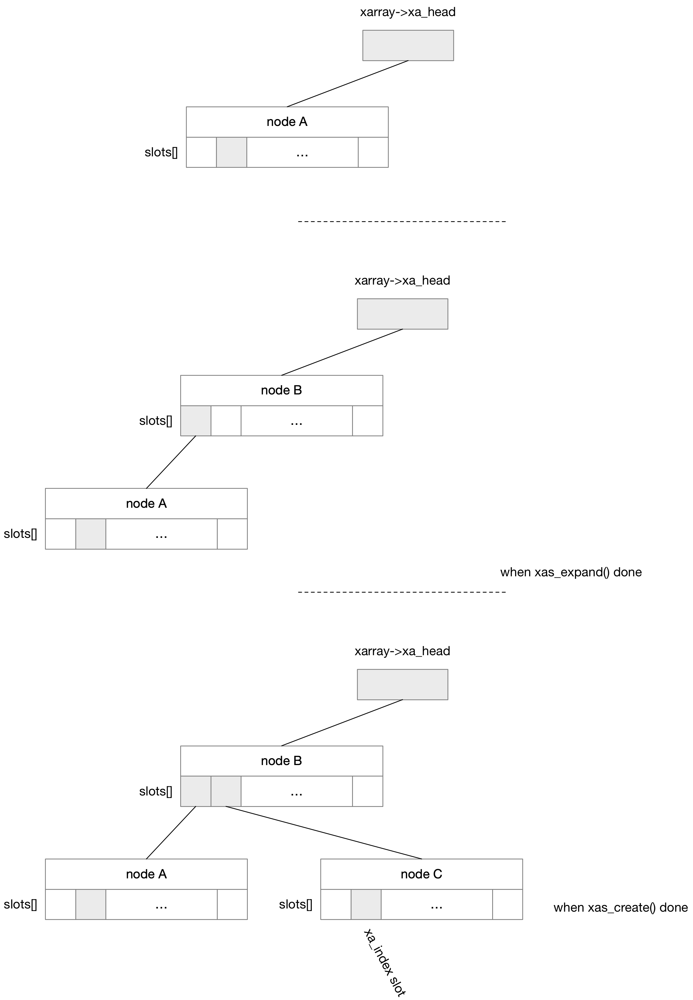
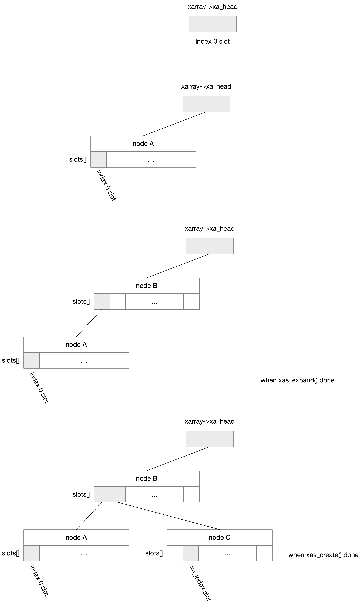

## XArray

xarray (eXtensible Arrays) 实际上是对 radix tree 的封装

radix tree 实现了 unsigned long (key) 到 void * pointer (value) 的映射，其本质上相当于是实现了一个变长的、稀疏的数组，其中数组的 index 作为 key，存储的 pointer 作为 value

因而 xarray 的作者 Matthew Wilcox 在保留 radix tree 底层实现的基础上，在 v4.20 版本引入新的 xarray 接口


### Concept



可以看到 xarray 的实现还是原来 radix tree 的实现


struct xarray 抽象 xarray root，@xa_head 即指向 level 1 node

```c
struct xarray {
	...
	void __rcu *	xa_head;
};
```


```c
struct xa_node {
	unsigned char	shift;		/* Bits remaining in each slot */
	unsigned char	offset;		/* Slot offset in parent */
	unsigned char	count;		/* Total entry count */
	unsigned char	nr_values;	/* Value entry count */
	struct xa_node __rcu *parent; /* NULL at top of tree */
	struct xarray	*array;		/* The array we belong to */

	void __rcu	*slots[XA_CHUNK_SIZE];
	...
};
```

@slots[] 数组即描述该节点的所有子节点，每个节点最多包含 RADIX_TREE_MAP_SIZE 即 64 个子节点
@count 描述 @slots[] 数组中实际使用的子节点的数量，即非 NULL slot 的数量

@parent 描述该节点的父节点 (不包括根节点)，即 level 1 节点的 @parent 字段的值为 NULL，此时 @array 字段就描述了当前节点的父节点；@offset 描述该节点在其父节点中的偏移

> height

@shift 描述当前节点的 subtree 的规模，即 @slots[] 数组中的任意一个 slot 指向的 subtree 最多可以包含 (2^shift) 个子节点，叶子节点的 @shift 字段即为 0

因而 @shift 实际上描述了，@slots[] 数组中的任意一个 slot 指向的 subtree，仍需要 index 的剩余 @shift bits 来进行寻址；同时 @shift 在一定程度上描述了当前节点在整棵树中的高度 (位置)，叶子节点的 @shift 字段为 0，越接近根节点 (即高度越高)，@shift 越大

> slot type

和之前 radix tree 一样，slot[] 数组中的一个 slot 可能指向一个 item (data entry)，也有可能指向下一级的 xa_node (internal entry)，因而使用 slot 存储的指针的低 2 bits 来区分上述两种 entry，此时

```
 * 00: Pointer entry
 * 10: Internal entry
 * x1: Value entry or tagged pointer
```


### API

#### init

```c
DEFINE_XARRAY(array_name);
```

或者

```c
struct xarray array;
xa_init(&array);
```


#### xa_load

xa_load() 返回 xarray 的 @index 偏移处的 entry

如果 @index 偏移处为空，那么函数返回 NULL

```c
void *xa_load(struct xarray *, unsigned long index);
```


#### xa_store

xa_store() 在 xarray 的 @index 偏移处存入 @entry

如果 @index 处已经存储有数据，那么该函数会覆盖写入，同时函数返回 @index 处原来存储的数据

当 @entry 为 NULL，相当于将 @index 处原来存储的数据擦除，此时等价于 xa_erase()

```c
void *xa_store(struct xarray *, unsigned long index, void *entry, gfp_t);
```


#### xa_insert

xa_insert() 与 xa_store() 类似，只是只有当 @index 处为空时，才会写入 @entry；如果 @index 处已经存储有数据，那么该函数会返回 -EBUSY

```c
int xa_insert(struct xarray *xa, unsigned long index, void *entry, gfp_t gfp)
```


#### xa_erase

xa_erase() 将 xarray 中 @index 处存储的数据擦除

```c
void *xa_erase(struct xarray *xa, unsigned long index);
```


#### xa_find

xa_find() 在 xarray 中寻找 [@index, @max] index 范围内，第一个存储有值的 slot

```c
void *xa_find(struct xarray *xa, unsigned long *index, unsigned long max, xa_mark_t filter);
```

#### xa_reserve

xa_reserve() 用于在 @index 位置处预留一个 slot，从而使得接下来调用的 xa_store() 在对应 @index 位置处存储 entry 时不必陷入分配内存的可能性

```c
int xa_reserve(struct xarray *xa, unsigned long index, gfp_t gfp)
```

xa_reserve() 可能会触发 node 的分配，从而确保 @index slot 的存在，同时实际上在 @index slot 位置处写入 XA_ZERO_ENTRY 以预留这个 slot，后续的 xas_load() 可以读取到这个 @index 位置处存储的值是 XA_ZERO_ENTRY，而 xa_load() 则只能读到 NULL

xa_reserve() 执行过程中，如果 @index 位置处已经存储有 entry (无论是 valid entry 还是 XA_ZERO_ENTRY)，xa_reserve() 实际上都不执行任何操作而直接返回


一般情况下调用 xa_erase() 移除 @index 处存储的 entry 之后，如果 @index 所在的 node 全为空 (即所有 slot 均为 NULL)，那么就可以释放这个 node 从而压缩整个 xarray tree；但是如果 node 中的一个 slot 被标记为 XA_ZERO_ENTRY，这整个 node 就不能被释放

因而被 xa_reserve() 预留的 slot，可以通过 xa_release() 进行释放，其实际上就是将 @index slot 处存储的值恢复为 NULL

```c
void xa_release(struct xarray *xa, unsigned long index)
```

但是只有 @index slot 处仍为 XA_ZERO_ENTRY 的时候，xa_release() 才会如上所述将 @index slot 处存储的值恢复为 NULL；如果 @index slot 已经存入了其他值 (无论是 valid entry 还是 NULL)，xa_release() 实际上都不执行任何操作而直接返回


如果 @index slot 已经存入了其他值 (无论是 valid entry 还是 NULL)，此时可以通过 xa_erase() 来将 @index slot 处存储的值恢复为 NULL


### Advanced API

xarray 框架提供了一些高级接口，以提供更强的灵活性和性能，之前介绍的 API 实际上也都是调用这些高级接口实现的

#### xa_state

xarray 的高级 API 的实现依赖于 xa_state，其作用相当于是遍历 xarray 过程中的指针，即当前指向 @xa_node 节点中 @xa_offset 偏移处的 slot，该 slot 对应的 index 为 @xa_index，该节点对应的 shift 为 @xa_shift

```c
struct xa_state {
	struct xarray *xa;
	unsigned long xa_index;
	unsigned char xa_shift;
	unsigned char xa_sibs;
	unsigned char xa_offset;
	unsigned char xa_pad;	/* Helps gcc generate better code */
	struct xa_node *xa_node;
	struct xa_node *xa_alloc;
	xa_update_node_t xa_update;
};
```

如果当前操作的是 multi-order entry，那么 @xa_sibs 描述该 multi-order entry 覆盖的 slot 的数量，实际上为 (2^order - 1)


#### xas_load

返回 xas->xa_index 偏移处的 entry

如果 @index 偏移处为空，那么函数返回 NULL

```c
void *xas_load(struct xa_state *xas)
```

#### xas_store

在 xas->xa_index 偏移处存入 @entry

```c
void *xas_store(struct xa_state *xas, void *entry)
```

```c
XA_STATE(xas, xarray, index);
xas_store(xas, entry);
```

xas_store() 内部

- 使用 xas_expand() 来扩展 xarray，从而使得 xarray tree 足够高 (扩展树的主干)，能够容纳 xas->xa_index 数量的 slot
- 使用 xas_create() 来扩展 xarray，从而使得 xarray tree 足够宽，能够容纳 xas->xa_index 数量的 slot，也就是扩展树的枝干，即沿着 xas->xa_index 一路向下，创建该路径上的所有 node

```c
void *xas_create(struct xa_state *xas, bool allow_root)
```

1. initial index 0

如果 xarray 刚初始化的时候需要在 index 0 处插入一个 entry，同时传入的 @allow_root 参数为 true，那么直接复用 xarray->xa_head 字段来作为 index 0 slot



```sh
# xa->xa_head = NULL, xas->xa_index = 0
xas_store
    slot = &xas->xa->xa_head
    xas_create // do nothing
    *slot = entry // reuse xarray->xa_head as index 0 slot
```


2. initial index > 0

如果 xarray 刚初始化的时候需要在 xas->xa_index 处插入一个 entry



```sh
# xa->xa_head = NULL, xas->xa_index = ...
xas_store
    xas_create
        xas_expand
            # return (XA_CHUNK_SHIFT * N)
        
        # expand xarray
        # xas->xa_node, xas->xa_offset pointing to corresponding slot
    
    node   = xas->xa_node;
    offset = xas->xa_offset
    slot   = &node->slots[offset]
    
    *slot = entry // store entry into corresponding slot
```

首先 xas_expand() 中计算存储 xas->xa_index slot 需要几层 node，如果算出来需要 N 层 node，那么 xas_expand() 的返回值就是 (XA_CHUNK_SHIFT * N)；例如上图中存储 xas->xa_index slot 需要 2 层 node，那么 xas_expand() 的返回值就是 (XA_CHUNK_SHIFT * 2)

之后回到 xas_create() 中就会根据 xas_expand() 的返回值，相应地扩展 xarray，即沿着 xas->xa_index 一路创建对应的 node (xas_expand() 的返回值决定了上述 expand xarray 中循环的次数)；最终 xas_create() 返回的时候，(xas->xa_node, xas->xa_offset) 就指向 xas->xa_index slot


3. following store, with xa->xa_head pointing to an internal node

如果插入 xas->xa_index 的时候，xa->xa_head 为非 NULL，同时指向一个 internal node

首先 xas_expand() 中会扩展 xarray，以使得 xarray 足够容纳 xas->xa_index 数量的 slot

这其中首先根据 level 1 node 即 xa->xa_head 指向的节点的 @shift 字段，获取当前 xarray 的规模，即当前 xarray 包含的 slot 的数量

3.1 no need expand

如果当前 xarray 的规模足以存储 xas->xa_index slot，那么



```sh
# xas->xa_index = ..., with xa->xa_head pointing to an internal node
xas_store
    xas_create
        xas_expand
            xas->xa_node = level 1 node (xa->xa_head)
            # return (xa->xa_head->shift + XA_CHUNK_SHIFT)
        
        # descend xarray
        # xas->xa_node, xas->xa_offset pointing to corresponding slot
    
    node   = xas->xa_node;
    offset = xas->xa_offset
    slot   = &node->slots[offset]
    
    *slot = entry // store entry into corresponding slot
```

首先 xas_expand() 中不需要再扩展 xarray，而是直接返回 (xa->xa_head->shift + XA_CHUNK_SHIFT)

之后回到 xas_create() 中就会根据 xas_expand() 的返回值 (xas_expand() 的返回值决定了之后 descend xarray 中循环的次数)，对 xarray 执行 descend 操作，即沿着 xas->xa_index 一路向下，最终 xas_create() 返回的时候，(xas->xa_node, xas->xa_offset) 就指向 xas->xa_index slot


3.2 need expand xarray

如果当前 xarray 的规模尚不足以存储 xas->xa_index slot，那么



```sh
# xas->xa_index = ..., with xa->xa_head pointing to an internal node
xas_store
    xas_create
        xas_expand
            # expand xarray, so that the tree is tall enough
            xas->xa_node = level 1 node (xa->xa_head)
            # return (xa->xa_head->shift + XA_CHUNK_SHIFT)
        
        # exapnd xarray, so that the tree is wide enough
        # xas->xa_node, xas->xa_offset pointing to corresponding slot
    
    node   = xas->xa_node;
    offset = xas->xa_offset
    slot   = &node->slots[offset]
    
    *slot = entry // store entry into corresponding slot
```

首先 xas_expand() 中会扩展 xarray，使得扩展后的 xarray tree 足够高能够容纳得下 xas->xa_index slot，例如上图中就是会创建 node B，xas_expand() 最终返回扩展后的 (xa->xa_head->shift + XA_CHUNK_SHIFT)

之后回到 xas_create() 中会根据 xas_expand() 的返回值继续扩展 xarray， (xas_expand() 的返回值决定了上述 expand xarray 中循环的次数)，即沿着 xas->xa_index 一路向下创建该路径上的 node，也就是说 xas_create() 中的扩展 xarray，是使得扩展后的 xarray tree 足够宽能够容纳得下 xas->xa_index slot，例如上图中就是创建 node C

最终 xas_create() 返回的时候，(xas->xa_node, xas->xa_offset) 就指向 xas->xa_index slot


4. following store, with xa->xa_head pointing to the initial value

如果上述 case 1 之后紧接着插入一个 entry，即当前插入 xas->xa_index 的时候，xa->xa_head 为非 NULL，同时指向 initial value，那么



```sh
# xas->xa_index = ..., with xa->xa_head pointing to initial value
xas_store
    xas_create
        xas_expand
            # expand xarray, so that the tree is tall enough
            xas->xa_node = level 1 node (xa->xa_head)
            # return (xa->xa_head->shift + XA_CHUNK_SHIFT)
        
        # exapnd xarray, so that the tree is wide enough
        # xas->xa_node, xas->xa_offset pointing to corresponding slot
    
    node   = xas->xa_node;
    offset = xas->xa_offset
    slot   = &node->slots[offset]
    
    *slot = entry // store entry into corresponding slot
```

首先 xas_expand() 中会扩展 xarray，使得扩展后的 xarray tree 足够高能够容纳得下 xas->xa_index slot，例如上图中就是会依次创建 node A、node B，xas_expand() 最终返回扩展后的 (xa->xa_head->shift + XA_CHUNK_SHIFT)

之后回到 xas_create() 中会根据 xas_expand() 的返回值继续扩展 xarray， (xas_expand() 的返回值决定了上述 expand xarray 中循环的次数)，即沿着 xas->xa_index 一路向下创建该路径上的 node，也就是说 xas_create() 中的扩展 xarray，是使得扩展后的 xarray tree 足够宽能够容纳得下 xas->xa_index slot，例如上图中就是创建 node C

最终 xas_create() 返回的时候，(xas->xa_node, xas->xa_offset) 就指向 xas->xa_index slot


#### xas_find

xas_find() 在 xarray 中寻找 [@index, @max] index 范围内，第一个存储有值的 slot

```c
void *xas_find(struct xa_state *xas, unsigned long max)
```

```c
XA_STATE(xas, xarray, index);
xas_find(xas, entry);
```


