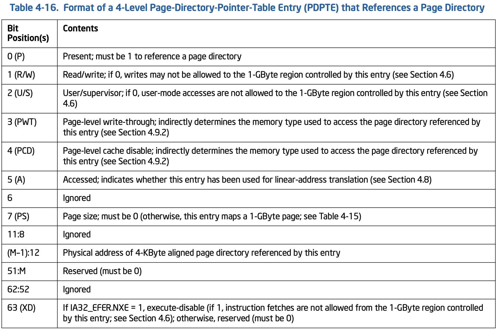

## MM - 04 Arch - x86 Memory Architecture

> Reference
> Intel 64 and IA-32 Architectures Software Developer’s Manual, Volume 3, CHAPTER 3 PROTECTED-MODE MEMORY MANAGEMENT
> Intel 64 and IA-32 Architectures Software Developer’s Manual, Volume 3, CHAPTER 3 PAGING


### Segmentation

一般支持虚拟地址空间的处理器架构，都只需要实现虚拟地址 (virtual address，也称为 linear address) 与物理地址 (physical address) 两个地址空间

然而 x86_32 架构拥有独特的 segmentation 架构，除了上述两个地址空间外，其还拥有逻辑地址 (logical address) 地址空间

```
            +--------------+                +-------+
logical --> | segmentation | --> linear --> |paging | --> physical
address     +--------------+     address    +-------+     address
```


这一架构最早来源于 Intel 8086 处理器，当时该处理器是 16 bit 的架构，因而理论上最大寻址 64KB；而为了突破这一限制，特别引入了 segmentation 架构，即在线性地址空间之上再构建一个地址空间，称为逻辑地址空间

此时原来的一个线性地址空间就称为是一个 segment，每个 segment 最大寻址 64KB，一个处理器可以拥有多个 segment，即多个逻辑地址空间，例如指令寻址使用 code segment (CS)，数据寻址使用 data segment (DS)，栈数据寻址使用 stack segment (SS)，从而突破 64KB 的最大寻址空间


之后的 Intel 80286/80386 以及 x86_32 都延承了这一设计，直到 x86_64 下不再使用该设计，因为 64 bit 模式下其地址空间已经足够大；因而本小节主要介绍 x86_32 下的 segmentation 设计

x86_32 存在以下几种内存模型


#### real-address mode

之前介绍过，segmentation 架构最初由 Intel 8086 引入，彼时处理器是 16 bit 的架构，为了突破 64KB 的最大寻址上限，引入了 segmentation 架构

Intel 8086 实现有四个 segment

Segment | Use | Selector | Offset
---- | ---- | ---- | ----
Code Segment | 指令寻址 | CS | EIP
Data Segment | 数据寻址 | DS | EDI
Stack Segment | 栈数据寻址 | SS | ESP
one extra segment | 由软件自由指定 | ES | ESI


在 segmentation 架构下，实际使用的线性地址的计算方式为

- 16 bit segment register 用于存储 segment selector，此时线性地址区间的基地址即为 (segment selector * 16)
- 16 bit EIP、EDI、ESP 来描述指令、数据、栈在对应的 code segment、data segment、stack segment 中的偏移

```
segment base address = segment selector * 16
linear address = segment selector * 16 + offset
```


这样理论上可以实现 32 bit 的线性地址空间，但当时只实现了 20 bit 的物理地址总线，因而线性地址空间和物理地址空间都是 20 bit 即最大寻址 1MB，此时这 1MB 的线性地址空间就被划分为多个 64KB 大小的 segment


x86_32 用于兼容 Intel 8086 处理器的模式称为 real-address mode，此时处理器工作在 16 bit 模式，并沿用该内存模型


#### segment memory model

之前介绍过，segmentation 架构最初由 Intel 8086 引入，此后的 Intel 80286/80386 同样沿用了这一设计；Intel 80386 开始引入了两个新的 segment

Segment | Use | Selector | Offset
---- | ---- | ---- | ----
extra segment | 由软件自由指定 | FS |
extra segment | 由软件自由指定 | GS |

x86_32 用于兼容 Intel 80286/80386 处理器的模式称为 protected mode，该模式下可以使用 flat memory model 或 segment memory model 内存模型


除了引入了两个新的 segment 之外，另外一个改变是引入 segment descriptor table 来实现逻辑地址到线性地址之间的翻译，此时处理器拥有 48 bit 的逻辑地址空间和 32 bit 的线性地址空间

此时处理器拥有 48 bit 的逻辑地址空间，包括 16 bit segment selector 与 32 bit offset

- segment selector 描述当前选择的 segment 对应的 segment descriptor 在 segment descriptor table 中的偏移
- offset 描述当前访问的内存在对应的 segment 中的偏移


通过 segment selector 在 segment descriptor table 中定位到当前访问的内存所在的 segment 对应的 segment descriptor，该 segment descriptor 描述了该 segment 的起始线性地址，此时加上 offset 即为当前访问的内存对应的线性地址


##### segment descriptor

segment memory model 中线性地址空间被划分为多个位置不定、大小不定的 segment，每个 segment 在线性地址空间中的位置及其大小即由对应的 segment descriptor 描述

每个 segment descriptor 占用 8 字节，其格式为


- segment limit，20 bit，描述该 segment 的大小，其单位由 G bit 决定
    - 若 G bit 为 0，则以字节为单位
    - 若 G bit 为 1，则以 4K 字节为单位

- base address，32 bit，描述该 segment 的起始线性地址

- type 字段描述该 segment 的访问权限，其格式为


##### segment descriptor table

descriptor table 维护系统中的所有 segment descriptor


每个系统都需要维护一个 GDT (global descriptor table)


> GDTR

GDTR 寄存器保存 GDT 的 base linear address 以及大小，其格式为


- table limit，16 bit，描述 descriptor table 的大小，以字节为单位
- linear base address，32 bit mode 下该字段为 32 bit，64 bit mode 下该字段为 64 bit

- sgdt 指令用于从 GDTR 寄存器获取 GDT 的 base linear address
- lgdt 指令用于向 GDTR 寄存器保存 GDT 的 base linear address


##### segment selector

16 bit segment selector 描述对应的 segment descriptor 在 descriptor table 中的偏移，其格式为


Index 字段描述对应的 segment descriptor 在 descriptor table (GDT 或 LDT) 中的偏移，由于每个 segment descriptor 占用 8 字节，因而对应的 segment descriptor 在 descriptor table 中的偏移实际为 index * 8


#### flat memory model

之前介绍过，protected mode 模式下可以使用 flat memory model 或 segment memory model 内存模型

flat memory model 下使用 0 ~ 4GB 的线性地址，此时 16 bit segment register 相当于不起任何作用，而只是使用 32 bit EIP、ESI/EDI、ESP 来描述指令、数据、栈在 4GB 线性地址空间中的位置


- 32 bit EIP 描述需要执行的指令在 4GB 线性地址空间中的偏移
- 当 DS 作为 data segment register 时，32 bit ESI 描述访问的数据在 4GB 线性地址空间中的偏移
- 当 ES 作为 data segment register 时，32 bit EDI 描述访问的数据在 4GB 线性地址空间中的偏移
- 32 bit ESP 描述栈顶位置在 4GB 线性地址空间中的偏移
- 32 bit EBP 描述栈帧基地址在 4GB 线性地址空间中的偏移


#### x86_64

x86_64 工作在 64 bit mode 时，通常关闭 segmentation，此时相当于不存在逻辑地址空间，而是由 64 bit RIP、RSI/RDI、RSP 直接构成 64 bit 线性地址空间


### Paging

#### 32-bit paging

该模式下，处理器拥有 32 bit 线性地址空间和 40 bit 物理地址空间，但是物理地址实际用到的只有 32-bit，其高 8 bit 全为 0，因而 paginbg 需要实现 32-bit linear address 到 32-bit physical address 的翻译

x86 架构下每个 table 的大小为 4KB，一个 table 包含多个 table entry；在 32 bit 模式下，table entry 的大小为 32 bit 即 4 字节，因而一个 table 就包含 1024 个 entry，也就是说一层 table 支持 10 bit 地址的寻址

因而在 32 bit 模式下，当 page frame 大小为 4KB 时，就需要 2-level page table


> CR3

CR3 (Control Register) 寄存器提供 level 1 即 PD (Page Directory) 的物理地址，因为 table 是按照 4KB 对齐的，因而实际只需要 CR3 的高 20 bit 描述该地址


> PDE


在多层 page table 中，一个 table entry 可能指向下一层的 page table（例如 PDE），也有可能直接描述一个 page frame 的物理地址（例如 PTE）

x86 架构在 translation table walk 过程中使用以下规则来判断当前所在的 table entry 到底是指向下一层的 page table，还是直接指向一个 page frame

- 如果 linear address 中剩余需要翻译的 bits 大于 12 bits，那么检查 table entry 的 PS (Page Size) bit
    - 若该 bit 为 1，则当前 table entry 指向一个 page frame
    - 否则当前 table entry 指向下一层的 page table
- 否则当前翻译的 linear address 中还剩余 12 bits，那么当前 table entry 肯定指向一个 page frame

所以可以发现 PDE 是有 PS bit 的，而 PTE 则没有


> PTE


#### 64-bit paging

x86_64 只使用 64-bit 线性地址空间中的低 48 bit，地址的高 16 bit 的值与地址的 bit 47 相等

同时 x86_64 最高支持 52 bit 的物理地址空间，但其实际支持的物理地址空间由 CPUID.80000008H:EAX[bits 7-0] 描述，最低支持 48 bit 的物理地址空间

因而 x86_64 下需要实现 48-bit linear address 到 48-bit physical addresses 的翻译


该模式下每个 table 的大小同样为 4KB，每个 table entry 的大小为 64 bit 即 8 字节，因而一个 table 就包含 512 个 entry，也就是说一层 table 支持 9 bit 地址的寻址；因而为了翻译 48-bit linear address，当 page frame 大小为 4KB 时，就需要 4-level page table


- 一个 PML4 table entry 映射 512 GB 的物理地址空间
- 一个 Page-directory-pointer table entry 映射 1 GB 的物理地址空间
- 一个 Page directory table entry 映射 2 MB 的物理地址空间
- 一个 Page table entry 映射 4 KB 的物理地址空间


> CR3

CR3 (Control Register) 寄存器提供 level 1 即 PML4 (Page Map Level 4) 的物理地址，因为 table 是按照 4KB 对齐的，因而其低 12 bit 可以复用于其他标志位


上表中的 M 表示 MAXPHYADDR，即处理器支持的物理地址的最大位数


> PML4E (Page Map Level 4)


> PDPTE (Page-directory-pointer table)





> PDE (Page directory table)


> PTE


> access rights

User/Supervisor 标志位描述映射的 page frame 是 user mode 还是 supervisor mode，若该 bit 为 0 则描述 user mode page frame

Read/Write 标志位描述映射的 page frame 是否是 read-only 的，若该 bit 为 0 则说明该 page frame 是 read only 的

Execute Disable 标志位描述映射的 page frame 是否具有运行权限，即能够从该映射的 page frame 读取指令，若该 bit 为 1 则说明该 page frame 不具有运行权限

CR0.WP (Write Protect) 描述是否禁止 supervisor-mode 的程序对 read-only page frame 的写操作，若该 bit 为 1 则禁止


当处理器运行在 supervisor-mode 时，其读写权限有

- 对于所有的 data page frame （包括 user mode 与 supervisor mode）具有读权限
- 对于 user/supervisor-mode data page frame 的写权限
    - 若 CR0.WP 为 0，则对于该 data page frame 具有写权限
    - 若 CR0.WP 为 1，则只有当该 data page frame 的 Read/Write flag bit 为 1 即该 page frame 不是 read only 时，才具有该 data page frame 的写权限
- 对于 supervisor-mode code page frame 的读权限，只有当该 page frame 的 Execute Disable 标志位为 0 时，才能从该 page frame 读取指令


#### TLB Control

使用 Translation Lookaside Buffers (TLBs) 缓存 logical page number 与 physical page frame 之间的映射关系，从而加速地址翻译的过程

此时使用 logical page number 索引一个 TLB entry

一个 TLB entry 包含的内容有

- 该 logical page number 对应的 physical page frame
- paging entry 中该 page frame 的 access rights、attribute 等属性

此外 x86_64 bit mode 下每个 TLB entry 都有一个 Process-Context Identifiers (PCIDs) 属性，由于每个进程都有一个独立的线性地址空间，PCID 即用于区分多个进程的线性地址空间，这样同一个 TLB 中就可以同时存储多个线性地址空间对应的 TLB entry


