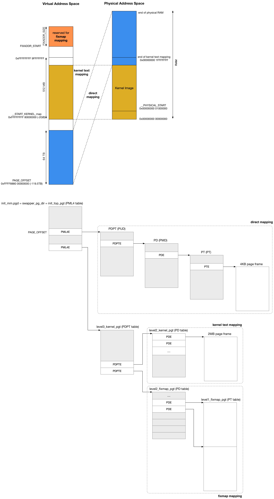

title:'MM - 05 Init - x86 Page Table'
## MM - 05 Init - x86 Page Table


### early 4G boot page table

系统初始化阶段，处理器由 protected mode 过渡到 64 bit mode 之前，bootstrap loader 需要初始化 early boot page table，此时该 page table 只需映射 4 GB 物理地址空间，其中将 0 地址起始的 4GB 虚拟地址空间映射为 0 地址起始的 4GB 物理地址空间

early 4G boot page table 实际只使用 3-level page table 结构，其中一个 PML4E (Page Map Level 4 entry) 映射 512 GB 的物理地址空间，一个 PDPTE (Page-directory-pointer table entry) 映射 1 GB 的物理地址空间

因而此时实际需要一个 PML4E，四个 PDPTE，此时

- 为了容纳一个 PML4E 需要一个 PML4 table
- 为了容纳四个 PDPTE 需要一个 PDPT table
- 每个 PDPTE 指向一个 PD (Page directory table)，因而一共需要四个 PD table
- 每个 PDE (Page directory table entry) 映射 2 MB 的物理地址空间，四个 PD table 中包含 2K 个 PDE，因而所有 2K 个 PDE 一共映射 4GB 的物理地址空间

因而一共需要六个 table，x86_64 架构下每个 table 都是 4KB 大小，因而 early boot page table 实际占用 24 KB


> alloc early boot page table

因而在 `arch/x86/boot/compressed/head_64.S` 中在 .pgtable section 中预留 24 KB 的空间以用于 early boot page table

```asm
/*
 * Space for page tables (not in .bss so not zeroed)
 */
	.section ".pgtable","a",@nobits
	.balign 4096
pgtable:
	.fill 6*4096, 1, 0
```


`arch/x86/boot/compressed/vmlinux.lds.S` 中定义 early boot page table 存储在 kernel image 内部

```lds
SECTIONS
{
	...
	.text :	{...}
	.rodata : {...}
	.data :	{...}
	.bss : {...}
#ifdef CONFIG_X86_64
       . = ALIGN(PAGE_SIZE);
       .pgtable : {
		_pgtable = . ;
		*(.pgtable)
		_epgtable = . ;
	}
#endif
	_end = .;
}
```


> zero early boot page table

x86_64 初始化过程中，由 protected mode 过渡到 64 bit mode 之前，需要初始化 early boot page table

首先将 early boot page table 占用的 24 KB 内存全部初始化为 0

```asm
 /*
  * Build early 4G boot pagetable
  */
	/* Initialize Page tables to 0 */
	leal	pgtable(%ebx), %edi
	xorl	%eax, %eax
	movl	$((4096*6)/4), %ecx
	rep	stosl
```

- leal	pgtable(%ebx), %edi

之前 ebx 寄存器存储的值为 LOAD_PHYSICAL_ADDR，即 kernel image 加载的物理地址

leal pgtable 指令会获取 early boot page table 在 kernel image中的偏移，此时将其加上 kernel image 加载的物理地址，即为 early boot page table 在内存中的物理地址


- xorl	%eax, %eax

对 eax 自身作异或运算，其效果实际将 eax 寄存器清零


- movl	$((4096*6)/4), %ecx

将 ecx 寄存器的值设置为 6K，这是因为之后的 stosl 指令会将 edi 寄存器指向的内存设置为 eax 寄存器的值，即每次将 page table 中的一个 32 bit 的数据清零，由于 early boot page table 一共 24KB 大小，因而 stosl 指令需要重复执行 6K 次，而之后的 rep 指令会重复运行 stosl，其重复的次数由 ECX 寄存器的值决定，因而此时将 ECX 寄存器的值设置为 6K


- rep	stosl

将 early boot page table 占用的 24 KB 内存全部初始化为 0


> build L4 PML4 table

接下来初始化唯一的一个 PML4E，该 PML4E 的值为唯一的 PDPT table 的物理地址

```asm
	/* Build Level 4 */
	leal	pgtable + 0(%ebx), %edi
	leal	0x1007 (%edi), %eax
	movl	%eax, 0(%edi)
```

- leal	pgtable + 0(%ebx), %edi

将 early boot page table 在 kernel image 中的偏移加上 kernel image 的加载物理地址，即为 early boot page table 的物理地址，同时这也是 PML4E 的物理地址，将其保存在 EDI 寄存器中


- leal	0x1007 (%edi), %eax

将 early boot page table 的物理地址加上 0x1000 即 4K，即为 PDPT table 的物理地址，将其作为 PML4E 的值，同时 PML4E 的低位复用于标志位，此时 0x7 相当于设置 
    
Present bit，表示对应的 PDPT table 存在于内存中
Read/Write bit，表示对应的 PDPT table 是可写的
User/Supervisor bit，表示对应的 PDPT table 用于 supervisor mode

将以上这些值，即需要设置的 PML4E 的值暂时保存在 EAX 寄存器中


- movl	%eax, 0(%edi)

将以上计算出来的值，即 PDPT table 的地址，写入 PML4E，使得该 PML4E 指向这个 PDPT table


> build L3 PDPT table

```asm
	/* Build Level 3 */
	leal	pgtable + 0x1000(%ebx), %edi
	leal	0x1007(%edi), %eax
	movl	$4, %ecx
1:	movl	%eax, 0x00(%edi)
	addl	$0x00001000, %eax
	addl	$8, %edi
	decl	%ecx
	jnz	1b
```

相类似地，初始化 PDPT table 中起始的四个 PDPTE，使其分别指向之后的四个 PD table


> build L2 PD table

```asm
	/* Build Level 2 */
	leal	pgtable + 0x2000(%ebx), %edi
	movl	$0x00000183, %eax
	movl	$2048, %ecx
1:	movl	%eax, 0(%edi)
	addl	$0x00200000, %eax
	addl	$8, %edi
	decl	%ecx
	jnz	1b
```

之后设置四个 PD table 中的所有 PDE

每个 PDE 为 64 bit，每个 table 为 4KB，因而每个 PD table 包含 512 个 PDE，因而四个 table 一共包含 2K 个 entry

其中的每个 PDE 直接映射 2 MB 的物理内存，因而 2K 个 PDE 一共映射 4GB 的物理地址空间，即此时实际使用三级页表


> enable early boot page table

```asm
	/* Enable the boot page tables */
	leal	pgtable(%ebx), %eax
	movl	%eax, %cr3
```

最终将 early boot page table 的物理地址保存到 CR3 寄存器中，以激活使用 early boot page table


### kernel text mapping

接下来内核的入口 startup_64() 中会创建 kernel text mapping 与 fixmap mapping 映射


1. kernel text mappin

所谓的 kernel text mapping 就是实现内核镜像所在内存的映射，从而实现内核镜像 .text/.data section 的访问

> physical address of kernel image

系统初始化阶段，内核镜像会被加载到 __PHYSICAL_START (即 CONFIG_PHYSICAL_START 即 0x1000000) 物理地址起始处的物理内存

> virtual address of kernel image

对应地，在虚拟地址空间中分配一块虚拟地址区间，以实现内核镜像的映射，分配的这块虚拟地址区间实际上就是 __START_KERNEL_map (64 bit 虚拟地址空间往前 2GB) 起始，512 MB 大小

因而 kernel text mapping 实际上就是将 __START_KERNEL_map 虚拟地址起始的 512MB 虚拟地址空间，映射到 0 物理地址起始的物理地址空间

但实际上，由于内核镜像存储的起始物理地址是 __PHYSICAL_START，因而内核镜像的起始虚拟地址实际上是 __START_KERNEL

`arch/x86/kernel/vmlinux.lds.S` 中定义

```lda
SECTIONS
{
#ifdef CONFIG_X86_32
        ...
#else
        . = __START_KERNEL;
#endif

	/* Text and read-only data */
	.text :  AT(ADDR(.text) - LOAD_OFFSET) {...}
	...
}
```

```c
#define __START_KERNEL		(__START_KERNEL_map + __PHYSICAL_START)
```

即内核镜像的起始虚拟地址实际上是 0xffffffff81000000


2. fixmap mapping

此外还预留了 4MB 的虚拟地址空间用于 fixmap mapping


### direct mapping

```sh
start_kernel
    setup_arch
        max_pfn = e820__end_of_ram_pfn();
        init_mem_mapping
            memory_map_bottom_up(kernel_end, max_pfn)
```

接下来内核初始化过程中，会从 BIOS 获取当前系统中的所有 RAM 拓扑信息，之后建立 direct mapping，即将物理地址空间中，内核镜像之后的所有物理内存，映射到 PAGE_OFFSET 起始的虚拟地址区间




### process page table

进程 fork 的时候，新进程会创建一个新的 page table，其中 PAGE_OFFSET 往后的虚拟地址空间的部分，实际上就是 global page table 即 swapper_pg_dir 的拷贝

```sh
bprm_mm_init
    mm_alloc
        mm_init
            mm_alloc_pgd 
                pgd_alloc(mm)
                    mm->pgd = _pgd_alloc(); // allocate new page table
                    pgd_ctor // copy from global page table (swapper_pg_dir)
```
