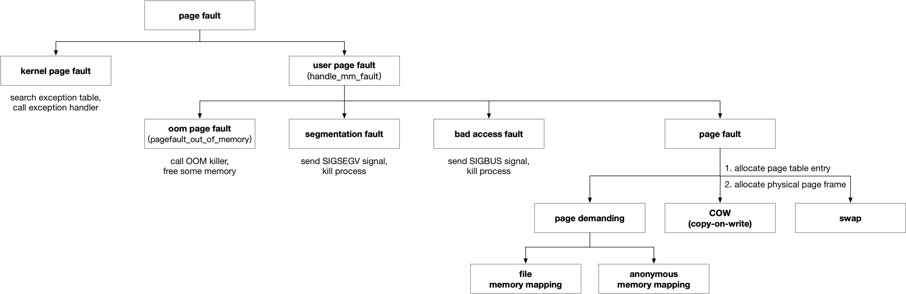

## MM - 3 Page Fault Handler

以下两种情况下会发生 page-fault exception

1. 处理器当前访问的线性地址没有映射的 page frame，即地址翻译过程中 pte 的 P (Present) bit 为 0
2. pte 中的相关标志位描述了其映射的 page frame 的访问权限，处理器当前访问的线性地址权限检查失败




page fault handler 的入口是架构相关的

- arm 架构下 page fault handler 的入口为 do_page_fault()
- x86 架构下 page fault handler 的入口为 exc_page_fault()


在 page fault handler 中

- 若当前进程处于 atomic context，即当前是 interrupt handler 触发异常，或 mm_struct 为 NULL，即当前是内核线程触发异常，则执行 kernel page fault handler
- 否则当前由用户进程触发缺页异常，则执行 user page fault handler


### kernel page fault

kernel page fault handler 用于处理内核线程发生的缺页异常

```
exc_page_fault
    handle_page_fault
        do_kern_addr_fault
            bad_area_nosemaphore
                kernelmode_fixup_or_oops
                    fixup_exception
```

fixup_exception() 中会搜索 exception table，在其中查找适用于当前异常状况的 exception handler 并执行，若找不到对应的 exception handler 则发生 oops，在打印各项信息之后内核退出

kernel page fault handler 在 arm 架构下的入口为 __do_kernel_fault()，x86 架构下的入口为 do_kern_addr_fault()


### user page fault

user page fault handler 的入口是架构相关的，arm 架构下为 __do_page_fault()，x86 架构下为 do_user_addr_fault()，但最终都实现为 handle_mm_fault()

#### user - oom page fault

user page fault handler 中会为触发异常的虚拟地址分配页表项 (PMD/PTE) 从而建立映射，当页表项分配失败时说明此时内存资源已经非常紧张，此时函数返回 VM_FAULT_OOM，从而触发 oom page fault handler

oom page fault handler 的入口为 pagefault_out_of_memory()，其中将调用 OOM killer 释放部分内存资源，之后返回到用户态


#### user - segmentation fault

若当前触发异常的原因是

- 进程访问的虚拟地址不包含于进程的任何 vma，即访问非法地址 (arm 架构下会返回 VM_FAULT_BADMAP)
- 进程访问的虚拟地址包含于进程的其中一个 vma，但是当前进程不具备该 vma 的访问权限（arm 架构下会返回 VM_FAULT_BADACCESS）

这两种情况下会触发 segmentation fault，此时 user page fault handler 的返回值为 VM_FAULT_SIGSEGV，此时会向用户进程发送 SIGSEGV 信号并杀死该用户进程


#### user - bad access fault

若 user page fault handler 的返回值为 VM_FAULT_SIGBUS，即 user page fault handler 因为某种原因无法修复该异常，例如 file memory mapping 中访问的 file offset 超过了文件的大小时，就会触发 bad access fault，此时会向用户进程发送 SIGBUS 信号并杀死该用户进程


#### user - page demanding/copy-on-write

user page fault handler 中，当进程访问的虚拟地址包含于进程的其中一个 vma，只是该 vma 当前尚未与任何 page frame 相映射 (page demanding)；或者该 vma 已经映射到 page frame，只是相应的 pte 显示该 page frame 只有 read 权限，而当前进程尝试对该 page frame 执行 write 操作，从而触发 page fault，但是进程确实对该 vma 具有 read/write 访问权限的 (copy-on-write)，就会为该 vma 分配相应的 page frame 以及页表项以实现映射

最终当成功修复该异常时，user page fault handler 就会返回 VM_FAULT_MAJOR

VM_FAULT_MAJOR 表示异常修复过程中当前进程被阻塞而进入睡眠状态，这通常发生在异常修复过程中为该异常地址分配相应的 page frame 之后，需要将 disk 上的数据拷贝到该 page frame 的场景


1. allocate page table

```sh
handle_mm_fault
    __handle_mm_fault
        p4d_alloc(), pud_alloc(), pmd_alloc() // allocate pgd/pud/pmd table
```

首先为触发异常的 vma 分配相应的页表项 (PGD/PUD/PMD)


2. allocate physical page frame

之后在 handle_pte_fault() 中根据不同情况，为触发异常的 vma 分配相应的 physical page frame

```sh
handle_mm_fault
    __handle_mm_fault
        handle_pte_fault
            # page demanding
                do_anonymous_page   // anonymous memory mapping
                do_fault            // file memory mapping
            
            # swap
            do_swap_page
            
            # CoW
            do_wp_page
```


> page demanding

若对应的 pte 全为 0，即进程并未为该 vma 分配对应的 page frame，此时会执行 page demanding 操作

内核通常尽可能地推迟用户进程的 vma 对应的 page frame 的分配，直到用户进程访问该 vma 的虚拟地址从而触发 page fault，由 page fault handler 分配该 vma 对应的 page frame，这一过程就称为请求调页 (page demanding)

anonymous memory mapping 和 file memory mapping 都会发生 page demanding

- 若对应的 vma->vm_ops 不为 NULL，说明该 vma 用于 file memory mapping，此时调用 do_fault()
- 否则该 vma->vm_ops 为 NULL，说明该 vma 用于 anonymous memory mapping，此时调用 do_anonymous_page()


> copy-on-write

若对应的 pte 不为 0，说明该页表项对应的 page frame 当前存在于内存中，此时如果检查到传入的 flags 参数包含 FAULT_FLAG_WRITE 标志，而 pte 页表项对应的 page frame 不具有写权限，则说明当前发生 page fault 的原因是当前进程尝试对该 vma 进行写操作，但对应的页表项显示该 page frame 只有 read-only 权限，此时如果对应的 vma->vm_flags 显示该 vma 具有 read/write 权限，那么就会调用 do_wp_page() 执行 copy-on-write 操作


> swap

若对应的 pte 不为 0，说明该虚拟地址区间已经与相应的 physical page frame 建立映射，但是 pte 的 Present 标志被清除，说明由于内存紧张等原因内核将该 page frame 交换到 disk 的 swap area，此时调用 do_swap_page()
