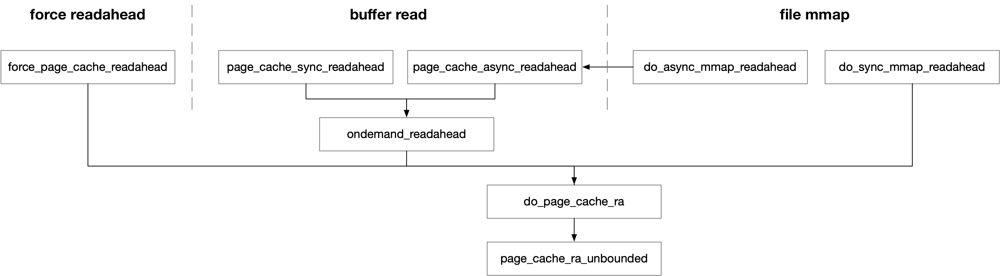

title:'IO - readahead'
## IO - readahead

### readahead window

readahead window size 由 bdi->ra_pages 描述，以 page 为单位

```c
struct backing_dev_info {
	unsigned long ra_pages;	/* max readahead in PAGE_SIZE units */
	...
}
```

用户可以通过 `/sys/block/<dev>/queue/read_ahead_kb` 或者 `/sys/devices/virtual/bdi/<bdi>/read_ahead_kb` 读取或设置 readahead window size


#### backing_dev_info

bdi 最初在 request_queue->backing_dev_info 字段中分配

```sh
blk_alloc_queue
    q->backing_dev_info = bdi_alloc()
```

之后传递给 bdev->bd_bdi

```sh
bdev_alloc_inode
    ei->bdev.bd_bdi = &noop_backing_dev_info;

blkdev_get_by_dev
    __blkdev_get
        if (bdev->bd_bdi == &noop_backing_dev_info)
            bdev->bd_bdi = bdi_get(disk->queue->backing_dev_info);
```

再传递给 sb->s_bdi

```sh
ext4_mount
    mount_bdev
        sget
            set_bdev_super
                s->s_bdi = bdi_get(s->s_bdev->bd_bdi);
```


#### bdi->ra_pages

bdi->ra_pages 描述这个设备上允许的 readahead window size 的上限，即该设备上的文件执行 readahead 时，实际 readahead window 的大小不能超过该上限，该参数默认为 VM_READAHEAD_PAGES 即 128KB

```sh
blk_alloc_queue
    q->backing_dev_info = bdi_alloc()
        bdi->ra_pages = VM_READAHEAD_PAGES;
```

此外其他因素也会影响 bdi 内保存的 readahead window size

> optimal_io_size

v5.10 引入的 commit c2e4cd57cfa1 ("block: lift setting the readahead size into the block layer")，使得块设备在设置 optimal_io_size 的时候，也要调整 readahead window size 的值

io_opt 描述执行 IO 操作的最佳大小，默认值为 0，设备驱动可以自己设置 io_opt，此时 readahead window size 的上限可以调整为 @io_opt 的两倍

```
blk_queue_io_opt
    q->backing_dev_info->ra_pages = max(queue_io_opt(q) * 2 / PAGE_SIZE, VM_READAHEAD_PAGES);
```


#### ra->ra_pages

readahead 路径中使用 struct file_ra_state 描述相关参数

```c
struct file_ra_state {
	unsigned int ra_pages;
	...
};
```

struct file_ra_state 是 per-file 的，因而 ra->ra_pages 就描述这个文件允许的 readahead window size 的上限，即该文件执行 readahead 时，实际 readahead window 的大小不能超过该上限，该参数默认就来自对应的 bdi->ra_pages 参数

```sh
sys_open
    do_sys_open
        do_filp_open
            path_openat
                do_last
                    vfs_open
                        do_dentry_open
                            file_ra_state_init
                                f->f_ra->ra_pages = inode_to_bdi(mapping->host)->ra_pages, i.e., sb->s_bdi->ra_pages
```


ra->ra_pages 是有可能超过 bdi->ra_pages 的，当执行 POSIX_FADV_SEQUENTIAL fadvise() 的时候，该参数实际上就是 2 倍的 bdi->ra_pages

```
POSIX_FADV_SEQUENTIAL fadvise()
    f->f_ra->ra_pages = bdi->ra_pages * 2
```


#### readahead window size

我们将文件执行 readahead 操作时，最终实际读取的数据大小称为 readahead window size

readahead window size 是综合考虑用户当前申请读取的数据大小 (nr_to_read)、与文件允许的 readahead window size 的上限 (ra->ra_pages)，最终计算出来的一个值

例如基于当前申请读取的数据大小 (nr_to_read) 乘以一个系数计算得到一个值，作为 readahead window size，但是最大值不能超过 ra->ra_pages

但是当 nr_to_read 一开始就大于 ra->ra_pages 的时候，上述 "readahead window size 不能超过 ra->ra_pages" 的规则就不能再适用了，例如用户请求读取 256K 的数据，ra->ra_pages 是 128K，同时底层的块设备又支持单个 IO 下发 256K 的数据，那么如果最终 readahead window size 由于 ra->ra_pages 的上限只能取为 128K，即用户每次单个 IO 只能读取 128K 的数据，显然是不符合预期的

因而 v4.10 引入的 commit 9491ae4 ("mm: don't cap request size based on read-ahead setting") 就修复了上述问题

此时 bdi 新引入 @io_pages 参数描述块设备支持的单个 IO 可以下发的最大数据量

```c
struct backing_dev_info {
	unsigned long io_pages;	/* max allowed IO size */
	...
}
```

此时当 nr_to_read 和 io_pages 都大于 ra->ra_pages 的时候，readahead window size 的上限就不再是 ra->ra_pages，而是 nr_to_read 和 io_pages 中更小的那一个，即 `min_t(nr_to_read, io_pages)`，此时实际的 readahead window size 就是超过 ra.ra_pages 的

```
ondemand_readahead
    if req_size > ra->ra_pages && bdi->io_pages > ra->ra_pages:
        max_pages = min(req_size, bdi->io_pages)
    else:
        max_pages = ra->ra_pages
```

此时在 nr_to_read 和 io_pages 都超过 ra->ra_pages 的情况下

- 当 nr_to_read 小于 io_pages 的时候，readahead window size 的上限就是 nr_to_read
- 当 nr_to_read 大于 io_pages 的时候，readahead window size 的上限就是 io_pages


### Entry Routine



#### readahead entry

readahead 的入口为 do_page_cache_ra()

```c
void do_page_cache_ra(struct readahead_control *ractl,
		unsigned long nr_to_read, unsigned long lookahead_size)
```

struct readahead_control 描述一个 readahead 请求，do_page_cache_ra() 函数描述对 rac.file 文件执行 readahead 操作，其 readahead window 如下所示

```
                              |<- @lookahead_size -|
                              
|----------------- @nr_to_read ----------------->|
|==============================#=================|
^                              ^page marked with PG_readahead
rac._index
```

即对 rac.file 文件的 rac._index 偏移处起始的 @nr_to_read 个 page 执行 readahead 操作，其中 async readahead window 的大小为 @lookahead_size 个 page

```sh        
do_page_cache_ra(rac, nr_to_read, lookahead_size)
    page_cache_ra_unbounded
        # mark page at offset (nr_to_read - lookahead_size) with PG_readahead
        
        # read all pages in readahead window
        read_pages
            aops->readahead()/readpages()/readpage()
```

do_page_cache_ra() 中只是做一些检查，其主体工作由 page_cache_ra_unbounded() 完成，即对 rac.file 文件执行 readahead 操作

```c
void page_cache_ra_unbounded(struct readahead_control *ractl,
		unsigned long nr_to_read, unsigned long lookahead_size)
```

这里 @nr_to_read 参数与 rac->_nr_pages 的区别是，一次 do_page_cache_ra() 调用可能拆分成多个 rac (即多次调用 .readahead()/.readpages())，rac->_nr_pages 就描述了每次 .readahead()/.readpages() 需要 readahead 的 page 的数量，所有 rac 的 _nr_pages 的总和应该是 @nr_to_read 参数


#### buffer read

##### sync readahead

buffer read 的 sync readahead 的入口为 page_cache_sync_readahead()，请求对 @mapping/@file 描述的文件，@index 起始处的 @req_count 个 page 执行 readahead 操作；@ra 实际上是 file->f_ra，即该文件的 readahead state，其中描述了 readahead window 的大小上限、以及该文件上次 readahead window 的信息

```c
void page_cache_sync_readahead(struct address_space *mapping,
		struct file_ra_state *ra, struct file *file, pgoff_t index,
		unsigned long req_count)
```

page_cache_sync_readahead() 中只是做一些简单的检查，之后由 ondemand_readahead() 执行主体操作

```c
void ondemand_readahead(struct readahead_control *ractl,
		struct file_ra_state *ra, bool hit_readahead_marker,
		unsigned long req_size)
```

上述 page_cache_sync_readahead() 传入的 @req_count 只是一个 hint，最终构造的 readahead window 的大小有可能大于或小于 @req_count

ondemand_readahead() 中根据入口的不同，会构造相应的 readahead window (即确定 rac._index/@nr_to_read/@lookahead_size 这三个参数)，之后就会由 do_page_cache_ra() 执行真正的 readahead 操作

```sh
filemap_read
    filemap_get_pages
        filemap_get_read_batch  // find page cache
        (find no page) page_cache_sync_readahead
            page_cache_sync_ra
                ondemand_readahead
                    # construct readahead window
                    do_page_cache_ra 
```

> initial_readahead

如果一开始 initial READ 是从 0 file offset 处开始的，那么

```sh
filemap_read
    filemap_get_pages
        filemap_get_read_batch  // find page cache
        (find no page) page_cache_sync_readahead
            page_cache_sync_ra
                ondemand_readahead
                    # initial_readahead
                    ra->start = 0
                    ra->size = get_init_ra_size() // ramp window size from iter->count
                    ra->async_size = ra->size - req_size
                    do_page_cache_ra(rac, iter->count, 0) 
    
```

此时 readahead window 为

```
|----- current READ size ---->|<- @lookahead_size -|
 (req_size, i.e. iter->count) (nr_to_read - req_size)

|----------------- @nr_to_read -------------------->|
(computed by get_init_ra_size(), i.e. multiples of req_size)
|=============================#=====================|
^                             ^page marked with PG_readahead
rac._index
(iocb->ki_pos, i.e. 0)
```

此时 readahead window 的大小是当前 READ 操作需要读取的 page 数量的整数倍 (但是不能超过 ra->ra_pages)

同时将这个 readahead window 中，当前 READ 操作需要读取的 page 数量之后的第一个 page 标记为 PG_readahead，以用于之后的 async readahead


> standalone, small random read

而如果一开始 initial READ 是从 non-0 file offset 处开始的，那么当前的 READ 操作会被认定为是 small random read

```sh
filemap_read
    filemap_get_pages
        filemap_get_read_batch  // find page cache
        (find no page) page_cache_sync_readahead
            page_cache_sync_ra
                ondemand_readahead
                    # standalone, small random read
                    # Read as is, and do not pollute the readahead state.
                    do_page_cache_ra(rac, iter->count, 0)
    
```

此时 readahead window 为

```                             
|----------------- @nr_to_read -------------------->|
            (current READ, i.e. iter->count)
|===================================================|
^
rac._index
(iocb->ki_pos)
```

此时这个 readahead window 只是覆盖当前 READ 需要读取的 page，并不会读取额外的 page，同时 @lookahead_size 为 0，也就是此时并不存在 readahead 的语义


> sequential READ

在 initial READ 之后的 sequential READ 在触发 readahead 算法的时候，一样只是被认定为 small random read，而随着这种 sequential READ 的累积，直到过去累积的连续 sequential READ 的长度超过当前 READ 需要读取的 page 数量 (iter->count) 时，

```sh
filemap_read
    filemap_get_pages
        filemap_get_read_batch  // find page cache
        (find no page) page_cache_sync_readahead
            page_cache_sync_ra
                ondemand_readahead
                    try_context_readahead
                        # if length of the past sequential read sequence exceeds current READ size (iter->count)
                        ra->start = iocb->ki_pos
                        ra->size = current READ size (iter->count), adds length of the past sequential read sequence
                        ra->async_size = 1
                    do_page_cache_ra(rac, ra->size, ra->async_size)
    
```

此时 readahead window 为

```
|--- current READ size --->|<-----------------------|
        (iter->count)      (length of the past sequential read sequence)

|----------------- @nr_to_read -------------------->|
        (ra.size, i.e. multiples of iter->count)
|==================================================#|
^                                                  ^PG_readahead
rac._index
(iocb->ki_pos)
```

此时 readahead window 的大小是当前 READ 操作需要读取的 page 数量，加上查询到的过去累积的连续 sequential READ 的长度 (但是不能超过 ra->ra_pages)

同时将这个 readahead window 中的最后一个 page 标记为 PG_readahead，以用于之后的 async readahead


##### async readahead

上述 sync readahead 路径中，readahead window 往前 @async_size 偏移处对应的**一个** page 会被标记为 PG_readahead，之后当读到这个标记为 PG_readahead 的 page 的时候，就会触发 async readahead

buffer read 的 async readahead 的入口为 page_cache_async_readahead()，请求对 @mapping/@file 描述的文件，@index 起始处的 @req_count 个 page 执行 readahead 操作；@ra 实际上是 file->f_ra，即该文件的 readahead state

```c
void page_cache_async_readahead(struct address_space *mapping,
		struct file_ra_state *ra, struct file *file,
		struct page *page, pgoff_t index, unsigned long req_count)
```

类似地，ondemand_readahead() 负责构造相应的 readahead window，之后就由 do_page_cache_ra() 执行真正的 readahead 操作

```sh
filemap_read
    filemap_get_pages
        filemap_get_read_batch  // find page cache
        (found，and hit PG_readahead) filemap_readahead
            page_cache_async_ra
                ondemand_readahead
                    # It's the expected callback index, assume sequential access.
                    do_page_cache_ra(rac, ra->size, ra->async_size)
    
```

此时新一轮的 readahead window 为

```
             |<-------------- @lookahead_size --------------|
                    (ra.async_size, i.e. ra->ra_pages)
    
             |---------------- @nr_to_read ---------------->|
                        (ra.size, i.e. ra->ra_pages)
|=====#=====||#=============================================|
      ^       ^page marked with PG_readahead
iocb->ki_pos
             ^
              rac._index
              (ra.start, i.e. first page after previous readahead window)
              
              <-------------- readahead window ------------->
```

即从上一轮的 readahead window 之后，构造一个 @ra_pages 大小的 readahead window，此时新一轮 readahead window 的第一个 page 就会被标记为 PG_readahead


#### file memory mapping

##### sync readahead

page fault 路径中会首先到 page cache 中查找当前触发 page fault 的地址对应的 page，如果 page cache 中找不到对应的 page (例如 mmap 之后第一次访问)，那么就会触发 sync readahead

```sh
filemap_fault
    find_get_page   // find page in page cache
    (find no page) do_sync_mmap_readahead
        ra->size = ra->ra_pages;
        ra->async_size = ra->ra_pages / 4;
        rac._index = ra->start = vmf->pgoff - ra->ra_pages / 2;
        
        do_page_cache_ra(&ractl, ra->size, ra->async_size)
```

此时 readahead window 如下所示，即以 @pgoff (当前触发 page fault 即当前访问的文件偏移) 为中点构造一个 @ra_pages 大小的 readahead window，当然这个 readahead window 不会超过文件大小的边界

```
                               |<- @lookahead_size -|
                                (ra.async_size, i.e. ra->ra_pages / 4)
|----------------- @nr_to_read -------------------->|
                (ra.size, i.e. ra->ra_pages)
|=============================#=====================|
^                    ^pgoff   ^page marked with PG_readahead
rac._index
(ra.start, i.e. pgoff - ra_pages/2)
```

同时 readahead window 往前 @async_size 偏移处对应的**一个** page 会被标记为 PG_readahead，这个标记就与之后的 async readahead 相关

目前实现的 async readahead 算法中，@async_size 为 (readahead window size)/4


##### async readahead

上述 sync readahead 路径中，readahead window 往前 @async_size 偏移处对应的**一个** page 会被标记为 PG_readahead，这个标记就与之后的 async readahead 相关

之后当这个标记为 PG_readahead 的 page 触发 page fault 的时候，就会触发 async readahead

```sh
filemap_fault
    find_get_page   // find page in page cache
    (find page) do_async_mmap_readahead
        (if PageReadahead(page)) page_cache_async_readahead
            page_cache_async_ra
                ClearPageReadahead(page);
                ondemand_readahead
                    # It's the expected callback index, assume sequential access.
                    do_page_cache_ra(&ractl, ra->size, ra->async_size)
                        ...
```

此时新一轮的 readahead window 为

```
             |<-------------- @lookahead_size --------------|
                    (ra.async_size, i.e. ra->ra_pages)
    
             |---------------- @nr_to_read ---------------->|
                        (ra.size, i.e. ra->ra_pages)
|=====#=====||#=============================================|
      ^pgoff  ^page marked with PG_readahead
             ^
              rac._index
              (ra.start, i.e. first page after previous readahead window)
              
              <-------------- readahead window ------------->
```

即从上一轮的 readahead window 之后，构造一个 @ra_pages 大小的 readahead window，此时新一轮 readahead window 的第一个 page 就会被标记为 PG_readahead


#### force readahead

上述的 sync/async readahead，即 page_cache_sync_readahead()/page_cache_async_readahead() 传入的 @index/@req_size 都只是一个 hint，它们都会调用 ondemand_readahead() 在传入的 @index/@req_size 的基础上来构造最终的 readahead window，此外 ondemand_readahead() 中也会在相应位置置上 PG_readahead 以用于后续的 async readahead

而 force readahead 则是由传入的 @index/@nr_to_read 直接确定 readahead window，之后调用 do_page_cache_ra() 执行 readahead 的主体操作

```c
void force_page_cache_readahead(struct address_space *mapping,
		struct file *file, pgoff_t index, unsigned long nr_to_read)
```

此时的 readahead window 为

```
|----------------- @nr_to_read -------------------->|
|==================================================|
^
rac._index, i.e. @index
```

其中并不涉及 PG_readahead


### read page routine

#### .readpage()

当 readpages()/readahead() 回调函数均未定义时，会回退到调用 a_ops 的 .readpage() 来将 readahead window 内的所有 page 从磁盘读到内存中

此时会对于 readahead window 内的每个 page 调用一次 .readpage() 回调函数

```c
int (*readpage)(struct file *, struct page *);
```

```sh        
do_page_cache_ra(rac, nr_to_read, lookahead_size)
    page_cache_ra_unbounded
        # mark PG_readahead ...
        
        read_pages
            # for each page in readahead window
                aops->readpage(..., page)
```


.readpage() 回调函数有两个入口

> 在 buffer read 路径中

```
f_op->read_iter(kiocb, iov_iter), e.g. generic_file_read_iter()
    generic_file_buffered_read
        # if no page found in page cache
        page = page_cache_alloc() // allocate page, with initial page->_refcount to 1
        add_to_page_cache_lru // add to page cache, and get one refcount
            get_page
        
        a_ops->readpage()
            # unlock page when completed
        
        put_page // put the initial refcount when .readpage() succeed or fail
```

新分配出来的 page 其初始计数为 1；同时会将该 page 添加到 page cache 中，此时会增加 page 的计数，同时该操作也会对 page 执行 lock 操作

之后会调用 .readpage() 回调函数，其中当该 page 的 IO 完成的时候，需要相应地执行 page 的 unlock 操作

- IO 成功完成的时候，设置 PG_uptodate 标志，并执行 unlock 操作
- IO 失败的时候，只是执行 unlock 操作

.readpage() 回调函数返回的时候，无论 .readpage() 的返回值如何，都会执行 put_page() 以减去 page 的初始计数，因而 .readpage() 回调函数本身不需要执行 put_page()

另外由于之前 add_to_page_cache_lru() 调用将 page 添加到 page cache 的过程中，已经增加了 page 的计数，因而这个 put_page() 虽然减去了 page 的初始计数，但此时 page 的计数仍不为 0，因而 page 并不会被释放回到 buddy system 中


> 在 readahead 路径中

```sh        
do_page_cache_ra(rac, nr_to_read, lookahead_size)
    page_cache_ra_unbounded
        # for each page in readahead window
            # if no page found in page cache
            page = __page_cache_alloc() // allocate page, with initial page->_refcount to 1
            add_to_page_cache_lru // add to page cache, and get one refcount
                get_page
        
        read_pages
            # for each page in readahead window
                aops->readpage(..., page)
                    # unlock page when completed
                put_page
```

和上面描述的类似，.readpage() 回调函数中，在该 page 的 IO 完成的时候，需要相应地执行 page 的 unlock 操作，但是 .readpage() 回调函数本身不需要执行 put_page()


#### .readpages()

当 .readahead() 回调函数未定义时，优先调用 .readpages() 回调函数，以将 readahead window 内的所有 page 从磁盘读到内存中

```c
int (*readpages)(struct file *filp, struct address_space *mapping,
			struct list_head *pages, unsigned nr_pages);
```

@pages 链表就组织了该 readahead window 中的所有 page，其数量为 @nr_pages

```sh        
do_page_cache_ra(rac, nr_to_read, lookahead_size)
    page_cache_ra_unbounded
        # for each page in readahead window
            # if no page found in page cache
            page = __page_cache_alloc() // allocate page, with initial page->_refcount to 1
            # add this page into a local list &page_pool
        
        read_pages
            aops->readpages(..., &page_pool, nr_pages)
                # for each page in &page_pool list
                    # delete this page from &page_pool list
                    add_to_page_cache_lru // add to page cache, and get one refcount
                    # unlock page and put_page when completed
            
            # Clean up the remaining pages
            put_pages_list(&page_pool)
                # for each page remained in the pages list
                    put_page
```

readahead 路径中，会将 readahead window 内的 page 组织成一个链表传递给 .readpages() 回调函数，此时这些 page 都还没有添加到 page cache 中，因而 .readpages() 回调函数中，这些 page 的 index 字段是有效的，但是 mapping 字段则还没有被赋值

.readpages() 回调函数中需要将这些 page 从传入的链表中移除，并添加到 page cache 中，之后发起 IO；对于这些已经被添加到 page cache 的 page，在 IO 完成的时候，需要相应地执行 page 的 unlock 操作

此外对于从 pages 链表中移出来的 page，.readpages() 回调函数还需要负责执行 put_page 操作，无论这些 page 的 IO 是成功完成还是失败；而当 .readpages() 回调函数返回时，readahead 路径会对 pages 链表中残留的 page 执行 put_page 操作，这些 page 因为没有被添加到 page cache，此时执行 put_page 之后其引用计数已经变为 0，此时这些 page 就会被释放回到 buddy system


#### .readahead()

readahead 路径会优先调用 .readahead() 回调函数，来将 readahead window 内的所有 page 从磁盘读到内存中

```c
void (*readahead)(struct readahead_control *rac);
```

传入的 rac 就描述了 readahead window，即对 rac->file 文件的 rac->_index 偏移处起始的 rac->_nr_pages 区间执行 readahead 操作

```
|----------------- @rac->_nr_pages ------------->|
|================================================|
^
rac._index
```

```sh        
do_page_cache_ra(rac, nr_to_read, lookahead_size)
    page_cache_ra_unbounded
        # for each page in readahead window
            # if no page found in page cache
            page = __page_cache_alloc() // allocate page, with initial page->_refcount to 1
            add_to_page_cache_lru // add to page cache, and get one refcount
            ractl->_nr_pages++
        
        read_pages
            aops->readahead(rac)
                # for each page in readahead window
                page = readahead_page(rac)
                # unlock page and put_page when completed
                
                # Clean up the remaining pages
                # for each page remained in rac
                    page = readahead_page(rac)
                    unlock_page
                    put_page
```


readahead 路径中，会将 readahead window 内的 page 添加到 page cache 中，
之后调用 .reaahead() 回调函数

.reaahead() 回调函数中通过 readahead_page() 依次从 rac 中取出需要处理的 page，之后发起 IO；对于已经从 rac 中取出的 page，需要相应地执行 page 的 unlock 操作、与 put_page 操作，无论这些 page 的 IO 是成功完成还是失败

而当 .reaahead() 回调函数返回时，readahead 路径会对 rac 中残留的 page 执行 unlock/put_page 操作，这些 page 因为已经被添加到 page cache，此时执行 put_page 之后其引用计数还不为 0，此时这些 page 不会被释放回到 buddy system


iomap 框架提供了 iomap_readahead() 来实现 .readahead() 回调函数

```c
void iomap_readahead(struct readahead_control *rac, const struct iomap_ops *ops)
```


