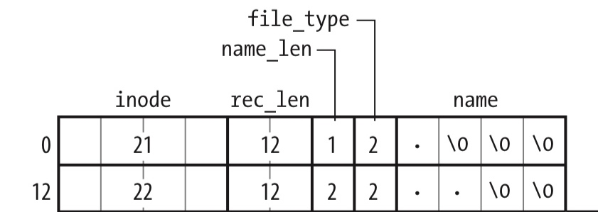

title:'Ext4 - 1 Inode Allocator'
## Ext4 - 1 Inode Allocator


### inode bitmap/table

Ext4 Spec 中描述 Ext4 文件系统使用

- inode table 存储该 block group 中的所有 inode 描述符
- inode bitmap 描述 inode table 中各个 inode 的使用情况


磁盘分区挂载过程中，mount() 系统调用会从磁盘读取各个 block group 的 inode table 与 inode bitmap

```
mount() syscall
    do_mount
        do_new_mount
            vfs_kern_mount
                mount_fs
                    .mount(), that is, ext4_mount
                        mount_bdev
                            ext4_fill_super
```

ext4_fill_super() 中会设置 memory version superblock 即 ext4_sb_info，其中

- 创建 memory version superblock 即 ext4_sb_info
- 创建磁盘上存储的 superblock 对应的 block buffer，即将 disk version superblock 即 ext4_super_block 读取到内存中，并保存在 ext4_sb_info 的 s_es 字段
- 创建磁盘上存储的 group descriptors 对应的 block buffer，即将 disk version group descriptor 读取到内存中，对应的 block buffer 对应的 buffer head 保存在 ext4_sb_info 的 s_group_desc[] 数组


### create directory

> mkdir()/mkdirat() 系统调用最终会调用父目录的 inode ops 的 mkdir() 回调函数，为子目录分配对应的 inode

```
mkdir()/mkdirat() syscall
    do_mkdirat
        vfs_mkdir
            dir->i_op->mkdir(), i.e., ext4_mkdir()
```


> 确定当前在哪个 block group 分配 inode

分配 inode 时，实际需要确定在哪个 block group 分配该 inode，为 directory 分配 inode 的策略是

1. 对于 top level directory，也就是根目录下的子目录来说，这些目录应该在所有的 block group 中均匀分布

此时从所有的 block group 中找到 <used_dirs> 最小的那么 block group，其中 <used_dirs> 表示 block group 中所有 directory inode 的数量，如果找到的这个 block 同时满足以下条件

- 找到的这个 block 的 <free_inodes> 大于等于 <average_free_inodes>，其中 <free_inodes> 表示 block group 中所有 free inode 的数量，<average_free_inodes> 表示所有 block group 中 free inode 的平均数量
- 找到的这个 block 的 <free_blocks> 大于等于 <average_free_blocks>，其中 <free_blocks> 表示 block group 中所有 free block 的数量，<average_free_blocks> 表示所有 block group 中 free block 的平均数量

那么就在这个找到的 block group 中为 directory 分配对应的 inode


2. 如果 top level directory 以上寻找的过程失败，或者对于 non-top-level directory

实际上只要找一个满足 “<free_inodes> 大于等于 <average_free_inodes>” 条件的 block group 就可以了，同时父目录具有更高的优先级，也就是从父目录所在的 block group 开始遍历所有的 block group，只要当前遍历的 block group 满足 “<free_inodes> 大于等于 <average_free_inodes>” 条件，那么当前遍历的 block group 就是我们需要寻找的 block group


3. 如果以上寻找的过程也失败了（这个是有可能的），那么直接返回父目录所在的 block group


> 在选定的 block group 中分配 inode

- group descriptor 的 bg_inode_bitmap_lo/bg_inode_bitmap_hi 字段描述了该 block group 中 inode bitmap 的起始 physical block number 地址
- 为 inode bitmap 创建对应的 block buffer，并将 inode bitmap 从 disk 读到内存中
- 从 bit 0 开始，寻找 inode bitmap 中的第一个 zero bit，作为当前分配的 inode 的 inode number


> 初始化 directory inode

directory inode 刚开始分配出来的时候，就会为其分配一个 data block，用于存储 ext4_dir_entry_2，此时就需要在 data block 中初始化 "." 和 ".." 对应的 ext4_dir_entry_2




> 之后将当前创建的子目录对应的 ext4_dir_entry_2 添加到父目录的 data block 中


### create regular file

> open() 系统调用过程中会执行 filepath lookup 操作，其中会寻找需要打开的文件对应的 inode，若该文件当前尚未创建，则会调用父目录 inode ops 的 create() 回调函数，为当前创建的文件分配一个 inode

```
open() syscall
    path_openat
        do_last
            lookup_open
                (open_flag & O_CREAT) dir_inode->i_op->create(), i.e., ext4_create()
```


> 确定当前在哪个 block group 分配 inode

分配 inode 时，实际需要确定在哪个 block group 分配该 inode，为 regular file 分配 inode 的策略是

1. 优先将父目录与其下的文件放置在同一个 block group

此时如果父目录所在的 block group 满足以下条件，那么就在父目录所在的 block group 中分配 inode

- 该 block group 中存在空闲可用的 inode
- 该 block group 中存在空闲可用的 block

2. 如果以上查找过程失败了，那么就需要将子文件放置在另一个 block group 中

此时的策略是

- 当子文件需要放置在其他 block group 中时，同一个父目录下的子文件应该放置在同一个 block group
- 当子文件需要放置在其他 block group 中时，不同父目录下的子文件应该均匀分布在所有其他 block group 中

当然最终选择的 block group 仍然要满足以下条件

- 该 block group 中存在空闲可用的 inode
- 该 block group 中存在空闲可用的 block


例如父目录 "<parent_dir>" 位于 block group 0 时，整个分区一共具有 8 个 block group 时，那么 <parent_dir> 下的子文件会优先放置在 block group 0；而如果 block group 0 中当前不存在可用的 inode 或 block 时，也就是说需要将其子文件放置在其他 block group 中时，"<parent_dir>" 下的所有子文件都会集中存储在 block group 1~7 的其中一个 block group 中，例如 block group A

另外如果 block group 0 中的另一个父目录 "<parent_dir_2>"，那么 "<parent_dir_2>" 下的子文件需要存储在其他 block group 时，其下的所有子文件应该集中存储在 block group 1~7 中的另一个 block group 中，例如 block group B


> 在选定的 block group 中分配 inode

这一步与分配 directory inode 时的操作是一致的

- group descriptor 的 bg_inode_bitmap_lo/bg_inode_bitmap_hi 字段描述了该 block group 中 inode bitmap 的起始 physical block number 地址
- 为 inode bitmap 创建对应的 block buffer，并将 inode bitmap 从 disk 读到内存中
- 从 bit 0 开始，寻找 inode bitmap 中的第一个 zero bit，作为当前分配的 inode 的 inode number


> 之后将当前创建的子文件对应的 ext4_dir_entry_2 添加到父目录的 data block 中


