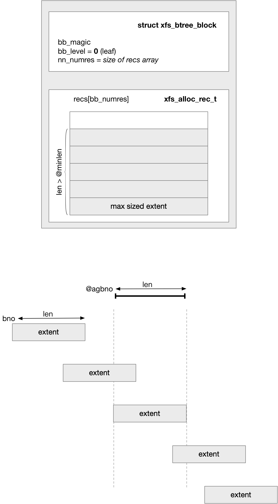
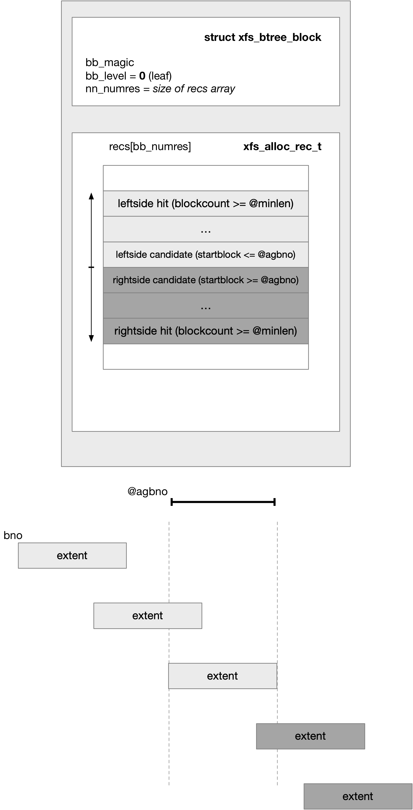

title:'XFS - Block Management'
## XFS - Block Management


### Addressing

macro | description
---- | ----
XFS_FSS_TO_BB | volume sector (FileSystem Sector) to sector (Basic Block)
XFS_FSB_TO_BB | absolute block (FileSystem Block) to sector (Basic Block)
XFS_AGB_TO_DADDR | relative block (AG Block) to sector (Disk ADDRess)


#### volume sector

XFS 中的最小寻址单元是 sector，这里的 sector 是文件系统中的概念，为了与 block 层的 sector 相区别，这里称为 volume sector

superblock 的 @sb_sectsize 字段就描述了 volume sector 的大小，通常是 512 或 4096 字节

```c
typedef struct xfs_dsb {
	__be16		sb_sectsize;	/* volume sector size, bytes */
	...
```

XFS 规范规定 superblock 存储在 AG 的第一个 sector，AGF (AG Freespace) 存储在 AG 的第二个 sector，这里实际上都是 volume sector


#### sector

xfs_daddr_t (disk address) 同样用于 XFS 文件系统的寻址，以 sector 为单位，这里的 sector 是 block 层的 sector (大小固定为 512 字节) 的概念，因而 xfs_daddr_t 更多地是在块设备层面进行寻址

```c
typedef __s64			xfs_daddr_t /* <disk address> type */
```


#### block

此外 XFS 中的最小分配单元是 block

superblock 的 @sb_blocksize 字段就描述了 block 的大小，通常是 4K 大小，但是其大小可以是 512~65536 字节

```c
typedef struct xfs_dsb {
	__be16		sb_blocksize;/* logical block size, bytes */
	...
```

xfs_agblock_t 描述 AG 内部的相对地址，以 block 为单位
xfs_fsblock_t 描述整个文件系统范围内的绝对地址，以 block 为单位

```c
typedef uint32_t	xfs_agblock_t; /* blockno in alloc. group */
typedef uint64_t	xfs_fsblock_t; /* blockno in filesystem (agno|agbno) */
```

agblock 到 fsblock 的转换公式如下，其中 @agbno 为对应的 agblock number，@agno 为其所在的 AG number

```
(xfs_fsblock_t)(agno) * sb_agblocks + agbno)
```


### Allocator Routine

block allocation 的入口为 xfs_alloc_vextent()，用于分配一块 block 区间 (即 extent)

```c
int xfs_alloc_vextent(struct xfs_alloc_arg *args)
```

其中会通过 Free Space B+ Tree 查找符合条件的空闲 block 区间，以 XFS_ALLOCTYPE_THIS_AG 为例

```sh
xfs_alloc_vextent
    xfs_alloc_ag_vextent
        xfs_alloc_ag_vextent_size // XFS_ALLOCTYPE_THIS_AG
            xfs_alloc_lookup_ge(cnt_cur, ...) // lookup record in blockcount Free Space B+ Tree
            bno_cur = xfs_allocbt_init_cursor(...) // lookup record in blocknumber Free Space B+ Tree
            xfs_alloc_fixup_trees
                xfs_btree_delete(cnt_cur, ...) // delete record in blockcount Free Space B+ Tree
                xfs_btree_delete(bno_cur, ...) // delete record in blocknumber Free Space B+ Tree
```


#### input & output

> input param

xfs_alloc_arg_t 是 block 分配操作的辅助数据结构，其中描述了当前需要分配的 extent 的相关条件，即分配一块从 @fsbno 起始的 @maxlen 大小 (以 block 为单位) 的 extent

```c
typedef struct xfs_alloc_arg {
	xfs_fsblock_t	fsbno;	/* file system block number */
	xfs_agblock_t	agbno;	/* allocation group-relative block # */
	xfs_fsblock_t	fsbno;	/* file system block number */
	
	xfs_extlen_t	maxlen;		/* maximum size of extent */
	xfs_extlen_t	minlen;		/* minimum size of extent */
	...
} xfs_alloc_arg_t;
```

注：@agno/@agbno 由 @fsbno 计算得出


> output result

返回时，@fsbno 或 @agbno/@len 就描述最终分配的 extent

```c
typedef struct xfs_alloc_arg {
	xfs_extlen_t	len;		/* output: actual size of extent */
	xfs_agblock_t	agbno;	/* allocation group-relative block # */
	xfs_fsblock_t	fsbno;	/* file system block number */
	...
} xfs_alloc_arg_t;
```

如果最终找不到合适条件的 extent，那么 @agbno 返回 NULLAGBLOCK，即 @fsbno 返回 NULLFSBLOCK


#### strategy

@type 字段描述了 block 分配的策略

```c
typedef struct xfs_alloc_arg {
	xfs_alloctype_t	type;		/* allocation type XFS_ALLOCTYPE_... */
	...
} xfs_alloc_arg_t;
```

其中 XFS_ALLOCTYPE_THIS_AG/XFS_ALLOCTYPE_THIS_BNO/XFS_ALLOCTYPE_NEAR_BNO 相当于是基础策略，描述了在 @agno 指定的 AG 中如何分配 extent

而 XFS_ALLOCTYPE_FIRST_AG/XFS_ALLOCTYPE_START_BNO 则相当于复合策略，描述在多个 AG 中如何分配 extent，其中会使用到以上这三个基础策略，从而构建出更为复杂的策略


##### XFS_ALLOCTYPE_THIS_AG

此时只需要在 @agno AG 的任意位置分配一个符合要求的 extent，此时 @agbno 字段无效；此时会在 blockcount 排序的 Free Space B+ tree 中，从 AG block number 0 开始查找第一个足够大 (大于 @maxlen) 的 extent

```sh
xfs_alloc_vextent
    xfs_alloc_ag_vextent
        xfs_alloc_ag_vextent_size
```

##### XFS_ALLOCTYPE_THIS_BNO

在 @agno AG 分配一个 extent，同时分配的 extent 必须从 @agbno 开始，此时最终分配的 extent 的大小可以小于 @maxlen，但是必须在 [@minlen, @maxlen] 范围内

```sh
xfs_alloc_vextent
    xfs_alloc_ag_vextent
        xfs_alloc_ag_vextent_exact
```

##### XFS_ALLOCTYPE_NEAR_BNO

在 @agno AG 分配一个 extent，分配的 extent 需要尽可能在 @agbno 附近 (分配的 extent 可以不包含 @agbno)，此时最终分配的 extent 的大小可以小于 @maxlen，但是必须在 [@minlen, @maxlen] 范围内

调用者也可以输入 @min_agbno/@max_agbno 限制分配的 extent 的范围，即只能在 [@min_agbno, @max_agbno] 范围内分配 extent；如果调用者未设置这两个参数，那么 @min_agbno 默认为 0，@max_agbno 默认为 AG 的最后一个 block，即默认在整个 AG 中分配 extent

```c
typedef struct xfs_alloc_arg {
	xfs_agblock_t	min_agbno; /* set an agbno range for NEAR allocs */
	xfs_agblock_t	max_agbno; /* ... */
	...
} xfs_alloc_arg_t;
```


```sh
xfs_alloc_vextent
    xfs_alloc_ag_vextent
        xfs_alloc_ag_vextent_near
```

XFS_ALLOCTYPE_NEAR_BNO 分配分两种情况

1. AG 中 [@min_agbno, @max_agbno] 范围内不存在大于等于 @maxlen 的 free extent

此时优先获取足够大的 extent，尽可能靠近 @agbno 的要求可以释放放宽

具体过程是，在 blockcount 排序的 Free Space B+ Tree 中获取最后一个 data record，即当前 AG 中最大的一个 extent；之后遍历该 extent 所在的叶子节点中的所有 extent，对于其中大小超过 @minlen、同时在 [@min_agbno, @max_agbno] 范围内的 extent，挑选起始 block number 离 @agbno 最近的一个 extent，作为最终挑选的 extent




2. AG 中 [@min_agbno, @max_agbno] 范围内存在大于等于 @maxlen 的 free extent

此时优先挑选尽可能靠近 @agbno 的 extent，最终挑选的 extent 可以小于 @maxlen，但必须是大于等于 @minlen 的

具体过程是，在 blocknumber 排序的 Free Space B+ Tree 中获取起始 block number 小于等于 @agbno 的 extent，记为 leftside candidate；同时 leftside candidate 右边的一个 extent 记为 rightside candidate

首先 leftside candidate 往左边寻找大小满足 @minlen 要求的 extent，记为 leftside hit，rightside candidate 往右边寻找大小满足 @minlen 要求的 extent，记为 rightside hit

如果只有一个方向上找到了 hit，那么就返回该 hit 作为最终挑选的 extent；如果两个方向上都找到了 hit，那么就在两个 hit 中挑选起始 block number 离 @agbno 最近的一个 extent，作为最终挑选的 extent




##### XFS_ALLOCTYPE_FIRST_AG

首先尝试在 @agno AG 按照 XFS_ALLOCTYPE_THIS_AG 方式分配一个 extent，如果 @agno AG 中不存在满足要求的 extent，那么在 @agno AG 的下一个 AG 中重复以上过程，一直到文件系统的最后一个 AG

即在 @agno AG 与最后一个 AG 的范围内，按照 XFS_ALLOCTYPE_THIS_AG 方式找到一个满足要求的 extent


##### XFS_ALLOCTYPE_START_BNO

从 @agno AG 开始，遍历所有的 AG 两轮，以寻找一个符合要求的 extent

- 最开始在 @agno AG 按照 XFS_ALLOCTYPE_NEAR_BNO 方式分配一个 extent
- 之后的第一轮遍历 (一直到 @agno 的前一个 AG)，按照 XFS_ALLOCTYPE_THIS_AG 方式分配
- 之后的第二轮遍历 (从 @agno AG 开始)，按照 XFS_ALLOCTYPE_NEAR_BNO 方式分配


#### alignment

##### prod & mod

上述介绍的 XFS_ALLOCTYPE_THIS_BNO/XFS_ALLOCTYPE_NEAR_BNO 策略中，最终分配的 extent 的大小可以小于 @maxlen，但是必须在 [@minlen, @maxlen] 范围内

对于这些策略，实际上最终分配的 extent 的大小必须满足以下格式

```
@len = k * @prod + @mod
```

```c
typedef struct xfs_alloc_arg {
	xfs_extlen_t	mod;		/* mod value for extent size */
	xfs_extlen_t	prod;		/* prod value for extent size */
	...
} xfs_alloc_arg_t;
```

默认情况下，@prod 为 1，@mod 为 0，即最终分配的 extent 的大小不再受上述格式的要求

> 相关实现参考 xfs_alloc_fix_len()


##### alignment

此外最终分配的 extent 的起始 block number 需要按照 @alignment 对齐，需要注意的是分配的 extent 的大小不需要是 @alignment 的整数倍

```c
typedef struct xfs_alloc_arg {
	xfs_extlen_t	alignment;	/* align answer to multiple of this */
	...
} xfs_alloc_arg_t;
```

@alignment 的默认值为 1，即默认不存在对齐要求

> 相关实现参考 xfs_alloc_compute_aligned()


### Extent Allocate Routine

XFS 使用 iomap 接口实现 block mapping，如果 write 系统调用中当前写入的 file offset 对应的 extent 是一个 hole，那么此时就需要为当前写入的 file offset 分配一个对应的 extent

```sh
xfs_iomap_ops->iomap_begin(), i.e., xfs_file_iomap_begin()
    xfs_bmapi_read // find the block mapping by extent tree
    if (returned imap.br_startblock == HOLESTARTBLOCK): // hole    
        xfs_iomap_write_direct
            xfs_bmapi_write
                xfs_bmapi_allocate
                    xfs_bmap_alloc
                        xfs_bmap_btalloc
                            xfs_alloc_vextent
```

extent 分配 block 的入口为 xfs_bmap_alloc()，其中会调用 xfs_alloc_vextent() 向 block allocator 申请分配一定的 block 区间，因而其任务就是初始化对应的 xfs_alloc_arg_t 参数，为此还使用了对应的辅助结构即 struct xfs_bmalloca

```c
int xfs_bmap_alloc(struct xfs_bmalloca *bma)
```


#### input & output

首先介绍以下几个概念，后面会介绍到这些概念会影响 extent 的分配

1. input param

> extent requirement

```c
struct xfs_bmalloca {
	xfs_fileoff_t		offset; /* offset in file filling in */
	xfs_extlen_t		length;	/* i/o length asked/allocated */
	...
};
```

当前需要为 @offset 文件偏移处起始，@length 大小的区间，分配对应的 physical extent


> @prev/@got

@prev 描述当前触发 block mapping 的 file offset 的前一个 extent
@got 描述后一个 extent

```c
struct xfs_bmalloca {
	struct xfs_bmbt_irec	prev; /* extent before the new one */
	struct xfs_bmbt_irec	got; /* extent after, or delayed */
	...
};
```


> @eof/@aeof

```c
struct xfs_bmalloca {
	bool			eof;	/* set if allocating past last extent */
	bool			aeof;	/* allocated space at eof */
	...
};
```

如果当前触发 block mapping 操作的 file offset 在文件 extent tree 的最后一个 extent 之后，那么 @eof 标志位就会设置为 1，相当于描述即将分配的 block 区间是该文件的 eof (end of file)

```sh
xfs_iomap_write_direct
    xfs_bmapi_write
        (if file offset beyonds the last extent of extent tree):
            eof = true
```


@aeof 的含义与 @eof 类似，同时又在 @eof 的基础上更进一步，即当前触发 block mapping 操作的 file offset 在文件 extent tree 的最后一个 extent 之后，同时当前触发 block mapping 操作的 extent 大小大于等于 chunk size 时，@aeof 标志位才会设置为 1

```sh  
xfs_iomap_write_direct
    xfs_bmapi_write
        xfs_bmapi_allocate
            (length >= @m_dalign) xfs_bmap_isaeof
                (if file offset beyonds the last extent of extent tree):
                    aeof = true
                   
```


2. output result

```c
struct xfs_bmalloca {
	xfs_extlen_t		length;	/* i/o length asked/allocated */
	xfs_fsblock_t		blkno; /* starting block of new extent */
	...
};
```

最终分配了 @blkno 起始的，@length 大小的 physical extent


#### extent

首先需要确定当前需要分配的 extent 区间，即 args 参数的 @fsbno/@minlen/@maxlen 参数

> @fsbno

XFS 中 data block 分配的总体原则是，文件的 data block 尽可能分布在文件的 inode 附近，因而 @fsbno 会配置为文件的 inode 的 fs block number，并按照 XFS_ALLOCTYPE_START_BNO 分配

```sh
xfs_iomap_write_direct
    xfs_bmapi_write
        xfs_bmapi_allocate
            xfs_bmap_alloc
                xfs_bmap_btalloc
                    # @blkno = XFS_INO_TO_FSB(mp, ap->ip->i_ino)
                    xfs_bmap_btalloc_nullfb
                        # @type = XFS_ALLOCTYPE_START_BNO
```


当然实际的 @fsbno 会在文件 inode 的 fs block number 的基础上微调

```sh
xfs_iomap_write_direct
    xfs_bmapi_write
        xfs_bmapi_allocate
            xfs_bmap_alloc
                xfs_bmap_btalloc
                    # @blkno = XFS_INO_TO_FSB(mp, ap->ip->i_ino)
                    xfs_bmap_adjacent
                
```

- 如果 @eof 为 1，即当前是 append 分配新的 extent
    - 如果 @prev 为空，例如第一次写入一个新文件的时候，那么不会作任何微调，此时 @fsbno 就是文件 inode 的 fs block number
    - 如果 @prev 不为空，即存在前一个 extent，那么优先接在前一个 extent 之后分配新的 block

```
file offset:
                  offset diff
                 <------------>
+++++++++++++++++--------------+++++++++++++++++++++
prev extent     |              | current file offset
+++++++++++++++++--------------+++++++++++++++++++++


disk block number:
                  offset diff
                 <------------>
+++++++++++++++++--------------+++++++++++++++++++++
prev extent     |              | current file offset
+++++++++++++++++--------------+++++++++++++++++++++
```

- 如果 @eof 为 0，即当前是填充 hole，那么新分配的 extent 尽可能接近前一个 extent (@prev) 或后一个 extent (@got)，其中前一个 extent 的优先级更高


> @minlen/@maxlen

@maxlen 默认就是触发当前 block mapping 操作的 extent 的长度，即 xfs_file_iomap_begin() 的 @length 参数

```sh  
xfs_iomap_write_direct
    xfs_bmapi_write
        bma.length = @length
        xfs_bmapi_allocate
            xfs_bmap_alloc
                xfs_bmap_btalloc
                    args.maxlen = bma->length
```


@minlen 参数的配置则参考以下规则

首先从上述选定的 @fsbno 所在的 AG 开始，遍历所有的 AG，找到第一个足够大 (即大于等于 @maxlen) 的 free extent，如果存在这样的 free extent，那么 @minlen 的值就等于 @maxlen

否则从上述选定的 @fsbno 所在的 AG 开始，遍历所有的 AG，找到所有 AG 中最大的那个 free extent，那么 @minlen 的值就是这个最大的 free extent 的大小，虽然此时挑选的 @fsbno/@minlen 可能来自于不同的 AG，但因为是按照 XFS_ALLOCTYPE_START_BNO 方式分配，其中就会遍历所有的 AG

```sh  
xfs_iomap_write_direct
    xfs_bmapi_write
        xfs_bmapi_allocate
            # @minlen = (flags & XFS_BMAPI_CONTIG) ? @maxlen : 1
            xfs_bmap_alloc
                xfs_bmap_btalloc
                    xfs_bmap_btalloc_nullfb
                        xfs_bmap_select_minlen
                            # find free extent large enough (>= @maxlen) starting from @agno
                            # (if there's free extent large enough) @minlen = @maxlen
                            # (else) @minlen = size of largest free extent in all AGs
```


#### alignment

alignment 特性包含两方面，extent 的起始 block number，以及 extent 的大小

同时有两个特性会影响分配的 extent 的 alignment 特性，即 extent hint 和 stripe

##### extent hint

用户可以通过 FS_IOC_FSSETXATTR ioctl 设置 extent hint 属性，保存在 @di_extsize 字段，每个文件可以单独设置该属性

```c
typedef struct xfs_dinode {
	__be32		di_extsize;	/* basic/minimum extent size for file */
	...
}
```

extent hint 主要影响 extent 的大小，新分配的 extent 的大小会向上取整为 extent hint 的整数倍


- 对于 append write 方式，extent hint 生效的路径是

```sh
xfs_iomap_write_direct
    if (offset + count) > inode size:
        xfs_iomap_eof_align_last_fsb
            # roundup @length to extent hint
```

此时新分配的 extent 的大小会向上取整为 extent hint 的整数倍


- 否则当前是在填充 hole，此时 extent hint 生效的路径是

```sh  
xfs_iomap_write_direct
    xfs_bmapi_write
        xfs_bmapi_allocate
            xfs_bmap_alloc
                xfs_bmap_btalloc
                    xfs_bmap_extsize_align
```


如果当前触发 block mapping 的 extent 前后都没有 extent，那么当前新分配的 extent 会按照 extent hint 对齐 (包括起始 block number 与大小)

```
                    extent hint
            <～～～～～～～～～～～～～～～～>        
    --------|-------+-----------+-------|--------
            |       |$$$$$$$$$$$|       |
    --------|-------+-----------+-------|--------    
                   off<---len--->
            ^<-------------------------->
        @fsbno         @maxlen
(round down to       
extent hint)
```

> 上述 "<--->" 图例表示实际分配的 extent 范围


如果当前触发 block mapping 的 extent 前面有 extent，且对齐之后的想要分配的 extent 范围与前一个 extent 重叠，那么会紧接在前一个 extent 之后分配一个新的 extent，新分配的 extent 的大小仍然为 extent hint；此时新分配的 extent 的起始 block number 不是按照 extent hint 对齐的

```
                    extent hint
            <～～～～～～～～～～～～～～～～>        
    -----------|-------+-----------+-------|--------
   prev extent |       |$$$$$$$$$$$|       |
    -----------|-------+-----------+-------|--------    
                   off<---len--->
               <--------------------------->
          @fsbno         @maxlen
```


如果当前触发 block mapping 的 extent 后面有 extent，且对齐之后的想要分配的 extent 范围与后一个 extent 重叠，那么会紧接在后一个 extent 前面分配一个新的 extent，新分配的 extent 的大小仍然为 extent hint；此时新分配的 extent 的起始 block number 不是按照 extent hint 对齐的

```
                    extent hint
            <～～～～～～～～～～～～～～～～>        
    --------|-------+-----------+----|--------
            |       |$$$$$$$$$$$|    | next extent
    --------|-------+-----------+----|--------    
                   off<---len--->
         <--------------------------->
    @fsbno         @maxlen
```


如果当前触发 block mapping 的 extent 前后都有 extent，且对齐之后的想要分配的 extent 范围与前后 extent 都重叠，那么只能在前后两个 extent 之间分配一个新的 extent，此时新分配的 extent 的大小会小于 extent hint，同时新分配的 extent 的起始 block number 也不是按照 extent hint 对齐的

```
                    extent hint
            <～～～～～～～～～～～～～～～～>        
    -----------|----+-----------+----|--------
   prev extent |    |$$$$$$$$$$$|    | next extent
    -----------|----+-----------+----|--------    
                   off<---len--->
               <--------------------->
          @fsbno      @maxlen   
```


以上介绍的算法都是计算 @fsbno/@maxlen 参数，但是最终分配的 extent 的大小有可能小于 @maxlen，此时还必须设置 @prod 参数，以确保最终分配的 extent 大小为 extent hint

```sh  
xfs_iomap_write_direct
    xfs_bmapi_write
        xfs_bmapi_allocate
            xfs_bmap_alloc
                xfs_bmap_btalloc
                    # @prod = extent hint
```


##### stripe

用户在格式化文件系统的时候，可以通过 "su" 和 "sw" 参数设置文件系统的 stripe 配置

这主要是考虑到 xfs 文件系统底层的块设备是一个 stripe 设备时，文件系统在分配 block 的时候，新分配的 extent 必须优先按照 stripe 对齐

一个 stripe 由多个 chunk 构成，每个 chunk 都对应一个底层设备

```
<------------------ m_swidth ------------------->
<-m_dalign->
+-----------+-----------+-----------+-----------+
|  chunk 0  |  chunk 1  |  chunk 2  |  chunk 3  |
+-----------+-----------+-----------+-----------+
|  chunk 4  |  chunk 5  |  chunk 6  |  chunk 7  |
+-----------+-----------+-----------+-----------+
|  chunk 8  |  chunk 9  |  chunk 10 |  chunk 11 |
+-----------+-----------+-----------+-----------+

|  device A |  device B |  device C |  device D |
| (stripe 1)| (stripe 2)| (stripe 3)| (stripe 4)|
```

"su" 参数描述了 chunk size，"sw" 参数描述了一个 stripe 包含的 chunk 的大小

文件系统初始化的时候就会初始 @m_dalign 字段，即 chunk size

```c
typedef struct xfs_mount {
	int			m_dalign;	/* stripe unit */
	int			m_swidth;	/* stripe width */
	...
}
```

```sh
xfs_fs_fill_super
    xfs_parseargs
        mp->m_dalign = dsunit;
    xfs_mountfs
        xfs_update_alignment
            mp->m_dalign = XFS_BB_TO_FSBT(mp, mp->m_dalign); // convert stripe unit to FSB (FileSystem Block)
```


- 对于 append write 方式，stripe 生效的路径是

```sh
xfs_iomap_write_direct
    if (offset + count) > inode size:
        xfs_iomap_eof_align_last_fsb
            # roundup @length to chunk size
```

此时新分配的 extent 的大小会向上取整为 chunk size 的整数倍


- 否则当前是在填充 hole，此时 stripe 生效的路径是

如果 @aeof 标志位被设置，同时当前触发 block mapping 操作的 file offset 为 0，即当前是第一次写入文件，此时 @alignment 参数会被设置为 chunk size，即新分配的 extent 的起始 block number 需要按照 stripe 对齐

```sh  
xfs_iomap_write_direct
    xfs_bmapi_write
        xfs_bmapi_allocate
            xfs_bmap_alloc
                xfs_bmap_btalloc
                   # @alignment = chunk size
                   xfs_alloc_vextent // first time
                   
                   (if first xfs_alloc_vextent failed):
                        # @alignment = 0
                        xfs_alloc_vextent // second time
```


如果 @aeof 标志位被设置，但是当前触发 block mapping 操作的 file offset 不是 0，即当前是 append write，首先按照 XFS_ALLOCTYPE_THIS_BNO 方式第一次尝试分配，此时是没有按照 stripe 对齐要求的；如果第一次尝试失败，那么第二次按照之前的 XFS_ALLOCTYPE_START_BNO 方式再尝试一次，此时需要按照 stripe 对齐

```sh  
xfs_iomap_write_direct
    xfs_bmapi_write
        xfs_bmapi_allocate
            xfs_bmap_alloc
                xfs_bmap_btalloc
                   # @type = XFS_ALLOCTYPE_THIS_BNO
                   # @alignment = 1
                   xfs_alloc_vextent // first time
                   
                   (if first xfs_alloc_vextent failed):
                        # @type = XFS_ALLOCTYPE_START_BNO
                        # @alignment = chunk size
                        xfs_alloc_vextent // second time

                   (if second xfs_alloc_vextent failed):
                        # @type = XFS_ALLOCTYPE_START_BNO
                        # @alignment = 0
                        xfs_alloc_vextent // third time
```


如果 @aeof 标志位未被设置，即当前是填充 hole，此时只会尝试一次，同时不必按照 stripe 对齐

```sh  
xfs_iomap_write_direct
    xfs_bmapi_write
        xfs_bmapi_allocate
            xfs_bmap_alloc
                xfs_bmap_btalloc
                   # @alignment = 1
```


所以 stripe 对齐并不是一个强保证，如果当前需要分配 block 的 extent 前后存在相邻 extent，那么优先在前后相邻的 extent 映射的 block 附近分配新的 block，从而确保同一个文件映射的 block 区间尽可能的连续，从而放松了按照 stripe 对齐的要求


#### extent status

xfs_iomap_write_direct() 过程中实际分配的 extent 的大小有可能大于或小于 xfs_file_iomap_begin() 传入的 @length 参数，同时这些 extent 都是会直接添加到 extent tree 中去的


> non-DAX

实际上在非 DAX 设备上，上述 xfs_iomap_write_direct() 新分配的 extent 实际上都是 unwritten 状态的；之后等到 writeback 的时候，在 writeback IO 完成时，才会将 extent tree 中对应的 extent 由 unwritten 状态转换为 normal 状态

```sh
# write() syscall
xfs_iomap_ops->iomap_begin(), i.e., xfs_file_iomap_begin()
    xfs_iomap_write_direct
        bmapi_flags = XFS_BMAPI_PREALLOC
        xfs_bmapi_write
            xfs_bmapi_allocate
                xfs_bmap_alloc // allocate block
                (bma->flags & XFS_BMAPI_PREALLOC):
                    bma->got.br_state = XFS_EXT_UNWRITTEN
                xfs_bmap_add_extent_hole_real // insert extent
               
# writeback
a_ops->writepages(), i.e., xfs_vm_writepages
    write_cache_pages
        xfs_do_writepage
            xfs_writepage_map
                xfs_map_blocks
                    (imap.br_state == XFS_EXT_UNWRITTEN):
                        io_type = XFS_IO_UNWRITTEN
                # submit_bio() for dirty page

# on bio completion
bio->bi_end_io(), i.e., xfs_end_bio()
    (io_type == XFS_IO_UNWRITTEN) queue_work(..., &ioend->io_work)
        io_work->func(), i.e., xfs_end_io()
            (io_type == XFS_IO_UNWRITTEN) xfs_iomap_write_unwritten
                xfs_bmapi_write(..., XFS_BMAPI_CONVERT, ...)
                    need_alloc = false
                    xfs_bmapi_convert_unwritten
                        (XFS_EXT_UNWRITTEN) mval->br_state = XFS_EXT_NORM
                        xfs_bmap_add_extent_unwritten_real(..., mval,) // convert extent from unwritten to normal
```


> DAX

而对于 DAX 设备，xfs_iomap_write_direct() 新分配的 extent 实际上是 normal 状态的，只是需要将新分配的 extent 作 write zero 处理，实际上也就是作 memcpy zero 处理

```sh
# write() syscall
xfs_iomap_ops->iomap_begin(), i.e., xfs_file_iomap_begin()
    xfs_iomap_write_direct
        bmapi_flags = XFS_BMAPI_CONVERT | XFS_BMAPI_ZERO
        xfs_bmapi_write
            xfs_bmapi_allocate
                (bma->flags & XFS_BMAPI_ZERO) bma->datatype |= XFS_ALLOC_USERDATA_ZERO
                xfs_bmap_alloc 
                    xfs_bmap_btalloc
                        xfs_alloc_vextent
                            # allocate block
                            (args->datatype & XFS_ALLOC_USERDATA_ZERO) xfs_zero_extent
                                __blkdev_issue_zero_pages // write zero
                                submit_bio_wait(bio)
                                    q->make_request_fn(), i.e., pmem_make_request
                                        pmem_do_bvec
                                            write_pmem
                                                memcpy(...)
                                    
                bma->got.br_state = XFS_EXT_NORM
                xfs_bmap_add_extent_hole_real // insert extent
```
