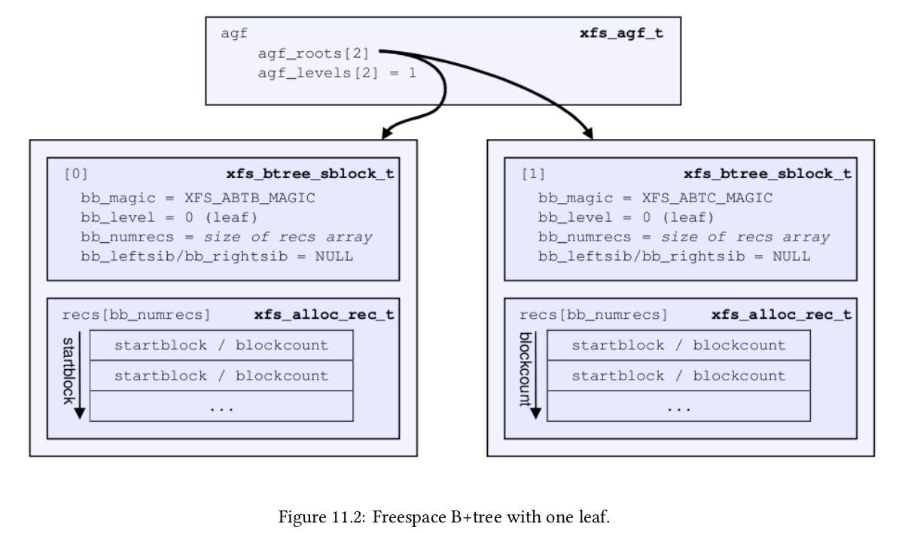
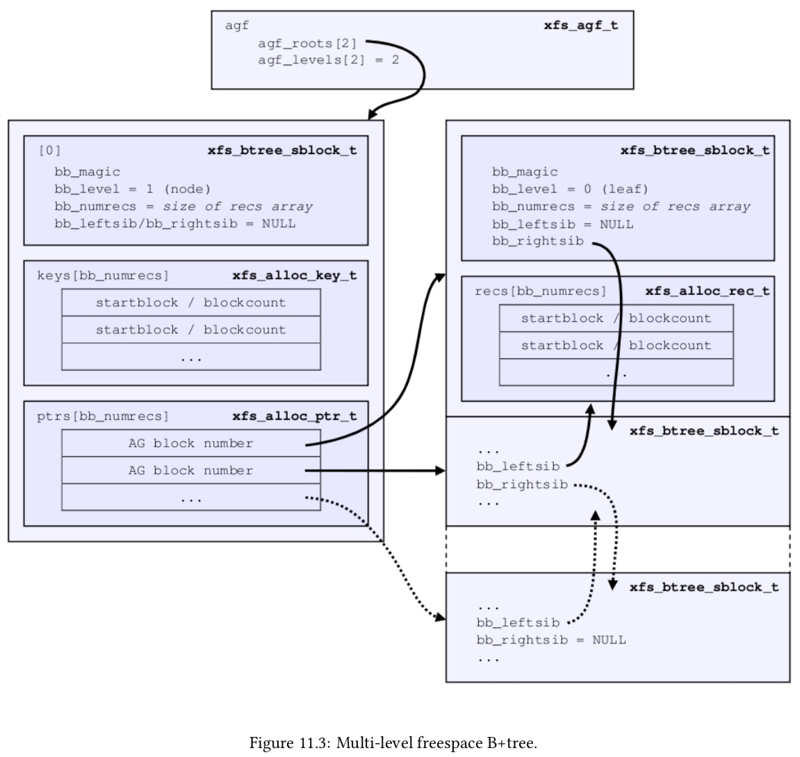
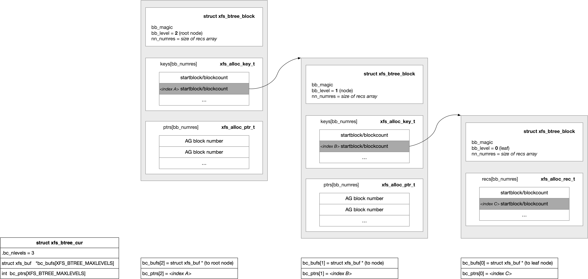

## XFS - B+ Tree


### B+ Tree Format

叶子节点的格式为

```
+--------+------------+------------+ 
| header |   record   |  records...| 
+--------+------------+------------+
```

中间节点的格式为

```
+--------+---------+---------+---------+---------+
| header |   key   | keys... |   ptr   | ptrs... | 
+--------+---------+---------+---------+---------+
```


#### header

无论是中间节点还是叶子节点，都以一个 header 起始，由 struct xfs_btree_block 描述

```c
struct xfs_btree_block {
	__be32		bb_magic;	/* magic number for block type */
	__be16		bb_level;	/* 0 is a leaf */
	__be16		bb_numrecs;	/* current # of data records */
	union {
		struct xfs_btree_block_shdr s;
		struct xfs_btree_block_lhdr l;
	} bb_u;				/* rest */
};
```

@bb_level 描述当前节点在这棵树中的高度 (叶子节点的高度为 0)
@bb_numrecs 描述当前节点包含的 data record 的数量


header 中还包含 @bb_leftsib/@bb_rightsib 分别描述当前节点的 left/right sibling 节点

```c
/* short form block header */
struct xfs_btree_block_shdr {
	__be32		bb_leftsib;
	__be32		bb_rightsib;

	__be64		bb_blkno;
	__be64		bb_lsn;
	uuid_t		bb_uuid;
	__be32		bb_owner;
	__le32		bb_crc;
};

/* long form block header */
struct xfs_btree_block_lhdr {
	__be64		bb_leftsib;
	__be64		bb_rightsib;

	__be64		bb_blkno;
	__be64		bb_lsn;
	uuid_t		bb_uuid;
	__be64		bb_owner;
	__le32		bb_crc;
	__be32		bb_pad; /* padding for alignment */
};
```

B+ Tree 有 short format 与 long format 两种格式，这主要考虑到有些 B+ Tree 存储的数据即 data record 是 32 bit 的，有些则是 64 bit 的，例如 xfs_agblock_t 即 AG 内部的相对地址 (以 block 为单位) 就是 32 bit 的，xfs_fsblock_t 即整个文件系统范围内的绝对地址 (以 block 为单位) 就是 64 bit 的

如果 data record 是 32 bit 的，就称为是 short format B+ tree，如果 data record 是 64 bit 的，就称为是 long format B+ tree

@bb_leftsib/@bb_rightsib 描述当前节点的 left/right sibling 节点，也就是 left/right sibling 节点的 block number 地址，如上所述这有可能是 32 bit 或 64 bit 的，因而 header 也就有 short format 与 long format 的区分


#### leaf node

叶子节点的格式为

```
+--------+------------+------------+ 
| header |   record   |  records...| 
+--------+------------+------------+
```

对于叶子节点来说，header 之后是一个 data record 数组，其中所有的 data record 会按照一定的 key 进行排序

record 的数据类型是 B+ Tree 特定的，例如 Free Space B+ Tree 中 record 的数据类型即为 xfs_alloc_rec_t

```c
typedef struct xfs_alloc_rec {
	__be32		ar_startblock; /* starting block number */
	__be32		ar_blockcount; /* count of free blocks */
} xfs_alloc_rec_t, xfs_alloc_key_t;
```




#### internal node

中间节点的格式为

```
+--------+---------+---------+---------+---------+
| header |   key   | keys... |   ptr   | ptrs... | 
+--------+---------+---------+---------+---------+
```

header 之后是一个排序的 key 数组，之后是一个对应的 ptr 数组，即 ptrs[i] 指向的节点描述的 key 就介于 keys[i] 与 keys[i+1] 之间

key 的数据类型是 B+ Tree 特定的，例如 Free Space B+ Tree 中 key 的数据类型即为 xfs_alloc_key_t

```c
typedef struct xfs_alloc_rec {
	__be32		ar_startblock; /* starting block number */
	__be32		ar_blockcount; /* count of free blocks */
} xfs_alloc_rec_t, xfs_alloc_key_t;
```

ptr 的数据类型也是 B+ Tree 特定的，但是 ptr 实际上就指向一个节点，其本质上只需要描述其指向的节点的 block number，因而在 short format B+ Tree 中 ptr 是 32 bit，而在 long format B+ Tree 中 ptr 是 64 bit




### lookup routine

B+ Tree 查找操作的入口为 xfs_btree_lookup()

```c
int xfs_btree_lookup( struct xfs_btree_cur *cur, xfs_lookup_t dir, int *stat)
```

#### input param

struct xfs_btree_cur 是 B+ Tree 操作中非常重要的辅助数据结构，在执行 B+ Tree 查找操作之前，就会初始化 xfs_btree_cur 结构

```
xfs_alloc_ag_vextent
    xfs_alloc_ag_vextent_size
        xfs_allocbt_init_cursor
```

> btree type

```c
typedef struct xfs_btree_cur
{
	xfs_btnum_t	bc_btnum;	/* identifies which btree type */
	const struct xfs_btree_ops *bc_ops;
	...
} xfs_btree_cur_t;
```

@bc_btnum 描述当前操作的 B+ Tree 的类型，@bc_ops 则是对应类型的一组回调函数，B+ Tree 操作过程中会调用相关回调函数

bc_btnum | tree | bc_ops
---- | ---- | ----
XFS_BTNUM_BNO | Free Space B+ Tree indexed by starting block number | xfs_bnobt_ops
XFS_BTNUM_CNT | Free Space B+ Tree indexed by number of blocks | xfs_cntbt_ops
XFS_BTNUM_INO | inode tree | xfs_inobt_ops
XFS_BTNUM_BMAP | extent tree | xfs_bmbt_ops
XFS_BTNUM_RMAP | reverse mapping tree | xfs_rmapbt_ops
XFS_BTNUM_REFC | refcount tree | xfs_refcountbt_ops


> btree root address

对 B+ Tree 执行查找操作，首先需要获取 B+ Tree 的根节点的地址，xfs_btree_lookup() 中就会调用 bc_ops->init_ptr_from_cur() 回调函数获取当前需要查找的 B+ Tree 的根节点

```sh
xfs_btree_lookup
    cur->bc_ops->init_ptr_from_cur() // get root node
    xfs_btree_lookup_get_block
```


对于一些 per-AG B+ Tree，例如 inode B+ Tree、Free Space B+ Tree 等，还需要输入当前需要查找的 B+ Tree 所在的 AG 编号，此时 @bc_private.a.agno 就描述了当前需要查找的 B+ Tree 所在的 AG 编号，@bc_private.a.agbp 描述了对应的 AGF (AG Freespace)

```c
typedef struct xfs_btree_cur
{
	...
	union {
		struct {			/* needed for BNO, CNT, INO */
			struct xfs_buf	*agbp; /* agf/agi buffer pointer */
			xfs_agnumber_t	agno; /* ag number */
			union xfs_btree_cur_private priv;
		} a;
		struct {			/* needed for BMAP */
			...
		} b;
	}		bc_private;	/* per-btree type data */
} xfs_btree_cur_t;
```


上述介绍到 B+ Tree 查找过程中需要调用 bc_ops->init_ptr_from_cur() 回调函数获取当前需要查找的 B+ Tree 的根节点，以 Free Space B+ Tree 为例，在 @bc_private.a.agno 确定了当前需要查找的 B+ Tree 所在的 AG 编号之后，对应的 AGF (AG Freespace) 的 @agf_roots[] 数组就描述了该 AG 的 Free Space B+ Tree 根节点的地址 (block number)

```c
typedef struct xfs_agf {
	__be32		agf_roots[XFS_BTNUM_AGF]; /* root blocks */
	...
}
```


> condition for expected data record

此外 @bc_rec 描述了当前需要查找的 data record 的条件

```c
typedef struct xfs_btree_cur
{
	...
	union xfs_btree_irec	bc_rec; /* current insert/search record value */
} xfs_btree_cur_t;
```

以 Free Space B+ Tree 为例，@bc_rec.a.ar_startblock/@bc_rec.a.ar_blockcount 就描述了当前需要查找的 data record

```c
union xfs_btree_irec {
	struct xfs_alloc_rec_incore a;
	struct xfs_bmbt_irec		b;
	struct xfs_inobt_rec_incore i;
	struct xfs_rmap_irec		r;
	struct xfs_refcount_irec rc;
};

typedef struct xfs_alloc_rec_incore {
	xfs_agblock_t	ar_startblock; /* starting block number */
	xfs_extlen_t	ar_blockcount; /* count of free blocks */
} xfs_alloc_rec_incore_t;
```


#### output result

最终查找到的 data record 保存在 @bc_ptrs[]、@bc_bufs[] 数组中

```c
typedef struct xfs_btree_cur
{
	struct xfs_buf	*bc_bufs[XFS_BTREE_MAXLEVELS]; /* buf ptr per level */
	int		bc_ptrs[XFS_BTREE_MAXLEVELS];/* key/record # */
	...
} xfs_btree_cur_t;
```

对于高度为 N 的 B+ Tree (只有一层叶子节点的 B+ Tree 的高度为 1，叶子节点的高度为 0，根节点的高度为 N-1) 

- @bc_bufs[N-1] 指向根节点 (levle=N-1)，根节点的 @ptrs[] 数组中的第 @bc_ptrs[N-1] 个元素就指向下一层的节点，需要注意的是 @bc_ptrs[] 描述的 @ptrs[] 数组的 index 从 1 开始，因而实际上 @ptrs[@bc_ptrs[N-1] - 1] 指向下一层的节点
- 类似地，@bc_bufs[N-2] 指向根节点下一层的节点 (levle=N-2)，该节点中 @ptrs[@bc_ptrs[N-2]] 指向再下一层的节点
- ......
- 最后，@bc_bufs[0] 指向叶子节点 (levle=0)，该节点中 @recs[@bc_ptrs[0]] 即为当前找到的 data record


例如对于高度为三的 Free Space B+ Tree (level=3)，相应的 @bc_ptrs[]、@bc_bufs[] 数组的赋值情况为




上述过程中是从根节点开始对 @bc_ptrs[]、@bc_bufs[] 数组进行赋值的，此时这些数组都是从后向前赋值的，因而在一开始必须确定根节点的高度，即整个 B+ Tree 的高度，在调用 xfs_btree_lookup() 执行查找操作之前必须设置 @bc_nlevels 字段以描述 B+ Tree 的高度

```c
typedef struct xfs_btree_cur
{
	struct xfs_buf	*bc_bufs[XFS_BTREE_MAXLEVELS]; /* buf ptr per level */
	int		bc_ptrs[XFS_BTREE_MAXLEVELS];/* key/record # */
	uint8_t		bc_nlevels;	/* number of levels in the tree */
	...
} xfs_btree_cur_t;
```

以 Free Space B+ Tree 为例，对应 AGF 的 @agf_levels[] 数组就描述了对应类型的 Free Space B+ Tree 的高度

```c
typedef struct xfs_agf {
	__be32		agf_roots[XFS_BTNUM_AGF]; /* root blocks */
	__be32		agf_levels[XFS_BTNUM_AGF]; /* btree levels */
	...
}
```


最终 xfs_btree_lookup() 的 @stat 参数描述当前的查找操作是否成功，即是否找到对应的 data record，1 表示成功，0 表示失败


#### direction

之前介绍过，@bc_rec 描述了当前需要查找的 data record 的 key，xfs_btree_lookup() 的 @dir 参数描述了最终查找的 data record 与 @bc_rec 描述的条件的相对关系

dir | description
---- | ----
XFS_LOOKUP_EQ | 查找与输入的 key 完全匹配的 data record
XFS_LOOKUP_LE | 查找小于或等于输入的 key 的 data record
XFS_LOOKUP_GE | 查找大于或等于输入的 key 的 data record

key 的相对关系 (相等、小于、大于) 是由对应的 bc_ops->key_diff() 回调函数描述的

以 blockcount 排序的 Free Space B+ Tree 为例，@bc_rec.a.ar_startblock/@bc_rec.a.ar_blockcount 输入了当前需要查找的 block 区间的条件，XFS_LOOKUP_EQ 描述当前就是要查找 @bc_rec.a.ar_blockcount 大小的 block 区间，如果 B+ Tree 中不存在这样的 data record，那么 @stat 参数返回 0


### range lookup routine

xfs_btree_query_range() 表示在 B+ Tree 中寻找 key 落在 [@low_rec, @high_rec] 区间内的一组 data record

```c
int
xfs_btree_query_range(
	struct xfs_btree_cur		*cur,
	union xfs_btree_irec		*low_rec,
	union xfs_btree_irec		*high_rec,
	xfs_btree_query_range_fn fn,
	void				*priv)
```

对于找到的每个 data record 调用 @fun() 回调函数，其中 @rec 即为当前找到的符合条件的一个 data record，@priv 即为传入的私有数据

```c
typedef int (*xfs_btree_query_range_fn)(struct xfs_btree_cur *cur,
		union xfs_btree_rec *rec, void *priv);
```


```
                    low_key                     high_key
------------------------|----------------------------|-------------------

                +-----------+     +---------+     +-----------+
                |           |     |         |     |           |
                +-----------+     +---------+     +-----------+
              left_key   right_key
```


xfs_btree_query_range() 会找出满足以下条件的所有 data record

```
right_key >= low_key
left_key <= high_key
```

其中 low_key/high_key 由传入的 low_rec/high_rec 经由对应的 xfs_btree_ops->init_key_from_rec() 回调函数计算得出

left_key 则由当前遍历的 data record 经由对应的 xfs_btree_ops->init_key_from_rec() 回调函数计算得出；right_key 则由当前遍历的 data record 经由对应的 xfs_btree_ops->init_high_key_from_rec() 回调函数计算得出

key 之间的比较则由对应的 xfs_btree_ops->diff_two_keys() 回调函数实现
