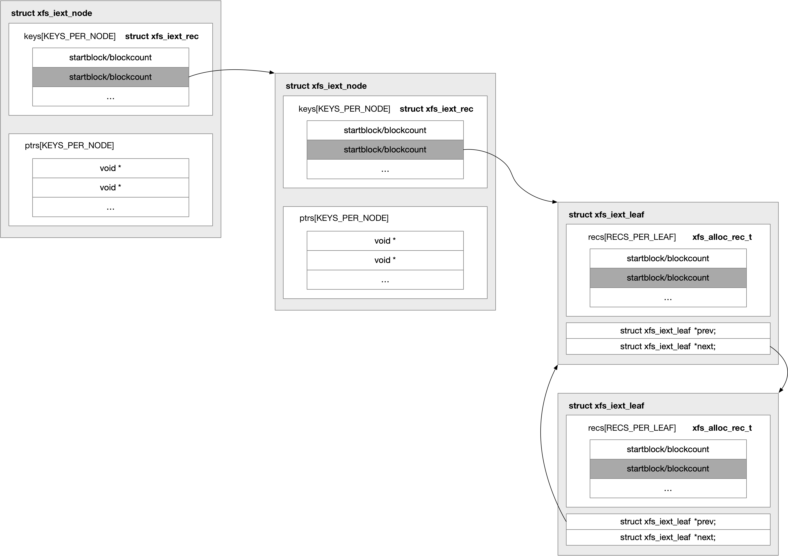

title:'XFS - Extent Tree'
## XFS - Extent Tree


### on-disk extent tree

#### data fork

on-disk inode 除了 inode core，还包含 data/xattr fork 两部分；对于 regular file，data fork 实际上就存储该文件的 extent tree

```
+-----------------+
|   inode core    |
+-----------------+
|    data fork    |
+-----------------+
|    xattr fork   |
+-----------------+
```

其中 inode core 由 struct xfs_dinode 描述，紧接着 inode core 之后的是 data fork，data fork 之后 (@di_forkoff << 3) 偏移处是 xattr fork


#### extent record

on-disk extent 由 struct xfs_bmbt_rec 描述，其格式为

```
+----+---------------------------+-----------------------+--------------------+
|flag| logical file block offset | absolute block number | number of blocks   | 
|1bit|    bit 72:126 (54 bits)   |  bit 21:72 (52 bits)  | bit 0:20 (21 bits) |
+----+---------------------------+-----------------------+--------------------+
```

flag 为 1 表示当前 extent 是一个 unwritten extent，否则是一个 normal extent


#### extent list

如果文件对应的 extent 数量较少，那么这些 extent 可以直接内嵌保存在 inode 中，此时 data fork 就相当于一个 extent 数组，即 struct xfs_bmbt_rec 数组，此时 @di_format 显示为 XFS_DINODE_FMT_EXTENTS

@di_nextents 描述 inline data fork 中存储的 extent record 的数量

```c
typedef struct xfs_dinode {
	__u8		di_format;	/* format of di_c data */
	__be32		di_nextents;	/* number of extents in data fork */
	...
} xfs_dinode_t;
```


#### extent B+ Tree

inode 中内嵌的 data fork 的大小是有限的，如果文件对应的 extent 数量较多，inode 中内嵌的 data fork 存储不下，那么此时就会构建一棵 extent B+ Tree，此时 data fork 就存储这棵 extent B+ Tree 的根节点；此时 @di_format 显示为 XFS_DINODE_FMT_BTREE

extent B+ Tree 的 header 为

```c
typedef struct xfs_bmdr_block {
	__be16		bb_level;	/* 0 is a leaf */
	__be16		bb_numrecs;	/* current # of data records */
} xfs_bmdr_block_t;
```

按照 file block offset 进行排序

```c
typedef struct xfs_bmbt_key {
	__be64		br_startoff;	/* starting file offset */
} xfs_bmbt_key_t, xfs_bmdr_key_t;
```

存储的 data record 即为 extent record，即 struct xfs_bmbt_rec


### in-core extent tree

由于 extent tree 的访问/修改是高频操作，因而实际上会将 on-disk 的 extent tree 缓存到内存中，也就是 in-core extent tree，此时每个文件就维护有一个 in-core extent tree

这棵树实际上就保存在 xfs_inode 的 @i_df 中，其中 @if_root 描述根节点的地址，@if_height 描述树的高度 (只有一层根节点时树的高度为 1)

```c
typedef struct xfs_inode {
	struct xfs_ifork	i_df;	 /* data fork */
	...
} xfs_inode_t;

struct xfs_ifork {
	int			if_height;	/* height of the extent tree */
	union {
		void		*if_root;	/* extent tree root */
		...
	} if_u1;
};
```

in-core extent Tree 中每个节点的大小为 NODE_SIZE 即 256 字节，其中存储的 data record 即为 on-disk extent record，由 struct xfs_iext_rec 描述，每个节点能够存储的 data record 数量为 RECS_PER_LEAF


实际上 in-core extent Tree 也有两种形态


#### extent list

> format

对于 extent list 这种，当文件的 extent 数量较少 (小于等于 RECS_PER_LEAF) 时，in-core extent Tree 实际只是一个 struct xfs_iext_rec 数组，此时 @if_root 指向这个数组，@if_height 为 1

```
            +-------+-------+-------+-------+-------+
@if_root:   | rec 1 | rec 2 | rec 3 | rec 4 | rec N |
            +-------+-------+-------+-------+-------+
```


> init

open() 系统调用过程中，会将文件的 on-disk extent list 整个读取到内存中

```sh
parent_dir_inode_ops->lookup(), i.e., xfs_lookup()
    xfs_iget
        xfs_iget_cache_miss
            xfs_iread
                xfs_iformat_fork
                    xfs_iformat_extents
```

此时 @if_flags 标志位设置有 XFS_IFEXTENTS 标记，以表明 on-disk extent 已经全部读取到内存中

```c
struct xfs_ifork {
	unsigned char		if_flags;	...
};
```


#### extent B+ Tree

> format

而对于 extent B+ Tree 这种，当文件的 extent 数量超过 RECS_PER_LEAF 时，in-core extent Tree 就转换为 B+ Tree 形态


此时叶子节点的格式如下

```
       +-------+-------+-------+-------+-------+----------+----------+
Leaf:  | rec 1 | rec 2 | rec 3 | rec 4 | rec N | prev-ptr | next-ptr |
       +-------+-------+-------+-------+-------+----------+----------+
```

```c
struct xfs_iext_leaf {
	struct xfs_iext_rec	recs[RECS_PER_LEAF];
	struct xfs_iext_leaf	*prev;
	struct xfs_iext_leaf	*next;
};
```

@prev/@next 指向前一个/后一个 sibling 叶子节点


中间节点的格式为

```
       +-------+-------+-------+-------+-------+-------+------+-------+
Inner: | key 1 | key 2 | key 3 | key N | ptr 1 | ptr 2 | ptr3 | ptr N |
       +-------+-------+-------+-------+-------+-------+------+-------+
```

```c
struct xfs_iext_node {
	uint64_t	keys[KEYS_PER_NODE];
	void			*ptrs[KEYS_PER_NODE];
};
```




> init

open() 系统调用过程中，只是将文件的 on-disk extent tree 的根节点读取到内存中，并保存在 @if_broot 字段，此时 @if_root 为 NULL，@if_height 为 0，同时 @if_flags 标志位会清除 XFS_IFEXTENTS 标志，同时设置上 XFS_IFBROOT 标志

```c
struct xfs_ifork {
	struct xfs_btree_block	*if_broot; /* file's incore btree root */
	int			if_height;	/* height of the extent tree */
	union {
		void		*if_root;	/* extent tree root */
		...
	} if_u1;
	...
};
```

```sh
parent_dir_inode_ops->lookup(), i.e., xfs_lookup()
    xfs_iget
        xfs_iget_cache_miss
            xfs_iread
                xfs_iformat_fork
                    xfs_iformat_btree
```


所以 open() 系统调用过程中只是将 on-disk extent tree 的根节点读取到内存中，之后当用到 extent tree (例如 iomap 执行 block mapping 时就需要查询 extent tree) 的时候才会将文件的 on-disk extent tree 整个读取到内存中

此时 in-core extent tree 同样保存在 @if_root 字段，同时 @if_flags 标志位会设置上 XFS_IFEXTENTS 标志

```c
xfs_iomap_ops->iomap_begin(), i.e., xfs_file_iomap_begin()
    xfs_bmapi_read // find the block mapping by extent tree
        if (!(ifp->if_flags & XFS_IFEXTENTS)):
            xfs_iread_extents // read in extents from a btree-format inode
```


### lookup routine

#### xfs_iext_lookup_extent

xfs_iext_lookup_extent() 在 in-core extent tree 中查找 @offset 文件偏移对应的 extent；如果 @offset 对应的是一个 hole，那么返回紧接在 @offset 之后的一个 extent

```c
bool xfs_iext_lookup_extent(
	struct xfs_inode	*ip, struct xfs_ifork *ifp, xfs_fileoff_t offset,
	struct xfs_iext_cursor	*cur, struct xfs_bmbt_irec *gotp)
```

返回的 @gotp 就描述以上返回的这个 extent，

```c
typedef struct xfs_bmbt_irec
{
	xfs_fileoff_t	br_startoff; /* starting file offset */
	xfs_fsblock_t	br_startblock;/* starting block number */
	xfs_filblks_t	br_blockcount;/* number of blocks */
	xfs_exntst_t	br_state;	/* extent state */
} xfs_bmbt_irec_t;
```

返回的 @cur 描述返回的这个 extent 在这个 extent tree 中的位置，即 @leaf->recs[@pos]；同时函数返回 true

```c
struct xfs_iext_cursor {
	struct xfs_iext_leaf	*leaf;
	int			pos;
};
```

如果 @offset 对应的是一个 hole，同时 @offset 之后没有 extent，那么函数最终返回 false


```sh
xfs_iomap_ops->iomap_begin(), i.e., xfs_file_iomap_begin()
    xfs_bmapi_read // find the block mapping by extent tree
        xfs_iext_lookup_extent
```


#### xfs_bmapi_read

xfs_bmapi_read() 在 in-core extent tree 中查找 @bno 文件偏移处起始、@len 长度的文件偏移区间对应的所有 extent，因为这个文件偏移区间可能对应多个 extent，这些 extent 就保存在传入的 @mval[] 数组中，传入的 @nmap 描述了 @mval[] 数组的大小

返回的 @mval[] 数组就描述了传入的文件偏移区间对应的所有 extent，@nmap 描述了该数组中实际保存的 extent 的数量

返回的 @mval[] 数组中可能包含 hole，此时对应的 xfs_bmbt_irec_t 的 @br_startblock 为 HOLESTARTBLOCK

```c
int xfs_bmapi_read(
	struct xfs_inode	*ip, xfs_fileoff_t bno, xfs_filblks_t len,
	struct xfs_bmbt_irec	*mval, int *nmap, int flags)
```


```sh
xfs_iomap_ops->iomap_begin(), i.e., xfs_file_iomap_begin()
    xfs_bmapi_read // find the block mapping by extent tree
```


### insert routine

```sh 
xfs_iomap_write_direct
    xfs_bmapi_write
        xfs_bmapi_allocate
            xfs_bmap_alloc // allocate block
            xfs_bmap_add_extent_hole_real
                xfs_iext_insert // insert extent
                xfs_rmap_map_extent
```


