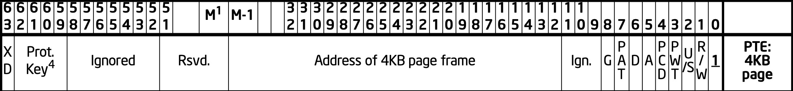
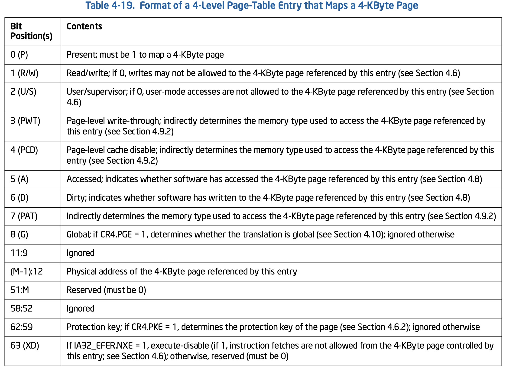

title:'MM - 6 Write Protect Page Fault'
## MM - 6 Write Protect Page Fault

Write Protect Page Fault 是一种内存地址访问时，访问权限异常时发生的 page fault


### Concept

在此之前有必要介绍描述内存地址访问权限的两个地方

1. vma.vm_flags

@vm_flags 的 VM_READ/VM_WRITE 描述该虚拟地址区间具有 read/write 权限

```c
struct vm_area_struct {
	unsigned long vm_flags;
	...
}
```


2. pte.rw

pte 的 @rw 标志位描述该页表项描述的虚拟地址是否具有 read/write 权限，如果 @rw 为 0 即其描述的虚拟地址只有 read 权限，而进程对该虚拟地址进行写操作，就会触发 page fault





Write Protect 常用的玩法就是，pte.rw=0 同时 vm_flags=VM_READ|VM_WRITE，这样由于 pte.rw=0 因而一旦有进程对该虚拟地址进行写操作，就会触发 page fault；而在 page fault 中会发现对应的 @vm_flags 包含有 VM_WRITE 标志，即该虚拟地址区间实际上是具有 write 权限的，从而与真正的访问权限导致的 page fault 区分开，此时就会走 Write Protect Page Fault 路径

```sh
handle_mm_fault
    __handle_mm_fault
        handle_pte_fault
            # Write Protect: pte exist, pte.P = 1
            do_wp_page
```


### Routine

实际上系统中多处都有应用 Write Protect


#### CoW - fork

传统的 Unix 系统在创建进程时为子进程分配完整的地址空间，该地址空间是父进程地址空间的拷贝，由于需要分配并初始化子进程的地址空间以及对应的页表项，因而这一过程极为耗时

包括 Linux 在内的现代 Unix 操作系统在创建进程时，父进程与子进程共用同一份相同的地址空间，此时地址空间中对应的 page frame 被标记为只读，父进程与子进程在进行读操作时可以安全地共享同一个 page frame，然而当父进程或子进程中的任一个需要进行写操作时，由于对应的共享的 page frame 不具备写权限，此时即发生 page fault，page fault handler 此时会分配一个新的 page frame 作为原来 page frame 的拷贝，并将新的 page frame 标记具有写权限，当前进程即可对新分配的 page frame 进行写操作；而此时原有的 page frame 的使用计数减 1，当其使用计数变为 1 时恢复该 page frame 的写权限


#### CoW - private file memory mapping

对于 shared memory mapping 来说，用户进程的一个 vma 实际与文件 page cache 中对应偏移处的 page frame 相映射，因而用户进程对这一映射区域的更改对于其他进程可见，同时对该映射区域的更改也会保存到原文件

而对于 private memory mapping 来说，一开始当只有读操作的时候，所有进程的 vma 仍然映射到 page cache 中的 page frame，此时这一映射关系相当于是 shared 的、但是 read-only

之后一旦某个进程对该 vma 执行写操作的时候，就会触发 CoW 流程，会分配一个新的 page frame，新分配的 page frame 不在 page cache 中，同时重新设置对应的页表项，使得该虚拟地址区域与新分配的 page frame 相映射，此时这一映射关系独属于触发写操作的进程，相当于是 private 的，此时进程对文件的这一映射区域的更改对于其他进程不可见，同时对该映射区域的更改也不会保存到原文件


1. mmap() syscall - build vma

mmap() 系统调用中会为当前的映射建立 vma

```sh
old_mmap()/mmap_pgoff
    ksys_mmap_pgoff
        vm_mmap_pgoff
            do_mmap
                get_unmapped_area
                mmap_region
                    # allocate vma
                    vma->vm_start = addr;
                    vma->vm_end = addr + len;
                    vma->vm_page_prot = vm_get_page_prot(vm_flags); // pte.rw = 0, pte.usr = 1
                    vma->vm_flags = VM_READ｜VM_WRITE
                    vma->vm_file = get_file(file);
                    vma->vm_pgoff = pgoff;
                    fops->mmap(), that is, ext4_file_mmap() for ext4
                        vma->vm_ops = ext4_file_vm_ops (for non-DAX mode)
```

对于 private memory mapping 来说，如果 mmap 系统调用的 @prot 参数包含 PROT_READ|PROT_WRITE，那么

- @vma->vm_page_prot 只具有 read 权限，之后第一次因为 read 操作发生 page fault 的时候，这段虚拟地址区间会映射到 page cache，对应的 pte 就只具有 read 权限
- @vma->vm_flags 表明该 vma 实际上是具有 write 权限的

从而满足 Write Protect 的起手式


2. read page fault

第一次对 private memory mapping 映射区域内的内存进行读操作而触发 page fault 时，虽然也会建立映射使得这段虚拟地址区间映射到 page cache 中的 page frame，但是此时建立的 pte.rw = 0，即进程对映射的 page frame 只有 read 权限

```sh
page fault handler entry, that is, do_page_fault/exc_page_fault
    handle_mm_fault
        handle_pte_fault
            do_fault // file memory mapping
                do_read_fault
                    do_fault_around
                        vma->vm_ops->map_pages(), that is, filemap_map_pages() for ext4
                            do_set_pte // build mapping
                                entry = mk_pte(page, vma->vm_page_prot);
                                set_pte_at(..., pte, entry)
```


3. write page fault

之后当用户进程尝试对映射区域内的内存进行写操作时，由于页访问权限会再次触发 page fault，此时虽然 pte.rw 为 0，但是 vma->vm_flags 包含 VM_WRITE，表明该虚拟地址区间是具有写权限的，此时就会执行 copy-on-write 操作

在 page fautl handler 中会分配一个新的 page frame，新分配的 page frame 不在 page cache 中，同时重新设置对应的页表项，使得该虚拟地址区域与新分配的 page frame 相映射，新的页表项会描述新映射的 page frame 具有 read/write 权限

```sh
page fault handler entry, that is, do_page_fault/exc_page_fault
    handle_mm_fault
        handle_pte_fault
            do_wp_page // copy-on-write
                wp_page_copy
                    # allocate new page frame
                    new_page = alloc_page_vma() // allocate one private page frame
                    cow_user_page(new_page, old_page)  // copy contents
                    
                    # make pte writable
                    entry = mk_pte(new_page, vma->vm_page_prot);
                    entry = maybe_mkwrite(entry, ...); // enable write permission
                        if vma->vm_flags & VM_WRITE: pte_mkwrite(pte)
                    set_pte_at_notify(..., pte, entry)  // build mapping
```

#### CoW - mkwrite notify

commit 9637a5efd4fbe36164c5ce7f6a0ee68b2bf22b7f 增加了 page_mkwrite() 回调函数

```c
struct vm_operations_struct {
	...
	/* notification that a previously read-only page is about to become
	 * writable, if an error is returned it will cause a SIGBUS */
	vm_fault_t (*page_mkwrite)(struct vm_fault *vmf);
	...
}
```

如果文件系统需要监控 “mmap 的一个 page 被写入 (由 clean 变为 dirty 状态)” 这个事件，往往就需要定义 vma_ops->page_mkwrite() 回调函数

其实现是，在执行 mmap() 系统调用的时候，即使是 shared file mmap，但是 vma->vm_page_prot 中显示对应的 pte 是只读的

```sh
old_mmap()/mmap_pgoff
    ksys_mmap_pgoff
        vm_mmap_pgoff
            do_mmap
                get_unmapped_area
                mmap_region
                    # allocate vma
                    vma->vm_page_prot = vm_get_page_prot(vm_flags); // pte.rw = 1, pte.usr = 1
                    vma->vm_flags = VM_READ｜VM_WRITE｜VM_SHARED
                    vma->vm_file = get_file(file);
                    fops->mmap(), i.e., ext4_file_mmap()
                        vma->vm_ops = ext4_dax_vm_ops
                    
                    vma_set_page_prot(vma)
                        # if vma_wants_writenotify(), i.e., vm_ops->page_mkwrite or vm_ops->pfn_mkwrite defined
                            # modify vma->vm_page_prot, pte.rw = 0
```


此时如果是先 read page fault，后 write page fault

对映射的虚拟地址区间作读操作时，会触发 read page fault，此时 pte 指向 NVDIMM 中的一个 page，但是该 pte 是只读的

```sh
page fault handler entry, that is, do_page_fault/exc_page_fault
    handle_mm_fault
        handle_pte_fault
            do_fault // file memory mapping
                do_read_fault
                    vma->vm_ops->fault()        
                        # insert pte into page table
                        vmf_insert_mixed // pte.rw=0
```

之后进程再一次对该 page 执行写操作时，就会触发 Write Protect Page Fault，其中会调用 vm_ops->page_mkwrite() 回调函数，其主要工作是更新对应的 pte，使其具备 writable 权限

```sh
page fault handler entry, that is, do_page_fault/exc_page_fault
    handle_mm_fault
        handle_pte_fault
            do_wp_page // copy-on-write
                (vma->vm_flags & VM_SHARED) wp_page_shared
                    vmf->flags = FAULT_FLAG_WRITE|FAULT_FLAG_MKWRITE
                    vma->vm_ops->page_mkwrite()        
                        # update pte (with PFN unchanged), turn to be writable
                        vmf_insert_mixed_mkwrite // pte.rw=1
```


#### CoW - writeback

对 shared file mmap 映射的 page 进行 writeback 的过程中，会将回写的 page 对应的 pte 设置为 read-only，之后进程再一次对该 page 执行写操作时，就会触发 Write Protect Page Fault，这一设计是为了追踪 shared dirty page


为什么需要追踪 shared dirty page 呢？考虑一下 msync() 的实现。msync() 系统调用用于对 file mmap 映射的内存作 flush 和 writeback 操作，以确保所作的修改回写到文件

> msync() flushes changes made to the in-core copy of a file that was mapped into memory using mmap(2) back to the filesystem.


这一过程中就需要找到该 file mmap 对应的所有 dirty page，对其执行回写操作，那又该如何追踪 shared dirty page 呢？

一种想法是依靠文件的 address space 的 @i_pages radix tree 的 DIRTY tag，但是考虑到以下情形：回写的过程中，对应 dirty page 的 DIRTY tag 会被移除，之后如果进程再次对该 page 执行写操作，即该 page 再次变为 dirty page 的时候，由于此时写操作只是单纯的内存写操作，因而并没有入口来将该 page 再次置上 DIRTY tag

因而之前的实现是，进程会遍历 page table，根据 pte.D 找出所有的 dirty pte，从而定位到对应的 dirty page，由于需要遍历整个 page table，这种实现无疑是低效率的


之后 commit d08b3851da41d0ee60851f2c75b118e1f7a5fc89 ("mm: tracking shared dirty pages") 提出了一种新的实现并沿用至今，那就是在对 page 进行 writeback 的过程中，将回写的 page 对应的 pte 设置为 read-only

```sh
# wbc->sync_mode == WB_SYNC_NONE
__writeback_single_inode
    do_writepages
        a_ops->writepages(), i.e., ext4_writepages
            generic_writepages
                write_cache_pages
                    pagevec_lookup_range_tag(..., PAGECACHE_TAG_DIRTY) // find PAGECACHE_TAG_DIRTY pages
                    
                    (for each PAGECACHE_TAG_DIRTY page)
                        lock_page(page)
                        clear_page_dirty_for_io(page)
                            (if mapping_cap_account_dirty(mapping)) page_mkclean(page)
                                (for all vma (may belong to multiple processes)) page_mkclean_one(page, vma, ...)
                                    # get corresponding pte
                                    entry = ptep_clear_flush(vma, address, pte);
                                    entry = pte_wrprotect(entry); // clean pte's writable
                                    entry = pte_mkclean(entry);

                        __writepage
                            a_ops->writepage(page, ...), e.g., ext4_writepage
                                ext4_bio_write_page
                                    set_page_writeback(page)
                                        __test_set_page_writeback // clear DIRTY tag
```


之后进程再一次对该 page 执行写操作时，就会触发 Write Protect Page Fault，其中会将对应的 pte 重新设置为 writable，当然更重要的是对该 page 重新置上 DIRTY tag

```sh
handle_mm_fault
    __handle_mm_fault
        handle_pte_fault
            # Write Protect: pte exist, pte.P = 1
            do_wp_page
                wp_page_shared
                    do_page_mkwrite
                        vmf->flags = FAULT_FLAG_WRITE|FAULT_FLAG_MKWRITE
                        vma->vm_ops->page_mkwrite() // notification that a previously read-only page is about to become writable
                        
                        finish_mkwrite_fault
                            wp_page_reuse
                                entry = pte_mkyoung(vmf->orig_pte);
                                entry = maybe_mkwrite(pte_mkdirty(entry), vma);
                        
                        fault_dirty_shared_page
                            set_page_dirty(page)
                                a_ops->set_page_dirty(page), i.e., ext4_set_page_dirty()
                                    __set_page_dirty_buffers
                                        __set_page_dirty
                                            radix_tree_tag_set(&mapping->i_pages, page_index(page), PAGECACHE_TAG_DIRTY) // set DIRTY tag
```


这样 msync() 就可以实现为 fsync()

```sh
msync() syscall
    vfs_fsync_range
        file->f_op->fsync(), e.g., ext4_sync_file()
            __generic_file_fsync
                file_write_and_wait_range
                    __filemap_fdatawrite_range
                        do_writepages
                            # find all dirty pages by DIRTY tag
```
