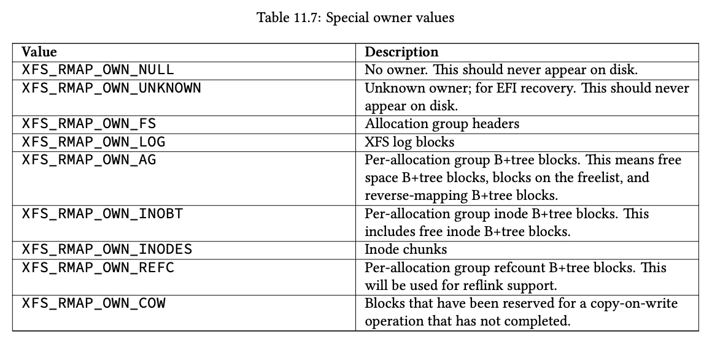

## XFS - reverse map B+ Tree

reverse map B+ Tree 描述了磁盘上的某个 extent 被谁所用，即其 owner 是谁，大部分情况下这些 extent 用于某一个文件的 data block，此时 reverse map B+ Tree 就描述磁盘上的某个 extent 映射到哪一个文件的哪一段文件偏移，相对于 extent tree 相当于是反过来了，因而称为 reverse map


每个 AG 维护有一个 reverse map B+ Tree，对应的 AGF (AG Freespace) 的 @agf_roots[XFS_BTNUM_RMAP] 字段即描述其根节点

```c
typedef struct xfs_agf {
	__be32		agf_roots[XFS_BTNUM_AGF]; /* root blocks */
	...
}
```


叶子节点的 data record 的格式为

```c
struct xfs_rmap_rec {
	__be32		rm_startblock; /* extent start block */
	__be32		rm_blockcount; /* extent length */
	__be64		rm_owner;	/* extent owner */
	__be64		rm_offset;	/* offset within the owner */
};
```

即描述 @rm_startblock 起始的，@rm_blockcount 大小的 extent，映射到 @rm_owner 文件的 @rm_offset 文件偏移处，这里 @rm_owner 存储的是文件的 inode number


虽然大部分情况下 reverse map B+ Tree 中的 extent 都用于某一个文件的 data block，此时 data record 的 @rm_owner 实际上存储的就是对应文件的 inode number，但是除此之外，reverse map B+ Tree 中的 extent 还可能用于 inode B+ Tree、inode chunk、refcount B+ Tree 这些元数据，此时 @rm_owner 字段的值为




中间节点的 key 为

```c
struct xfs_rmap_key {
	__be32		rm_startblock; /* extent start block */
	__be64		rm_owner;	/* extent owner */
	__be64		rm_offset;	/* offset within the owner */
} __attribute__((packed));
```

与其他 B+ Tree 不同，reverse map B+ Tree 的 key 由三个字段构成

为什么单独 @rm_startblock 字段不足以构成 key 呢？因为在引入 reflink 特性之后，磁盘上的一个 extent (@rm_startblock) 可能被多个文件 (@rm_owner) 共享，此时同一个 @rm_startblock 就可能对应多个 @rm_owner。如果单单 @rm_startblock 作为 key，那么多个 data record 就可能具有相同的 key，而 B+ Tree 是要求每个 data record 具有唯一的 key 的

那为什么 (@rm_startblock, @rm_owner) pair 不足以构成 key 呢？同样在 reflink 特性中，磁盘上的一个 extent (@rm_startblock) 可能被同一个文件 (@rm_owner) 的多个文件偏移区间 (@rm_offset) 共享，此时同一个 (@rm_startblock, @rm_owner) pair 就可能对应多个 @rm_offset。如果单单 (@rm_startblock, @rm_owner) pair 作为 key，那么多个 data record 就可能具有相同的 key

综上所述，reverse map B+ Tree 的 key 必须由 @rm_startblock/@rm_owner/@rm_offset 这三个字段构成，唯有如此，每个 data record 才具有唯一的 key
