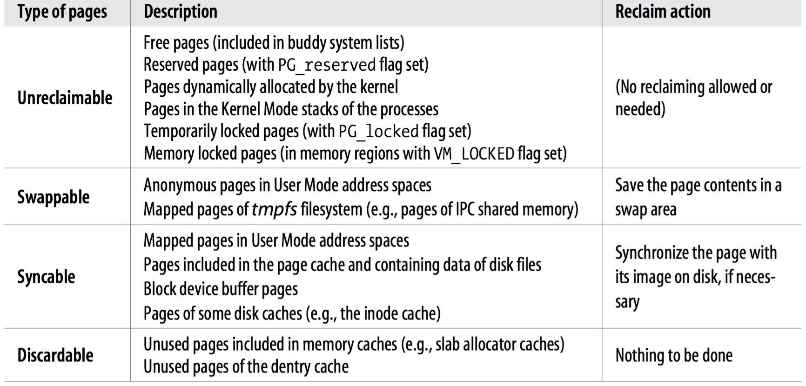
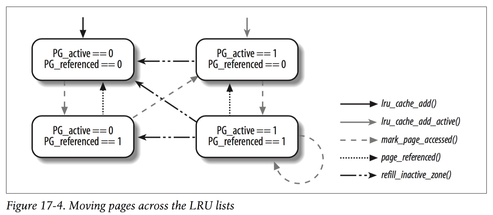

title:'MM - Reclaim - Routine'
## MM - Reclaim - Routine


### PFRA Target

#### reclaimable page type

PFRA (Page Frame Reclaiming Algorithm) 将所有的 page frame 分为以下类型



PFRA 可以回收上述 swappable/syncable/discardable 类型的 page frame，具体包括 page cache、file mmap、anonymous mmap 的 page frame


上述可回收的 page frame 内部也有优先级区分

- PFRA 可以回收的 page frame 主要包括 page cache 以及 user process address space (主要指 file mmap、anonymous mmap) 映射的 page 两部分，如果要回收 user process address space 映射的 page，还需要修改对应的 user process 的 page table，因而 PFRA 会优先回收 page cache
- PFRA 将所有可回收的 page frame 分为 active 与 unactive 两类，PFRA 优先回收 unactive page，PFRA 根据 page 对应的 pte 的 Accessed bit 标志位以及 LRU (Least Recently Used) list 区分这两类 page


#### LRU lists

内核使用一组 LRU list 管理所有可回收的 page frame，即 page cache、file mmap、 anonymous mmap


内核一共维护 5 个 LRU 链表

- inactive _anonymous mapping_ list
- active _anonymous mapping_ list
- inactive _file mapping_ list
- active _file mapping_ list
- unevitable list

其中

- anonymous mapping 链表组织所有的 anonymous mmap 映射的 page frame
- file mapping 链表组织所有的 page cache 以及 file mmap 映射的 page frame
- unevitable 链表组织所有的 locked page frame，即 page_lock() 锁住的 page frame

PFRA 只能回收 anonymous/file mapping 这两个链表中的 page frame


此外每种类型的链表还分成 active/inactive 两个子链表，以区分最近访问的 page frame 以及最近一段时间没有访问过的 page frame，具体逻辑是，page frame 新创建并第一次访问时被添加到对应的 inactive 链表，之后当再次访问该 page frame 时就会将其从 inactive 链表移到对应的 active 链表的头部


这一组 LRU 链表实际上就保存在每个 zone 描述符的 @lruvec 字段

```c
struct zone {
	...
	struct lruvec		lruvec;
	...
}

struct lruvec {
	struct list_head lists[NR_LRU_LISTS];
	...
};
```

- lruvec[0] 为 inactive anonymous mapping list
- lruvec[1] 为   active anonymous mapping list
- lruvec[2] 为 inactive      file mapping list
- lruvec[3] 为   active      file mapping list
- lruvec[4] 为         unevitable mapping list


page frame 描述符通过其 @lru 字段添加到对应的 LRU list 中，同时其 @flags 标志位也反映了该 page frame 在 LRU list 中的状态

- 当 page frame 被添加到相应的 LRU list 时，其 PG_lru 标志被设置
- 当 page frame 被添加到 active LRU list 时，其 PG_active 标志被设置，被添加到 inactive LRU list 时，其 PG_active 标志被清除
- 当 page frame 被添加到 unevitable LRU list 时，其 PG_mlocked 标志被设置


##### LRU list state machine

active/inactive LRU list 用于区分 page frame 的两种状态即 active/inactive

为了更好地维护 active/inactive state，内核同时维护 page frame 的第三种状态即 referenced state，page frame 的 flags 标志位的

- PG_referenced 被清除时，表明该 page frame 在最近一段时间内未被访问过
- PG_referenced 被设置，表明该 page frame 在最近一段时间内被访问过


内核在访问 LRU list 中的 page frame 时，通常需要将该 page frame 移动到对应的 active LRU list 中，但是为了防止该 page frame 在当前访问结束之后的一段时间内均不需要再访问该 page frame 的情况，内核实际会延迟将该 page frame 移动到对应的 active LRU list 的操作，即

- 当内核第一次访问该 inactive page frame 时，只是设置 page frame 的 PG_referenced 标志，而不会将该 page frame 移动到对应的 active LRU list
- 之后一段时间内当内核第二次访问该 inactive page frame 时，发现该 page frame 的 PG_referenced 标志被设置，此时才会将该 page frame 移动到对应的 active LRU list
- 内核会周期性地清除 page frame 的 PG_referenced 标志




上图描述 page frame 在各个 LRU list 中移动的情形

- lru_cache_add_lru() 将 page frame 添加到特定的 inactive/active LRU list 中

- 在访问 page frame 时，对于 page cache、file mmap、anonymous mmap 类型的 page frame，均会调用 mark_page_accessed() 设置 page_referenced 标志，同时
    - 对于 non-referenced inactive page frame，即第一次访问该 inactive page frame 时，函数只是设置该 page frame 的 page_referenced 标志
    - 对于 referenced inactive page frame，即再次访问该 inactive page frame 时，函数将该 inactive page frame 移动到对应的 active LRU list 中
    - 对于 non-referenced active page frame 或是 referenced active page frame，函数均只是设置该 page frame 的 page_referenced 标志

- PFRA 在扫描过程中，对于扫描的每个 page frame 均会调用 page_referenced()，清除该 page frame 的 page_referenced 标志


##### LRU entry

将 page frame 添加到 LRU lists 的入口为

- page cache 在创建时被添加到 inactive file LRU list，之后当第二次执行 read/write 操作访问该 page frame 时，该 page frame 从 inactive file LRU list 移动到 active file LRU list 的头部
- anonymous mmap 映射的 page frame 在创建时保存在 active anonymous LRU list 的头部
- file mmap 映射的 page frame 在创建时保存在 inactive file LRU list 的头部，同时设置对应的 pte 的 access bit

anonymous mmap 映射的 page frame 存储用户进程的 stack/heap，回收过程中需要对其执行 swap 操作，过程比较繁琐，因而这些 page frame 在创建时即保存在 active anonymous LRU list 中，从而确保这些 page frame 相对不容易被回收

page cache、file mmap 映射的 page frame 在回收过程中只需要回写 dirty page，因而这些 page frame 在创建时保存在 inactive file LRU list 中，这些 page frame 相对更容易被回收


1. page cache

page cache 中的 page frame 在创建时被添加到 inactive file LRU list，之后当第二次执行 read/write 操作访问该 page frame 时，该 page frame 从 inactive file LRU list 移动到 active file LRU list

```sh
# first access
do_generic_file_read
    add_to_page_cache_lru // allocate page, add into 'inactive file'
    mark_page_accessed // set page_referenced flag

# second access
do_generic_file_read
    mark_page_accessed // move from 'inactive file' to 'active file'
```


2. file mmap

file mmap 映射的 page frame 在创建时保存在 inactive file LRU list 的头部，同时设置对应的 pte 的 access bit

file memory mapped page frame 在创建时保存在 inactive file LRU list 中，同时使用对应的 pte 的 access bit 标记该 page frame 的活跃度，即对于 user process space 的 page frame，使用对应的 pte 的 access bit 而非 inactive/active LRU list 来描述 page frame 的活跃度，此时当 page frame 对应的 pte 的 access bit 被设置时，描述该 page frame 的活跃度高，其具有与 active LRU list 相同的效果

```sh
filemap_fault
    page_cache_read
        add_to_page_cache_lru // allocate page, add into 'inactive file'
        # set pte's 
```

- file memory mapping 结束后，当程序尝试访问 mmap()返回的线性地址时会发生 page fault，page fault handler 中会调用 page_cache_read()，其中调用 add_to_page_cache_lru() 分配一个新的 page frame 用作 buffer page 并添加到 page cache 中，同时将该新分配的 page frame 添加到 inactive file LRU list 中
- 同时设置该 file mapped page frame 对应的 page table entry (pte) 的 PTE_AF 标志，即将其标记为 young pte


3. anonymous mapped page

anonymous mapped page frame 在创建时保存在 active anonymous LRU list 中

```
do_anonymous_page
    |_ page_add_new_anon_rmap
```


### PFRA routine

PFRA routine 的入口为 shrink_zone()，其中对指定的 zone 执行 page frame reclaiming 操作，其中会对该 zone 维护的 LRU lists 进行多轮的扫描，传入的 struct scan_control 结构控制每一轮扫描的相关行为

```c
static void shrink_zone(struct zone *zone, struct scan_control *sc);
```

#### control struct

PFRA 在对一个 zone 执行 page frame reclaiming 操作的过程中，会扫描该 zone 维护的 LRU lists 以挑选满足条件的 page frame 进行释放，扫描过程中 PFRA 实际会对 LRU lists 进行多轮的扫描，其中从对应的 LRU list 的尾部开始扫描，以寻找符合要求的当前可以回收的 page frame，每一轮扫描的优先级不同，优先级控制一轮扫描过程中可以扫描的 page frame 的数量，一轮扫描过程中可以扫描的 page frame 的数量为 (total_size >> priority)，扫描过程中其优先级递增，即第一轮扫描 priority 为 12，此时优先级最低，第一轮扫描完成后若没有找到预定数量的可以回收的 page frame，则进行第二轮扫描，此时 priority 为 11，如此循环，直到最后一轮扫描 priority 为 0，此时会扫描整个 LRU list


此外内核使用 struct scan_control 结构控制每一轮扫描的相关行为，其中

> scan control 结构的以下参数相当于 PFRA routine 的输入参数，用于控制一轮扫描的相关行为

- @priority 参数描述 PFRA scan 过程中当前一轮扫描的优先级，优先级的范围为 [0, 12]，即一次 PFRA scan 过程中最多进行 13 轮的扫描，其中 priority 的值越小，其优先级越高，扫描过程中优先级递增，即第一轮扫描的优先级为 12，最后一轮扫描的优先级为 0，优先级控制当前一轮扫描过程中可以扫描的 page frame 的数量

- @nr_to_reclaim 参数描述当前 PFRA scan 过程中需要回收的 page frame 的数量

- @may_writepage 参数描述当前一轮扫描过程中能否回收 dirty page，包括 page cache 与 file mmape
    - direct/periodic reclaiming 中该参数的初始值均为 (!laptop_mode)
    - direct/periodic reclaiming 中，在完成三轮扫描后，从第四轮扫描开始即扫描优先级从 12 降至 9 时，@may_writepage 参数变为 1
    - direct reclaiming 中，在多轮扫描过程中，当扫描的 page frame 的数量达到需要回收的 page frame 数量的 1.5 倍时，@may_writepage 参数变为 1

- @may_unmap 参数描述当前一轮扫描过程中能否回收 process address space 对应的 page frame，即 file/anonymous mmap
    - direct/periodic reclaiming 中该参数的初始值均为 1

- @may_swap 参数描述当前一轮扫描过程中能否回收 anonymous mmap
    - direct/periodic reclaiming 中该参数的初始值均为 1

- @target_mem_cgroup 参数描述对特定的 memory cgroup 执行 page frame reclaiming 操作，当该参数为 NULL 时描述对所有的 zone 执行 page frame reclaiming 操作


> scan control 结构的以下参数相当于 PFRA routine 的输出参数，即一轮扫描完成后返回这一轮扫描的结果

- @nr_scanned 参数描述当前已经扫描的 inactive page frame 的数量，多轮扫描过程中可以共用同一个 scan control 结构，因而该参数实际描述多轮扫描过程中累计已经扫描的 page frame 的数量
- @nr_reclaimed 参数描述当前已经回收的 page frame 的数量，由于多轮扫描过程中可以共用同一个 scan control 结构，因而该参数实际描述多轮扫描过程中累计已经回收的 page frame 的数量


#### scan routine

PFRA routine 每次只会回收 inactive page frame，即从 inactive file/anonymous LRU list 中挑选可以回收的 page frame，同时还需要从 active LRU list 中挑选合适的 page frame 补充到对应的 inactive LRU list 中


##### calculate scan number

PFRA routine 中需要从 inactive LRU list 挑选可以回收的 page frame，同时从 active LRU list 挑选合适的 page frame 补充到对应的 inactive LRU list 中，以上过程需要遍历 LRU list 中的 page frame，而在扫描过程中 file LRU list 与 anonymous LRU list 具有不同的优先级，即在一轮扫描过程中各个 LRU list 可以扫描的 page frame 的数量是不同的

get_scan_count() 会计算当前一轮扫描过程中各个 LRU list 可以扫描的 page frame 的数量，其中共实现有四种扫描策略


1. SCAN_FILE

在以下任一条件下

- 当前一轮扫描的 scan control 结构的 @may_swap 参数为 0，即当前一轮扫描过程中不能回收 anonymous mmap
- 当前 inactive file LRU list 中 page frame 的数量大于 active file LRU list 中 page frame 的数量，即当前系统中拥有充足数量的 inactive file mmap 映射的 page frame 可供回收

只扫描 file LRU list，而不扫描 anonymous LRU list，此时

- active/inactive file LRU list 的扫描数量为 (该 LRU list 中 page frame 数量 >> priority)
- active/inactive anonymous LRU list 的扫描数量为 0


2. SCAN_FRACT

在排除了其他三种扫描策略之后，即执行 SCAN_FRACT 策略，此时需要使用 `swappiness` 参数对 file/anonymous LRU list 需要扫描的 page frame 的数量分别进行调整，在调整过后使得 file LRU list 需要扫描的 page frame 数量通常大于 anonymous LRU list，从而倾向于保留 anonymous mmap (因为回收 file mmap 只需要回写 dirty page，而回收 anonymous mmap 则需要执行 swap 操作，代价更大，因而 anonymous mmap 具有更高的优先级)


swappiness 参数即用于实现 page frame reclaiming 过程中对 file/anonymous LRU list 的优先级进行区分

swappiness 参数实际描述了需要回收的 anonymous mmap 在所有需要回收的 page frame 中的配额，其取值范围为 [0, 100]，此时

- anonymous mmap 的回收配额为 swappiness
- file mmap 的回收配额为 (200 - swappiness)


此时

- file LRU list 需要扫描的 page frame 的数量均为 (该 LRU list 中 page frame 数量 >> priority) 再乘以 (file mmap 的回收配额 / 总的回收配额)
- anonymous LRU list 需要扫描的 page frame 的数量均为 (该 LRU list 中 page frame 数量 >> priority) 再乘以 (anonymous mmap 的回收配额 / 总的回收配额)


3. SCAN_ANON

在以下条件下

- 当前 zone 中 free page 的数量，加上 file LRU list 中 file mmap 的数量，两者的和仍小于当前 zone 的 watermark[WMARK_HIGH]，也就是说，即使对 file LRU list 中的所有 file mmap 进行回收，也不能使 zone 恢复为 balanced 状态，说明此前已经回收太多的 file mmap

因而接下来只扫描 anonymous LRU list，而不扫描 file LRU list，此时

- active/inactive file LRU list 的扫描数量为 0 
- active/inactive anonymous LRU list 的扫描数量为 (该 LRU list 中 page frame 数量 >> priority)


4. SCAN_EQUAL

若当前一轮扫描的 scan control 结构的 @priority 参数为 0，即当前是最后一轮扫描，同时 swappiness 参数不为 0 时，则此时不必再像 SCAN_FRACT 中一样偏向于保留 anonymous mmap，而是同等地对待 file/anonymous mmap

此时所有 LRU list 需要扫描的 page frame 的数量均为 (该 LRU list 中 page frame 数量 >> priority)


##### scan LRU lists

在确定各个 LRU list 需要扫描的 page frame 的数量之后，即需要依次扫描各个 LRU lists，扫描的顺序分别为

- inactive anonymous LRU list
- active anonymous LRU list
- inactive file LRU list
- active file LRU list


##### select candidate from inactive LRU lists

对于 inactive LRU list，从 LRU list 的尾部开始扫描一定数量的 page frame，从中挑选当前可以回收的 page frame，这些可以回收的 page frame 会暂时保存到一个 local tmp list 中，在扫描过程中

- 若该 page frame 当前正在执行 writeback 操作，则
    - 当 scan_control 的 @may_writepage 参数为 1 时，则当前可以回收该 page frame，此时将该 page frame 从原先的 inactive LRU list 移到 local tmp list 中
    - 否则当前不可以回收该 page frame，此时将该 page frame 移到所在的 inactive LRU list 的头部，这样在下一轮扫描过程中可以继续检查该 page frame

- 若该 page frame 为 dirty page，则
    - 当 scan_control 的 @may_writepage 参数为 1 时，则当前可以回收该 page frame，此时将该 page frame 从原先的 inactive LRU list 移到 local tmp list 中
    - 否则当前不可以回收该 page frame，此时将该 page frame 移到所在的 inactive LRU list 的头部，这样在下一轮扫描过程中可以继续检查该 page frame

- 若该 page frame 为 file/anonymous mmap，则
    - 当 scan_control 的 @may_unmap 参数为 1 时，则当前可以回收该 page frame，此时将该 page frame 从原先的 inactive LRU list 移到 local tmp list 中
    - 否则当前不可以回收该 page frame，此时将该 page frame 移到所在的 inactive LRU list 的头部，这样在下一轮扫描过程中可以继续检查该 page frame


##### reclaim page frame from inactive LRU lists

接下来需要回收上个步骤中挑选的保存在 local tmp list 中的 page frame，其中首先再次检查

- 若该 page frame 为 file/anonymous mmap，同时 scan_control 的 @may_unmap 参数为 0，则将该 page frame 移回到对应的 LRU list 的头部
- 若该 page frame 当前正在执行 writeback 操作，则设置该 page frame 的 PG_reclaim 标志，并将该 page frame 移回到对应的 LRU list 的头部，之后当 writeback 操作完成时，在对应的 end_page_writeback() 回调函数中会检查该 page frame 是否设置有 PG_reclaim 标志，若有则说明该 page frame 当前正在执行 reclaiming 操作，则 end_page_writeback() 则会将该 page frame 移动到对应的 inactive LRU list 的尾部，之后在下一轮扫描中会优先回收该 page frame


之后执行真正的回收操作

- 对于 anonymous mmap
    - 将该 page frame 添加到 swap cache 中，此时该 page frame 类似于 file mmap，其映射的文件即为 disk swap section，并设置该 page frame 的 PG_swapcache、PG_dirty 标志
    - 使用 reverse mapping 解除该 page frame 与对应的 user process page table 之间的映射关系
    - 在将 page frame 添加到 swap cache 的过程中，该 page frame 被标记为 dirty page，此时调用相应函数将该 page frame 的内容缓存到 disk swap area
    - 在最终释放前将对应的 page frame 从 swap cache 中移除
    - 最后释放该 page frame

- 对于 file mmap
    - 使用 reverse mapping 解除该 page frame 与对应的 user process page table 之间的映射关系
    - 若该 page frame 为 dirty page，则
        - direct reclaiming 或者 kswapd 在 @priority 大于等于 10 时，则直接将该 page frame 标记为 PG_reclaim，同时将其移到对应的 inactive LRU list 的头部，这样之后当该 page frame 完成 writeback 操作时，对应的 end_page_writeback() 回调函数检查到该 page frame 设置有 PG_reclaim 标志，则会将该 page frame 移动到对应的 inactive LRU list 的尾部，之后在下一轮扫描中会优先回收该 page frame
        - 否则 kswapd 在 @priority 小于 10 时，则调用对应的 file 的 address space ops 的 writepage() 回调函数将该 page frame 的内容写回到对应的 disk file，最后将对应的 page frame 从 swap cache 中移除，同时释放该 page frame

- 对于 page cache
    - 若该 page frame 为 dirty page，则
        - direct reclaiming 或者 kswapd 在 priority 大于等于 10 时，则直接将该 page frame 标记为 PG_reclaim，同时将其移到对应的 inactive LRU list 的头部，这样之后当该 page frame 完成 writeback 操作时，对应的 end_page_writeback() 回调函数检查到该 page frame 设置有 PG_reclaim 标志，则会将该 page frame 移动到对应的 inactive LRU list 的尾部，之后在下一轮扫描中会优先回收该 page frame
        - 否则 kswapd 在 priority 小于 10 时，则调用对应的 file 的 address space ops 的 writepage() 回调函数将该 page frame 的内容写回到对应的 disk file，最后将对应的 page frame 从 swap cache 中移除，同时释放该 page frame


##### select candidate from active LRU list

在 inactive LRU lists 扫描完成后，总是需要检查该 inactive LRU lists 包含的 page frame 的数量是否过少，若是则会将对应的 active LRU list 尾部的一部分 page frame 移动到该 inactive LRU lists 的头部

首先从对应的 active LRU list 的尾部开始扫描并寻找合适的 page frame，其扫描过程与步骤 2 相类似，并将挑选的 page frame 保存在一个 local tmp list 中


##### refill candidate into inactive LRU list

之后需要将上一步挑选的保存在 local tmp list 中的 page frame 补充到对应的 inactive LRU list

- 清除 page frame 的 Access 标记，同时检查对该 page frame 进行引用的 pte 的数量
    - 若引用该 page frame 的 pte 的数量不为 0
        - 同时该 page frame 实际映射 program text section，则将该 page frame 移回到对应的 active LRU list 的头部
        - 否则将该 page frame 移到对应的 inactive LRU list 的头部
    - 若引用该 page frame 的 pte 的数量为 0，则直接释放该 page frame


