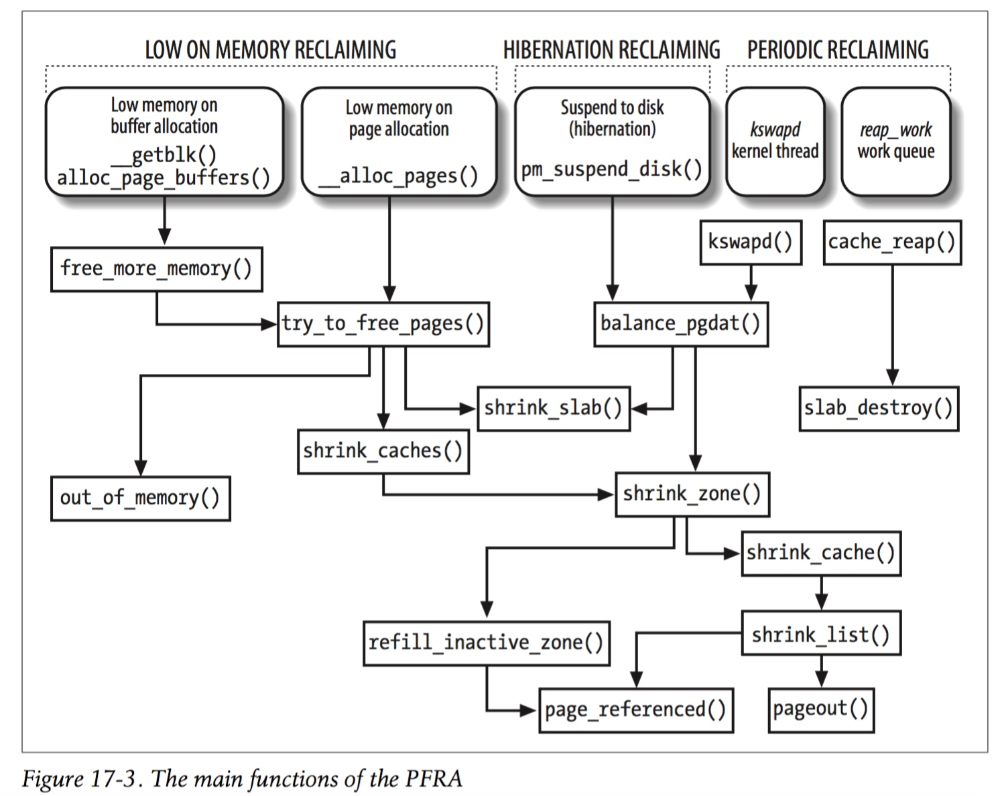

title:'MM - Reclaim - Entry'
## MM - Reclaim - Entry




PFRA routine 存在以下入口

1. direct reclaiming on low memory

page frame 分配失败时首先会执行 memory compaction，之后再次尝试内存分配，此时当内存分配再次失败时，即会执行 page frame reclaiming


2. hibernation reclaiming

当内核需要执行 suspend-to-disk 类型的睡眠操作时，必须执行 page frame reclaiming 操作


3. periodic reclaiming

此外内核还维护一个 kswapd 内核线程用于周期性地执行 page frame reclaiming 操作


### Direct Page Frame Reclaiming on Low Memory

内核在内存分配失败时会直接执行 direct page frame reclaiming，具体有以下两种情况

- 在 page frame 分配过程中，alloc_pages() 中当 page frame 失败时会调用 __perform_reclaim()，其中对可用分配于该 page frame 的所有 zone 调用 try_to_free_pages()，以对这些 zone 执行 PFRA 操作
- buffer page 分配过程中会调用 alloc_page_buffers() 分配 block buffer 对应的 buffer head 结构，其中当 buffer head 分配失败时会调用 free_more_memory()，其中对于每个 NUMA node 调用 try_to_free_pages()，以对所有 NUMA node 下的所有 zone 执行 PFRA 操作

try_to_free_pages() 中最终对传入的 zonlist 中的每个 zone 调用 shrink_zone()，以执行 PFRA routine


direct page frame reclaiming 中 scan control 结构的初始值为

- @nr_to_reclaim 参数的初始值为 SWAP_CLUSTER_MAX 即 32，即从传入的 zonlist 中的所有 zone 中回收 32 个 page frame
- @may_writepage 参数的初始值为 (!laptop_mode)，其中 laptop_mode 全局变量的值由 `/proc/sys/vm/laptop_mode` 控制
- @may_unmap 参数的初始值为 1，即允许回收 process address space (包括 file/snonymous mmap) 映射的 page frame
- @may_swap 参数的初始值为 1，即允许 anonymous mmap
- @target_mem_cgroup 参数的值为 NULL


### Periodic Page Frame Reclaiming

此外系统还为每个 NUMA node 维护一个专门的 kswapd 内核线程，该线程以 NUMA node 为单位周期性地执行 page frame reclaiming 操作

#### balanced NUMA node

per-NUMA-node kswapd 内核线程的目标是确保整个 NUMA node 处于 balanced 状态，通常需要 @order 与 @classzone_idx 两个参数来定义 NUMA node 的 balanced 状态

内核中通常使用 zoned page frame allocator 完成 page frame 的分配，而每次分配都需要两个参数，即

1. @classzone_idx 参数描述分配哪种类型的 page frame，例如 @classzone_idx 参数为 ZONE_HIGHMEM 表示当前需要分配 high memory，此时 zoned page frame allocator 会优先从 highmem zone 分配内存，若 highmem zone 中内存紧张，则依次回退到 normal zone、DMA zone
2. @order 参数描述当前需要分配 (2 ^ order) 个 page frame 大小的连续内存

因而 NUMA node 的 balanced 状态与 @order/@classzone_idx 这两个参数相关，即只有当这两个参数定义时，我们才能判断 NUMA node 是否有足够的空闲内存用于分配特定类型（由 @classzone_idx 参数定义）的特定大小（由 @order 参数定义）的连续内存


pgdat_balanced() 中完成 balanced NUMA node 的判断，其具体定义为，当给定 @order/@classzone_idx 这两个参数时，对于该 NUMA node 下编号为 0 ~ @classzone_idx 的所有 zone，都有足够的空闲内存用于分配 (2 ^ order) page frame 大小的连续内存，即编号为 0 ~ @classzone_idx 的所有 zone 在 @order 参数下均处于 balanced 状态

例如当 (@classzone_idx = ZONE_HIGHMEM, @order = 0) 时，balanced NUMA node 的判断标准是，highmem zone、normal zone 与 DMA zone 中都具有足够的空闲的内存，以分配一个用于 high memory 的 page frame，即使用 zoned page frame allocator 在该 NUMA node 下分配一个 highmem page frame 时不会发生失败


以上为 (@order = 0) 时的 balanced NUMA node 的判断标准，而当 (@order > 0) 时，其判断标准存在一些差异，此时不必要求该 NUMA node 下编号为 0 ~ @classzone_idx 的所有 zone 都处于 balanced 状态，这是因为当 @order 参数较大时，要求每个 zone 下都有足够数量的大块连续内存可能确实有些“强人所难”，此时可以有一些 zone 处于 imbalanced 状态，但是在编号为 0 ~ @classzone_idx 的所有 zone 中，所有 balanced zone 的容量之和，必须大于所有 zone 的容量之和的 1/2


那么判断一个 zone 中的 free page 数量足够少的标准是什么呢？这个判断过程中涉及到 per-zone low memory watermark 与 per-zone reserved memmory 这两个参数


#### balanced zone

前文提到 balanced NUMA node 的判断标准涉及到 balanced zone 的判断，而类似地 balanced zone 的判断标准也与 @order/@classzone_idx 参数相关，只有当这两个参数给定时，我们才能判断该 zone 下拥有足够的空闲内存以分配 (2 ^ order) page frame 大小的特定类型（由 @classzone_idx 参数定义）的连续内存，即该 zone 处于 balanced 状态

此外 balanced zone 的判断还涉及到 low memory watermark 与 reserved memory 这两个参数

zone_balanced() 中完成 balanced zone 的判断，其具体定义为

- watermark[WMARK_HIGH] 参数描述该 zone 的 low memory watermark
- lowmem_reserve[classzone_idx] 参数表示从当前 zone 分配 classzone_idx 类型的内存时，该 zone 中需要预留的 page frame 的数量
- 该 zone 下 free page 的数量减去当前需要分配的 (2 ^ order) 数量的 page frame，为剩余的 free page 的数量
- 此时该 zone 下剩余 free page 的数量必须大于 (watermark[WMARK_HIGH] + lowmem_reserve[classzone_idx])
- 同时还要确保该 zone 下具有充足的大块连续内存，即具有充足数量的 (2^order)、(2^(order+1))... 大小的连续内存，具体定义为
    - 除去所有 (2^0) page frame 大小的连续内存之后，剩余的 free page 数量超过 watermark[WMARK_HIGH] / 2
    - 在以上基础上，再除去所有 (2^1) page frame 大小的连续内存之后，剩余的 free page 数量超过 watermark[WMARK_HIGH] / 4
    - 以此类推，直至最后除去所有 (2^0, 2^1, ... 2^(order-1)) page frame 大小的连续内存之后，剩余的 (2^order) 及以上大小的连续内存包含的 free page 数量超过 (watermark[WMARK_HIGH] / (2^order))


##### per-zone low memory watermark

每个 zone 都维护一组 low memory watermark 参数

```c
struct zone {/* zone watermarks, access with *_wmark_pages(zone) macros */
	unsigned long watermark[NR_WMARK];
	...
}
```

watermark[] 参数实际包含以下三个参数

- watermark[WMARK_MIN]
- watermark[WMARK_LOW]
- watermark[WMARK_HIGH]


watermark[] 参数的值与 min_free_kbytes 参数相关，min_free_kbytes 参数描述一个 NUMA node 下的 low memory watermark

- 初始化时，min_free_kbytes 参数的值为 (4 * sqrt(lowmem_kbytes))，其中 lowmem_kbytes 为该 NUMA node 下除 high memory zone 之外所有 zone 的容量之和，但是最小不能小于 128KB，最大不能超过 64MB
- 之后用户也可以通过 `/proc/sys/vm/min_free_bytes` 参数文件修改 min_free_kbytes 参数


watermark[] 参数的值与 min_free_kbytes 参数相关，其计算公式为

- min_free_kbytes 参数描述一个 NUMA node 下的 low memory watermark，因而首先按照比例计算 min_free_kbytes 参数中当前 zone 所占的配额为 (min_free_kbytes * total_pages_of_current_zone / total_pages_of_NUMA_node)
- watermark[WMARK_MIN] 的值即为以上计算的 min_free_kbytes 参数中当前 zone 的配额
- watermark[WMARK_LOW] 的值为 watermark[WMARK_MIN] 的 1.25 倍
- watermark[WMARK_HIGH] 的值为 watermark[WMARK_MIN] 的 1.5 倍


##### per-zone reserved memmory

此外 zone page frame allocation 过程中还需要考虑为每个 zone 预留一定数量的 page frame

例如使用 page frame allocator 分配 highmem 时，page frame allocator 会优先分配 highmem zone 中的 page frame，而如果 highmem zone 中的 page frame 不足，那么 page frame allocator 会考虑从 normal zone 中分配 page frame，同理当 normal zone 中 page frame 不足时会考虑从 DMA zone 分配

但是这样的分配策略存在一个问题，就是申请分配 highmem 但实际分配的是 normal page frame，这样长此以往 normal zone 中的 page frame 很有可能被 highmem 的分配请求消耗完，反而导致之后申请分配 normal mem 的请求无法得到满足

因而 page frame allocator 需要为每个 zone 预留一定数量的 page frame，以满足对应 zone memory 的分配请求

```c
struct zone {
	/*
	 * We don't know if the memory that we're going to allocate will be freeable
	 * or/and it will be released eventually, so to avoid totally wasting several
	 * GB of ram we must reserve some of the lower zone memory (otherwise we risk
	 * to run OOM on the lower zones despite there's tons of freeable ram
	 * on the higher zones). This array is recalculated at runtime if the
	 * sysctl_lowmem_reserve_ratio sysctl changes.
	 */
	unsigned long		lowmem_reserve[MAX_NR_ZONES];
	...
}
```

zone 描述符的 lowmem_reserve[] 数组即描述当前 zone 预留的 page frame 数量

一个 zone 的 lowmem_reserve 参数是一组参数，例如若当前系统中一个 NUMA node 下存在 DMA zone、normal zone、highmem zone 共三个 zone，那么

- DMA zone 的 lowmem_reserve 参数为
    - lowmem_reserve[0] 即 lowmem_reserve[ZONE_DMA] 为 0，表示申请分配 DMA zone 下的 page frame 时，不需要进行任何预留操作
    - lowmem_reserve[1] 即 lowmem_reserve[ZONE_NORMAL]，表示申请分配 normal zone 下的 page frame 时，当回退到 DMA zone 满足分配请求时，需要在 DMA zone 中预留的 page frame 数量
    - lowmem_reserve[2] 即 lowmem_reserve[ZONE_HIGHMEM]，表示申请分配 highmem zone 下的 page frame 时，当回退到 DMA zone 满足分配请求时，需要在 DMA zone 中预留的 page frame 数量
    - lowmem_reserve[3] 即 lowmem_reserve[ZONE_MOVABLE]，表示申请分配 movable page frame 时，当回退到 DMA zone 满足分配请求时，需要在 DMA zone 中预留的 page frame 数量
- normal zone 与 highmem zone 的 lowmem_reserve 参数与以上类似


对于 zone[i]，其 lowmem_reserve[j] 参数的值为

- 若 i > j，则 lowmem_reserve[j] 参数为 0
    - 例如 (i = highmem zone, j = normal zone)，此时当申请分配 normal memory 时，根本不会从 highmem zone 分配，因而此时不需要为 highmem zone 预留专用的 page frame
-  若 i == j，则 lowmem_reserve[j] 参数为 0
    - 同理例如 (i = j = normal zone)，此时当申请分配 normal memory 时，不需要为 normal zone 预留专用的 page frame
- 若 i < j，则 lowmem_reserve[j] 参数的值为 ((total sums of managed_pages from zone[i+1] to zone[j] on the node)/ lowmem_reserve_ratio[i])
    - 例如 (i = DMA zone, j = highmem zone)，此时当申请分配 highmem memory 时，需要为 DMA zone 预留一定数量的 page frame，此时 lowmem_reserve[ZONE_HIGHMEM] 参数的值即为 ((managed_pages_of_normal_zone + managed_pages_of_highmem_zone) / lowmem_reserve_ratio[ZONE_DMA])

因而 lowmem_reserve[] 参数的计算与 lowmem_reserve_ratio[] 参数有关，lowmem_reserve_ratio 参数同样是一组参数

lowmem_reserve_ratio[] 参数的默认值为

```c
/*
 * results with 256, 32 in the lowmem_reserve sysctl:
 *	1G machine -> (16M dma, 800M-16M normal, 1G-800M high)
 *	1G machine -> (16M dma, 784M normal, 224M high)
 *	NORMAL allocation will leave 784M/256 of ram reserved in the ZONE_DMA
 *	HIGHMEM allocation will leave 224M/32 of ram reserved in ZONE_NORMAL
 *	HIGHMEM allocation will (224M+784M)/256 of ram reserved in ZONE_DMA
 *
 * TBD: should special case ZONE_DMA32 machines here - in those we normally
 * don't need any ZONE_NORMAL reservation
 */
int sysctl_lowmem_reserve_ratio[MAX_NR_ZONES-1] = {
#ifdef CONFIG_ZONE_DMA
	 256,
#endif
#ifdef CONFIG_ZONE_DMA32
	 256,
#endif
#ifdef CONFIG_HIGHMEM
	 32,
#endif
	 32,
};
```

当系统中存在 DMA zone、normal zone、highmem zone 这三个 zone 时，lowmem_reserve_ratio[] 参数的默认值即为

```
256
32
32
```

lowmem_reserve_ratio[i] 参数表示在分配 page frame 时为 zone i 预留的 page frame 的数量

例如系统的内存布局为

```
1G machine -> (16M dma, 784M normal, 224M high)
```

- 此时对于 DMA zone
    - 在申请分配 normal memory 时，需要为 DMA zone 预留 (managed_pages_of_normal_zone / lowmem_reserve_ratio[ZONE_DMA]) 即 (784M/256)，即这些数量的预留的 page frame 不能用于 normal memory 的分配
    - 在申请分配 highmem memory 时，需要为 DMA zone 预留 ((managed_pages_of_normal_zone + managed_pages_of_highmem_zone) / lowmem_reserve_ratio[ZONE_DMA]) 即 ((224M+784M)/256)，即这些数量的预留的 page frame 不能用于 highmem memory 的分配

- 同理对于 normal zone
    - 在申请分配 highmem memory 时，需要为 normal zone 预留 ((managed_pages_of_highmem_zone) / lowmem_reserve_ratio[ZONE_NORMAL]) 即 (224M/32)，即这些数量的预留的 page frame 不能用于 highmem memory 的分配


`/proc/sys/vm/lowmem_reserve_ratio` 参数文件即控制 lowmem_reserve_ratio 参数，用户可以通过该参数文件修改 lowmem_reserve_ratio 参数

所有的 NUMA node 共享同一个 lowmem_reserve_ratio 参数，当 lowmem_reserve_ratio 参数被修改时，需要更新系统中所有 zone 的 lowmem_reserve 参数


#### kswapd routine

per-node kswapd 内核线程的任务就是确保整个 NUMA node 处于 balanced 状态

- 线程会以 (HZ/10) 即 100 ms 为周期检查所属的 NUMA node 是否处于 balanced 状态，若该 NUMA node 处于 balanced 状态则睡眠 (HZ/10) 即 100 ms 时间，之后重复以上检查过程
- 若线程检查到 NUMA node 处于 imbalanced 状态，或其他进程在分配 page frame 时失败而唤醒 kswapd 线程，kswapd 线程都会循环执行 page frame reclaiming 操作，直到 NUMA node 恢复为 balanced 状态，之后重复以上检查过程

无论是 kswapd 睡眠超时被唤醒，还是其他进程由于内存紧张而唤醒 kswapd，kswapd 线程在被唤醒之后都会检查对应的 NUMA node 是否处于 balanced 状态，执行该检查需要传入 order 与 classzone_idx 两个参数

- kswapd 线程自身因超时而被唤醒时，order 参数的值为 0，classzone_idx 参数的值为 NUMA node 下最后一个 zone，即 kswapd 默认确保该 NUMA node 拥有足够的空闲内存以分配一个 page frame 大小的 high memory 类型的连续内存
- 而当其他进程分配 page frame 失败而主动唤醒 kswapd 时，order 与 classzone_idx 参数的值即为该进程在分配 page frame 时使用的 order 与 classzone_idx 参数


而对于确定的 order 与 classzone_idx 参数，当检查到 NUMA node 处于 imbalanced 状态时，就需要对该 NUMA node 执行 page frame reclaiming 操作，balance_pgdat() 描述了 periodic page frame reclaiming 的过程，具体过程为

- 在 balanced NUMA node 判断过程中，在编号为 0~classzone_idx 的所有 zone 中，即使有些 zone 处于 balanced 状态，而有些 zone 处于 imbalanced 状态，也可能判断该 NUMA node 处于 imbalanced 状态，此时在执行 periodic page frame reclaiming 的时候，可以省略其中的 balanced zone，此时遍历从 classzone_idx 到 0 的所有 zone，将遍历过程中出现的第一个即编号最靠近 classzone_idx 的 zone 标记为 end_zone，之后只需要对编号 0~end_zone 的所有 zone 执行 page frame reclaiming 操作，例如 classzone_idx zone 为 balanced zone，而 (classzone_idx-1) zone 为 imbalanced zone 时，只需要对编号 0~(classzone_idx-1) 的所有 zone 执行 page frame reclaiming 操作
- 在以上确定 end_zone 的过程中，若编号为 0~classzone_idx 的所有 zone 均处于 balanced 状态，则说明 NUMA node 处于 balanced 状态，因而此时不需要再执行 page frame reclaiming 操作，此时 kswapd 退出当前 periodic page frame reclaiming 的过程，而继续之前描述的周期性睡眠
- 否则就需要对编号 0~end_zone 的所有 zone 执行 page frame reclaiming 操作，此时
    - 从编号 0 开始一直到 end_zone，即 DMA zone 开始一直到 highmem zone，对于其中的每个 zone，调用 shrink_zone() 对该 zone 的 LRU list 进行第一轮扫描，以请求尽可能多地释放各个 zone 下的所有 page frame，第一轮扫描的优先级为 12
    - 在当前一轮扫描结束之后，若该 NUMA node 恢复为 balanced 状态，则退出 periodic page frame reclaiming 操作
    - 否则需要对编号 0~end_zone 的所有 zone 进行下一轮扫描，此时若截止上一轮扫描，所有 zone 累计的成功释放的 page frame 的数量小于 SWAP_CLUSTER_MAX，这说明成功回收的 page frame 数量很少，因而需要扩大扫描的范围，因而将下一轮扫描的优先级递减，对编号 0~end_zone 的所有 zone 进行下一轮扫描，但最多只进行 13 轮扫描
    - 而在以上 13 轮的扫描过程中，只要所有 zone 累计的成功释放的 page frame 的数量已经超过 SWAP_CLUSTER_MAX，则将扫描的优先级恢复为默认的 12，并重新开始新的总计 13 轮的扫描过程
    - 而在以上多轮扫描过程中，最多只能连续扫描 13 轮，而在连续 13 轮扫描结束后，若 NUMA node 仍处于 imbalanced 状态，这可能是因为 order 参数过大导致 imbalanced NUMA node 的判断标准较为严苛，因而此时将 order 参数设置为 0 并重新开始新的总计 13 轮的扫描过程，从而适当降低 imbalanced NUMA node 的判断标准，以防止 kswapd 线程死循环


periodic page frame reclaiming 中 scan control 结构的初始值为

- nr_to_reclaim 参数的初始值为 ULONG_MAX，即请求尽可能多地释放各个 zone 下的所有 page frame，此时当前一轮扫描过程中能够释放的 page frame 的最大数量由当前这一轮能够扫描的 page frame 的最大数量进行限制
- may_writepage 参数的初始值为 (!laptop_mode)，其中 laptop_mode 全局变量的值由 `/proc/sys/vm/laptop_mode` 控制
- may_unmap 参数的初始值为 1，即允许回收 user space page（包括 user space file mmap 与 user space anonymous mmap）
- may_swap 参数的初始值为 1，即允许 user space anonymous mmap
- target_mem_cgroup 参数的值为 NULL
