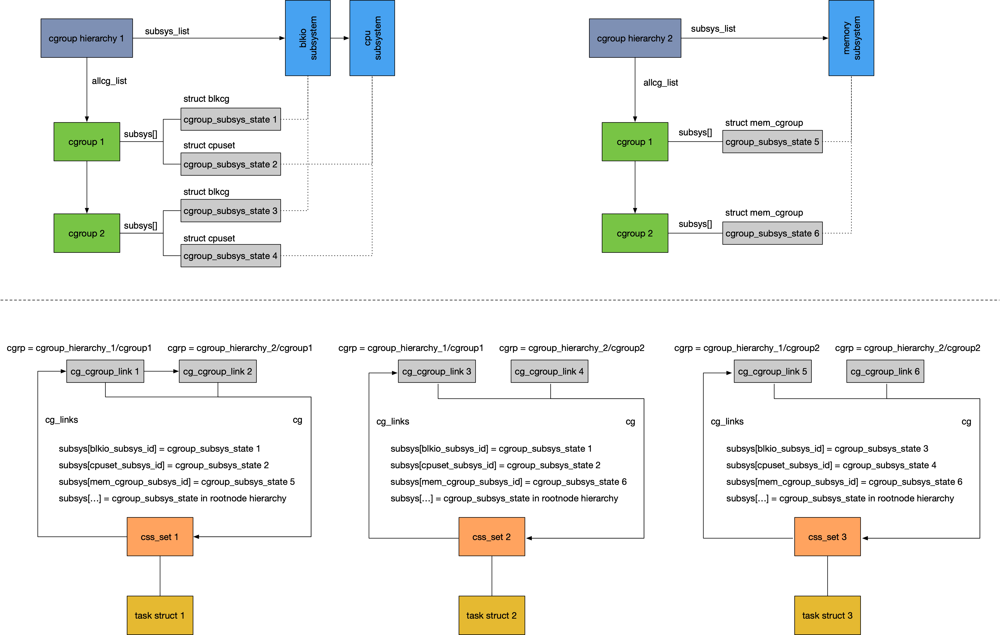
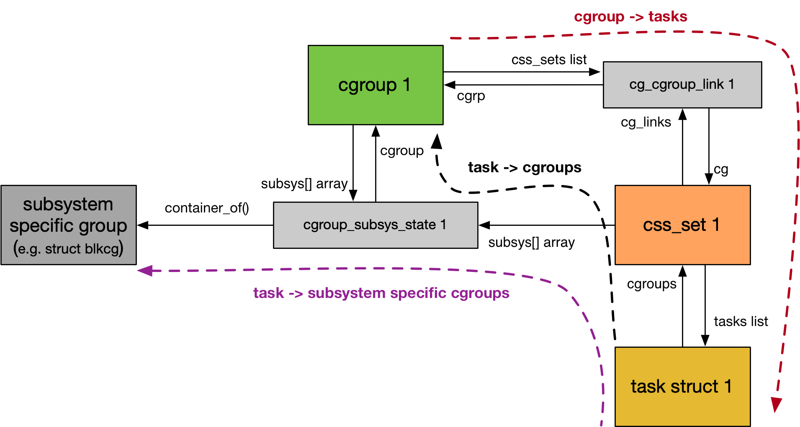

## Cgroup v1

### Data Hierarchy

#### Data Structure

> cgroup hierarchy

系统中可以包含多个 cgroup hierarchy，一个 cgroup hierarchy 描述一种 partitioning policy，即系统中所有进程的分组可以有多种分组方法，一个 cgroup hierarchy 即描述这么一种分组方法

一个 cgroup hierarchy 可以包含多个 cgroup，其 @allcg_list 链表组织该 cgroup hierarchy 下的所有 cgroup

每个 subsystem 都可以依附到一个 cgroup hierarchy 上，从而实现该 cgroup hierarchy 在该 subsystem 描述的资源上的管理，每个 subsystem 同时只能依附到一个 cgroup hierarchy 上，而一个 cgroup hierarchy 可以依附有多个 subsystem

cgroup hierarchy 的 @subsys_list 链表即用于管理依附在该 cgroup hierarchy 上的所有 subsystem

> cgroup subsystem state

cgroup 与 subsystem 之间是多对多的关系，即一个 cgroup 所在的 cgroup hierarchy 可以依附有多个 subsystem，而一个 subsystem 依附的 cgroup hierarchy 也包含多个 cgroup，此时使用 struct cgroup_subsys_state 作为中间态将两者联系起来，cgroup_subsys_state 描述某个 cgroup 在特定 subsystem 下对应的 subsystem specific group

因而每一对不同的 (cgroup, subsystem) 都需要使用单独的一个 cgroup_subsys_state (css) 以描述它们之间的联系

- cgroup_subsys_state 中包含指向对应的 cgroup 的指针
- cgroup 的 @subsys[] 数组存储该 cgroup 对应的一组 cgroup_subsys_state

> cgroup subsystem state set

一个进程可以归属于不同 cgroup hierarchy，例如一个进程可以在 cgroup hierarchy A 的 cgroup 1 里面，也可以在 cgroup hierarchy B 的 cgroup 2 里面，此时当 cgroup hierarchy A 依附有 memory subsystem，而 cgroup hierarchy B 依附有 CPU subsystem 时，cgroup 1 - memory pair 对应的 cgroup_subsys_state，加上 cgroup 2 - CPU pair 对应的 cgroup_subsys_state，就共同描述了该进程在整个 cgroup framework 中的资源限制，即一个进程在所有 subsystem 对应的 cgroup_subsys_state 的集合，共同描述了该进程在整个 cgroup framework 中的资源限制，该集合被抽象为 struct css_set

struct css_set 即 cgroup subsystem state set，该结构集合了一组 cgroup_subsys_state，实际描述了整个系统中的一组资源限制

struct css_set 的 @subsys[] 数组就描述了该 css_set 包含的一组 cgroup_subsys_state

每个进程都有一个对应的 css_set 结构，以描述该进程所在的所有 subsystem specific group，即描述该进程受到的所有资源限制

进程描述符的 @cgroups 字段即指向该进程对应的 css_set

css_set 实际描述了一组资源限制，不同进程可能具有相同的资源受限情况，因而一个 css_set 可以被多个进程复用

css_set 的 @tasks 链表即组织复用该 css_set 的所有进程

> cgroup link

一个系统中可以同时存在多个 cgroup hierarchy，一个 task 不能存在于同一个 hierarchy 的不同 cgroup 中，但是一个 task 可以存在于不同 hierarchy 的多个 cgroup 中

因而 task 与 cgroup 是多对多的关系，即一个 task 可以存在于不同 hierarchy 的多个 cgroup 中，而一个 cgroup 也可以包含多个 task，因而 css_set 与 cgroup 也是多对多的关系，此时使用 struct cg_cgroup_link 作为中间态将 css_set 与 cgroup 联系起来

- cg_cgroup_link 中包含两个分别指向对应的 css_set 与 cgroup 的指针
- cgroup 的 @css_sets 链表组织该 cgroup 的所有 struct cg_cgroup_link
- css_set 的 @cg_links 链表组织该 css_set 下的所有 struct cg_cgroup_link

#### Example

在 cgroup framework 刚初始化完成时，系统中只有 rootnode cgroup hierarchy，该 cgroup hierarchy 中只有一个 root cgroup，所有的 subsystem 都依附在该 cgroup hierarchy，同时系统中的所有进程都属于 rootnode cgroup hierarchy 的 root cgroup 之下

之后当通过 mount 指令挂载一个新的 cgroup hierarchy 时，会将 mount 指令指定的 subsystem 从 rootnode cgroup hierarchy 移除，并依附到当前新挂载的 cgroup hierarchy，同时同一个 subsystem 不能同时依附到不同的 cgroup hierarchy

下图中挂载两个 cgroup hierarchy，其中

- blkio subsystem 与 cpuset subsystem 依附到 cgroup hierarchy 1
- memory subsystem 依附到 cgroup hierarchy 2

同时

- task 1 属于 cgroup_hierarchy_1/cgroup1 与 cgroup_hierarchy_2/cgroup1 之下
- task 2 属于 cgroup_hierarchy_1/cgroup1 与 cgroup_hierarchy_2/cgroup2 之下
- task 3 属于 cgroup_hierarchy_1/cgroup2 与 cgroup_hierarchy_2/cgroup2 之下

此时各个数据结构的关系为

### Lookup Path

#### task -> subsystem specific group

- 每个进程描述符的 @cgroups 字段即指向该进程对应的 css_set
- css_set 描述一个进程对应的一组 cgroup subsystem state，其 @subsys[] 数组即描述这一组 cgroup subsystem state
- 由于 struct cgroup_subsys_state 通常内嵌在 subsystem specific group 中，因而在找到进程在某个 subsystem 中对应的 cgroup_subsys_state 之后，通过 container_of() 宏即可以找到进程在某个 subsystem 中对应的 subsystem specific group

#### task -> cgroups

- struct cgroup_subsys_state 的 @cgroup 字段指向该 cgroup_subsys_state 对应的 cgroup
- 因而在找到进程在某个 subsystem 中对应的 cgroup_subsys_state 之后，通过 cgroup_subsys_state 的 @cgroup 字段，即可以找到该进程在某个 subsystem 中对应的 cgroup
- 这样可以找到进程在各个 subsystem 中对应的多个 cgroup

#### cgroup -> tasks

- cgroup 的 @css_sets 链表组织该 cgroup 的所有 struct cg_cgroup_link
- struct cg_cgroup_link 用于联系一对 cgroup 与 css_set，cg_cgroup_link 的 @cg 字段指向其对应的 css_set，因而通过 cgroup 的 @css_sets 链表可以找到该 cgroup 对应的所有 css_set
- css_set 的 @tasks 链表组织引用该 css_set 的所有进程，因而可以找到特定 cgroup 下的所有进程

