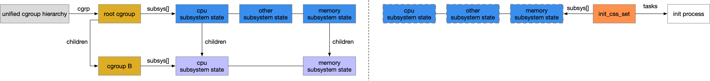

title:'Cgroup v2'
## Cgroup v2


### Background

#### cgroup v1

cgroup v1 中允许存在多个 cgroup hierarchy，这种实现基于的考虑是，按照不同的分类方法将同一组进程描述为多个 cgroup hierarchy，每个 cgroup hierarchy 实现不同的资源限制，从而提高 cgroup framework 的灵活性

例如根据 cgroup v1 文档中的例子

```
Disk : Professors (50%), Students (30%), system (20%)
Network : WWW browsing (20%), Network File System (60%), others (20%)
```

对于学校服务器中的一组进程，可以使用两种分类方法

- 一种是按照进程的 owner 来分类，将所有的进程分为 professor、student、system admin 三类，并在该 cgroup hierarchy 上实现 blkio 资源限制，即按照进程的使用者对其分配 blkio 资源
- 另一种是按照进程运行的程序分类，将所有的进程分为 browser、network file system、others 三类，并在该 cgroup hierarchy 上实现 network 资源限制，即按照进程运行的程序对其分配 network 资源


虽然以上在设计上没有问题，但是 cgroup v1 的实现存在相当争议，2012 年 cgroup framework 的维护者 Tejun Heo 就在邮件列表上讨论 cgroup v1 的实现存在的种种不足

[cgroup: about multiple hierarchies](https://lwn.net/Articles/484254/)


> 1. cgroup v1 的 multiple cgroup hierarchy 存在缺陷

multiple cgroup hierarchy 的设计初衷固然是让 cgroup framework 具有更大的灵活性，然而这种“灵活性”的代价则是代码的复杂性

虽然 cgroup v1 允许用户从不同的角度对进程进行分类，从而将同一组进程描述为多个 cgroup hierarchy，但是在实际使用过程中很少有 multiple cgroup hierarchy 的使用场景

cgroup v1 中虽然存在多个 cgroup hierarchy，但是每个 subsystem controller 只能挂载到一个 cgroup hierarchy，这种限制对于一些涉及到资源分配的 subsystem controller 是有意义的，例如当 blkio controller 挂载到两个不同的 cgroup hierarchy 时，同一个进程在这两个 cgroup hierarchy 中受到的 blkio 资源限制就会产生矛盾；然而对于其他 subsystem controller 这一限制就会带来不便，例如 freezer controller 只是用于对 cgroup 下的一组进程进行 freeze/unfreeze 操作，将 freezer controller 挂载到多个 cgroup hierarchy 不会引起任何矛盾，同时也存在这样的应用场景

由于系统中可以存在多个 cgroup hierarchy，因而对于特定的 subsystem controller，其挂载在哪个 cgroup hierarchy 是不确定的，这会导致不同 subsystem controller 之间基本没有协同合作的能力，例如 memory controller 与 blkio controller 之间缺乏协同而导致 dirty buffer writeback throttling 机制迟迟无法实现


> 2. inconsistency among subsystem controllers

此外 cgroup v1 实现中允许 internal process 即允许 non-leave cgroup 存在 direct child process

```
cgroup A  -  cgroup B - process 2
          \  process 1
```

此时 child cgroup（即cgroup B）会与 parent cgroup（即 cgroup A）中的 direct child process（即 process 1）进行资源竞争，两种不同类型的实体（一个为 cgroup，一个为 processes）发生竞争，这本身会带来一定的歧义以及难以理解

此外不同 subsystem controller 在处理 internal process 与 child cgroup 之间的关系时，会采取不同的实现，从而带来 subsystem controller 之间的不一致性

例如 CPU controller 会令每一个 internal process 与 child group 公平竞争 CPU tick 资源，此时竞争实体的数量为 (number_of_internal_processes + number_of_child_cgroups)，而 blkio controller 则是在内部将所有的 internal process 封装为一个 anonymous child group，该 anonymous child group 与所有的 child cgroup 竞争 blkio 资源，此时整个 anonymous child group 作为一个竞争实体


#### cgroup v2

针对 cgroup v1 的种种不足，Tejun Heo 在 Linux v3.16 版本首次引入 unified cgroup hierarchy，也就是后来的 cgroup v2

[cgroup: implement unified hierarchy](https://lwn.net/Articles/592434/)

于 Linux v4.5 版本正式引入 cgroup v2，cgroup v2 中的改变有

- 只存在 unified cgroup hierarchy，即一个 cgroup hierarchy
- 以 cgroup 为单位开启或关闭 subsystem controller，同时只有当 parent cgroup 开启某个 subsystem controller 时，child cgroup 才能同时开启该 subsystem controller，但是 child cgroup 可以关闭该 subsystem controller
- 只有当 cgroup 下不存在 direct child process 时，该 cgroup 才可以开启 subsystem controller，从而消除 internal process 的问题

经过以上重构，cgroup v2 的代码更为清晰，其中

- cgroup core 负责维护 unified cgroup hierarchy，即维护进程之间的树状关系
- subsystem controller 则负责实现对应的资源限制


### cgroup hierarchy

cgroup v2 中静态定义一个 unified cgroup hierarchy 即 cgrp_dfl_root，其中内嵌的 cgroup 即作为 unified cgroup hierarchy 的 root cgroup

```c
struct cgroup_root {
	/* The root cgroup.  Root is destroyed on its release. */
	struct cgroup cgrp;
	...
}
```


每个 cgroup 中还内嵌一个 cgroup_subsys_state 结构

```c
struct cgroup {
	/* self css with NULL ->ss, points back to this cgroup */
	struct cgroup_subsys_state self;
	...
}
```

```c
struct cgroup_subsys_state {
	/* siblings list anchored at the parent's ->children */
	struct list_head sibling;
	struct list_head children;

	/*
	 * PI: the parent css.	Placed here for cache proximity to following
	 * fields of the containing structure.
	 */
	struct cgroup_subsys_state *parent;
	...
};
```

通过 cgroup_subsys_state 的 @parent、@sibling、@children 字段，同一个 subsystem 下的所有 cgroup_subsys_state 结构本身可以形成一个树状结构，其中

@parent     描述 parent subsystem state
@children   链表组织该 subsystem state 的所有 child subsystem state
@sibling    通过该链表头将该 subsystem state 添加到其 parent subsystem state 的 children 链表中


因而 cgroup 结构正是借用 cgroup_subsys_state 可以形成树状结构这一特性，通过 cgroup 中内嵌的 cgroup_subsys_state 结构，将 unified cgroup hierarchy 中的所有 cgroup 也组织为树状结构

```c
struct cgroup {
	/*
	 * The depth this cgroup is at.  The root is at depth zero and each
	 * step down the hierarchy increments the level.  This along with
	 * ancestor_ids[] can determine whether a given cgroup is a
	 * descendant of another without traversing the hierarchy.
	 */
	int level;
	
	/* ids of the ancestors at each level including self */
	int ancestor_ids[];
	...
}	
```


### subsystem hierarchy

cgroup v2 中，cgroup 成为开启或关闭 subsystem controller 的单位

每个 cgroup 下均存在一个 cgroup.controllers 文件，该文件描述该 cgroup 可以使能的 subsystem controller

```
# cat cgroup.controllers
cpu io memory
```


此外每个 cgroup 下均存在一个 cgroup.subtree_control 文件，通过该文件在该 cgroup 下使能或关闭特定 subsystem controller

```
# echo "+cpu +memory -io" > cgroup.subtree_control
```

但需要注意的是
- 只有当 parent cgroup 使能一个 subsystem controller 之后，其 child cgroup 才能使能该 subsystem controller
- 只有当 cgroup 下不存在 direct child process 时，该 cgroup 才可以开启 subsystem controller，从而消除 internal process 的问题


cgroup framework 中实际使用两个 bitmask 来描述 per-cgroup subsystem 属性

```c
struct cgroup {
	/*
	 * The bitmask of subsystems enabled on the child cgroups.
	 * ->subtree_control is the one configured through
	 * "cgroup.subtree_control" while ->child_ss_mask is the effective
	 * one which may have more subsystems enabled.  Controller knobs
	 * are made available iff it's enabled in ->subtree_control.
	 */
	u16 subtree_control;
	u16 subtree_ss_mask;
	...
}	
```


#### subtree_control bitmask

@subtree_control bitmask 存储用户通过该 cgroup 下 "cgroup.subtree_control" 文件写入的值，描述了该 cgroup 下各个 subsystem controller 开启及关闭的情况

若用户通过 "cgroup.subtree_control" 文件开启某个 subsystem controller，则 @subtree_control bitmask 中对应的 bit 为 1，否则对应的 bit 为 0


> default value

root cgroup 以及刚刚创建的 cgroup 的 @subtree_control bitmask 的初始值均为 0，因为 cgroup 刚刚创建完成时，用户还没有设置 "cgroup.subtree_control" 文件，即此时该 cgroup 下尚未开启任何的 subsystem controller


> update @subtree_control bitmask

当用户通过 "cgroup.subtree_control" 文件在特定 cgroup 下开启或关闭 subsystem controller 时，会依次更新该 cgroup 及其以下所有 child cgroup 的 @subtree_control bitmask，此时

- 对于 "cgroup.subtree_control" 文件所在的 cgroup

```
subtree_control = (subtree_control | enable) & ~disable
```

@subtree_control 为该 cgroup 的 @subtree_control bitmask
@enable 为开启的 subsystem controler
@disable 为关闭的 subsystem controller

之后还需要执行

```
subtree_control &= parent_cgroup->subtree_control
```

@parent_cgroup->subtree_control 为当前 cgroup 的 parent cgroup 的 subtree_control bitmask，即只有当 parent cgroup 开启某个 subsystem controller 时，其下的 child cgroup 才能开启该 subsystem controller

若当前 cgroup 为 root cgroup，则 @parent_cgroup->subtree_control 实际为 unified cgroup hierarchy 的 @subsys_mask bitmask，其描述了可以依附在 unified cgroup hierarchy 上的所有 subsystem controller


- 而对于 "cgroup.subtree_control" 文件所在的 cgroup 以下的所有 child cgroup

```
subtree_control &= parent_cgroup->subtree_control
```

这主要是通过 "cgroup.subtree_control" 文件在 parent cgroup 下关闭某个 subsystem controller 时，考虑到其下的 child cgroup 之前可能开启该 subsystem controller，此时需要递归地在该 parent cgroup 下的所有 child cgroup 下关闭该 subsystem controller


#### subtree_ss_mask bitmask 

cgroup v2 中为实现 subsystem controller 之间的协同工作，有些 subsystem controller 之间会存在依赖关系，例如 blkio subsystem 即依赖于 memory subsystem，从而完成 dirty buffer writeback throttling 的功能

考虑到 subsystem controller 之间的依赖关系，@subtree_ss_mask bitmask 在 @subtree_control bitmask 的基础上，再加上 (位与) 当前开启的 subsystem controller 所依赖的那些 subsystem controller，来描述该 cgroup 下各个 subsystem controller 开启及关闭的情况

即 @subtree_ss_mask bitmask 实际在用户手动设置开启的 subsystem controller 的基础上，再加上这些 subsystem controller 所依赖的 subsystem controller，即为该 cgroup 实际需要开启的所有 subsystem controller

例如当用户通过 "cgroup.subtree_control" 文件开启 blkio subsystem 而尚未显式开启 memory subsystem 时

- 该 cgroup 的 @subtree_control bitmask 中，blkio subsystem 对应的 bit 为 1，而 memory subsystem 对应的 bit 为 0
- 该 cgroup 的 @subtree_ss_mask bitmask 中，blkio subsystem 与 memory subsystem 对应的 bit 均为 1


> default value

root cgroup 以及新创建的 cgroup 的 @subtree_ss_mask bitmask 的初始值均为 0


> update subtree_ss_mask bitmask 

当用户通过 "cgroup.subtree_control" 文件在特定 cgroup 下开启或关闭 subsystem controller 时，会更新该 cgroup 及其下所有 child cgroup 的 @subtree_ss_mask bitmask

1. 首先按照之前描述的规则，更新该 cgroup 的 subtree_control bitmask

2. 之后加上当前开启的 subsystem controller 所依赖的 subsystem controller

```
subtree_ss_mask = subtree_control | dependent_subsystem
```

3. 之后还需要执行

```
subtree_ss_mask &= parent->subtree_ss_mask
```


#### summary

cgroup 的 @subtree_control/@subtree_ss_mask bitmask 共同描述了 per-cgroup subsystem 属性


每个 cgroup 目录下的 "cgroup.subtree_control" 文件用于开启或关闭该 cgroup 下的 subsystem controller，同时对该文件的读操作会输出该 cgroup 当前已经开启的所有 subsystem controller，其输出的值实际为该 cgroup 的 @subtree_control bitmask 值，即只包括用户通过 "cgroup.subtree_control" 文件手动开启的 subsystem controller，而不包括这些手动开启的 subsystem controller 所依赖的那些 subsystem controller


cgroup 的 @subtree_ss_mask bitmask 实际描述该 cgroup 下实际开启的所有 subsystem controller

每个 cgroup 目录下的 "cgroup.controllers" 文件描述了该 cgroup 可以开启的 subsystem controller，由于 child cgroup 只能开启 parent cgroup 中已经开启的 subsystem controller，因而 "cgroup.controllers" 文件的值实际为该 cgroup 的 parent cgroup 的 @subtree_ss_mask bitmask 值


而对于 root cgroup 来说，"cgroup.controllers" 文件的值实际来自 unified cgroup hierachy 的 @subsys_mask bitmask

```c
struct cgroup_root {
	/* The bitmask of subsystems attached to this hierarchy */
	unsigned int subsys_mask;
	...
}
```

unified cgroup hierachy 的 @subsys_mask bitmask 描述可以依附在 unified cgroup hierarchy 上的所有 subsystem controller

由于当前 cgroup framework 同时兼容 cgroup v1 与 cgroup v2，但是同一个 subsystem controller 不能同时挂载到 cgroup v1 与 cgroup v2，因而 cgroup v2 中只能挂载那些没有在 cgroup v1 中挂载的 subsystem controller

因而 unified cgroup hierachy 的 @subsys_mask bitmask 实际描述尚未挂载到 cgroup v1，即可以挂载到 cgroup v2 的所有 subsystem controller


#### subsystem control

对于 leaf cgroup，在该 leaf cgroup 的资源配额下，其下的所有进程之间都会无序竞争各种 subsystem 类型的资源


而对于 non-leaf cgroup，当该 cgroup 下没有开启 subsystem 时，在该 cgroup 的资源配额下，其下的所有 child cgroup 同样会无序竞争各种 subsystem 类型的资源

而在该 cgroup 下开启特定 subsystem 时，实际是让其下的所有 child cgroup 在竞争该 subsystem 类型的资源时，实现 child cgroup 之间 subsystem 类型资源的资源限制

在 parent cgroup 下开启特定 subsystem 时，实际会在该 cgroup 下的所有 child cgroup 对应的目录下创建该 subsystem 对应的接口文件，用户可以通过这些接口文件设置各个 child cgroup 对该 subsystem 类型资源的配额


```
  A(cpu,memory) - B(memory) - C()
                \            \ D()
                 \ E()
```

> subsystem control of cgroup A

上例中，cgroup A 中开启 cpu/memory subsystem，实际是在 cgroup A 的 cpu/memory 资源配额的基础上，实现其下的所有 child cgroup 在竞争 cpu/memory 资源时的资源限制

cgroup A 中开启 cpu/memory subsystem 时，实际在其下的两个 child cgroup 即 cgroup B、cgroup E 对应的目录下创建这两个 subsystem 对应的接口文件，例如

- 通过 cgroup B 的接口文件设置 cgroup B 的 cpu 资源配额为 1，memory 资源配额为 2
- 通过 cgroup E 的接口文件设置 cgroup E 的 cpu 资源配额为 1，memory 资源配额为 8

因而在 cgroup A 占有的 cpu/memory 资源配额的基础上

- cgroup B 与 cgroup E 占有的 cpu 资源比例为 1:1
- cgroup B 与 cgroup E 占有的 memory 资源比例为 1:4

因而 cgroup B 最多能够使用 50% 的 cgroup A 占有的 cpu 资源配额，这些配额供以 cgroup B 为根节点的 subtree 中的所有进程使用


> subsystem control of cgroup B

同时上例中 cgroup B 开启 memory subsystem，此时如果

- 通过 cgroup C 的接口文件设置 cgroup C 的 memory 资源配额为 1
- 通过 cgroup D 的接口文件设置 cgroup D 的 memory 资源配额为 1

那么在 cgroup B 占有的 memory 资源配额当中，cgroup C 最多能够使用其中的 50% 的 memory 资源配额


> summary

综上所述，上例中

```
cgroup E:
    quota_cpu_cgroup_E    = 1/2 * quota_cpu_cgroup_A
    quota_memory_cgroup_E = 1/5 * quota_memory_cgroup_A
```

```
cgroup B:
    quota_cpu_cgroup_B    = 1/2 * quota_cpu_cgroup_A
    quota_memory_cgroup_B = 4/5 * quota_memory_cgroup_A
```

```
    quota_memory_cgroup_C = 1/2 * quota_memory_cgroup_B
                          = 2/5 * quota_memory_cgroup_A
                          
    quota_memory_cgroup_D = 1/2 * quota_memory_cgroup_B
                          = 2/5 * quota_cpu_cgroup_A
```

- 对于 cgroup A 占有的 memory 资源配额，cgroup C、D、E 占有的 memory 资源配比为 1:2:2
- 对于 cgroup A 占有的 cpu 资源配额
    - cgroup B、E 占有的 cpu 资源配比为 1:1
    - 由于 cgroup B 中没有开启 cpu subsystem，因而 cgroup C、D 会无序竞争 cgroup B 的 cpu 资源配额


### subsystem state hierarchy

#### cgroup subsystem state

cgroup v2 中 cgroup 与 subsystem 之间依然是多对多的关系，即一个 cgroup 可以挂载有多个 subsystem，而一个 subsystem 可以挂载到多个 cgroup 上，此时同 cgroup v1 中一样，使用 struct cgroup_subsys_state 作为中间态将两者联系起来

```c
struct cgroup_subsys_state {
	/* PI: the cgroup that this css is attached to */
	struct cgroup *cgroup;

	/* PI: the cgroup subsystem that this css is attached to */
	struct cgroup_subsys *ss;
	...
}
```


之前在 `subsystem control` 中讲到，在 parent cgroup 中开启某个 subsystem，实际是让其下的 child cgroup 在竞争该 subsystem 类型的资源时，实现资源限制

当在 parent cgroup 中开启某个 subsystem 时，就需要为其下的每个 child cgroup 分配一个对应的 subsystem state；该 subsystem state 由对应的 subsystem controller 分配，其往往内嵌在 subsystem specific structure 中，该 subsystem specific structure 中维护有该 child cgroup 对该 subsystem 类型资源的使用量以及相关参数，从而实现 child cgroup 对该类型资源的使用限制

```
B(blkio) - C()
         \ D()
```

例如 cgroup B 中开启 blkio subsystem 时，cgroup C、D 在竞争 blkio 资源时就需要受到限制，此时就需要分别为 cgroup C、D 创建一个 subsystem state，以 cgroup C 为例

为 cgroup C 分配一个 subsystem state，该 subsystem state 由 blkio subsystem controller 创建，创建的 subsystem state 通常内嵌在 subsystem specific structure 中，此时即内嵌在 block group

该 block group 中维护 cgroup C 对 blkio 资源的使用量，因而通过该 block group 即可实现 cgroup C 对 blkio 资源的使用限制


#### cgroup subsystem state set

struct css_set 是一组 cgroup subsystem state 的集合

在继续之前我们需要理解 subsystem state set 的本质。我们将具有相同资源限制的进程归为一组，因而将系统中的所有进程按照其资源限制情况划分为多组，cgroup framework 的目标就是实现多组进程间的资源限制

多组进程之间可能具有不同的参数，同时为了实现资源限制，也需要记录每一组进程当前资源的使用量。这部分实现是 subsystem specific 的，但是 cgroup core 使用 subsystem state 抽象其中各个 subsystem controller 共有的逻辑；subsystem 具体实现时通常会分配 subsystem specific 的数据结构，该数据结构即用于存储对应的一组进程在该 subsystem 下的相关参数及资源使用量，同时会在该数据结构的开头内嵌通用的 subsystem state 结构，从而实现 cgroup core 与 subsystem controller 之间的联系

因而 subsystem state 实际为具有相同资源限制情况的一组进程所共用，其实际描述了这一组进程在对应 subsystem 下的资源使用量及相关参数

在具体实现时，当进程在请求某项资源时，就必须将请求的资源计算到该进程所在的一组进程对应的 subsystem state 上，这需要实现进程到对应 subsystem state 的快速映射

最直观的方法是在进程描述符中维护一个 subsystem state 指针数组，其中维护该进程对应的所有 subsystem state ，然而这种方法存在的缺陷是，当 cgroup framework 支持的 subsystem controller 数量增加时，在进程描述符中占用的内存空间是呈线性上升的，同时内核在执行进程的 fork 操作时，进程描述符体积的增大会降低进程 fork 的速度

因而另外一种设计就是使用一个指向 subsystem state 数组的指针，代替原先的 subsystem state 指针数组，这样进程描述符中只会占用一个指针的内存量

因而 cgroup core 中在具有相同资源限制情况的一组进程共用的一组 subsystem state 的基础上进行封装，得到 subsystem state set 结构，进程描述符中则只维护一个指向 subsystem state set 的指针


cgroup v1 中 cgroup 与 subsystem state set 具有多对多的关系，即多个 cgroup 可能共用同一个 subsystem state set

而 cgroup v2 中 cgroup 成为 subsystem 开启或关闭的基本单元，即此时一个 cgroup 下的所有进程即为一组具有相同资源限制情况的进程，因而此时 cgroup 实际与 subsystem state set 具有一一映射的关系，即每个 cgroup 都有一个对应的 subsystem state set，同时每个 subsystem state set 也都对应一个 cgroup

```c
struct css_set {
	/*
	 * Set of subsystem states, one for each subsystem. This array
	 * is immutable after creation apart from the init_css_set
	 * during subsystem registration (at boot time) and modular subsystem
	 * loading/unloading.
	 */
	struct cgroup_subsys_state *subsys[CGROUP_SUBSYS_COUNT];
	
	/* the default cgroup associated with this css_set */
	struct cgroup *dfl_cgrp;
	...
};
```

同 cgroup v1 中一样，subsystem state set 的 @subsys[] 数组指向其对应的一组 subsystem state

同时由于 cgroup v2 中 cgroup 与 subsystem state set 具有一一映射的关系，此时每个 subsystem state set 只对应一个 cgroup，因而 subsystem state set 的 @dfl_cgrp 指针可以直接指向对应的 cgroup


cgroup v1 中 cgroup 与 subsystem state set 具有多对多的关系，因而需要 struct cg_cgroup_link 结构作为中间介质连结一对 (cgroup, subsystem state set) pair

而 cgroup v2 中 cgroup 与 subsystem state set 具有一一映射的关系，

```c
struct cgroup {
	/* Private pointers for each registered subsystem */
	struct cgroup_subsys_state __rcu *subsys[CGROUP_SUBSYS_COUNT];
	...
}
```

然而为了兼容 cgroup v1，此时仍然使用 struct cgrp_cset_link 结构连结一对 cgroup 与 subsystem state set


#### process hierarchy in cgroup

cgroup framework 中可以将进程添加到特定 cgroup 中，那么如何实现进程与 cgroup 之间的联系呢？

如果直接在进程描述符中维护一个指向该进程所在 cgroup 的指针，由于cgroup v1 中一个进程可能位于多个 cgroup hierachy 的多个 cgroup 中，因而这样的实现不可行

那么对于一个进程，什么结构是唯一的呢？答案就是 subsystem state set。subsystem state set 完整地描述了一组在各个 subsystem 下的资源限制，由于一个进程在单一时刻受到的资源限制是唯一的，因而每个进程都有一个唯一对应的 subsystem state set（虽然该 subsystem state set 可能被多个进程共用），因而可以在进程描述符中维护一个指向对应 subsystem state set 的指针

```c
struct task_struct {
#ifdef CONFIG_CGROUPS
	/* Control Group info protected by css_set_lock */
	struct css_set __rcu *cgroups;
#endif
	...
}
```

同时一个 subsystem state set 可能被多个进程共用，即一个 subsystem state set 对应多个进程，因而 subsystem state set 中的 tasks 链表维护其对应的所有进程

```c
struct css_set {
	struct list_head tasks;
	...
}
```


而随后虽然 cgroup v2 中一个进程只能属于一个 cgroup，但是为了兼容 cgroup v1，cgroup v2 中还是在进程描述符中维护一个指向对应 subsystem state set 的指针，通过 subsystem state set 实现进程与 cgroup framework 的联系

同时与 cgroup v1 中一样，cgroup v2 中一个 subsystem state set 同样对应多个进程，只是此时由于每个 cgroup 有一个对应的 subsystem state set，因而此时 subsystem state set 下的一组进程实际均为对应的 cgroup 下的所有进程

即此时 subsystem state set 的 tasks 链表组织该 subsystem state set 对应的 cgroup 下的所有进程


#### management routine

cgroup framework 需要维护 cgroup hierarchy，其中包括 cgroup, subsystem state, subsystem state set 等多个 hierachy，由于 cgroup v2 中  cgroup 与 subsystem state set 具有一一映射的关系，因而为简洁起见，以下描述中均忽略 cgrp_cset_link


```
  root (cpu,memory) - B(memory) - C()
                                \ D()
```

以以上 cgroup hierarchy 为例，cgroup framework 中各个 hierarchy 变化的过程为


> root cgroup


系统初始化阶段，会初始化 unified cgroup hierarchy 中的 root cgroup 与 init subsystem state set，此时

- init process 即位于 root cgroup 之下
- root cgroup 对应的 subsystem state set 即为 init subsystem state set
- 为 root cgroup 创建所有 subsystem 对应的 subsystem state，这一组 subsystem state 同时保存在 root cgroup 的 @subsys[] 数组，以及 init subsystem state set 的 @subsys[] 数组


> create cgroup B


在 root cgroup 下创建一个目录时，相当于新建一个 cgroup，此时会为其创建一个 cgroup 结构，并将其添加到 parent cgroup 的 children 链表中


> apply subsystem control to root cgroup



对 parent cgroup 目录下的 "cgroup.subtree_control" 文件进行写操作，以开启特定 subsystem controller 时，会递归地为其下的所有 child cgroup 创建该 subsystem 对应的 subsystem state，并保存在对应 child cgroup 的 @subsys[] 数组

例如 root cgroup 中开启 cpu/memory subsystem 时，会为 cgroup B 分别创建 cpu/memory subsystem state，并保存在 cgroup B 的 @subsys[] 数组中，此时 cgroup B 的 @subsys[] 数组中其余 subsystem 对应的值为 NULL


> create cgroup C/D and apply subsystem control to cgroup B


相类似地，在 cgroup B 下创建 child cgroup 即 cgroup C、cgroup D，同时在 cgroup B 下开启 memory subsystem，此时会为 cgroup C、cgroup D 创建 memory subsystem state，并保存在各自的 @subsys[] 数组中


> attach process to cgroup C/D


parent cgroup 开启特定 subsystem controller 的过程中，只会为 child cgroup 创建对应的 subsystem state，而尚未为 child cgroup 创建 subsystem state set

之后当通过 child cgroup 目录下的 "cgroup.procs" 文件将特定进程添加到该 cgroup 时，会为该 cgroup 创建对应的 subsystem state set

这是因为 subsystem state set 是一组 subsystem state 的封装，各个 subsystem state 即记录了对应一组进程在该 subsystem 下的相关参数与资源使用量，因而 subsystem state set 结构是为 cgroup 下的进程服务的，只有当 cgroup 下存在进程并需要消耗资源时，subsystem state set 才有存在的必要，因而在 cgroup 下不存在进程时，是不会为其分配对应的 subsystem state set 的

考虑到 subsystem state set 就是用于记录具有相同资源限制情况的一组进程的资源使用量这一本质，每个具有相同资源限制情况的一组进程都具有一个对应的 subsystem state set，由于 cgroup v2 中 cgroup 下的所有 direct child process 实际即为具有相同资源限制情况的一组进程，因而 cgroup v2 中实际每个 cgroup 具有对应的一个 subsystem state set

前面提到，subsystem state set 只是一组 subsystem state 的封装，那么怎么确定 subsystem state set 中各个 subsystem state 的值呢？

对于特定 subsystem，假设其编号为 <subsysID>

- 前面提到，在 parent cgroup 下开启某个 subsystem controller 时，会为其下的所有 child cgroup 创建对应的 subsystem state，并保存在对应 child cgroup 的 @subsys[] 数组中，若 subsystem state set 对应的 cgroup 的 @subsys[<subsysID>] 不为 NULL，则 subsystem state set 的 @subsys[<subsysID>] 即具有对应的 cgroup 的 @subsys[<subsysID>] 相同的值
- 否则判断 subsystem state set 对应的 cgroup 的 parent cgroup 的 @subsys[<subsysID>] 是否为 NULL，若为 NULL，则再次判断 parent cgroup 的 parent cgroup，如此循环，最终 subsystem state set 的 @subsys[<subsysID>] 的值即为以上循环过程中第一个不为 NULL 的 @subsys[<subsysID>] 值
 

例如上例中，cgroup B 开启 memory subsystem，因而其下的 cgroup C 与 cgroup D 都具有对应的 memory subsystem state，此时 cgroup C 的 subsystem state set 中 @subsys[MEMORY] 即为 cgroup C 的 @subsys[MEMORY]，cgroup C 下所有进程的 memory 资源使用量都会计算到 cgroup C 的 subsystem state上，同理 cgroup D 下所有进程的 memory 资源使用量都会计算到 cgroup D 的 subsystem state上

此时 cgroup B 的 subsystem state 下具有两个 child subsystem state，这两个 child subsystem state 会瓜分 cgroup B 所拥有的 memory 资源配额，并实现相应的资源限制

同时由于 cgroup B 未开启 cpu subsystem，cgroup C/D 的 @subsys[cpu] 为 NULL，因而需要向上循环，寻找第一个具有 memory subsystem state 的 parent cgroup，即 cgroup B，因而 cgroup C/D 的 subsystem state set 中 @subsys[cpu] 即为 cgroup B 的 @subsys[cpu]，即 cgroup C/D 下所有进程对 memory 资源的使用量都会计算到 cgroup B 上


### Lookup Path

#### task -> cgroup

cgroup v2 中使用 task_cgroup_from_root() 实现 task 到其所在的 cgroup 的映射

- 每个进程描述符的 @cgroups 字段指向该进程对应的 subsystem state set
- 由于 cgroup v2 中每个 cgroup 实际均有一个对应的 subsystem state set，因而进程描述符的 @cgroups 字段指向的 subsystem state set 实际为进程所在的 cgroup 对应的 subsystem state set
- 由于此时 cgroup v2 中 cgroup 与 subsystem state set 具有一一映射的关系，subsystem state set 中维护一个 @dfl_cgrp 指针指向对应的 cgroup
- 因而通过 @dfl_cgrp 指针即可找到该 subsystem state set 对应的 cgroup，即我们要找的进程对应的 cgroup
