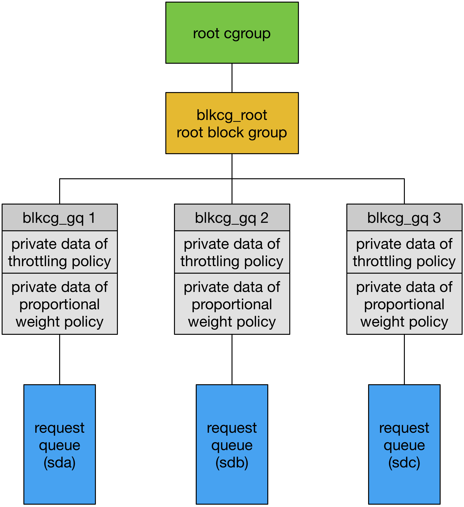
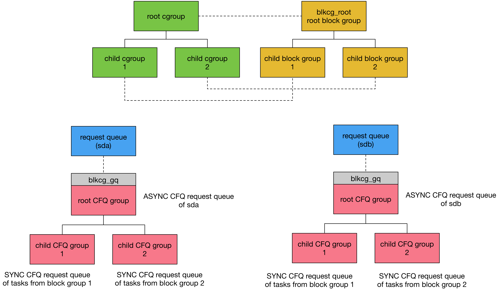

## Block Controller - Proportional Weight Policy


### CFQ Group Hierarchy

CFQ proportional weight policy 使用 CFQ group 描述采用同一个 policy 的 CFQ request queue 的集合


CFQ group 具有分层的树状结构，例如下例中

- root CFQ group 包含 A CFQ group 与 B CFQ group，其中 (A + B != root)，即 root CFQ group 中，存在既不属于 A CFQ group，也不属于 B CFQ group 的 CFQ request queue，这些剩余的 CFQ request queue 的集合称为 implicit leaf CFQ group
- A CFQ group 包含 AA CFQ group 与 AB CFQ group，同理 A CFQ group 也包含 implicit leaf CFQ group


每个 CFQ group 都有两个参数描述该 CFQ group 采用的 policy

- weight 参数描述该 CFQ group 与其 sibling CFQ group 竞争 block IO 资源时，该 CFQ group 相对于其 parent CFQ group 的比重
- leaf_weight 参数描述该 CFQ group 的 implicit leaf CFQ group 在该 CFQ group 中的比重


```
        weight leaf_weight
 root :  125    125
 A    :  500    750
 B    :  250    500
 AA   :  500    500
 AB   : 1000    500


          root
       /    |   \
      A     B    leaf
     500   250   125
   /  |  \
  AA  AB  leaf
 500 1000 750
```

例如上例中

- root CFQ group 是整个树状结构中的最上层，没有其它 sibling CFQ group 与其竞争，因而其 weight 参数没有意义，为了与其它 CFQ group 保持兼容，root CFQ group 的 weight 参数通常与其 leaf_weight 参数具有相同的值

- 以下为各个 CFQ group 占用 block IO 资源的比例

```
A:500 + B:250 + C:125 = 875.

 root-leaf :   125 /  875      =~ 14%
 A         :   500 /  875      =~ 57%
 B(-leaf)  :   250 /  875      =~ 28%
```

```
AA:500 + AB:1000 + A-leaf:750 = 2250.

 A-leaf    : (750 / 2250) * A =~ 19%
 AA(-leaf) : (500 / 2250) * A =~ 12%
 AB(-leaf) : (1000 / 2250) * A =~ 25%
```


### Tunable

block group 是一组采用相同 block IO control policy 的进程的集合，在 cgroup filesystem 中，每个 block group 都对应一个目录，该目录下包含的配置文件可以对该 block group 的 block IO control policy 的参数进行配置

采用 CFQ proportional weight policy 的 block group 的目录下，包含以下配置文件

#### blkio.weight

该配置文件描述该 block group 下的进程在使用所有 block device 时的 default weight 参数


#### blkio.weight_device

该配置文件描述该 block group 下的进程的 per-block-device weight 参数，即该 block group 下的进程在使用特定 block device 时的 weight 参数


```
# echo dev_maj:dev_minor weight > blkio.weight_device
# Configure weight=300 on /dev/sdb (8:16) in this cgroup
echo 8:16 300 > blkio.weight_device
```

上例中，该 block group 下的进程在访问 /dev/sdb 时，该进程对应的 CFQ group 的 weight 参数为 300


```
# Remove specific weight for /dev/sda in this cgroup
echo 8:0 0 > blkio.weight_device
```

上例中，该 block group 下的进程在访问 /dev/sda 时，该进程对应的 CFQ group 的 weight 参数为 0，即移除该 block group 对 /dev/sda 访问的特别限制


#### blkio.leaf_weight

该配置文件描述该 block group 下的进程在使用所有 block device 时的 default leaf_weight 参数


#### blkio.leaf_weight_device

该配置文件描述该 block group 下的进程的 per-block-device leaf_weight 参数，即该 block group 下的进程在使用特定 block device 时的 leaf_weight 参数


### Implementation

#### CFQ group parameter

struct cfq_group 结构中维护多个参数，以保证 CFQ proportional weight policy 的正常运行

##### weight

每个 block group 中的进程在访问一个特定的 block device 时，都会创建一个 CFQ group，即 CFQ group 实际维护 per-block-group per-block-device 的信息

每个 block device 都有一个 CFQ IO scheduler，该 CFQ IO scheduler 管理该 block device 下的所有 CFQ group


```c
/* This is per cgroup per device grouping structure */
struct cfq_group {
	/*
	 * There are two weights - (internal) weight is the weight of this
	 * cfqg against the sibling cfqgs.  leaf_weight is the wight of
	 * this cfqg against the child cfqgs.  For the root cfqg, both
	 * weights are kept in sync for backward compatibility.
	 */
	unsigned int weight;
	unsigned int new_weight;
	unsigned int dev_weight;

	unsigned int leaf_weight;
	unsigned int new_leaf_weight;
	unsigned int dev_leaf_weight;
};
```


> weight / leaf_weight

- weight 字段描述该 CFQ group 的 weight 参数
- leaf_weight 字段描述该 CFQ group 的 leaf_weight 参数


CFQ group 刚创建时

- weight 参数的初始值为对应的 block group 的 cfq_weight 字段的值
- leaf_weight 参数的初始值为对应的 block group 的 cfq_leaf_weight 字段的值


而 block group 刚创建时

- 对于 blkcg_root block group，cfq_weight、cfq_leaf_weight 字段的初始值均为 (2 * CFQ_WEIGHT_DEFAULT)
- 对于之后创建的 child block group，cfq_weight、cfq_leaf_weight 字段的初始值均为 CFQ_WEIGHT_DEFAULT

之后用户可以通过对应 block group 目录下的 blkio.weight、blkio.leaf_weight 配置文件修改该 block group 的 weight、leaf_weight 参数


> new_weight / new_leaf_weight

- new_weight 字段会缓存用户通过 blkio.weight 文件配置的 weight 参数，CFQ IO scheduler 运行过程中会将 new_weight 字段的值更新到 weight 字段
- new_leaf_weight 字段会缓存用户通过 blkio.leaf_weight 文件配置的 leaf_weight 参数，CFQ IO scheduler 运行过程中会将 new_leaf_weight 字段的值更新到 leaf_weight 字段


> dev_weight / dev_leaf_weight

- dev_weight 字段描述 CFQ group 对当前 block device 特定的 weight 参数
- dev_leaf_weight 字段描述 CFQ group 对当前 block device 特定的 leaf_weight 参数

这两个参数的初始值均为 0，用户可以通过对应 block group 目录下的 blkio.weight_device、blkio.leaf_weight_device 配置文件修改这两个参数


```c
/* This is per cgroup per device grouping structure */
struct cfq_group {
	/*
	 * The number of active cfqgs and sum of their weights under this
	 * cfqg.  This covers this cfqg's leaf_weight and all children's
	 * weights, but does not cover weights of further descendants.
	 *
	 * If a cfqg is on the service tree, it's active.  An active cfqg
	 * also activates its parent and contributes to the children_weight
	 * of the parent.
	 */
	int nr_active;
	unsigned int children_weight;
};
```

- nr_active 字段描述该 CFQ group 下所有正在运行的 child CFQ group 的数量，包括该 CFQ group 的 implicit child CFQ group，因而该字段的初始值为 1
- children_weight 字段描述该 CFQ group 下所有正在运行的 child CFQ group 的 weight 参数之和，包括该 CFQ group 的 implicit child CFQ group 的 weight 参数，因而该字段的初始值为 implicit child CFQ group 的 weight 参数，即该 CFQ group 的 leaf_weight 参数的值

这两个字段均用于计算 CFQ group 的 vfraction 参数


##### vfraction

```c
/* This is per cgroup per device grouping structure */
struct cfq_group {
	/*
	 * vfraction is the fraction of vdisktime that the tasks in this
	 * cfqg are entitled to.  This is determined by compounding the
	 * ratios walking up from this cfqg to the root.
	 *
	 * It is in fixed point w/ CFQ_SERVICE_SHIFT and the sum of all
	 * vfractions on a service tree is approximately 1.  The sum may
	 * deviate a bit due to rounding errors and fluctuations caused by
	 * cfqgs entering and leaving the service tree.
	 */
	unsigned int vfraction;
};
```

vfraction 字段描述该 CFQ group 的 implicit child CFQ group 在当前所有运行的 CFQ group 中对于该 block device 使用权的比例

为了方便计算，vfraction 字段的值实际为 block device 使用权的比例，再乘上 (1 << CFQ_SERVICE_SHIFT) 即 (1 << 12) 常量，因而 vfraction 的取值范围为 (0, 1 << CFQ_SERVICE_SHIFT)

再将 CFQ group 下的 CFQ request queue 添加到 service tree 的过程中，会确保该 CFQ group 已经添加到 CFQ data 的 group service tree，其中还会根据当前所有正在运行的 CFQ group 的 weight 参数，更新该 CFQ group 的 vfraction 字段


例如对于以下 block group hierarchy

```
        weight leaf_weight
 root :  125    125
 A    :  500    750
 B    :  250    500
 AA   :  500    500
 AB   : 1000    500


          root
       /    |   \
      A     B    leaf
     500   250   125
   /  |  \
  AA  AB  leaf
 500 1000 750
```

若其中的所有 block group 都参与调度，那么

- total weight = A:500 + B:250 + C:125 = 875
- root CFQ group 的 vfraction 参数即为 `((125 /  875) * (1 << CFQ_SERVICE_SHIFT))`，即 root CFQ group 的 implicit leaf group 的使用权比例
- A CFQ group 的 vfraction 参数即为 `((750 / 2250) * (500 /  875) * (1 << CFQ_SERVICE_SHIFT))`，即 A CFQ group 的 implicit leaf group 的使用权比例
- AA CFQ group 的 vfraction 参数即为 `((500 / 2250) * (500 /  875) * (1 << CFQ_SERVICE_SHIFT))`，即 AA CFQ group 的 implicit leaf group 的使用权比例
- AB CFQ group 的 vfraction 参数即为 `((1000 / 2250) * (500 /  875) * (1 << CFQ_SERVICE_SHIFT))`，即 AB CFQ group 的 implicit leaf group 的使用权比例
- B CFQ group 的 vfraction 参数即为 `((250 /  875) * (1 << CFQ_SERVICE_SHIFT))`，即 B CFQ group 的使用权比例


##### vdisktime

```c
/* This is per cgroup per device grouping structure */
struct cfq_group {
	/* group service_tree key */
	u64 vdisktime;
	...
}
```

CFQ group 的 vdisktime 字段描述该 CFQ group 整体的 virtual run time（实际为其 implicit CFQ group 的 virtual run time）

grp_service_tree rbtree 中使用 (当前的 CFQ group 的 vdisktime - grp_service_tree rbtree 中所有 CFQ group 的最小 vdisktime) 作为该 CFQ group 的 key，对 grp_service_tree rbtree 中的所有 CFQ group 进行排序


CFQ group 新添加到 group service tree 时，会初始化该 CFQ group 的 vdisktime 字段，其中

- 若 group service tree 为空，则该 CFQ group 的 vdisktime 字段即为 group service tree 的 min_vdisktime 字段的值，service tree 的 min_vdisktime 字段描述该 group service tree 中所有 CFQ group 的 vdisktime 的最小值
- 否则将该 CFQ group 的 vdisktime 字段设置为其中所有 CFQ group 的 vdisktime 的最大值，再加上 CFQ_IDLE_DELAY


每次 CFQ request queue 结束调度时，都会更新其所属的 CFQ group 的 vdisktime 字段，即 vdisktime 的增量为该 CFQ request queue 在当前一轮调度中的 physical run time，经过该 CFQ group 的 vfraction 参数修正后的 virtual run time，其换算公式为

```
vdisktime += physical_run_time / vfraction
```

因而 CFQ group 的 vfraction 越小，即其对 block device 使用权的比例越小，则该 CFQ group 的 vdisktime 增加地越快，这样该 CFQ group 被调度的机会也就越小


#### cgroup/block group/CFQ group

cgroup 是采用同一种资源管理策略的一组 task 的集合，反映到 block IO subsystem，对应的 block group 即为采用同一种 block IO 资源管理策略的一组 task 的集合

而 CFQ IO scheduler 实际以 CFQ request queue 为调度的单位，CFQ group 其实是采用同一种 CFQ proportional weight policy 的一组 CFQ request queue 的集合，那么 block group 是怎样映射到 CFQ group 的呢？


进程在向 block layer 提交 IO request 时，进程提交的 IO request 需要添加到对应的 CFQ request queue 中，同时对应的 CFQ request queue 也会添加到对应的 CFQ group 中

- 进程的 SYNC request 会被添加到该进程专属的 SYNC CFQ request queue，而该 SYNC CFQ request queue 实际归属于该进程所在的 block group 对应的 CFQ group
- 进程的 ASYNC request 会被添加到 block device 的 CFQ data 管理的 ASYNC CFQ request queue，而该 block device 的所有 ASYNC CFQ request queue 实际都归属于该 block device 的 root CFQ group

因而 block group 只对进程的 SYNC request 有影响，若进程所属的 block group 占有更高的使用权比例，那么该进程的 SYNC request 在调度时则具有更高的优先级，而对于进程的 ASYNC request，无论提交 ASYNC request 的进程所属的 block group 的优先级高低，ASYNC request 实际都是按照同一个优先级进行调度




block IO subsystem 中维护一个 blkcg_root root block group，所有 block device 的 request queue 都会通过 struct blkcg_gq 结构将其与该 blkcg_root root block group 联系起来，同时在对应的 struct blkcg_gq 结构中会分别分配该 request queue 的 block group policy 使用的 private data

CFQ proportional weight policy 使用的 private data 即为 CFQ group，每个 block device 都会维护一棵 CFQ group tree，该 block device 对应的 struct blkcg_gq 结构中存储的 CFQ policy 使用的 private data 即为该 block device 的 CFQ IO scheduler 使用的 root CFQ group




每个 block device 的 CFQ IO scheduler 都维护一棵 CFQ group tree

当系统中只有一个 root cgroup，此时只有一个对应的 root block group，此时每个 block device 的 CFQ IO scheduler 的 root CFQ group 组织该 CFQ IO scheduler 的所有 ASYNC CFQ request queue，以及 root block group 下的所有进程的 SYNC CFQ request queue

当 root cgroup 下包含 child cgroup 1 与 child cgroup 2 时，对应地，root block group 下也有 child block group 1 与 child block group 2，此时会在每个 block device 的 root CFQ group 下创建对应的 child CFQ group，其中 child CFQ group 1 对应 child block group 1，child CFQ group 2 对应 child block group 2

此时

- root CFQ group 组织该 CFQ IO scheduler 的所有 ASYNC CFQ request queue，以及 root block group 下除了 child block group 1、child block group 2 剩余进程的 SYNC CFQ request queue
- child CFQ group 1 组织 child block group 1 下的进程对应的 SYNC CFQ request queue
- child CFQ group 2 组织 child block group 2 下的进程对应的 SYNC CFQ request queue


