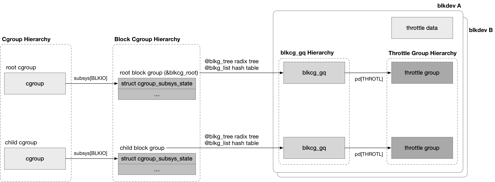
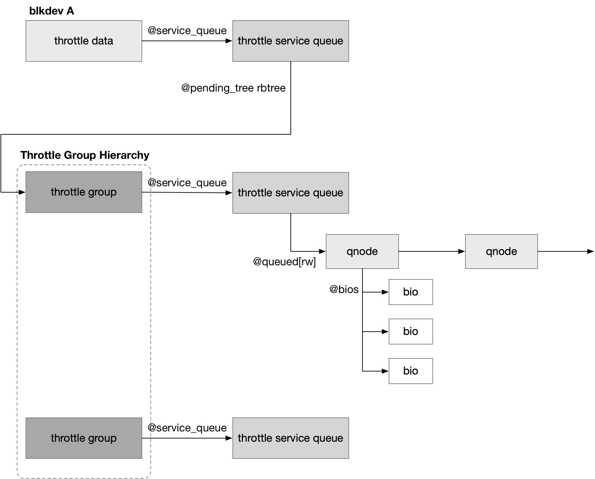
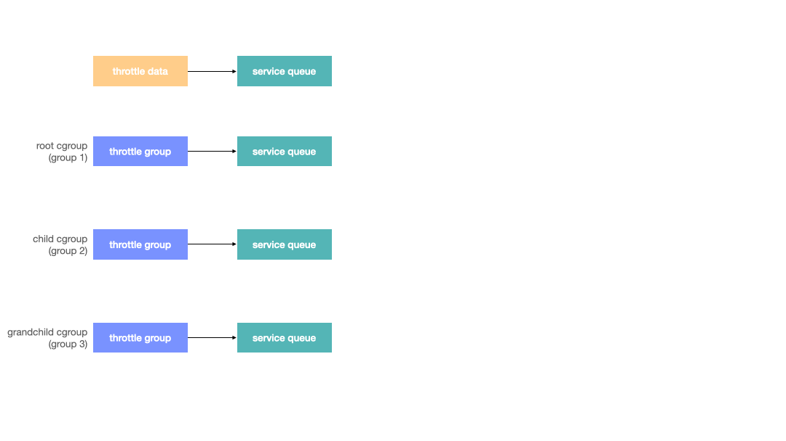

title:'Throttling Limit Policy'
## Throttling Limit Policy


### Group Hiererchy

每个 blkdev 会为每个 block group 创建一个对应的 throttle group




#### throttle data

每个 blkdev 对应一个 throttle data，保存该 blkdev 的 blk-throttle policy 相关的信息

```c
struct throtl_data
```

系统初始化过程中，每次注册一个 blkdev 时，会创建对应的 throttle data

```sh
blk_alloc_queue
    blkcg_init_queue
        blk_throtl_init(q)
            # allocate throttle data
```


#### throttle group

类似地，每个 blkcg_gq 即 (cgroup, request queue) pair 具有一个对应的 throttle group，保存在 blkcg_gq 的 @pd[] 数组

block group 层定义有一系列的 policy，例如 blk-throttle/iolatency/iocost 等，这里每个 policy 都会分配 policy specific data，这些 policy specific data 都会内嵌 struct blkg_policy_data，同时最终都保存在 @pd[] 数组

```c
struct blkcg_gq {
	struct blkg_policy_data	 *pd[BLKCG_MAX_POLS];
	...
};
```


blk-throttle 的 specific data 就是 struct throtl_grp

```c
struct throtl_grp {
	/* must be the first member */
	struct blkg_policy_data pd;
	...
};
```


- root cgroup

> 系统初始化过程中，每次注册一个 blkdev 时，会创建对应的 blkcg_gq 结构，使得该 blkdev 与 root block group 建立联系，这一过程中会依次调用各个 policy 的 pd_alloc_fn() 回调函数，创建 policy specific data

对于 blk-throttle 来说，此时就会创建该 blkcg_gq 对应的 throttle group

```sh
blk_alloc_queue
    blkcg_init_queue
        blkg_alloc
            # allocate blkcg_gq (@blkg)
            (for each policy)
                blkg->pd[...] = pol->pd_alloc_fn(), e.g., throtl_pd_alloc() // allocate throttle group
```


- child cgroup

> child block group 对应的 blkcg_gq 结构，则是在 child block group 下发 bio 的时候延迟创建的，此时会创建当前下发的 bio 的 blkdev 对应的 blkcg_gq 结构

```sh
bio_set_dev
    bio_associate_blkg
        css = blkcg_css() // get css of current task
        bio_associate_blkg_from_css
            blkg_tryget_closest
                blkg_lookup_create(css_to_blkcg(css), queue)
                    blkg_create
                        blkg_alloc
                            # allocate blkcg_gq (@blkg)
                            (for each policy)
                                blkg->pd[...] = pol->pd_alloc_fn(), e.g., throtl_pd_alloc() // allocate throttle group
                            
                        (for each policy)
                            blkg->pd[...] = pol->pd_init_fn(), e.g., throtl_pd_init()
```


### Throttle Routine

#### throttle limit

用户可以配置 throttle group 的参数上限，这些参数保存在 @iops[]/@bps[] 数组

```c
struct throtl_grp {
	uint64_t bps[2][LIMIT_CNT]; /* internally used bps limits */
	unsigned int iops[2][LIMIT_CNT]; /* internally used IOPS limits */
	...
}
```

@bps[2][LIMIT_MAX] 描述该 throttle group 的 read/write BPS 限制
@iops[2][LIMIT_MAX] 描述该 throttle group 的 read/write IOPS 限制


#### throttle check

throttle policy 是按照时间片 (time slice) 为单位对 IO 进行限流的，在一个时间片以内，下发的 IO 流量超过这个时间片对应的配额，才会触发限流；当下一个时间片来临的时候，配额会重新刷新；时间片一般默认为 HZ/10 即 100 ms


```
@slice_start[rw]                @slice_end[rw]
--------+-------------------------------+--------
                      ^
                current jiffies
```

1. usage in slice

首先每个 throttle group 需要统计一个时间片内截止目前为止，该 block group 对该 block device 的使用量

```c
struct throtl_grp {
	/* When did we start a new slice */
	unsigned long slice_start[2];
	unsigned long slice_end[2];

	/* Number of bytes disptached in current slice */
	uint64_t bytes_disp[2];
	/* Number of bio's dispatched in current slice */
	unsigned int io_disp[2];
	...
}
```

在 (@slice_start[READ], @slice_end[READ]) 时间段内，数据读取的总量为 @bytes_disp[READ] 字节，处理的读 IO 的数量为 @io_disp[READ]

在 (@slice_start[WRITE], @slice_end[WRITE]) 时间段内，数据写入的总量为 @bytes_disp[WRITE] 字节，处理的写 IO 的数量为 @io_disp[WRITE]

@slice_start[] 与 @slice_end[] 的间隔为 @throtl_data->throtl_slice，一般默认为 HZ/10 即 100 ms


```sh
submit_bio
    submit_bio_noacct
        submit_bio_checks
            blk_throtl_bio
                tg_may_dispatch
                    # check if within limit
                
                # if pass the thottle check
                throtl_charge_bio
                    	@bytes_disp[rw] += bio_size;
                    	@io_disp[rw]++;
```


2. quota in slice

之后需要计算当前这个时间片内，目前为止可用的配额，即 (jiffies - @slice_start[rw]) / HZ * limit


3. check

那么 IO 下发过程中，如果当前时间片内的使用量 (iops/bps) 超过了当前时间片内的可用的配额，那么就会触发限流操作


#### throttle

上述介绍到，IO 下发过程中可能会触发限流操作，此时当前下发的 IO 就会暂时缓存在当前 throttle group 中，之后恢复配额时会重新提交这些缓存的 IO，此时相关数据结构的层次如图所示




##### throttle service queue

每个 throttle group 维护有一个 throttle service queue，该 throttle group 下被限流的 bio 就组织在该 throttle service queue 中

```c
struct throtl_grp {
	/* this group's service queue */
	struct throtl_service_queue service_queue;
	...
}
```


值得注意的是，per blkdev 的 throttle data 也维护有一个 throttle service queue

```c
struct throtl_data {
	/* service tree for active throtl groups */
	struct throtl_service_queue service_queue;
	...
}
```


这些 throttle service queue 通过 @parent_sq 字段组成一个树状关系

```c
struct throtl_service_queue {
	struct throtl_service_queue *parent_sq; /* the parent service_queue */
	...
};
```

这里需要注意的是，所有 throttle group 的 @parent_sq 字段都指向 throttle data 对应的 service queue

```
                    service queue of throttle data
                            +-------+
                            |       |
                            +-------+
                                ^
                                | @parent_sq
        +-----------------------+
        |                       |
service queue               service queue
of throttle group           of child throttle group
    +-------+               +-------+
    |       |               |       |
    +-------+               +-------+

```


##### pending bio list

被限流的 bio 就暂时缓存在其所在的 throttle group 对应的 service queue 的 @queued[rw] 链表中

但是需要注意的是，被限流的 bio 并不是直接缓存在 @queued[rw] 链表中，而是缓存在 qnode 的 @bios 链表中，@queued[rw] 链表组织所有的 qnode

```c
struct throtl_qnode {
	struct bio_list		bios;	 /* queued bios */
	...
};
```

qnode 概念的提出，是为了解决在 dispatch 阶段，各个 throttle group 能公平分配配额的问题。其实在 qnode 概念提出来之前，限流的 bio 就是直接缓存到 @queued[rw] 链表的

需要注意的是，当前 throttle group 的 @queued[rw] 链表中缓存的 bio，有可能是来自当前 throttle group 的，也有可能是来自 child throttle group 的，甚至是 grandchild throttle group 的。这需要理解 throttle check 检查的过程，其中首先检查所在的 throttle group 的配额，如果当前所在的 throttle group 的配额已经用尽了，即该 bio 被限流在当前 throttle group，那么该 bio 就会缓存在当前 throttle group 的 @queued[rw] 链表中；而如果当前 throttle group 的配额还非常充足，此时会向上一层，检查 parent throttle group 的配额，如果 parent throttle group 的配额用尽，那么该 bio 就会被限流在 parent throttle group，此时该 bio 就会缓存在 parent throttle group 的 @queued[rw] 链表中

此时一个 throttle group 的 @queued[rw] 链表中缓存的 bio，既有来自当前 throttle group 的，也有来自 child throttle group、grandchild throttle group ... 之后当这个 throttle group 的配额恢复、进入 dispatch 阶段的时候，往往只能按照顺序依次对 @queued[rw] 链表中缓存的 bio 进行 dispatch 操作；此时试想某一时刻某一个 child throttle group 大量下发 bio 触发限流操作，缓存在其 parent throttle group 的 @queued[rw] 链表中，那么之后该 parent throttle group 进入 dispatch 阶段，此时大部分的配额分配给了之前大量下发 IO 的那个 child throttle group，而其他 child/grandchild throttle group 就存在饿死的风险

为了解决上述的公平分配配额的问题，就引入了 qnode 的概念。每个 throttle group 对应一个 qnode，在下发 IO 过程中，

- 如果当前 throttle group 配额用尽，导致 bio 被限流在当前 throttle group 时，会使用 @qnode_on_self[rw] 这一套 qnode，此时被限流的 bio 缓存到 @qnode_on_self[rw]->bios 链表，同时 @qnode_on_self[rw] 被添加到当前 throttle group 的 @queued[rw] 链表
- 如果当前 throttle group 配额还很充足，那么会向上检查其 parent throttle group 的配额，如果 parent throttle group 的配额用尽，导致 bio 被限流在 parent throttle group 时，会使用 @qnode_on_parent[rw] 这一套 qnode，此时被限流的 bio 缓存到 @qnode_on_parent[rw]->bios 链表，同时 @qnode_on_parent[rw] 被添加到其 parent throttle group 的 @queued[rw] 链表

```c
struct throtl_grp {
	/*
	 * qnode_on_self is used when bios are directly queued to this
	 * throtl_grp so that local bios compete fairly with bios
	 * dispatched from children.  qnode_on_parent is used when bios are
	 * dispatched from this throtl_grp into its parent and will compete
	 * with the sibling qnode_on_parents and the parent's
	 * qnode_on_self.
	 */
	struct throtl_qnode qnode_on_self[2];
	struct throtl_qnode qnode_on_parent[2];
	...
}
```

```sh
submit_bio
    submit_bio_noacct
        submit_bio_checks
            blk_throtl_bio
                tg_may_dispatch // check
                
                # if need to be throttled
                throtl_add_bio_tg
                    throtl_qnode_add_bio // add bio to qnode's @bios list
                                         // add qnode to throttle group's @queued[rw] list
                    sq->nr_queued[rw]++
```


##### pending throttle group rbtree

此外所有包含有 pending bio 的 throttle group 会组织成一棵 rbtree，保存在 throttle data 对应的 service queue 的 @pending_tree rbtree 中

需要注意的是，只有存在 pending bio 需要处理的 throttle group 才会进入 @pending_tree rbtree 中

```c
struct throtl_service_queue {
	/*
	 * RB tree of active children throtl_grp's, which are sorted by
	 * their ->disptime.
	 */
	struct rb_root		pending_tree; /* RB tree of active tgs */
	...
};
```

这棵 rbtree 的 value 是 throttle group，而 key 是对应 throttle group 的 dispatch time，dispatch time 描述该 throttle group 中最近一个可以执行 dispatch 操作的 pending bio 的时间


> dispatch time of bio

何谓 dispatch time？之前介绍到，throttle policy 是按照时间片 (time slice) 为单位对 IO 进行限流的，每个 throttle group 都记录了当前一个时间片内，截止到目前为止已经使用了的配额。IO 下发过程中，如果检查到 throttle group 的配额已经用尽，导致当前下发的 bio 需要被限流时，那么根据该 throttle group 配置的 limit 上限、当前时间片内截止到目前为止已经使用了的配额、以及当前被限流的 bio 的大小，就可以计算出将来的某一时刻，throttle group 的配额可以恢复，从而使得该 bio 被重新下发，这一时刻就称为这个 pending bio 的 dispatch time


> dispatch time of throttle group

每个 throttle group 都会维护一个 @disptime 字段，描述该 throttle group 包含的所有 pending bio 中，离当前时刻最近的一个 dispatch time，实际上也就是该 throttle group 下一次被调度的时刻

```c
struct throtl_grp {
	/*
	 * Dispatch time in jiffies. This is the estimated time when group
	 * will unthrottle and is ready to dispatch more bio. It is used as
	 * key to sort active groups in service tree.
	 */
	unsigned long disptime;
	...
}
```


每当有一个 bio 被限流从而加入到 throttle group 中时，都会更新 throttle group 的 @disptime 字段

```sh
submit_bio
    submit_bio_noacct
        submit_bio_checks
            blk_throtl_bio
                tg_may_dispatch // check
                
                # if need to be throttled, add bio to qnode's @bios list
                throtl_add_bio_tg

                tg_update_disptime
                    # read_wait = time to wait for latest read IO
                    # write_wait = time to wait for latest write IO
                    # min_wait = min(read_wait, write_wait);
                    # tg->disptime = jiffies + min_wait;
```


> throttle group rbtree

之后就会将该 throttle group 添加到 throttle data 对应的 service queue 的 @pending_tree rbtree 中

@pending_tree rbtree 中的所有 throttle group 按照 @tg->disptime 排序，即 rbtree 中最左边的 throttle group 的 dispatch time 距离当前时刻最近，也就是下一个将被调度的 throttle group

```sh
submit_bio
    submit_bio_noacct
        submit_bio_checks
            blk_throtl_bio
                tg_may_dispatch // check
                
                # if need to be throttled, add bio to qnode's @bios list
                throtl_add_bio_tg
                
                tg_update_disptime
                    # update tg->disptime
                    
                    throtl_enqueue_tg
                        tg_service_queue_add // add throttle group to throttle_data->service_queue's @pending_tree rbtree
```


##### schedule dispatch timer

之后就会调度 dispatch timer 来处理缓存在 throttle group 中的 pending bio

这里需要注意的是，需要等待一段时间，等待 throttle group 的配额恢复之后，才能调度 dispatch timer；@pending_tree rbtree 最左边的 throttle group 对应的 @disptime 字段描述了最近一个 throttle group 将被调度的时刻，因而也就是等待这一时刻到来之后，再调度 dispatch timer

```sh
submit_bio
    submit_bio_noacct
        submit_bio_checks
            blk_throtl_bio
                tg_may_dispatch // check
                
                # if need to be throttled, add bio to qnode's @bios list
                throtl_add_bio_tg
                
                tg_update_disptime
                    # update tg->disptime
                    
                    throtl_enqueue_tg
                        tg_service_queue_add // add throttle group to throttle_data->service_queue's @pending_tree rbtree
                
                throtl_schedule_next_dispatch
                    # first_pending_disptime = disptime of the latest expiring throttle group
                    throtl_schedule_pending_timer(..., first_pending_disptime)
```


#### dispatch

##### dispatch timer

dispatch timer 被调度的时候，就会处理 @pending_tree rbtree 中的 throttle group


> iterate throttle groups

dispatch timer 会优先处理 @pending_tree rbtree 最左边的 throttle group，即 dispatch time 最近的一个 throttle group，但是每个 throttle group 单次最多只能分发 THROTL_GRP_QUANTUM 个 IO (包括 READ IO 和 WRITE IO)，之后根据该 throttle group 中剩下的还未分发的 pending bio 更新该 throttle group 的 @disptime 字段，并根据更新后的 @disptime 字段，调整该 throttle group 在 @pending_tree rbtree 中的位置 (此时该 throttle group 往往不再位于 @pending_tree rbtree 的最左边)

之后 dispatch timer 会在一个循环中重复上述过程，即从 @pending_tree rbtree 的最左边取出一个 throttle group，分发其中的 pending bio，但同样最多只能分发 THROTL_GRP_QUANTUM 个 IO，...

重复以上过程，直到 @pending_tree rbtree 最左边取出的 throttle group 的 @disptime 在当前时刻之后，才会结束


> dispatch one throttle group

上述循环中，在对当前轮到的 throttle group 作 dispatch 操作的过程中实际上是将 @queued[rw] 链表中各个 qnode 的 @bios 链表中缓存的 pending bio 转移到当前 throttle group 的 @qnode_on_parent[rw] 中，之后将 @qnode_on_parent[rw] 添加到 throttle data 的 service queue 的 @queued[rw] 链表中

也就是说此时尚未真正下发 pending bio，而只是将这些 pending bio 转移到 throttle data 的 service queue 的 @queued[rw] 链表中，之后会调度 dispatch worker 对这些 pending bio 作真正的下发操作

```sh
# throtl_pending_timer
throtl_pending_timer_fn // input @throtl_service_queue is from throtl_data
    throtl_select_dispatch
        # get the leftmost throttle group (@tg) in @pending_tree rbtree
        
        throtl_dispatch_tg(tg)
            # dispatch (75% * THROTL_GRP_QUANTUM) READ IO
                tg_dispatch_one_bio(tg, READ)
                    # get latest expiring qnode from @tg's @queued[READ] list
                    # get latest expiring bio from qnode
                    # add bio to current throttle group's qnode_on_parent[rw] list
                    # current throttle group's qnode_on_parent[rw] to throtl_data's throtl_service_queue's @queued[rw] list
                
            # dispatch (25% * THROTL_GRP_QUANTUM) WRITE IO
            ...
    
    queue_work(kthrotld_workqueue, &td->dispatch_work) // schedule @kthrotld_workqueue worker
```

每个 throttle group 能够处理的 pending bio 的数量存在一个上限，即 THROTL_GRP_QUANTUM，其中会优先处理 READ IO，但是单次能够处理的 READ IO 也只能占当前能够处理的 THROTL_GRP_QUANTUM 的 75%


这里需要注意的是，在处理单个 throttle group 的过程中，每次都是从 @queued[rw] 链表的头部取出一个 qnode，再从该 qnode 的 @bios 链表的头部取出一个 pending bio 进行处理，之后就会将该 qnode 转移到 @queued[rw] 链表的尾部；之后再从 @queued[rw] 链表的头部取出下一个 qnode，循环往复

这一行为正是当初引入 qnode 的意义所在，即所有 qnode (即所有 child/grandchild throttle group) 公平地分配当前 throttle group 的配额，防止其中的某个 child/grandchild throttle group 存在饿死的风险


##### dispatch worker

上述介绍到，dispatch timer 只是将 pending bio 转移到 throttle data 的 service queue 的 @queued[rw] 链表中，尚未进行真正的下发，之后调度的 dispatch worker 会对这些 pending bio 作真正的下发操作

每个 block device 维护一个 @dispatch_work，当该 block device 下存在 pending bio 需要下发时，就会调度 worker thread 进行处理

worker thread 只是依次将缓存在 throttle data 的 service queue 的 @queued[rw] 链表中的 pending bio，下发给 block layer 进行处理


```sh
# @kthrotld_workqueue worker
blk_throtl_dispatch_work_fn
    # for each qnode on throtl_data's throtl_service_queue's @queued[rw] list
        # for each bio in the qnode
            submit_bio_noacct(bio)
```


#### slice management

总的来说，slice 是一个动态移动的过程

- bio 下发过程中做 limit 检查的时候，@slice_end[rw] 会向后移，即 extend slice 操作
- 检查通过 bio 成功下发，即 dispatch 阶段，@slice_start[rw] 会向后移，即 trim slice 操作

```
@slice_start[rw]                @slice_end[rw]
--------+-------------------------------+--------
```

##### throttle check

> start new slice

向 throttle group 发送第一个 bio，或者这个 throttle group 在发生限流、之后发送完所有积压的 bio 之后再重新发送一个 bio 时，此时这个 throttle group 是空的，即当前没有 bio 在该 throttle group 中等待，同时当前的 slice 也已经过时了，那么此时就会新开一个 slice

```
@slice_start[rw]                @slice_end[rw]
--------+-------------------------------+--------
        ^
current jiffies
```

```sh
submit_bio
    submit_bio_noacct
        submit_bio_checks
            blk_throtl_bio
                tg_may_dispatch
                    # if throttle group is empty, and current slice used up, start a new slice
                    throtl_start_new_slice
                        	@bytes_disp[rw] = 0;
                        	@io_disp[rw] = 0;
                        	@slice_start[rw] = jiffies;
                        	@slice_end[rw] = jiffies + @td->throtl_slice;
```


> extend 

如果当前的 slice 还没有过时，但是当前 slice 中剩余的时间 (即 (@slice_end[rw] - jiffies)) 还不足 @throtl_slice，由于 block throttle 中很多计算都是以 @throtl_slice 为单位的，因而此时就需要扩展当前的 slice，从而确保剩余时间向上取整为 @throtl_slice 的倍数

```
@slice_start[rw]                @slice_end[rw]
--------+-------------------------------+--------
                      ^
                current jiffies

@slice_start[rw]                                @slice_end[rw]
--------+-------------------------------*-------------+-----------
                      ^
                current jiffies
```


另外如果当前的 slice 已经过时，但是 throttle group 不为空，即当前 throttle group  中还存在等待的 bio，由于这些还在等待的 bio 的 dispatch 操作必须依赖当前 slice 的相关数据，因而此时也还不能新开 slice，因而此时也需要扩展当前的 slice，从而确保剩余时间向上取整为 @throtl_slice 的倍数

```
@slice_start[rw]        @slice_end[rw]
--------+--------------------+--------
                                    ^
                            current jiffies

@slice_start[rw]                                        @slice_end[rw]
--------+--------------------*--------------------------------+--------
                                    ^
                            current jiffies
```

```sh
submit_bio
    submit_bio_noacct
        submit_bio_checks
            blk_throtl_bio
                tg_may_dispatch
                    # if throttle group is not empty, or current slice not used up
                        # if remained time in current slice smaller than @throtl_slice
                        throtl_extend_slice
                            @slice_end[rw] = jiffies + @td->throtl_slice;
```


> trim slice

之前介绍到，在做 throttle limit 检查之前会作 extend slice 操作，现在检查通过即当前 bio 可以直接下发、不需要等待，那么此时需要将之前扩展的 slice 重新缩减回去

这是因为在 throttle limit 检查之前做了 extend slice 操作，现在如果不做 trim slice 操作，那么之后如果 throttle group 重新设置了一个相对很小的 limit，而此时当前这个 slice 的相关数据，主要是 @io_disp[rw]/@bytes_disp[rw]，都还是过去 limit 很大时的统计数据，这就会造成修改 limit 之后，新下发的 bio 需要 throttle 等待很长时间才能够下发

```
@slice_start[rw]                @slice_end[rw]
--------+-------------------------------+--------
                                ^
                         current jiffies

                @slice_start[rw]                 @slice_end[rw]
--------*-----------------+-------------*-------------+-----------
                                ^
                         current jiffies
```

trim slice 操作会将整个 slice 往后移，其中 @slice_start[rw] 会移动到当前的 jiffies 附近，同时也会按照 @slice_start[rw] 变化的幅度，等比例地减小 @io_disp[rw]/@bytes_disp[rw]

```sh
submit_bio
    submit_bio_noacct
        submit_bio_checks
            blk_throtl_bio
                tg_may_dispatch // pass
                
                # if pass the throttle check
                throtl_charge_bio
                
                throtl_trim_slice
                    @slice_end[rw] = jiffies + @td->throtl_slice;
                    # move @slice_start[rw] around current jiffies
                    # modify @io_disp[rw]/@bytes_disp[rw] proportionally
```


##### dispatch

> extend

dispatch 的过程中会从 throttle group 中取出等待的 bio，此时会再次调用 tg_may_dispatch() 检查这个 bio 是否能够下发，如果在 limit 之内就可以下发，进入 dispatch 阶段，否则必须继续等待

此时类似地在 tg_may_dispatch() 中，需要检查当前 slice 中剩余的时间，如果剩余时间不足 @throtl_slice，就需要扩展当前的 slice，从而确保剩余时间向上取整为 @throtl_slice 的倍数

```sh
# throtl_pending_timer
throtl_pending_timer_fn
    throtl_select_dispatch
        # get the leftmost throttle group (@tg) in @pending_tree rbtree
        
        throtl_dispatch_tg(tg)
            bio = throtl_peek_queued()
            tg_may_dispatch(bio, ...)
                # if remained time in current slice smaller than @throtl_slice
                throtl_extend_slice
                    @slice_end[rw] = jiffies + @td->throtl_slice;            
```


> trim

dispatch 的过程中如果检查通过，基于以上类似的原因，在下发之后，需要将之前扩展的 slice 重新缩减回去

```sh
# throtl_pending_timer
throtl_pending_timer_fn
    throtl_select_dispatch
        # get the leftmost throttle group (@tg) in @pending_tree rbtree
        
        throtl_dispatch_tg(tg)
            bio = throtl_peek_queued()
            tg_may_dispatch(bio, ...) // pass
            
            tg_dispatch_one_bio
                throtl_charge_bio
                throtl_trim_slice
```


#### example

> example 1



如果当前 throttle group 就被限流，那么当前下发的 bio 缓存在当前 throttle group 的 @qnode_on_self，同时该 qnode 缓存在当前 throttle group 中

之后 dispatch 阶段调度到该 throttle group 的时候，从该 throttle group 的 @queued 链表的第一个 qnode 取出一个 bio，将该 bio 转移到当前 throttle group 的 @qnode_on_parent 中，之后将该 qnode (即 @qnode_on_parent) 转移到 throttle data 的 @queued 链表中

之后调度的 dispatch worker 就会对 throttle data 的 @queued 链表中缓存的 pending bio 进行下发


> example 2


如果当前 throttle group 配额充足，那么就会一层层往上，如果在某一层 parent throttle group 被限流，那么当前下发的 bio 缓存在其下一层 child throttle group 的 @qnode_on_parent，同时该 qnode 缓存在该 parent throttle group 中 (说明该 qnode 中缓存的 bio 来自当前 throttle group 的下一层 throttle group，而非直接来自当前的 throttle group)

之后 dispatch 阶段调度到该 throttle group (缓存有该 bio 的 parent throttle group) 的时候，类似地，从该 throttle group 的 @queued 链表的第一个 qnode 取出一个 bio，将该 bio 转移到当前 throttle group 的 @qnode_on_parent 中，之后将该 qnode (即 @qnode_on_parent) 转移到 throttle data 的 @queued 链表中

之后调度的 dispatch worker 就会对 throttle data 的 @queued 链表中缓存的 pending bio 进行下发


> example 3


类似地，如果当前 throttle group 配额充足，那么就会一层层往上，如果在某一层 parent throttle group 被限流，那么当前下发的 bio 缓存在其下一层 child throttle group 的 @qnode_on_parent，同时该 qnode 缓存在该 parent throttle group 中

之后 dispatch 阶段也是类似地，当调度到该 throttle group 时，从该 throttle group 的 @queued 链表的第一个 qnode 取出一个 bio，将该 bio 转移到当前 throttle group 的 @qnode_on_parent 中

此时如果该 @qnode_on_parent 已经存在于某个 @queued 链表 (例如其上一层 parent throttle group 的 @queued 链表，或者 throttle data 的 @queued 链表) 中，那么此时不会再移动该 @qnode_on_parent

此时如果该 @qnode_on_parent 存在于其上一层 parent throttle group 的 @queued 链表，那么之后在调度到该 parent throttle group 的时候，类似地，会将该 bio 转移到当前 throttle group 的 @qnode_on_parent 中，之后将该 qnode (即 @qnode_on_parent) 转移到 throttle data 的 @queued 链表中

之后调度的 dispatch worker 就会对 throttle data 的 @queued 链表中缓存的 pending bio 进行下发


### Tunable

block group 是一组采用相同 block IO control policy 的进程的集合，在 cgroup filesystem 中，每个 block group 都对应一个目录，该目录下包含的配置文件可以对该 block group 的 block IO control policy 的参数进行配置

采用 Throttling Limit Policy 的 block group 的目录下，包含以下配置文件


#### blkio.throttle.read_bps_device

该配置文件描述该 block group 对该 block device 的读操作的速度上限，单位为 bytes/second

```sh
echo "<major>:<minor>  <rate_bytes_per_second>" > /cgrp/blkio.throttle.read_bps_device
```


例如下例中，该 block group 读取 major/minor number 8:16 的 block device 时，速度上限为 1MB/s

```sh
echo "8:16  1048576" > /sys/fs/cgroup/blkio/blkio.throttle.read_bps_device
```


#### blkio.throttle.write_bps_device

该配置文件描述该 block group 对该 block device 的写操作的速度上限，单位为 bytes/second

```
echo "<major>:<minor>  <rate_bytes_per_second>" > /cgrp/blkio.throttle.write_bps_device
```


#### blkio.throttle.read_iops_device

该配置文件描述该 block group 对该 block device 的读操作的速度上限，单位为 bios/second

当同时对某个 block device 的 read_bps_device 与 read_iops_device 进行限制时，该 block device 需要同时受到两者的限制

```
echo "<major>:<minor>  <rate_io_per_second>" > /cgrp/blkio.throttle.read_iops_device
```


#### blkio.throttle.write_iops_device

该配置文件描述该 block group 对该 block device 的写操作的速度上限，单位为 bios/second

当同时对某个 block device 的 write_bps_device 与 write_iops_device 进行限制时，该 block device 需要同时受到两者的限制

```
echo "<major>:<minor>  <rate_io_per_second>" > /cgrp/blkio.throttle.write_iops_device
```


### Statistics

#### io_serviced/io_service_bytes

`blkio.throttle.io_serviced` 和 `throttle.io_service_bytes` 描述该 block group 对应的各个 throttle group 已经下发的数据量，其中前者描述下发的 IO 数量，后者描述下发的数据量 (字节为单位)

一个 block group 可能对多个 blkdev 进行限流配置，此时每个配置的 blkdev 都对应一个 throttle group，因而一个 block group 可以对应多个 throttle group

```sh
# cat /sys/fs/cgroup/blkio/blkio.throttle.io_serviced
253:16 Read 380
253:16 Write 158342
253:16 Sync 158590
253:16 Async 132
253:16 Discard 0
253:16 Total 158722
253:0 Read 15390
253:0 Write 60458
253:0 Sync 38000
253:0 Async 37848
253:0 Discard 0
253:0 Total 75848
Total 234570
```

读取 blkio.throttle.io_serviced 和 throttle.io_service_bytes 的时候，就会遍历当前 block cgroup 对应的所有 throttle group，依次输出各个 throttle group 下发的数据量


每个 throttle group 都会统计自己的数据

```c
struct throtl_grp {
	struct blkg_rwstat stat_bytes;
	struct blkg_rwstat stat_ios;
	...
}
```

```c
struct blkg_rwstat {
	struct percpu_counter	cpu_cnt[BLKG_RWSTAT_NR];
	...
};
```

其中分为两个维度进行统计

- 一个是按照 IO 类型统计，分别为 READ/WRITE/DISCARD
- 一个是按照操作类型统计，分别为 SYNC/ASYNC

```c
	BLKG_RWSTAT_READ,
	BLKG_RWSTAT_WRITE,
	BLKG_RWSTAT_SYNC,
	BLKG_RWSTAT_ASYNC,
	BLKG_RWSTAT_DISCARD
```

以上两个维度是完全正交的，即

```
TOTAL = READ + WRITE + DISCARD = SYNC + ASYNC
```


#### charge when split

对于 bio 发生 split 的场景，v4.15 引入的 commit 111be8839817 ("block-throttle: avoid double charge") 只会对 split 之前的 original bio 作 charge 操作，因而目前限的都是 split 之前的 iops/bps

在执行 throttle 检查的时候，无论是通过了检查、还是没通过检查被 throttle 住了，都会给 original bio 打上 BIO_THROTTLED 标记

```sh
submit_bio
    submit_bio_noacct
        submit_bio_checks
            blk_throtl_bio
                # throttle check
                
                # no matter whether pass the throttle check                
                bio_set_flag(bio, BIO_THROTTLED)
```

之后 original bio 发生 split 时，所有 split bio 也都会复制上 BIO_THROTTLED 标记

```
blk_queue_split
    blk_bio_segment_split
        bio_split
            bio_clone_fast
                __bio_clone_fast
                    if (bio_flagged(bio_src, BIO_THROTTLED)
                        bio_set_flag(bio, BIO_THROTTLED);
```

之后对这些 split bio 作 throttle 检查的时候，检查到 BIO_THROTTLED 标记就会直接通过，不会作任何限制

```sh
submit_bio
    submit_bio_noacct
        submit_bio_checks
            blk_throtl_bio
                if bio_flagged(bio, BIO_THROTTLED): return
                
                # throttle check
                ....
```


后面 v5.18 引入的 commit 9f5ede3c01f9 ("block: throttle split bio in case of iops limit") 则改变了上述行为，使得用户配置的 IOPS limit 限的是 split 之后的 IOPS

我们之前介绍过，在 blk_throtl_bio() 中检查到 BIO_THROTTLED 标记就会直接通过，不会作任何 throttle 限制

```sh
blk_throtl_bio
    if bio_flagged(bio, BIO_THROTTLED): return
    
    ....
```

但是  commit 9f5ede3c01f9 ("block: throttle split bio in case of iops limit") 中将上述 fast path 后移，同时将该 fast path 只对 BPS 生效；同时在 throtl_charge_bio() 中，使得 BPS 限制不会对 split IO 重复 charge，而 IOPS 限制需要对 split IO 重复 charge

```
blk_throtl_bio
    # check if within limit
    tg_may_dispatch
        tg_with_in_bps_limit
            # if bio_flagged(bio, BIO_THROTTLED):
                return true
        tg_with_in_iops_limit
    
    /* within limits, let's charge and dispatch directly */
    throtl_charge_bio
        if !bio_flagged(bio, BIO_THROTTLED):
            tg->bytes_disp[rw] += bio_size
        tg->io_disp[rw]++
        
```

从而使得用户配置的 IOPS limit 限的是 split 之后的 IOPS，而 BPS limit 限的是 split 之前的 BPS


#### statistics when split

但是在 bio 发生 split 的场景下，io_serviced 和 io_service_bytes 的统计逻辑则存在差异

4.19 版本中，io_serviced 和 io_service_bytes 的统计逻辑为

```sh
submit_bio
    generic_make_request
        generic_make_request_checks
            blkcg_bio_issue_check
                blk_throtl_bio
        
                # if blk_throtl_bio() returns false, i.e., not throttled
                if (!bio_flagged(bio, BIO_QUEUE_ENTERED))
			             blkg_rwstat_add(@stat_bytes, bio->bi_iter.bi_size);
			         blkg_rwstat_add(&blkg->stat_ios, 1);
```


当发生 split 的时候，split 出来的 bio 会标记为 BIO_QUEUE_ENTERED

```
        original struct bio
+-------------------------------+
|                               |
+-------------------------------+

cloned struct bio      original struct bio
+-------+           +-----------------------+
| split |           |       remain          |
+-------+           +-----------------------+
```

```sh
blk_queue_split
    bio_set_flag(*bio, BIO_QUEUE_ENTERED)
```

也就是说，io_serviced 会重复统计 split bio，而 io_service_bytes 则不会


以 io_serviced 统计为例，

最开始对 original bio 调用 submit_bio() 时，会增加 io_serviced 计数

```
        original struct bio
+-------------------------------+
|                               |
+-------------------------------+
```

```sh
submit_bio (original bio)
    generic_make_request
        generic_make_request_checks
            blkcg_bio_issue_check
                blk_throtl_bio
                blkg_rwstat_add(&blkg->stat_ios, 1); // count for original bio
```


之后 original bio 发生 split 时，会对 split 之后的 remain bio 递归调用 generic_make_request()，此时会再次增加 io_serviced 计数

```
        original struct bio
+-------------------------------+
|                               |
+-------------------------------+

cloned struct bio      original struct bio
+-------+           +-----------------------+
| split |           |       remain          |
+-------+           +-----------------------+
```

```sh
submit_bio (original bio)
    generic_make_request
        q->make_request_fn(), e.g., blk_mq_make_request()
            blk_queue_split
                split = blk_bio_segment_split() // split
                bio_set_flag(*bio, BIO_QUEUE_ENTERED) // split bio is flagged with BIO_QUEUE_ENTERED
                
                generic_make_request(remain)
                    generic_make_request_checks
                        blkcg_bio_issue_check
                            blk_throtl_bio
                            blkg_rwstat_add(&blkg->stat_ios, 1); // count for remain bio
                            # buffer the remain bio in bio_list temporarily
                
                # go on handling split bio
```


v5.5 引入的 commit f73316482977ac401ac37245c9df48079d4e11f3 ("blk-cgroup: reimplement basic IO stats using cgroup rstat") 重构了这些统计的实现，并随后在 commit 7ca4643 ("blk-throtl: stop using blkg->stat_bytes and ->stat_ios") 中改变了 io_serviced 的统计逻辑，此时 io_serviced 不再重复统计 split bio

```sh
submit_bio
    submit_bio_noacct
        submit_bio_checks
            blk_throtl_bio
                if (bio_flagged(bio, BIO_THROTTLED)): return
                
                blkg_rwstat_add(@stat_bytes, bio->bi_iter.bi_size);
                blkg_rwstat_add(@stat_ios, 1);         
```

后面 v5.18 引入的 commit 9f5ede3c01f9 ("block: throttle split bio in case of iops limit") 以及后面 v6.1 引入的 commit 81c7a63abc7c ("blk-throttle: improve bypassing bios checkings") 则改变了上述行为，使得 io_serviced (IOPS) 重复统计 split IO，而 io_serviced_bytes (BPS) 不会重复统计 split IO

这里对于 IOPS，无论是否带有 THROTTLED 标记 (即无论是 original IO 还是 split IO) 都会执行 throttle 操作，也就是对于 split IO 都会执行 charge 以及 statistics 的统计工作

而对于 BPS，对于 THROTTLED 标记的 IO (即split IO) 不执行 throttle 操作，也就是对于 split IO 不执行 charge 以及 statistics 的统计工作

```
blk_throtl_bio
    blk_should_throtl
        /* iops limit is always counted *
        if tg->has_rules_iops[rw]:
            return true
        
        /* skip split IO for bps limit */
        if (tg->has_rules_bps[rw] && !bio_flagged(bio, BIO_BPS_THROTTLED)):
            return false

    # if blk_should_throtl returns true:
    __blk_throtl_bio
            blkg_rwstat_add(@stat_bytes, bio->bi_iter.bi_size);
            blkg_rwstat_add(@stat_ios, 1);     
```


另外这里需要注意的是，v5.18 引入的 commit 3f98c753717c ("block: don't check bio in blk_throtl_dispatch_work_fn") 使得 dispatch worker 里面在下发 IO 的时候不再使用 submit_bio_noacct()，而是由 submit_bio_noacct_nocheck() 下发 IO

submit_bio_noacct_nocheck() 中不会调用 blk_throtl_bio() 执行 throttle 检查和限流操作，这是可以理解的，因为 dispatch worker 在取得 quota 之后才会下发之前被限流的 IO，因而此时 dispatch worker 中确实没有必要再执行一遍 quota 检查

这对于 BPS 限流是可以理解的，但是对于 IOPS 限流，会不会导致下发一个很大的 IO 被限流，之后由 dispatch worker 下发该 IO 时，该 IO 发生 split 导致这些 split IO 没有被 throttle 框架统计，从而使得 block throttle 框架限制的还是 split 之前的 IOPS 呢？

实际不是的。可以看到 submit_bio_noacct_nocheck() 中确实没有执行 throttle 检查 (dispatch worker 在下发 IO 前已经获得了一个 IOPS 的 quota)，但是在下发的 IO 发生 split 的场景下，这一个 IOPS 的 quota 只能用于 split IO，后续的 remain IO 还是通过 submit_bio_noacct() 下发的，其中就会对 remain IO 继续执行 throttle 检查

```
blk_throtl_dispatch_work_fn
    submit_bio_noacct_nocheck
        __submit_bio_noacct_mq
            __submit_bio
                blk_mq_submit_bio
                    __bio_split_to_limits
                        split = bio_split_rw(bio, ...)
                        submit_bio_noacct(bio);
                            blk_throtl_bio
                        return split
                    
                    # submit split bio
```


另外 commit 320fb0f91e55 (" blk-throttle: fix that io throttle can only work for single bio") 中使得 split bio 不再继承 BIO_THROTTLED 标记

```diff
 static int __bio_clone(struct bio *bio, struct bio *bio_src, gfp_t gfp)
 {
        bio_set_flag(bio, BIO_CLONED);
-       if (bio_flagged(bio_src, BIO_THROTTLED))
-               bio_set_flag(bio, BIO_THROTTLED);
```

> Noted this patch also remove the code to set flag in __bio_clone(), it's introduced in commit 111be8839817 ("block-throttle: avoid double charge"), and author thinks split bio can be resubmited and throttled again, which is wrong because split bio will continue to dispatch from caller.

这是因为在 split 过程中，新 clone 出来的 'struct bio' 用于描述 split bio，而原来的 'struct bio' 则描述 remaining bio；blk_mq_submit_bio() 中在执行 split 操作之后，返回到 blk_mq_submit_bio() 中继续对 split bio 执行 submit 操作，此时 split bio 不会再调用到 blk_throtl_bio()，因而对 split bio 设置 BIO_THROTTLED 标记就是无意义的

而 remaining bio 因为是使用原来的 'struct bio' 描述的，因而其会保留原来的 BIO_THROTTLED 标记


#### statistic observation

block throttle 配置的 IOPS/BPS 的语义，从字面上理解就是限制 block cgroup 每秒钟下发的 IO 数量，至于如何观测这一限制的效果，其中会存在一些微妙的问题

从语义上来说，配置的 IOPS/BPS 就是限制 block cgroup 每秒钟下发的 IO 数量，但是 block throttle 的实现决定了，拉长一段时间平均来看，是能够达到这一限制的，但是如果采用 iostat 这类工具查看秒级的数据，可以发现 iostat 输出的秒级数据可能小于、也有可能大于配置的 IOPS/BPS

以下以 WRITE BPS=1024 KB/s 为例

> iostat 输出的 BPS 可能超过配置的 BPS

例如以下 iostat 输出的数据，其中有一秒的 WITE BPS 为 1404 KB/s

```
Device:         rrqm/s   wrqm/s     r/s     w/s    rkB/s    wkB/s avgrq-sz avgqu-sz   await r_await w_await  svctm  %util
sdb               0.00     0.00    4.00    4.00  1024.00  1024.00   512.00     0.00    1.00    0.50    1.50   0.25   0.20

Device:         rrqm/s   wrqm/s     r/s     w/s    rkB/s    wkB/s avgrq-sz avgqu-sz   await r_await w_await  svctm  %util
sdb               0.00     0.00    4.00    7.00  1024.00  1404.00   441.45     0.01    1.55    0.50    2.14   0.64   0.70

Device:         rrqm/s   wrqm/s     r/s     w/s    rkB/s    wkB/s avgrq-sz avgqu-sz   await r_await w_await  svctm  %util
sdb               0.00     0.00    4.00    4.00  1024.00  1024.00   512.00     0.01    1.25    0.75    1.75   0.38   0.30
```

以下是 ftrace 抓取的 WRITE IO 下发的时序

```
[1]    kworker/56:1-559   [056] ....  7033.714639: block_bio_queue: 8,16 W 23071232 + 2048 [kworker/56:1]

[2]    kworker/56:1-559   [056] ....  7034.714647: block_bio_queue: 8,16 W 27265536 + 2048 [kworker/56:1]
[3]    kworker/56:1-559   [056] ....  7034.827649: block_bio_queue: 8,16 W 4196864 + 232 [kworker/56:1]
[4]    kworker/56:1-559   [056] ....  7035.085652: block_bio_queue: 8,16 W 4197096 + 528 [kworker/56:1]
    
[5]    kworker/56:1-559   [056] ....  7036.085659: block_bio_queue: 8,16 W 6294016 + 2048 [kworker/56:1]
```

block throttle 算法的原则是，等到有足够的配额之后，再下发整个 IO，例如下发一个 1024KB 的 IO 时，需要等到时刻 [1] 才能下发这个 IO，其他的 IO 以此类推；因而在这条时间的长河上，block throttle 会严格地按照配置的 IOPS/BPS 限制，发送 IO，只不过在其中**任意**截取的一段 (1s) 时间区间内，实际下发的 IO 数据量可能不足或超过配置的 IOPS/BPS 限制

```
                       [1]                  [2] [3]     [4]                 [5]
...+--------------------+--------------------+---+------+--------------------+...
                                        <-------------------->
                                                    1s
```

例如上述时序中，如果 iostat 观察的是 7034.5~7035.5 时间段，就会发现这 1s 时间内 WRITE IO 下发了 2808 (2048+232+528) 个 sector 即 1404 KB/s


> iostat 输出的 BPS 可能小于配置的 BPS

例如以下 iostat 输出的数据，其中有一秒的 WITE BPS 为 904 KB/s

```
Device:         rrqm/s   wrqm/s     r/s     w/s    rkB/s    wkB/s avgrq-sz avgqu-sz   await r_await w_await  svctm  %util
sdb               0.00     0.00   ......   9.00  1024.00   904.00    32.00     0.01    0.22    0.38    0.04   0.10   1.20
```

以下是 ftrace 抓取的 WRITE IO 下发的时序

```
    kworker/22:1-532   [022] ....  2020.029000: block_bio_queue: 8,16 W 27264512 + 256 [kworker/22:1]

    kworker/22:1-532   [022] ....  2020.154001: block_bio_queue: 8,16 W 16778752 + 256 [kworker/22:1]
    kworker/22:1-532   [022] ....  2020.279007: block_bio_queue: 8,16 W 23070208 + 256 [kworker/22:1]
    kworker/22:1-532   [022] ....  2020.279010: block_bio_queue: 8,16 W 2098072 + 8 [kworker/22:1]
    kworker/22:1-532   [022] ....  2020.279011: block_bio_queue: 8,16 W 2098080 + 8 [kworker/22:1]
    kworker/22:1-532   [022] ....  2020.411003: block_bio_queue: 8,16 W 14681600 + 256 [kworker/22:1]
    kworker/22:1-532   [022] ....  2020.536005: block_bio_queue: 8,16 W 4195840 + 256 [kworker/22:1]
    kworker/22:1-532   [022] ....  2020.661005: block_bio_queue: 8,16 W 6293248 + 256 [kworker/22:1]
    kworker/22:1-532   [022] ....  2020.786006: block_bio_queue: 8,16 W 8390400 + 256 [kworker/22:1]
    kworker/22:1-532   [022] ....  2020.911008: block_bio_queue: 8,16 W 31460352 + 256 [kworker/22:1]
    
    kworker/22:1-532   [022] ....  2021.036009: block_bio_queue: 8,16 W 25167616 + 256 [kworker/22:1]
```

如果 iostat 观察的是 2020.030~2021.030 时间段，就会发现这 1s 时间内 WRITE IO 下发了 1808 (256*7+16) 个 sector 即 904 KB/s
