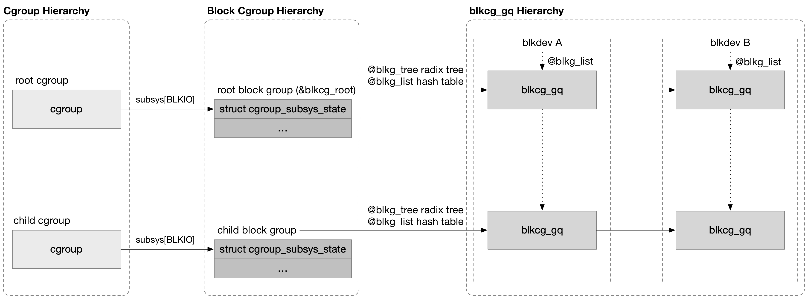

## Block Group




#### blkcg

> 在 cgroup hierarchy 中新建一个 cgroup 时，会依次调用依附在该 cgroup hierarchy 上的 subsystem 的 css_alloc() 回调函数，以创建 (cgroup, subsystem) pair 对应的 cgroup_subsys_state 结构

blkio subsystem 的 css_alloc() 回调函数为 blkcg_css_alloc()，其中为新建的 cgroup 创建一个对应的 block group

```c
struct blkcg {
	struct cgroup_subsys_state css;
	...
};
```

```sh
cgroup_mkdir
    cgroup_create
    cgroup_apply_control_enable
        css_create
            css = ss->css_alloc(), e.g., blkcg_css_alloc() for blkio subsys
                # allocate new block cgroup
```


blkio subsystem 的 root block group 则是静态定义的，即 @blkcg_root，内核初始化阶段会将该 root block group 与 root cgroup 建立联系

```sh
start_kernel
    cgroup_init
        (for each subsys) cgroup_init_subsys
            css = ss->css_alloc(), e.g., blkcg_css_alloc() for blkio subsys
                (@parent_css == NULL) blkcg = &blkcg_root   
```


#### blkcg_gq

block group 与 request queue 之间是多对多的关系，即一个 request queue 可以归属于一个 cgroup hierarchy 下的多个 block group，同时一个 block group 可以对应多个 request queue

此时使用 struct blkcg_gq 作为中间态将对应的 block group 与 request queue 联系起来

```c
/* association between a blk cgroup and a request queue */
struct blkcg_gq {
	struct request_queue		*q;
	struct list_head		q_node;
	
	struct hlist_node		blkcg_node;
	struct blkcg			*blkcg;

	struct blkg_policy_data	*pd[BLKCG_MAX_POLS];

};
```

@q 描述对应的 request queue，通过 @q_node 字段将该 blkcg_gq 添加到对应 request queue 的 @blkg_list 链表

@blkcg 描述对应的 block group，通过 @blkcg_node 字段将该 blkcg_gq 添加到对应 block group 的 @blkg_list hash table

同时一个 block group 可以包含多个 block device，因而 block group 的 @blkg_tree radix tree 管理该 block group 下的所有 block device


- root cgroup

系统初始化过程中，每次注册一个 block device 时，在创建对应的 request queue 的时候，会创建该 request queue 对应的 blkcg_gq 结构，使得该 request queue 与 root block group 建立联系

```c
blk_alloc_queue
    blkcg_init_queue
        blkg_create
```


- child cgroup

child block group 对应的 blkcg_gq 结构，则是在 child block group 下发 bio 的时候延迟创建的，此时会创建当前下发的 bio 的 blkdev 对应的 blkcg_gq 结构

```sh
bio_set_dev
    bio_associate_blkg
        css = blkcg_css() // get css of current task
        bio_associate_blkg_from_css
            blkg_tryget_closest
                blkg_lookup_create(css_to_blkcg(css), queue)
                    blkg_create
                        blkg_alloc // create blkcg_gq
```


