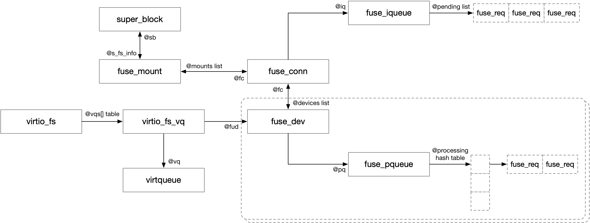

title:'FUSE - Routine'
## FUSE - Routine


### Normal Routine

本节描述 FUSE 文件系统的常规用法，此时 kernel 作为 client，user space daemon 作为 server，两者通过 `/dev/fuse` 通讯


#### 1. daemon: open /dev/fuse

首先 daemon 获取 /dev/fuse 对应的 fd

```sh
# fd = open("/dev/fuse", ...)
file_ops->open(), i.e., fuse_dev_open()
```


#### 2. daemon: mount

之后 daemon 挂载该 FUSE 文件系统，此时的 `-o fd=N` 传入的正是上一步获取的 /dev/fuse 对应的 fd

```sh
# mount -t fuse -o fd=N <mntpoint>
do_new_mount
    fc = fs_context_for_mount(type, ...)
        # allocate 'struct fs_context' @fc
        file_system_type->init_fs_context(fc), i.e., fuse_init_fs_context()
            # allocate 'struct fuse_fs_context' @ctx
    
    parse_monolithic_mount_data
        generic_parse_monolithic
            vfs_parse_fs_string
                vfs_parse_fs_param
                    file_system_type->parse_param(), i.e., fuse_parse_param()
                        for "fd=...": fuse_fs_context->fd=N
        
    vfs_get_tree(fc)
        fc->ops->get_tree(fc), i.e., fuse_get_tree()
            get_tree_nodev
                fuse_fill_super
                    # allocate "struct fuse_conn" @fc
                    # allocate "struct fuse_mount" @fm    
                    fuse_conn_init // init fuse_conn
                        @iq.ops = fuse_dev_fiq_ops
                    fuse_fill_super_common // allocate root indoe and root dentry
                    
                    fuse_send_init
```


#### 3. client: send FUSE request

client 可以通过两个接口向 daemon 发送 FUSE request，这两个接口都是将下发的请求暂时缓存在 @iqueue.pending 链表中


一个是 fuse_simple_background()，函数返回后只代表请求已经下发，并不意味着请求已经完成

```sh
fuse_simple_background(args, ...)
    # allocate 'struct fuse_req' @req
    # init @req->in from @args
    req->args = args
    
    fuse_request_queue_background(req)
        # add @req to @fc->bg_queue list
        flush_bg_queue(fc)
            # get one @req from @fc->bg_queue list
            queue_request_and_unlock(fiq, req)
                # add @req to @fiq->pending list
                fiq->ops->wake_pending_and_unlock(fiq), e.g., fuse_dev_wake_and_unlock() for fuse_dev_fiq_ops
                    wake_up(&fiq->waitq)
```

这种一般都需要 @args->end() 字段存在定义，这样之后 daemon 在完成该请求之后，就可以调用该 @end() 回调函数通知 client


另一个是 fuse_simple_request()，与上一个接口不同，函数中下发请求后，会等待请求完成之后再返回

```sh
fuse_simple_request(fm, args)
    # allocate 'struct fuse_req' @req
    # init @req->in from @args
    req->args = args
    
    __fuse_request_send(req)
        queue_request_and_unlock(fiq, req)
            # add @req to @fiq->pending list
            fiq->ops->wake_pending_and_unlock(fiq), e.g., fuse_dev_wake_and_unlock() for fuse_dev_fiq_ops
                wake_up(&fiq->waitq)
        
        request_wait_answer(req)
            # wait on @req->flags's FR_FINISHED bit
```


#### 4. daemon: get FUSE request

> processing queue

通过 "-o fd=N" 参数挂载的 FUSE 文件系统，在挂载阶段都会都会分配一个对应的 fuse_dev 实例

```sh
# mount -t fuse -o fd=N <mntpoint>
do_new_mount
    ...
    parse_monolithic_mount_data
        ...
        for "fd=...": fuse_fs_context->fd=N
        
    vfs_get_tree(fc)
        ...
        fuse_fill_super
            ctx->fudptr = &file->private_data;
            # allocate "struct fuse_conn" @fc
            # allocate "struct fuse_mount" @fm    
            fuse_conn_init // init fuse_conn
            fuse_fill_super_common
                if (ctx->fudptr): fuse_dev_alloc_install(fc)
                    fuse_dev_alloc // allocate and init fuse_dev
                    fuse_dev_install // add @fud to @fc->devices list
```

其中的 @processing[] hash table 组织所有的 FUSE request，其中 @req->in.h.unique 作为 hash 值

```c
struct fuse_dev {
	/** Processing queue */
	struct fuse_pqueue pq;
	...
};
```

```c
struct fuse_pqueue {
	...

	/** Hash table of requests being processed */
	struct list_head *processing;
};
```

```
@fud->pq.processing[]
+---+
|   | --> FUSE req --> FUSE req
+---+
|   |
+---+
|...|
+---+
|   |
+---+

```


> get FUSE request

daemon 对 `/dev/fuse` 执行 read 操作可以获取 FUSE request

此时 daemon 会从 @fiq->pending 链表中取出一个请求进行处理，并随后将该请求添加到 @fpq->processing[] hash table

如果 @fiq->pending 链表为空，那么 daemon 就会在 @fiq->waitq 等待队列上睡眠等待，之后当 client 有新的请求下发时，就会唤醒 @fiq->waitq 上睡眠等待的 daemon 进程

```sh
# read /dev/fuse
f_ops->read_iter(), i.e., fuse_dev_read()
    wait_event_interruptible_exclusive(fiq->waitq, ...) // wait on @fiq->waitq
    
    # get waken up once new request enqueued into @fiq->pending list
    
    # get one @req from @fiq->pending list
    # copy FUSE request message (@req->in) to user's buffer
    hash = fuse_req_hash(req->in.h.unique)
    # add @req to @fpq->processing[hash]
```


#### 5. daemon: send FUSE reply

daemon 通过 read 操作获取一个 FUSE request 请求之后，就可以在用户态执行相应的操作，之后通过对 `/dev/fuse` 执行 write 操作将该请求对应的 FUSE reply 回复发送给 client

FUSE reply 与 FUSE request 必须具有相同的 @unique 字段，这样才能通过 @unique 字段找到当初缓存在 @fpq->processing[] hash table 中的对应的 FUSE request

```sh
# write /dev/fuse
f_ops->write_iter(), i.e., fuse_dev_write()
    # copy user's buffer to FUSE reply message (@req->out)
    request_find // find previous @req buffered in @fpq->processing[] hash table
    # remove this @req from @fpq->processing[] hash table
    fuse_request_end(req)
        test_and_set_bit(FR_FINISHED, &req->flags)
        if req->args->end() defined:
            req->args->end(fm, req->args, req->out.h.error)
```

最后会将 FUSE request 加上 FR_FINISHED 标记，这样之前通过 fuse_simple_request() 下发请求，并一直睡眠等待请求完成的 client 就会被唤醒

同时如果当初下发请求的 end() 回调函数存在定义，即主要是通过 fuse_simple_background() 下发的请求，此时还会调用该回调函数以通知 client 当前请求已经完成


### virtiofs Routine



#### 1. guest: probe virtiofs device

```sh
virtio_driver->probe(), i.e., virtio_fs_probe()
    # allocate virtio_fs
    virtio_fs_setup_vqs
        # find all virtqueues, stored in @fs->vqs[].vq
    virtio_fs_add_instance(fs)
        # add virtio_fs into @virtio_fs_instances global list
```


#### 2. guest: mount virtiofs

```sh
fs_context_operations->get_tree(), i.e., virtio_fs_get_tree()
    # allocate "struct fuse_conn" @fc
    # allocate "struct fuse_mount" @fm 
    
    virtio_fs_fill_super       
        fuse_conn_init // init fuse_conn
            @iq.ops = virtio_fs_fiq_ops
            @iq.priv = virtio_fs
        virtio_fs_fill_super
            # for each virtqueue, allocate and init fuse_dev
                @fs->vqs[].fud = fuse_dev_alloc
            
            fuse_fill_super_common
                # allocate root indoe and root dentry
            
            # for each fuse_dev of each virtqueue
                fuse_dev_install // add fuse_dev to @fc->devices list
            
            fuse_send_init
```


#### 3. guest: send FUSE request

这一步和之前描述的步骤是一样的，guest 内部调用 fuse_simple_background()/fuse_simple_request() 接口下发请求，此时会将下发的 FUSE 请求转换为 virtio 请求添加到 virtqueue 中，并通知 host 处理，同时将该 FUSE 请求添加到 @fpq->processing hash table 中

```sh
fuse_simple_background()/fuse_simple_request()
    __fuse_request_send(req)
        queue_request_and_unlock(fiq, req)
            # add @req to @fiq->pending list
            fiq->ops->wake_pending_and_unlock(fiq), e.g., virtio_fs_wake_pending_and_unlock() for virtio_fs_fiq_ops
                # get one request from @fiq->pending list
                virtio_fs_enqueue_req
                    # add request to virtqueue
                    # add request to @fpq->processing hash table                
                    virtqueue_notify // kick the device
```


#### 4. guest: receive FUSE reply

当 host daemon 完成该 FUSE 请求之后，会调度 @done_work worker 线程处理这些完成的 FUSE 请求

```sh
# virtio IRQ
virtio_fs_vq_done
    # schedule @done_work worker

# @done_work worker
virtio_fs_requests_done_work
    # for each completed request in this virtio queue
        # remove request from @fpq->processing hash table
        virtio_fs_request_complete
            fuse_request_end(req)
                test_and_set_bit(FR_FINISHED, &req->flags)
                if req->args->end() defined:
                    req->args->end(fm, req->args, req->out.h.error)
```


