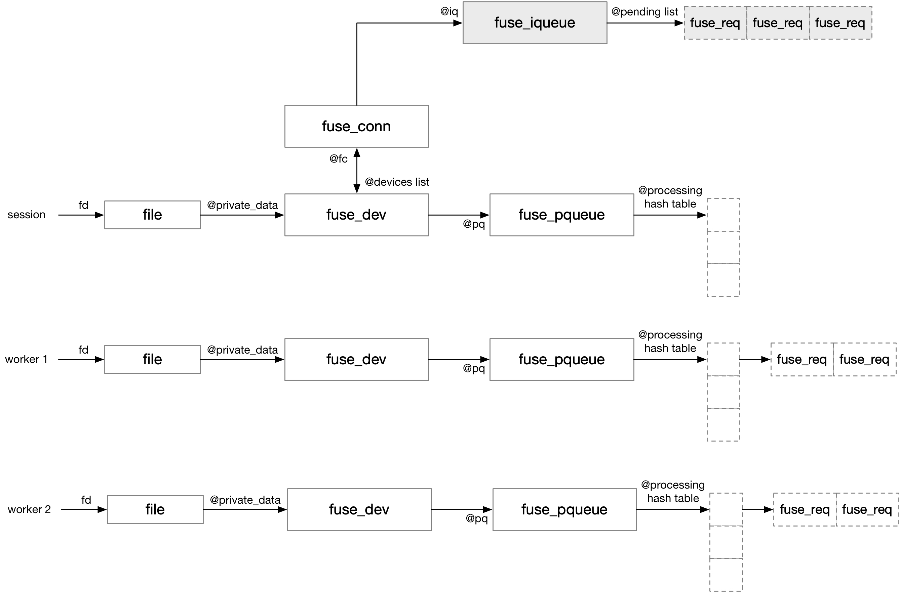

title:'FUSE - Message - Routine'
## FUSE - Message - Routine


### message queue

FUSE 中使用一系列的 queue 来管理下发的 FUSE message


#### iqueue (input queue)

fuse_iqueue 的 @pending 链表维护 fuse client 下发的，但是尚未下发给 fuse daemon 的请求

```c
struct fuse_conn {
	/** Input queue */
	struct fuse_iqueue iq;
	...
}
```

```c
struct fuse_iqueue {
	/** The list of pending requests */
	struct list_head pending;
	...
}
```


#### pqueue (processing queue)

fuse_dev 的 @processing[] hash table 组织所有已经下发给 fuse daemon 的请求，其中 @req->in.h.unique 作为 hash 值

```c
struct fuse_dev {
	/** Processing queue */
	struct fuse_pqueue pq;
	...
};
```

```c
struct fuse_pqueue {
	...

	/** Hash table of requests being processed */
	struct list_head *processing;
	
	/** The list of requests under I/O */
	struct list_head io;
};
```

```
@fud->pq.processing[]
+---+
|   | --> FUSE req --> FUSE req
+---+
|   |
+---+
|...|
+---+
|   |
+---+
```

fuse daemon 对 "/dev/fuse" 读操作以获取一个请求的时候，需要将该请求的相关数据拷贝到用户态缓存；在这一过程中会暂时将请求添加到 @io 链表中，之后再进行数据拷贝，数据拷贝完成后再将该请求添加到 @processing[] hash table


#### multi fuse_dev

之前介绍过，fuse_dev 中的 @processing hash table 管理所有已经下发给 fuse daemon 的请求

```c
struct fuse_pqueue {
	/** Lock protecting accessess to  members of this structure */
	spinlock_t lock;

	/** Hash table of requests being processed */
	struct list_head *processing;
	...
};
```

如果 fuse daemon 实现为多线程的，那么多个 worker 线程就需要并发访问 fuse_dev 中的 @processing hash table，此时必须使用锁机制对并发访问进行保护

v4.2 引入的 commit 00c570f ("fuse: device fd clone") 引入的 clone fuse_dev 特性，使得每个 worker 线程有一个独立的 fuse_dev，从而减小对 fuse_dev 的锁竞争

其主要流程如下，fuse daemon 的 session (主线程) 在 mount 过程中会创建一个 fuse_dev，接下来每个 worker 线程对 open("/dev/fuse") 获取得到的 fd 调用 FUSE_DEV_IOC_CLONE ioctl，使得每个 worker 线程分配一个 fuse_dev

```c
# session
session_fd = open("/dev/fuse")
mount -t fuse -o fd=session_fd ...  # allocate fuse_dev

# worker
worker_fd = open("/dev/fuse")
ioctl(worker_fd, FUSE_DEV_IOC_CLONE, &session_fd) # allocate cloned fuse_dev
```

这样每个 worker 线程都有一个独立的 fuse_dev，worker 线程对 /dev/fuse 执行读操作以获取请求的时候，都是将请求转移到该线程自己的 fuse_dev 的 @processing hash table 中，从而减小对 fuse_dev 的锁竞争

此时一个 fuse_conn 可能存在多个 fuse_dev，fuse_conn 的 @devices 链表组织其对应的所有 fuse_dev



此时多个 pqueue 共享同一个 iqueue，即多个 worker 线程都是从同一个 iqueue 获取需要处理的请求


### Routine

#### 1. client: send FUSE request

client 可以通过两个接口向 daemon 发送 FUSE request，这两个接口都是将下发的请求暂时缓存在 @iqueue.pending 链表中

这两个接口都是通过 fuse_args 来描述当前下发的 FUSE request 的相关信息，调用者在调用这两个接口之前，就需要初始化传入的 fuse_args

```c
int fuse_simple_background(struct fuse_mount *fm, struct fuse_args *args, gfp_t gfp_flags)
ssize_t fuse_simple_request(struct fuse_mount *fm, struct fuse_args *args)
```

这两个接口都会为传入的 fuse_args 构建对应的 fuse_req，每个 fuse_req 就用于抽象一个 FUSE request 以及对应的 FUSE reply，后续对 FUSE 请求的处理都是对该 fuse_req 进行的

```c
struct fuse_req {
	/* Input/output arguments */
	struct fuse_args *args;
	...
};
```


##### fuse_simple_request

发送 FUSE 请求的一个接口是 fuse_simple_request()，函数中下发请求后，会等待请求完成之后再返回

```sh
fuse_simple_request(fm, args)
    # allocate fuse_req
    fuse_get_req
        # request: set FR_PENDING flag
        # init @req->in from @args
        # request: set FR_WAITING flag
    
    # initialize @req from @args
    
    # request: set FR_ISREPLY flag
    
    __fuse_request_send(req)
        queue_request_and_unlock(fiq, req)
            # add @req to @fiq->pending list
            fiq->ops->wake_pending_and_unlock(fiq), e.g., fuse_dev_wake_and_unlock() for fuse_dev_fiq_ops
                wake_up(&fiq->waitq)
        
        request_wait_answer(req)
            # wait on @req->waitq for FR_FINISHED bit
```


##### fuse_simple_background

发送 FUSE 请求的另一个接口是 fuse_simple_background()，函数返回后只代表请求已经下发，并不意味着请求已经完成

这种一般都需要 @args->end() 字段存在定义，这样之后 daemon 在完成该请求之后，就可以调用该 @end() 回调函数通知 client

```sh
fuse_simple_background(args, ...)
    # allocate fuse_req
    fuse_get_req
        # request: set FR_PENDING flag
        # init @req->in from @args
        # request: set FR_WAITING flag
        # request: set FR_BACKGROUND flag

    # initialize @req from @args
        # request: set FR_ASYNC flag

    fuse_request_queue_background(req)
        # request: set FR_ISREPLY flag
        # add @req to @fc->bg_queue list
        flush_bg_queue(fc)
            # for each @req in @fc->bg_queue list
                # get one @req from @fc->bg_queue list
                queue_request_and_unlock(fiq, req)
                    # add @req to @fiq->pending list
                    fiq->ops->wake_pending_and_unlock(fiq), e.g., fuse_dev_wake_and_unlock() for fuse_dev_fiq_ops
                        wake_up(&fiq->waitq)
```


#### 2. server: get FUSE request

daemon 对 /dev/fuse 执行 read 操作可以获取 FUSE request

```sh
# server: read /dev/fuse
f_ops->read_iter(), i.e., fuse_dev_read()
    # get one @req from @fiq->pending list
    # request: clear FR_PENDING flag
    
    # move this @req to fud->fpq->io list 
    # copy FUSE request message (@req->in) to user's buffer
    # request: clear FR_LOCKED flag

    # move this @req to fud->fpq->processing[hash] hash table
    # request: set FR_SENT flag
```

这一过程中

1. 首先从 @fiq->pending 链表中取出一个待处理的请求；同时清除该请求的 FR_PENDING 标记，以表明该请求从 @fiq->pending 链表中移除，正在被 daemon 读取
2. 将这个请求 (即 request message) 拷贝到 daemon 传入的用户态缓存中，这一过程中会临时将这个请求暂存在 fud->fpq->io 链表中
3. 如果这个请求含有 FR_ISREPLY 标记，即该请求对应有 reply，那么还需要将该请求转移到 fud->fpq->processing[] hash table 中；同时该请求置上 FR_SENT 标记，以表明该请求位于 fud->fpq->processing[] hash table 中，即该请求已经发送给 daemon，同时等待对应的 reply

这个请求添加到 @fpq->processing[] hash table


当然如果 @fiq->pending 链表为空，那么 daemon 就会在 @fiq->waitq 等待队列上睡眠等待；之后当 client 有新的请求下发时，就会唤醒 @fiq->waitq 上睡眠等待的 daemon 进程

```sh
# server: read /dev/fuse
f_ops->read_iter(), i.e., fuse_dev_read()
    wait_event_interruptible_exclusive(fiq->waitq, ...) // wait on @fiq->waitq
    
    # get waken up once new request enqueued into @fiq->pending list
    
    # start to process @req in @fiq->pending list
    ...
```


#### 3. server: send FUSE reply

daemon 获取一个 FUSE request 请求之后，就可以在用户态执行相应的操作，之后通过对 /dev/fuse 执行 write 操作将该请求对应的 FUSE reply 发送给 client

```sh
# server: write /dev/fuse
f_ops->write_iter(), i.e., fuse_dev_write()
    # find previous @req buffered in @fpq->processing[] hash table
    req = request_find(..., unique) 
    
    # request: clear FR_SENT flag
    
    # move this @req to fud->fpq->io list
    # (removed from @fpq->processing[] hash table)
    # request: set FR_LOCKED flag
    # copy user's buffer to FUSE reply message
    # request: clear FR_LOCKED flag
    # remove this @req from fud->fpq->io list
    
    fuse_request_end(req)
```

1. 首先在 @fud->fpq->processing[] hash table 中找到当前 FUSE reply 对应的 @req，这里回复的 FUSE reply 必须与对应的 FUSE request 具有相同的 @unique 字段，这样才能通过 @unique 字段在 @fud->fpq->processing[] hash table 中找到对应的 @req
2. 将 daemon 传入的用户态缓存中的 FUSE reply 拷贝到内核中，这一过程中会临时将这个请求暂存在 fud->fpq->io 链表中
3. 最后调用 fuse_request_end(req) 将 FUSE reply 通知给当初下发 FUSE 请求的 client


对于同步下发的请求，即通过 fuse_simple_request() 下发的请求，下发请求的 client 还在 fuse_simple_request() 中，同步等待 @req 的 FR_FINISHED bit；因而这里将 @req 加上 FR_FINISHED 标记后，就会唤醒上述睡眠等待请求完成的 client 

```sh
# for sync FUSE request
fuse_request_end(req)the 
    # request: set FR_FINISHED flag
    # wake up process waiting on @req->waitq
```


而对于异步下发的请求，即通过 fuse_simple_background() 下发的请求，这里将 @req 加上 FR_FINISHED 标记后，就会调用 req->args->end() 回调函数以通知 client 当前请求已经完成

```sh
# for background FUSE request
fuse_request_end(req)
    # request: set FR_FINISHED flag
    # request: clear FR_BACKGROUND flag
    
    req->args->end(fm, req->args, req->out.h.error)
```


nohup ./stress-ng --sequential 1 -x access,af-alg,affinity,aio,aiol,alarm,atomic,bad-altstack,bigheap,binderfs,branch,brk,bsearch,cache,cacheline,cap,chattr,chdir,chmod,chown,chroot,clock,clone,close,context,copy-file,cpu,crypt,cyclic,daemon,dccp,dekker,dentry -t 5m --metrics --times --verify -v --log-file /root/tmp/stress-ng/stress-logfile-11.txt --temp-path /root/tmp/stress-ng/ &