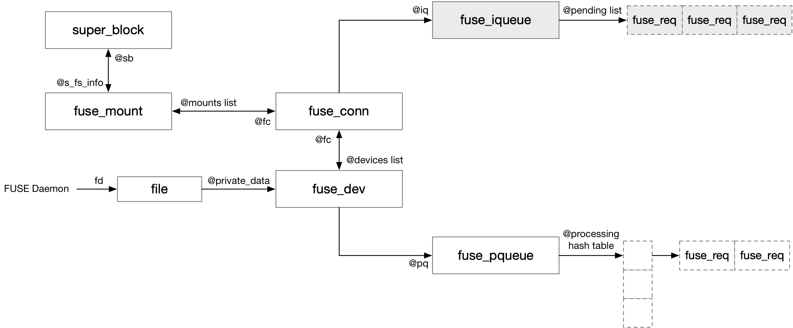

title:'FUSE - Routine'
## FUSE - Routine


### Normal Routine

本节描述 FUSE 文件系统的常规用法，此时 kernel 作为 client，user space daemon 作为 server，两者通过 `/dev/fuse` 通讯




> iqueue (input queue)

fuse_iqueue 的 @pending 链表维护 fuse client 下发的，但是尚未下发给 fuse daemon 的请求

```c
struct fuse_conn {
	/** Input queue */
	struct fuse_iqueue iq;
	...
}
```

```c
struct fuse_iqueue {
	/** The list of pending requests */
	struct list_head pending;
	...
}
```


> pqueue (processing queue)

fuse_dev 的 @processing[] hash table 组织所有已经下发给 fuse daemon 的请求，其中 @req->in.h.unique 作为 hash 值

```c
struct fuse_dev {
	/** Processing queue */
	struct fuse_pqueue pq;
	...
};
```

```c
struct fuse_pqueue {
	...

	/** Hash table of requests being processed */
	struct list_head *processing;
	
	/** The list of requests under I/O */
	struct list_head io;
};
```

```
@fud->pq.processing[]
+---+
|   | --> FUSE req --> FUSE req
+---+
|   |
+---+
|...|
+---+
|   |
+---+
```

fuse daemon 对 /dev/fuse 读操作以获取一个请求的时候，需要将该请求的相关数据拷贝到用户态缓存；在这一过程中会暂时将请求添加到 @io 链表中，之后再进行数据拷贝，数据拷贝完成后再将该请求添加到 @processing[] hash table


#### 1. daemon: open /dev/fuse

首先 daemon 获取 /dev/fuse 对应的 fd

```sh
# fd = open("/dev/fuse", ...)
file_ops->open(), i.e., fuse_dev_open()
```


#### 2. daemon: mount

之后 daemon 挂载该 FUSE 文件系统，此时的 `-o fd=N` 传入的正是上一步获取的 /dev/fuse 对应的 fd

```sh
# mount -t fuse -o fd=N <mntpoint>
do_new_mount
    fc = fs_context_for_mount(type, ...)
        # allocate 'struct fs_context' @fc
        file_system_type->init_fs_context(fc), i.e., fuse_init_fs_context()
            # allocate 'struct fuse_fs_context' @ctx
    
    parse_monolithic_mount_data
        generic_parse_monolithic
            vfs_parse_fs_string
                vfs_parse_fs_param
                    file_system_type->parse_param(), i.e., fuse_parse_param()
                        for "fd=...": fuse_fs_context->fd=N
        
    vfs_get_tree(fc)
        fc->ops->get_tree(fc), i.e., fuse_get_tree()
            # allocate "struct fuse_conn" @fc
            # allocate "struct fuse_mount" @fm
            fuse_conn_init // init fuse_conn
                @iq.ops = fuse_dev_fiq_ops
            
            get_tree_nodev
                fuse_fill_super 
                    fuse_fill_super_common
                        fuse_dev_alloc_install // allocate fuse_dev
                        fd's file->private_data = fuse_dev
                        
                        # allocate root indoe and root dentry
    
                fuse_send_init
```

在 mount 过程中会创建 fuse_conn/fuse_mount 结构，同时还会创建 fuse_dev 结构

这里需要注意的是，这个过程中会在 "fd=N" 对应的 file 的 @private_data 字段存储 fuse_dev 结构，这样后面 fuse daemon 通过 read/write /dev/fuse 来接收、发送 fuse message/reply 的时候，就可以根据 fd 来找到对应的 fuse_dev/fuse_conn


#### 3. client: send FUSE request

client 可以通过两个接口向 daemon 发送 FUSE request，这两个接口都是将下发的请求暂时缓存在 @iqueue.pending 链表中


一个是 fuse_simple_background()，函数返回后只代表请求已经下发，并不意味着请求已经完成

```sh
fuse_simple_background(args, ...)
    # allocate 'struct fuse_req' @req
    # init @req->in from @args
    req->args = args
    
    fuse_request_queue_background(req)
        # add @req to @fc->bg_queue list
        flush_bg_queue(fc)
            # get one @req from @fc->bg_queue list
            queue_request_and_unlock(fiq, req)
                # add @req to @fiq->pending list
                fiq->ops->wake_pending_and_unlock(fiq), e.g., fuse_dev_wake_and_unlock() for fuse_dev_fiq_ops
                    wake_up(&fiq->waitq)
```

这种一般都需要 @args->end() 字段存在定义，这样之后 daemon 在完成该请求之后，就可以调用该 @end() 回调函数通知 client


另一个是 fuse_simple_request()，与上一个接口不同，函数中下发请求后，会等待请求完成之后再返回

```sh
fuse_simple_request(fm, args)
    # allocate 'struct fuse_req' @req
    # init @req->in from @args
    req->args = args
    
    __fuse_request_send(req)
        queue_request_and_unlock(fiq, req)
            # add @req to @fiq->pending list
            fiq->ops->wake_pending_and_unlock(fiq), e.g., fuse_dev_wake_and_unlock() for fuse_dev_fiq_ops
                wake_up(&fiq->waitq)
        
        request_wait_answer(req)
            # wait on @req->flags's FR_FINISHED bit
```


#### 4. daemon: get FUSE request

daemon 对 `/dev/fuse` 执行 read 操作可以获取 FUSE request

这一过程中就是从 file->private_data 中存储的 fuse_dev 找到对应的 fuse_conn

此时 daemon 会从 @fiq->pending 链表中取出一个请求进行处理，并随后将该请求添加到 @fpq->processing[] hash table

如果 @fiq->pending 链表为空，那么 daemon 就会在 @fiq->waitq 等待队列上睡眠等待，之后当 client 有新的请求下发时，就会唤醒 @fiq->waitq 上睡眠等待的 daemon 进程

```sh
# read /dev/fuse
f_ops->read_iter(), i.e., fuse_dev_read()
    wait_event_interruptible_exclusive(fiq->waitq, ...) // wait on @fiq->waitq
    
    # get waken up once new request enqueued into @fiq->pending list
    
    # get one @req from @fiq->pending list
    # copy FUSE request message (@req->in) to user's buffer
    hash = fuse_req_hash(req->in.h.unique)
    # add @req to @fpq->processing[hash]
```


#### 5. daemon: send FUSE reply

daemon 通过 read 操作获取一个 FUSE request 请求之后，就可以在用户态执行相应的操作，之后通过对 `/dev/fuse` 执行 write 操作将该请求对应的 FUSE reply 回复发送给 client

FUSE reply 与 FUSE request 必须具有相同的 @unique 字段，这样才能通过 @unique 字段找到当初缓存在 @fpq->processing[] hash table 中的对应的 FUSE request

类似地，这一过程中也是从 file->private_data 中存储的 fuse_dev 找到对应的 fuse_conn

```sh
# write /dev/fuse
f_ops->write_iter(), i.e., fuse_dev_write()
    # copy user's buffer to FUSE reply message (@req->out)
    request_find // find previous @req buffered in @fpq->processing[] hash table
    # remove this @req from @fpq->processing[] hash table
    fuse_request_end(req)
        test_and_set_bit(FR_FINISHED, &req->flags)
        if req->args->end() defined:
            req->args->end(fm, req->args, req->out.h.error)
```

最后会将 FUSE request 加上 FR_FINISHED 标记，这样之前通过 fuse_simple_request() 下发请求，并一直睡眠等待请求完成的 client 就会被唤醒

同时如果当初下发请求的 end() 回调函数存在定义，即主要是通过 fuse_simple_background() 下发的请求，此时还会调用该回调函数以通知 client 当前请求已经完成


### multi fuse_dev

之前介绍过，fuse_dev 中的 @processing hash table 管理所有已经下发给 fuse daemon 的请求

```c
struct fuse_pqueue {
	/** Lock protecting accessess to  members of this structure */
	spinlock_t lock;

	/** Hash table of requests being processed */
	struct list_head *processing;
	...
};
```

如果 fuse daemon 实现为多线程的，那么多个 worker 线程就需要并发访问 fuse_dev 中的 @processing hash table，此时必须使用锁机制对并发访问进行保护

内核随后引入的 clone fuse_dev 特性，使得每个 worker 线程有一个独立的 fuse_dev，从而减小对 fuse_dev 的锁竞争

其主要流程如下，fuse daemon 的 session (主线程) 在 mount 过程中会创建一个 fuse_dev，接下来每个 worker 线程对 open("/dev/fuse") 获取得到的 fd 调用 FUSE_DEV_IOC_CLONE ioctl，使得每个 worker 线程分配一个 fuse_dev

```c
# session
session_fd = open("/dev/fuse")

# worker
worker_fd = open("/dev/fuse")
ioctl(worker_fd, FUSE_DEV_IOC_CLONE, &session_fd)
```

这样每个 worker 线程都有一个独立的 fuse_dev，worker 线程 read /dev/fuse 获取请求的时候，都是将请求转移到该线程自己的 fuse_dev 的 @processing hash table 中，从而减小对 fuse_dev 的锁竞争

此时一个 fuse_conn 可能存在多个 fuse_dev，fuse_conn 的 @devices 链表组织其对应的所有 fuse_dev


