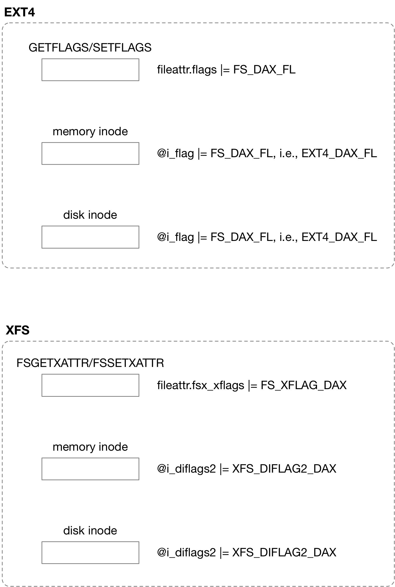

title:'per-file DAX'
## per-file DAX

在 LSF/MM'19 (2019 Linux Storage, Filesystem, and Memory-Management Summit) 上开发者讨论了 DAX 的一些受限场景

> Boaz Harrosh wondered why someone might want to turn DAX off for a persistent memory device. Hellwig said that the performance "could suck"; Williams noted that the page cache could be useful for some applications as well. Jan Kara pointed out that reads from persistent memory are close to DRAM speed, but that writes are not; the page cache could be helpful for frequent writes. Applications need to change to fully take advantage of DAX, Williams said; part of the promise of adding a flag is that users can do DAX on smaller granularities than a full filesystem.
> [DAX semantics](https://lwn.net/Articles/787973/)


针对这些受限场景，决定提供一种更细粒度的、决定文件是否开启 DAX 的特性，即所谓的 per-file DAX 特性；在此之前，用户可以通过 "-o dax" 挂载参数来决定是否开启 DAX，其粒度是整个文件系统，而 per-file DAX 特性则使得每个文件可以自由决定是否开启 DAX

linux 在 v5.8 为 ext4/xfs 引入 per-file DAX 特性
- commit 9cb20f94afcd2964944f9468e38da736ee855b19 ("fs/ext4: Make DAX mount option a tri-state")
- commit 02beb2686ff964884756c581d513e103542dcc6a ("fs/xfs: Make DAX mount option a tri-state")


per-file DAX 特性主要包含以下部分

- persistent filesystem inode state flag
- ioctls to manipulate persistent inode state flag (FS_XFLAG_DAX)
- mount options to override persistent inode state flag
- VFS inode state indicating DAX is active (S_DAX, STATX_ATTR_DAX)


### tri-state mount option

之前用户可以通过 "-o dax" 挂载参数来决定是否开启 DAX，而为了支持 per-file DAX 特性，对该挂载参数进行了扩展 "-o dax=always|never|inode"

"-o dax=never" 表示强制关闭 DAX 特性
"-o dax=always" 表示强制开启 DAX 特性

"-o dax=inode" 表示 per-file DAX 特性，即由文件自身 (例如根据文件的相关标志位)，决定该 inode 是否开启 DAX 特性

原先的 "-o dax" 等价于 "-o dax=always"，当没有配置 "dax" 挂载参数时默认 "-o dax=inode"，即默认开启 per-file DAX 特性


### persistent inode flag


### enable DAX

#### generic

vfs inode 的 @i_flags 字段的 S_DAX 标志描述该文件是否开启 DAX 特性

> mmap

```sh
file->f_op->mmap(), i.e., fuse_file_operations->mmap()
    IS_DAX(inode) // check if inode->i_flags & S_DAX
        vma->vm_ops = &XXX_dax_vm_ops // DAX version vm_ops
```

> read/write

```sh
f_ops->read_iter()/f_ops->write_iter()
    IS_DAX(inode) // check if inode->i_flags & S_DAX
        # DAX version: memory copy
```


一般文件系统在 pathname lookup 路径中，会设置 vfs inode 的 S_DAX 标记，其逻辑一般是

- "-o dax=never" 时，不设置 S_DAX 标记
- "-o dax=always" 或 "-o dax" 时，总是设置 S_DAX 标记
- "-o dax=inode" 时，一般在 disk inode 中保存 fs specific 的标志，描述该文件是否开启 DAX 特性，从而设置 vfs inode 的 S_DAX 标记，例如
    - ext4 中是 disk inode 的 @i_flags & EXT4_DAX_FL (EXT4_INODE_DAX)
    - xfs 中是 disk inode 的 @i_diflags2 & XFS_DIFLAG2_DAX




#### ext4

@sbi->s_mount_opt 通过 EXT4_MOUNT_DAX_ALWAYS/EXT4_MOUNT2_DAX_NEVER 这两个标志来描述当前的 DAX 特性开启情况，以对应 "-o dax=never" 与 "-o dax=always" 挂载参数

```sh
ext4_fill_super
    parse_options
        handle_mount_opt
            case Opt_dax:
            case Opt_dax_always:
            	   sbi->s_mount_opt |= EXT4_MOUNT_DAX_ALWAYS;
            	   sbi->s_mount_opt2 &= ~EXT4_MOUNT2_DAX_NEVER;
            	   
            case Opt_dax_never:
            	   sbi->s_mount_opt2 |= EXT4_MOUNT2_DAX_NEVER;
            	   sbi->s_mount_opt &= ~EXT4_MOUNT_DAX_ALWAYS;
            	
            case Opt_dax_inode:
            	   sbi->s_mount_opt &= ~EXT4_MOUNT_DAX_ALWAYS;
            	   sbi->s_mount_opt2 &= ~EXT4_MOUNT2_DAX_NEVER;
```


当开启 per-file DAX 特性，即 "-o dax=inode" 挂载时，disk inode 的 @i_flags 字段的 EXT4_INODE_DAX 标志描述该文件是否开启 DAX 特性

```sh
dir_inode_ops->lookup(), i.e., ext4_lookup()
    ext4_iget
        __ext4_iget
            ext4_inode_info->i_flags = le32_to_cpu(ext4_inode->i_flags)
            
            ext4_set_inode_flags
                if ext4_should_enable_dax()
                    if sbi->s_mount_opt2 & EXT4_MOUNT2_DAX_NEVER: return false
                    if sbi->s_mount_opt2 & EXT4_MOUNT2_DAX_ALWAYS: return true
                    if ext4_inode_info->i_flag & EXT4_INODE_DAX: return true
                    
                    inode->i_flags |= S_DAX
```


#### xfs

@xfs_mount->m_flags 通过 XFS_MOUNT_DAX_ALWAYS/XFS_MOUNT_DAX_NEVER 这两个标志来描述当前的 DAX 特性开启情况，以对应 "-o dax=never" 与 "-o dax=always" 挂载参数

```sh
fs_context_ops->parse_param(), i.e., xfs_fs_parse_param
    xfs_mount_set_dax_mode
        case Opt_dax:
        case Opt_dax_always:
        	   xfs_mount->m_flags |= XFS_MOUNT_DAX_ALWAYS
        	   xfs_mount->m_flags &= ~XFS_MOUNT_DAX_NEVER
        	   
        case Opt_dax_never:
        	   xfs_mount->m_flags |= XFS_MOUNT_DAX_NEVER 
        	   xfs_mount->m_flags &= ~XFS_MOUNT_DAX_ALWAYS
        	
        case Opt_dax_inode:
        	   xfs_mount->m_flags &= ~(XFS_MOUNT_DAX_ALWAYS | XFS_MOUNT_DAX_NEVER)
```


当开启 per-file DAX 特性，即 "-o dax=inode" 挂载时，disk inode 的 @i_diflags2 字段的 XFS_DIFLAG2_DAX 标志描述该文件是否开启 DAX 特性

```sh
dir_inode_ops->lookup(), i.e., xfs_vn_lookup()
    xfs_lookup
        xfs_iget
            xfs_iget_cache_miss
                xfs_inode_from_disk
                    xfs_inode->i_diflags2 = be64_to_cpu(xfs_dinode->di_flags2)
            
            xfs_setup_existing_inode
                xfs_setup_inode
                    xfs_diflags_to_iflags
                        if xfs_inode_should_enable_dax()
                            if xfs_mount->m_flags & XFS_MOUNT_DAX_NEVER: return false
                            if xfs_mount->m_flags & XFS_MOUNT_DAX_ALWAYS: return true
                            if xfs_inode->i_diflags2 & XFS_DIFLAG2_DAX: return true
                            
                            inode->i_flags |= S_DAX
```


### create new inode

目录也可以设置 EXT4_INODE_DAX/XFS_DIFLAG2_DAX 标志 (虽然目录无法使用 DAX 特性)，该目录下新建的文件会继承该标志

- ext4

```sh
dir's inode_ops->create()
    ext4_inode_info->i_flags = ext4_mask_flags(mode, EXT4_I(dir)->i_flags & EXT4_FL_INHERITED)
        ext4_set_inode_flags
            if ext4_should_enable_dax(), i.e., ext4_inode_info->i_flag & EXT4_INODE_DAX:
                inode->i_flags |= S_DAX
```

```c
#define EXT4_FL_INHERITED (... | EXT4_DAX_FL)
```


- xfs

```sh
dir's inode_ops->create()
    xfs_generic_create
        xfs_create
            xfs_dir_ialloc
                xfs_init_new_inode
                    if parent_dir->i_diflags2 & XFS_DIFLAG2_ANY:
                        xfs_inode_inherit_flags2
                            if parent_dir->i_diflags2 & XFS_DIFLAG2_DAX:
                                xfs_inode->i_diflags2 |= XFS_DIFLAG2_DAX;
                    xfs_setup_inode
                        xfs_diflags_to_iflags
                        if xfs_inode_should_enable_dax(), i.e., xfs_inode->i_diflags2 & XFS_DIFLAG2_DAX
                            inode->i_flags |= S_DAX
```


### change per-file DAX flag

用户态可以通过以下任一方式查询或修改 disk inode 的 EXT4_INODE_DAX/XFS_DIFLAG2_DAX 标志

- FS_IOC_[G|S]ETFLAGS ioctl (FS_DAX_FL)
- 或 FS_IOC_FS[G|S]ETXATTR ioctl (FS_XFLAG_DAX) 

但是目前的实现是，用户态修改 disk inode 的标志之后，如果修改前后文件的 DAX 特性发生变化，例如原先不支持 DAX、修改后支持 DAX，反之亦然，此时这一修改并不会立即生效，对应的 disk inode 标志已经保存到 memory inode 中，但是 inode->i_flags 的 S_DAX 状态并不会立即改变，此时只是将该文件的所有 inode 标记为 I_DONTCACHE，所有 dentry 标记为 DCACHE_DONTCACHE

```sh
# chattr(1) for ext4
FS_IOC_SETFLAGS ioctl
    ioctl_setflags
        vfs_fileattr_set
            inode_ops->fileattr_set(), i.e., ext4_fileattr_set()
                ext4_ioctl_setflags
                    ext4_dax_dontcache
                        if (oldflags ^ newflags) & EXT4_DAX_FL:
                            d_mark_dontcache(inode)
                                for each dentry in @inode->i_dentry:
                                    dentry->d_flags |= DCACHE_DONTCACHE
                                inode->i_state |= I_DONTCACHE
```

```sh
# chattr(1) for xfs
FS_IOC_SETFLAGS ioctl
    ioctl_setflags
        vfs_fileattr_set
            inode_ops->fileattr_set(), i.e., xfs_fileattr_set()
                xfs_ioctl_setattr_prepare_dax
                    if (oldflags & XFS_DIFLAG2_DAX) && !(newflags & FS_XFLAG_DAX) ||
                      !(oldflags & XFS_DIFLAG2_DAX) && (newflags & FS_XFLAG_DAX):
                            d_mark_dontcache(inode)
                                for each dentry in @inode->i_dentry:
                                    dentry->d_flags |= DCACHE_DONTCACHE
                                inode->i_state |= I_DONTCACHE
```


对 dentry 执行 dput() 操作的时候，当 dentry 的引用计数减小为 0 时并不会立即释放这个 dentry 结构，而是将这个 dentry 继续保留在 dcache 中，也就是所谓的 unused dentry，当下一次再对该文件执行 pathname lookup 操作时，就可以快速复用该 dentry

而在 per-file DAX 特性中，当用户态通过 FS_IOC_SETFLAGS ioctl 使得文件的 DAX 状态前后发生变化时，该文件对应的所有 dentry 会标记为 DCACHE_DONTCACHE，这样当这些 dentry 执行 dput() 操作的时候，当 dentry 的引用计数减小为 0 时会立即释放这些 dentry 结构，其中会释放对应 inode 的引用计数

```sh
dput(dentry)
    if !retain_dentry(dentry), i.e., dentry->d_flags & DCACHE_DONTCACHE:
        dentry_kill(dentry)
            iput(dentry->d_inode) // release inode's refcount
```

上述文件的 DAX 状态发生变化时，将文件对应的所有 dentry 标记为 DCACHE_DONTCACHE，是为了释放 inode 的引用计数，从而尽可能快地进入 inode 的回收流程即 iput_final()

一般情况下 inode 的引用计数变为 0 进入 iput_final() 流程之后，并不会立即释放，而是继续缓存在 inode cache (@inode_hashtable) 中，以待之后复用；而当 inode 标记上 I_DONTCACHE 时，就会释放该 inode 结构

```sh
iput
    # decrease @i_count reference count
    iput_final
        if !(inode->i_state & I_DONTCACHE):
            # buffer inode in @sb->s_inode_lru
        else:
            write_inode_now // writeback to disk inode
            evict(inode)
                remove_inode_hash
                destroy_inode // free inode
```

这样当下次再对该文件执行 pathname lookup 操作时，就会重新创建并初始化 vfs inode，此时就会根据 disk inode 重新设置 vfs inode 的 S_DAX 标志


所以通过上述流程可以发现，当用户态更新文件的 DAX 状态时，这一状态的变化并不会及时反映到 vfs inode 的 S_DAX 标志的变化，而是将该文件的所有 inode 标记为 I_DONTCACHE，所有 dentry 标记为 DCACHE_DONTCACHE，都是为了该文件的 vfs inode 尽快进入回收流程，即释放该 vfs inode

之后需要重新 load inode 的时候，就会根据 disk inode 重新设置 vfs inode 的 S_DAX 标志
