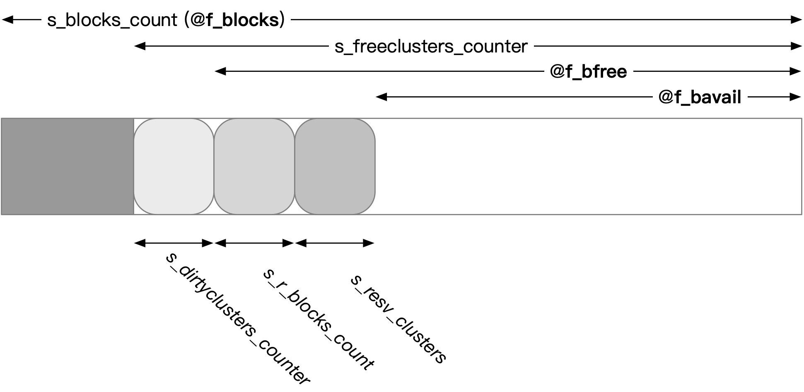

## df and du


### df

`df` 命令用于展示当前系统中所有 mount point 的信息，该命令会

- 读取 /proc/self/mountinfo 文件，获取当前系统中的所有 mount point
- 调用 statfs()/statvfs() 系统调用获取每个 mount point 的相关信息

```
Filesystem     Type     1K-blocks      Used Available Use% Mounted on
/dev/<dev>     ext4
```

df 的输出字段来自 statfs()/statvfs() 系统调用输出的 struct statfs

df field | struct statfs field
---- | ----
"Size"  | f_blocks
"Used"  | f_blocks - f_bfree
"Avail" | f_bavail

```c
struct statfs {
   fsblkcnt_t f_blocks;  /* Total data blocks in filesystem */
   fsblkcnt_t f_bfree;   /* Free blocks in filesystem */
   fsblkcnt_t f_bavail;  /* Free blocks available to
                            unprivileged user */
   ...
};
```




#### f_blocks

@f_blocks 描述文件系统的总大小，包括 data/metadata，在 ext4 中来自 disk superblock 的 @s_blocks_count_[low|hi] 字段

```sh
ext4_statfs
    f_blocks = s_blocks_count_hi/s_blocks_count_lo
```


#### f_bfree

@f_bfree 描述文件系统中可用的 free block 的数量，ext4 中使用 @s_freeclusters_counter/@s_dirtyclusters_counter 两个计数器来进行计算

```sh
ext4_statfs
    f_bfree = s_freeclusters_counter - s_dirtyclusters_counter
```


##### s_freeclusters_counter

@s_freeclusters_counter 是 memory version superblock 中维护的一个计数器，描述当前文件系统中尚未分配的 free block 的数量

```c
struct ext4_sb_info {
	struct percpu_counter s_freeclusters_counter;
	...
}
```

以 non-delayed allocation 为例，文件系统 mount 的时候，会遍历所有 block group，将所有 block group 的 @bg_free_blocks_count_[lo|hi] 字段相加汇总，得到 @s_freeclusters_counter 计数器的初始值

```sh
# init
s_freeclusters_counter is calculated from summing up each block group's bg_free_blocks_count_lo/bg_free_blocks_count_hi
```


write() 系统调用中会为文件分配 block，这一过程中就会将 @s_freeclusters_counter 计数器减去新分配的 block 的数量

```sh
# alloc block
f_ops->write_iter(), that is, ext4_file_write_iter
    __generic_file_write_iter
        generic_perform_write
            a_ops->write_begin(), that is, ext4_write_begin
                __block_write_begin
                    ext4_get_block
                        ext4_map_blocks
                            ext4_ext_map_blocks
                                ext4_mb_new_blocks // with ar->flags = 0
                                    ext4_mb_regular_allocator // allocate block by buddy system
                                    
                                    # if allocate succeed
                                    ext4_mb_mark_diskspace_used
                                        percpu_counter_sub(&sbi->s_freeclusters_counter, ac->ac_b_ex.fe_len); // sub newly allocated blocks                            
```


文件 truncate 过程中，就会将 @s_freeclusters_counter 计数器加上释放的 block 的数量

```sh
# free blocks
ext4_free_blocks
    percpu_counter_add(&sbi->s_freeclusters_counter, count_clusters) // add freed blocks
```


##### s_dirtyclusters_counter

@s_dirtyclusters_counter 也是 memory version superblock 中维护的一个计数器，描述当前文件系统中 delayed allocation 预留 (reserve) 的 block 的数量

```c
struct ext4_sb_info {
	struct percpu_counter s_dirtyclusters_counter;
	...
}
```

用户可以通过 `/sys/fs/ext4/<dev>/delayed_allocation_blocks` 获取 @s_dirtyclusters_counter 计数器的值


> reserve blocks

一般 write() 系统调用中，如果当前写入的数据超过文件的大小，就会为文件分配新的 block；而 delayed allocation 特性就是延迟 block 的分配，一直等到这些数据需要从 pagecache 下刷到磁盘的时候，才真正分配 block

因而 delayed allocation 中，在 buffer write() 系统调用过程中，并不会分配 block，只是将对应的 extent 添加到 extent status tree 中；此时虽然不会分配 block，但是需要预留相应数量的 block，比如说当前写入的 extent 的大小是 N 个 block，此时就需要预留 N 个 block

那么如何预留 block 呢？实际上就是将 @s_dirtyclusters_counter 计数器加上需要预留的 block 数量

```sh
# buffer write
f_ops->write_iter(), that is, ext4_file_write_iter
    __generic_file_write_iter
        generic_perform_write
            a_ops->write_begin(), that is, ext4_da_write_begin
                __block_write_begin
                    # for each block
                    ext4_da_get_block_prep
                        ext4_da_map_blocks
                            ext4_da_reserve_space
                                ext4_claim_free_clusters(..., 1, ...)
                                    percpu_counter_add(&sbi->s_dirtyclusters_counter, 1) // reserve one cluster
                                ei->i_reserved_data_blocks++
                                
                            ext4_es_insert_extent(..., EXTENT_STATUS_DELAYED) // insert a delayed extent status into extent status tree
                            set_buffer_delay(bh) // mark corresponding buffer_head delayed
```


为什么增加 @s_dirtyclusters_counter 计数器的值可以表示预留 block 呢？因为 delayed allocation 中，buffer write() 中在预留 block 的时候都会调用 ext4_has_free_clusters() 判断当前是否还有可以预留的 block，此时如果 @s_dirtyclusters_counter 计数器的值达到了 @s_freeclusters_counter 计数器的值，就表明当前没有可预留的 block 了

```sh
# buffer write
f_ops->write_iter(), that is, ext4_file_write_iter
    __generic_file_write_iter
        generic_perform_write
            a_ops->write_begin(), that is, ext4_da_write_begin
                __block_write_begin
                    # for each block
                    ext4_da_get_block_prep
                        ext4_da_map_blocks
                            ext4_da_reserve_space
                                ext4_claim_free_clusters(..., 1, ...)
                                    ext4_has_free_clusters
                                        if @s_freeclusters_counter >= @s_dirtyclusters_counter:
                                            return 1;
```


> alloc blocks

之前介绍过，由于 delayed allocation 的特性，等到 dirty pagecache 回写的时候，才会真正分配 block，此时就会相应地将 @s_dirtyclusters_counter 计数器的值减去当前分配的 block 的数量 (即之前预留的 block 的数量)

```sh
# alloc block
a_ops->writepages(), that is, ext4_writepages
    mpage_prepare_extent_to_map
        mpage_process_page_bufs
            mpage_add_bh_to_extent
                map->m_flags = bh->b_state & BH_FLAGS
            
    mpage_map_and_submit_extent
        mpage_map_one_extent
            # for delayed extent, get_blocks_flags |= EXT4_GET_BLOCKS_DELALLOC_RESERVE since it's marked with BH_Delay
            if map->m_flags & BIT(BH_Delay):
                get_blocks_flags |= EXT4_GET_BLOCKS_DELALLOC_RESERVE
            
            ext4_map_blocks(..., get_blocks_flags)
                ext4_ext_map_blocks
                    # ar.flags |= EXT4_MB_DELALLOC_RESERVED since EXT4_GET_BLOCKS_DELALLOC_RESERVE
                    ext4_mb_new_blocks(..., ar)
                    
                    allocated_clusters = ar.len
                    # since get_blocks_flags marked with EXT4_GET_BLOCKS_DELALLOC_RESERVE
                    ext4_da_update_reserve_space(..., allocated_clusters)
                        ei->i_reserved_data_blocks -= allocated_clusters
                        percpu_counter_sub(&sbi->s_dirtyclusters_counter, allocated_clusters)
```


##### i_reserved_data_blocks

另外值得注意的是，@s_dirtyclusters_counter 是 filesystem scope 的计数器，描述整个文件系统中由于 delayed allocation 而预留的 block 的数量

此外每个文件还维护有 @i_reserved_data_blocks 计数器，描述该文件由于 delayed allocation 而预留的 block 的数量

```c
struct ext4_inode_info {
	/* allocation reservation info for delalloc */
	/* In case of bigalloc, this refer to clusters rather than blocks */
	unsigned int i_reserved_data_blocks;
	...
}
```

与 @s_dirtyclusters_counter 计数器的更新保持一致，在 buffer write() 系统调用过程中，会将 @i_reserved_data_blocks 计数器加上当前新写入的数据需要占用的 block 数量，以表明预留相应数量的 block；之后等到 dirty pagecache 回写的时候，会真正地分配 block，并将 @s_dirtyclusters_counter 计数器的值减去当前分配的 block 的数量 (即之前预留的 block 的数量)


#### f_bavail

之前介绍过 @f_bfree 描述文件系统中 (privileged user, i.e., root) 可用的 free block 的数量，而 @f_bavail 则描述文件系统中 (unprivileged user) 可用的 free block 的数量

```sh
ext4_statfs
    f_bavail = f_bfree - s_r_blocks_count_[lo|hi] - s_resv_clusters
```


##### s_r_blocks_count

@s_r_blocks_count_[lo|hi] 计数器描述 (privileged user, i.e., root) 预留的 block 数量

用户在格式化文件系统的时候，可以通过 "mkfs -m reserved-blocks-percentage" 参数指定这一部分预留的 block 数量

> -m reserved-blocks-percentage
> Specify the percentage of the filesystem blocks reserved for the super-user. This avoids fragmentation, and allows root-owned daemons, such as syslogd(8), to continue to function correctly after non-privileged processes are prevented from writing to the filesystem. The default percentage is 5%.

```c
struct ext4_super_block {
	__le32	s_r_blocks_count_lo;    /* Reserved blocks count */
	__le32	s_r_blocks_count_hi;    /* Reserved blocks count */
	...
}
```


实际上 ext4_has_free_clusters() 的算法是

```sh
ext4_has_free_clusters
    if @s_freeclusters_counter >= (@s_dirtyclusters_counter + s_r_blocks_count):
        return 1;
        
    if capable(CAP_SYS_RESOURCE):
        if @s_freeclusters_counter >= @s_dirtyclusters_counter:
            return 1;
```

也就是说 @s_r_blocks_count 计数器描述的 block 只能用于 privileged user


##### s_resv_clusters

@s_resv_clusters 计数器描述文件系统自身预留的 block 数量，这些预留的 block 主要用于 free block 资源紧张时，应急用于 punch hole、converting unwritten extents in delalloc path 等情况下 metadata 的分配

```c
struct ext4_sb_info {
	atomic64_t s_resv_clusters;
	...
}
```

默认情况下，文件系统挂载的时候 @s_resv_clusters 会被设置为文件系统总大小 (@s_blocks_count) 的 2%，但是不能超过 4096

```sh
ext4_set_resv_clusters
    resv_clusters = @s_blocks_count
    resv_clusters /= 50
    resv_clusters = min_t(resv_clusters, 4096);
    atomic64_set(&sbi->s_resv_clusters, resv_clusters)
```

用户也可以通过 `/sys/fs/ext4/sda2/reserved_clusters` 手动设置 @s_resv_clusters 的值


实际上 ext4_has_free_clusters() 的算法是

```sh
ext4_has_free_clusters
    if @s_freeclusters_counter >= (@s_dirtyclusters_counter + s_r_blocks_count + @s_resv_clusters):
        return 1;
        
    if capable(CAP_SYS_RESOURCE):
        if @s_freeclusters_counter >= (@s_dirtyclusters_counter + @s_resv_clusters):
            return 1;
```

也就是说 @s_resv_clusters 计数器描述的 block 只能用于文件系统应急分配 metadata 用


### du

`du` 命令用于获取指定文件的大小即 disk usage

例如当执行 "du <dirA>" 时

- 首先对 <dirA> 执行 fstat() 系统调用以获取 <dirA> 本身的大小
- 对 <dirA> 执行 getdents() 系统调用获取 <dirA> 目录下的所有子文件，对于其下的每个子文件
    - 对于子目录，对其递归执行 fstat()、getdents() 系统调用，以获取该目录的大小，以及该目录下子文件的大小
    - 对于子文件，只对其执行 fstat() 系统调用 以获取该文件的大小

对于 "du -s" 命令，则是将该目录下所有文件的 fstat() 系统调用返回的结果相加汇总


du 默认使用 fstat() 返回的 struct stat 的 @st_blocks 字段，当指定 `du --apparent-size` 参数时，实际使用的是 struct stat 的 @st_size 字段

ls 实际使用 inode 的 @i_size 字段

```c
struct stat {
    off_t     st_size;    /* total size, in bytes */
    blkcnt_t  st_blocks;  /* number of 512B blocks allocated */
    ...
};
```

struct stat 的 @st_size 字段就来自 inode.i_size 字段，描述文件的大小，以字节为单位
struct stat 的 @st_blocks 字段就来自 inode.i_blocks 字段，描述该文件实际占用的 block 的数量


```c
struct inode {
	loff_t			i_size;
	blkcnt_t		i_blocks;
	...
}
```

之所以分别存储这两个字段，是因为一个文件的大小，以及该文件实际占用的 block 的数量，实际是两个概念

一种情况下，由于文件系统是以 block 为单位给文件分配存储空间的，因而当文件的大小不是以 block 对齐的话，那么 @i_blocks 描述的大小就会大于 @i_size 

例如当一个文件的内容只有一个字符时，那么这个文件的大小就是 1 字节，此时 @i_size 字段的值就是 1；但是文件系统中是以 block 为单位给文件分配存储空间的，因而此时虽然文件实际大小只有 1 字节，但是会为该文件分配一个 block，此时 @i_blocks 字段的值就是 1，如果 block size 是 1k，那么实际为该文件分配的存储空间就是 1k


另外一种情况下，对于 sparse 文件，也就是说当文件中存在 hole 时，@i_size 描述的大小就会大于 @i_blocks

例如当一个文件大小为 2* 4k，但是只在 offset 4096 处存储了一个字符，那么该文件实际上就存在 [0, 4095] 与 [4097, 8191] 两个 hole

此时文件的 @i_size 字段的值为 8192，即文件的大小为 2 * 4K，但是文件系统实际上只给该文件分配了一个 block 来存储唯一的一个字符，因而 @i_blocks 字段的值实际为 1

```
0                      4095                    8191
+------------------------+------+----------------+
|         hole           | char |                |
+------------------------+------+----------------+
```

```sh
# alloc block
f_ops->write_iter(), that is, ext4_file_write_iter
    __generic_file_write_iter
        generic_perform_write
            a_ops->write_begin(), that is, ext4_write_begin
                # allocate block here
            
            a_ops->write_end(), that is, ext4_write_end
                ext4_update_inode_size(..., newsize)
                    i_size_write(..., newsize) // update inode->i_size
                    ext4_update_i_disksize(..., newsize) // update ext4_inode_info->i_disksize
```


这里需要注意的是，fstat() 返回的 stat->blocks 是包含文件因为 delayed allocation 而预留的 block (即 @i_reserved_data_blocks) 的

```sh
# fstat() syscall
ext4_file_getattr
    ext4_getattr
        generic_fillattr
            stat->size = inode->i_size;
            stat->blocks = inode->i_blocks;
    stat->blocks += @i_reserved_data_blocks
```
