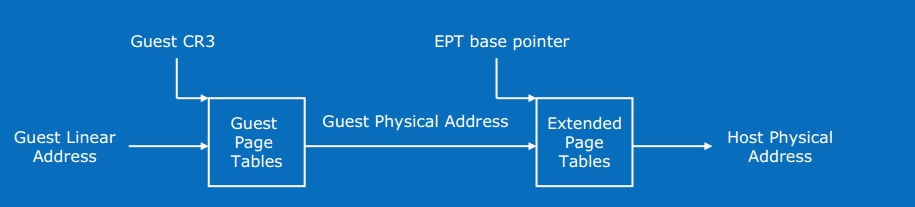
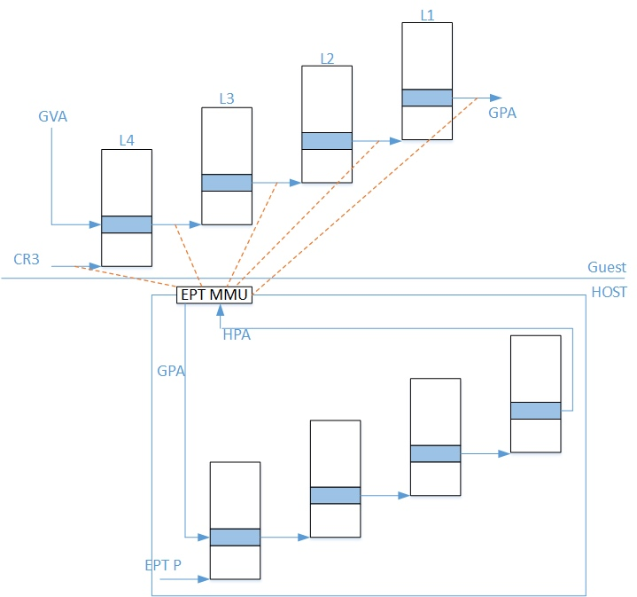
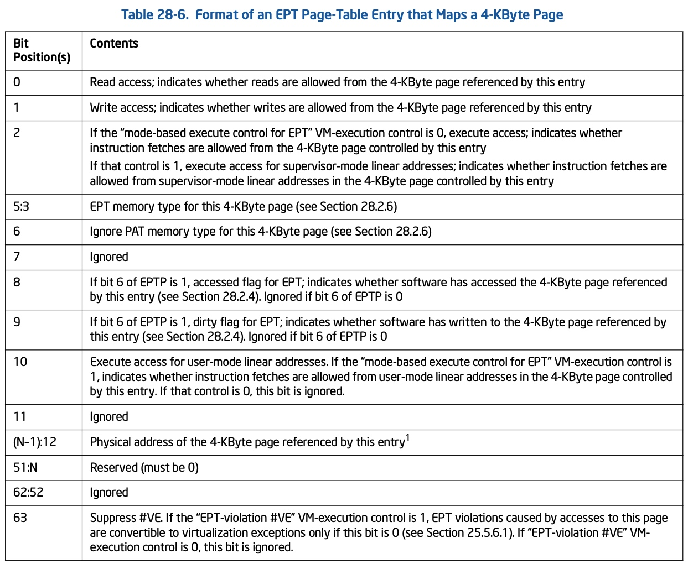
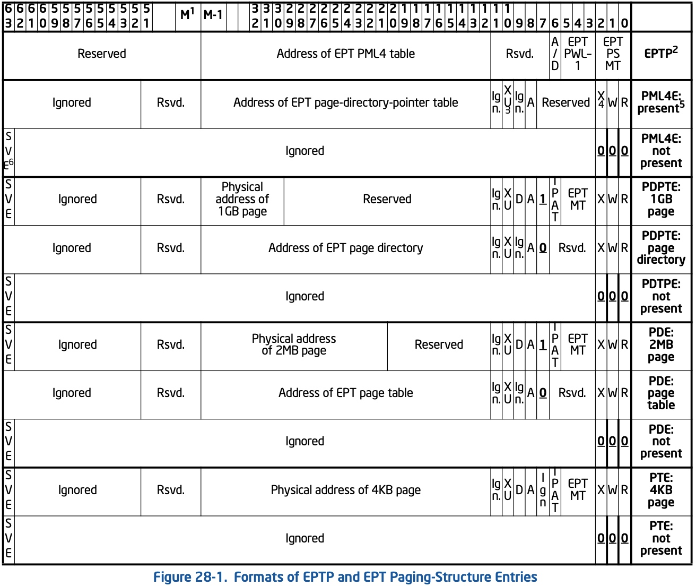

title:'Arch - x86 VMM'
## Arch - x86 VMM

Virtual Machine Monitor (VMM)

在开启虚拟化时，需要实现以下地址的翻译

- GVA (Guest Virtual Address)
- GPA (Guest Physical Address)
- HPA (Host Physical Address)




Intel 使用 Extended page table (EPT) 实现 GPA -> HPA 的翻译

此时 guest 中访问内存时，guest page table (CR3 指定其基地址) 负责 GVA -> GPA 的翻译，之后 EPT (extended-page-table pointer (EPTP) 寄存器指定其基地址) 负责 GPA -> HPA 的翻译



开启虚拟化的机器需要设置 "Enable EPT" bit，此时 EPT 才会实现 GPA -> HPA 的翻译

EPT 同样采用 4-level 结构，采用 GPA 的低 48 bits，翻译为 HPA


EPT entry 的格式为




EPT 在将 GPA 翻译为 HPA 的过程中，当发生以下情况时

- 对应的 table entry 不存在，即 table entry 的 bit 2:0 为 0
- 或者发生权限错误，table entry 的 bit 2:0 描述对应的地址区间是否有 read/write/execute 权限，如果当前的操作与该地址区间的权限相冲突

此时都会发生 EPT violations 并导致 VM exits




### Routine

#### qemu: register memory regions

qemu 需要通过 KVM_SET_USER_MEMORY_REGION ioctl 将自身分配的虚拟地址区间向 KVM 注册，这一段虚拟地址区间就称为一个 kvm_memory_slot，之后将用于 guest 作为内存使用

```c
struct kvm_memory_slot {
	gfn_t base_gfn;
	unsigned long npages;
	unsigned long userspace_addr;
	...
};
```

```
                    +-------+
                    |       |
                    |       |
                    |       |
                    |       |
                    |       |
  @userspace_addr   +-------+   @base_gfn
    (HOST)                       (GUEST)
```

@userspace_addr 是这一段虚拟地址区间的起始虚拟地址，即 HVA (host virtual address)
@npages 描述这一段虚拟地址区间的长度

@base_gfn 则是这一段虚拟地址区间对应在 guest 中作为内存区间时，这段内存区间的起始物理地址，即 GPA (guest physical address)，这一地址是由 qemu 自由指定的


#### KVM: init mmu

之后 qemu 通过 KVM_CREATE_VCPU ioctl 创建虚拟机的时候，会初始化 guest MMU

```sh
# KVM_CREATE_VCPU ioctl
kvm_vm_ioctl_create_vcpu
    kvm_arch_vcpu_create
        kvm_x86_vcpu_create, i.e., vmx_x86_ops->vcpu_create(), i.e., vmx_create_vcpu()
        kvm_init_mmu
            init_kvm_tdp_mmu
                context->page_fault = kvm_tdp_page_fault;
```


#### KVM: setup mmu

之后 qemu 开始运行虚拟机的时候，需要设置 guest MMU，其中重点关注 EPTP 与 guest CR3 的初始化

EPTP 寄存器存储 EPT table 的起始物理地址 (HPA)，这里只是分配了一个 page 作为 EPT，并使得 EPTP 指向这个新分配的 page；注意这里 EPT table 并没有初始化，同时这个 page 是通过 zeroed 分配的，因而 EPT table 初始状态是全 0

guest CR3 寄存器存储 guest page table 的起始物理地址 (GPA)，这里只是为 guest CR3 提供相应的存储空间，而不会初始化 guest CR3 寄存器的值；之后 guest kernel 初始化过程中，自己会创建 guest page table，并将其起始物理地址 (GPA) 写入 guest CR3

```sh
vcpu_enter_guest
    kvm_mmu_reload
        kvm_mmu_load
            mmu_alloc_direct_roots
                mmu->root_hpa = kvm_tdp_mmu_get_vcpu_root_hpa() // allocate one page (zeroed) for EPT
            kvm_mmu_load_pgd
                kvm_x86_load_mmu_pgd, i.e., vmx_x86_ops->load_mmu_pgd(), i.e., vmx_load_mmu_pgd()
                    # 1. setup EPTP register,
                    # pointing to former allocated one page for EPT
                    eptp = construct_eptp(vcpu, root_hpa, root_level);
                    vmcs_write64(EPT_POINTER, eptp);
                    
                    # 2. allocate guest's CR3 register,
                    # later guest kernel itself will make it point to guest page table
                    guest_cr3 = vcpu->arch.cr3;
                    vmcs_writel(GUEST_CR3, guest_cr3);
```


#### KVM: EPT violations

之后处理器硬件使用 EPT 将 GPA 翻译为 HPA 的过程中，由于 EPT entry 都为空，就会触发 EPT violations 并导致 VM exits

```c
static int (*kvm_vmx_exit_handlers[])(struct kvm_vcpu *vcpu) = {
	[EXIT_REASON_EPT_VIOLATION] = handle_ept_violation,
	...
}
```


##### 1. address translation

在对应的处理函数中，KVM 需要将触发 EPT violations 的 GPA 翻译为 HPA，主要分为以下两步进行

- GPA -> HVA

首先通过 qemu 之前注册的 kvm_memory_slot 将 GPA 翻译为对应的 HVA

```
hva = (gfn - @base_gfn) * PAGE_SIZE + @userspace_addr

                    +-------+
                    |       |
                    |       |
                    |       |
                    |       |
                    |       |
  @userspace_addr   +-------+   @base_gfn
    (HOST)                       (GUEST)
```


- HVA -> HPA

之后调用 hva_to_pfn() 将 HVA 翻译为对应的 HPA，其中就是在触发 EPT violations 的当前进程的进程地址空间 (current->mm) 中寻找当前 HVA 对应的 vma，在找到对应的 vma 之后，就能获取当前 HVA 对应的 struct page 结构，从而找到对应的 HPA

```sh
handle_ept_violation
    gpa = vmcs_read64(GUEST_PHYSICAL_ADDRESS);
    kvm_mmu_page_fault
        kvm_mmu_do_page_fault
            
            vcpu->arch.mmu->page_fault(), i.e., kvm_tdp_page_fault(..., gpa, ...)
                direct_page_fault
                    gfn = gpa >> PAGE_SHIFT // guest page frame number
                    
                    # calculate pfn according to gfn
                    try_async_pf(gfn, gpa, &pfn, &hva, ...)
                        slot = kvm_vcpu_gfn_to_memslot(..., gfn) // search kvm_memory_slot according to gfn
                        
                        __gfn_to_pfn_memslot
                            # 1. calculate host virtual address (@addr) according to kvm_memory_slot
                            addr = __gfn_to_hva_many(slot, gfn, ...)
                            
                            # 2. calculate host page frame number according to hva
                            pfn = hva_to_pfn(addr, ...)
                                hva_to_pfn_slow
                                    get_user_pages_unlocked(addr, 1, &page, ....)
                                        mm = current->mm;
                                        __get_user_pages(mm, start, ...)
                                            # find vma corresponding to @addr in current->mm
                                            # and then return page according to found vma                  
                                    *pfn = page_to_pfn(page)          
```


##### 2. set EPT entry

上述实现 GPA 到 HPA 的翻译之后，就需要将翻译后得到的 HPA 写入对应的 EPT entry

vcpu->arch.mmu->root_hpa 字段保存了 EPT table 的起始物理地址，在 EPT table 中找到 @gpa 对应的 EPT entry，之后就将该 @gpa 翻译得到的 @pfn 填入该 EPT entry 中

```sh
handle_ept_violation
    gpa = vmcs_read64(GUEST_PHYSICAL_ADDRESS);
    kvm_mmu_page_fault
        kvm_mmu_do_page_fault
            
            vcpu->arch.mmu->page_fault(), i.e., kvm_tdp_page_fault(..., gpa, ...)
                direct_page_fault
                    # 1. calculate pfn according to gfn
                    try_async_pf(gfn, gpa, &pfn, &hva, ...)
                    
                    # 2. fill @pfn into EPT entry
                    __direct_map(.., gpa, pfn, ...)
```


#### Guest: Address Translation

KVM 在填充好 EPT 之后，就会 VM enter 返回到 guest 中，此时 guest 再继续根据 EPT 找到当前触发 EPT violations 的 GPA 对应的 HPA

之后 guest 再根据 EPT 实现 GPA -> HPA 地址翻译的时候，由于之前 EPT 已经设置完成，因而此时不会再发生 VM exit，而是直接由 EPT 实现 GPA -> HPA 地址翻译

也就是说对于某个具体的 GPA -> HPA 地址翻译，只有 guest 第一次触发这一特定地址的翻译的时候，由于对应的 EPT entry 仍为空，所以会发生 EPT violations 并 VM exit，并由 host KVM 查找该 GPA 对应的 HPA，并填充到对应的 EPT entry 中；之后 guest 中再触发这一特定地址的翻译的时候，都是直接由 EPT 实现 GPA -> HPA 地址翻译
