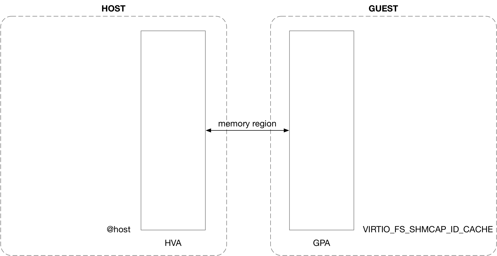
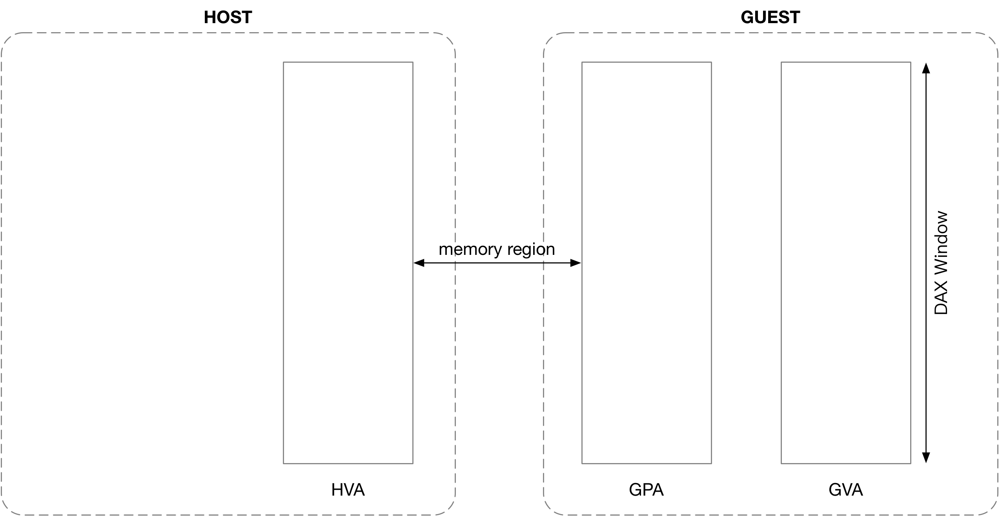
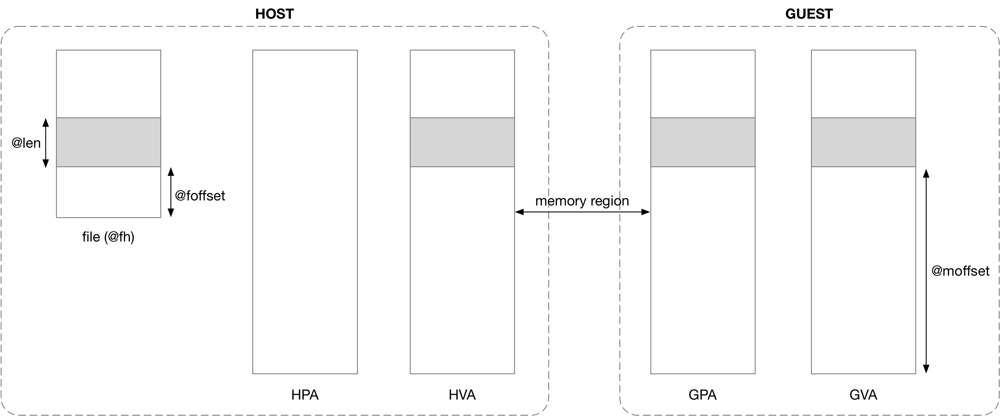
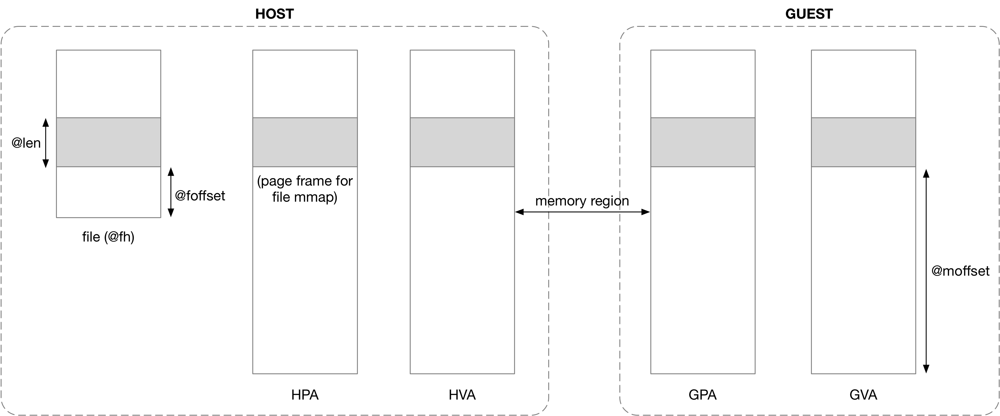
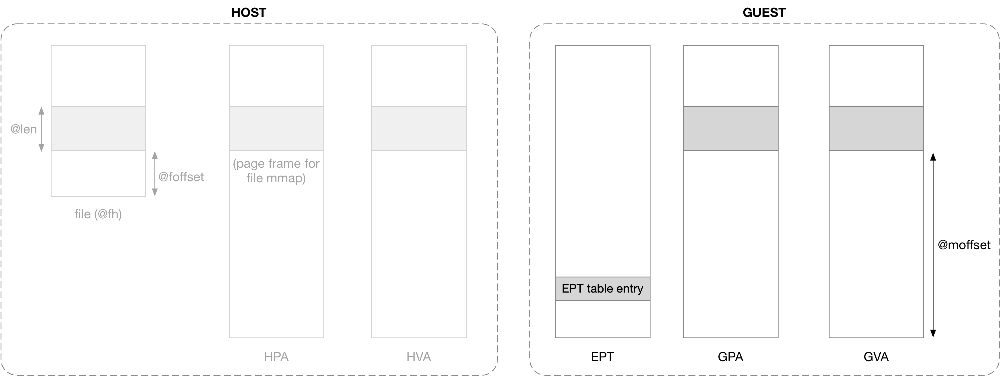

## virtiofs - DAX


### 1. Host: register memory region

qemu 创建虚拟机的过程中会执行 anonymous mmap() 分配一段虚拟地址空间，这段虚拟地址空间的起始虚拟地址就表示为 @host

```sh
# vhost-user-fs.c
# conf.cache_size is from "device vhost-user-fs-pci,tag=xxx,cache-size=xxx"

vuf_device_realize
    host = mmap(NULL, conf.cache_size, PROT_NONE, MAP_ANONYMOUS | MAP_PRIVATE, -1, 0);
    memory_region_init_ram_ptr(conf.cache_size, host, ...)
        ram_block_add
            ram_block_notify_add(host, size)
                
memory_listener_register
    listener_add_address_space
        kvm_region_add
            kvm_set_phys_mem
                kvm_set_user_memory_region
                    # KVM_SET_USER_MEMORY_REGION ioctl
```

之后 qemu 会调用 KVM_SET_USER_MEMORY_REGION ioctl 将上述 anonymous mmap() 申请分配的 HVA 地址区间与 qemu 分配给 guest 的一段 GPA 地址区间相映射

下图中 @host 就是 anonymous mmap() 的返回值，即分配的这一段虚拟地址空间的起始虚拟地址，对应的起始物理地址保存在 virtiofs 的 VIRTIO_FS_SHMCAP_ID_CACHE (0) shared memory region 中




### 2. Guest: remap DAX window

virtiofs 初始化过程中会通过 memremap 将 DAX window 对应的 GPA 映射为 GVA，这其中的逻辑主要是在 guest page table 中分配相应的 page table entry，以描述该映射关系

```sh
virtio_driver->probe(), i.e., virtio_fs_probe()
    virtio_fs_setup_dax
        # read shmid 0 (@addr, @len)
        virtio_get_shm_region(..., VIRTIO_FS_SHMCAP_ID_CACHE)
        
        fs->window_kaddr = devm_memremap_pages(...);
        fs->window_phys_addr = @addr;
```




### 3. Guest: FUSE_SETUPMAPPING

之后当 guest 向 virtiofsd 发送 FUSE_SETUPMAPPING 请求 (将 @fh 文件 @foffset 偏移处起始的 @len 长度的区间映射到 DAX window 中 @moffset 偏移处起始的区间) 的时候

```c
struct fuse_setupmapping_in {
	/* An already open handle */
	uint64_t	fh;
	/* Offset into the file to start the mapping */
	uint64_t	foffset;
	/* Length of mapping required */
	uint64_t	len;
	/* Flags, FUSE_SETUPMAPPING_FLAG_* */
	uint64_t	flags;
	/* Offset in Memory Window */
	uint64_t	moffset;
};
```

virtiofsd 会向 qemu 发送 vhost-user 协议中的 VHOST_USER_SLAVE_FS_MAP 消息，qemu 接收到该消息时，会执行 file mmap() 操作，将这个文件映射到之前 anonymous mmap() 分配的虚拟地址区间的相应偏移处

```sh
# receiving virtiofsd's VHOST_USER_SLAVE_FS_MAP
vhost_user_fs_slave_map
    mmap(@host + @moffset, @len, PROT_READ/PROT_WRITE, MAP_SHARED | MAP_FIXED, fd, @foffset)
```



需要注意的是，此时 host 上可能还没有为该 file mmap 分配对应的 page frame，即 HPA 地址空间中尚未分配对应的地址区间


### 4. KVM: EPT violations

之后 guest 访问 DAX window 的 GVA 时，guest page table 负责 GVA -> GPA 的地址翻译，之后在 x86 架构下，处理器硬件会自动通过 Extended page table (EPT) 实现 GPA -> HPA 的翻译

如果此时 guest 是第一次访问该 GVA，即 EPT 中对应的 table entry 为空，那么此时就会发生 EPT violations 并导致 VM exits，此时 host 上的 KVM 模块负责实现 GPA -> HPA 的地址翻译，主要执行以下两步操作

- 实现 GPA -> HPA 的地址翻译
- 将翻译后的 HPA 填充到 EPT 对应的 table entry 中




#### address translation

KVM 首先需要将触发 EPT violations 的 GPA 翻译为 HPA，主要分为以下两步进行

- GPA -> HVA

首先通过 qemu 之前注册的 memory region (kvm_memory_slot) 将 GPA 翻译为对应的 HVA


- HVA -> HPA

之后调用 hva_to_pfn() 将 HVA 翻译为对应的 HPA，其中就是在触发 EPT violations 的当前进程的进程地址空间 (current->mm) 中寻找当前 HVA 对应的 vma，在找到对应的 vma 之后，再通过 (当初执行 file mmap 的进程，即 qemu 的) process page table 找到当前 HVA 对应的 struct page 结构，从而找到对应的 HPA

这里需要注意的是，之前 virtiofsd 处理 FUSE_SETUPMAPPING 请求的时候，会向 host kernel 调用 file mmap，但是此时对应的 physical page frame 尚未分配，此时 EPT violations 中通过 process page table 寻找 HVA 对应的 HPA 的过程中，会手动触发 page fault 以为之前的 file mmap 分配对应的 physical page frame，也就是说 file mmap 对应的 physical page frame 分配会推迟到 EPT violations 进行

```sh
handle_ept_violation
    gpa = vmcs_read64(GUEST_PHYSICAL_ADDRESS);
    kvm_mmu_page_fault
        kvm_mmu_do_page_fault
            
            vcpu->arch.mmu->page_fault(), i.e., kvm_tdp_page_fault(..., gpa, ...)
                direct_page_fault
                    gfn = gpa >> PAGE_SHIFT // guest page frame number
                    
                    # calculate pfn according to gfn
                    try_async_pf(gfn, gpa, &pfn, &hva, ...)
                        slot = kvm_vcpu_gfn_to_memslot(..., gfn) // search kvm_memory_slot according to gfn
                        
                        __gfn_to_pfn_memslot
                            # 1. calculate host virtual address (@addr) according to kvm_memory_slot
                            addr = __gfn_to_hva_many(slot, gfn, ...)
                            
                            # 2. calculate host page frame number according to hva
                            pfn = hva_to_pfn(addr, ...)
                                hva_to_pfn_slow
                                    get_user_pages_unlocked(addr, 1, &page, ....)
                                        mm = current->mm;
                                        __get_user_pages(mm, start, ...)
                                            # find vma corresponding to @addr in current->mm
                                            
                                            # and then return page acoording to found vma
                                            page = follow_page_mask(vma, start, ...)
                                            # if page frame has not been allocated yet, trigger page fault
                                            # and allocate page frame for previous file mmap
                                            if !page:
                                                faultin_page(vma, start, ...)
                                                    handle_mm_fault
                                    *pfn = page_to_pfn(page)          
```


#### set EPT entry

上述实现 GPA 到 HPA 的翻译之后，就需要将翻译后得到的 HPA 写入对应的 EPT entry

vcpu->arch.mmu->root_hpa 字段保存了 EPT table 的起始物理地址，在 EPT table 中找到 @gpa 对应的 EPT entry，之后就将该 @gpa 翻译得到的 @pfn 填入该 EPT entry 中

```sh
handle_ept_violation
    gpa = vmcs_read64(GUEST_PHYSICAL_ADDRESS);
    kvm_mmu_page_fault
        kvm_mmu_do_page_fault
            
            vcpu->arch.mmu->page_fault(), i.e., kvm_tdp_page_fault(..., gpa, ...)
                direct_page_fault
                    # 1. calculate pfn according to gfn
                    try_async_pf(gfn, gpa, &pfn, &hva, ...)
                    
                    # 2. fill @pfn into EPT entry
                    __direct_map(.., gpa, pfn, ...)
```


### 5. Guest: Address Translation

KVM 在填充好 EPT 之后，就会 VM enter 返回到 guest 中，此时 guest 再继续根据 EPT 找到当前触发 EPT violations 的 GPA 对应的 HPA

之后 guest 再需要访问相应 GVA/GPA 的时候，由于对应的 EPT table entry 已经设置完成，此时就会直接由 EPT 实现 GPA -> HPA 地址翻译，而不会再触发 EPT violations


