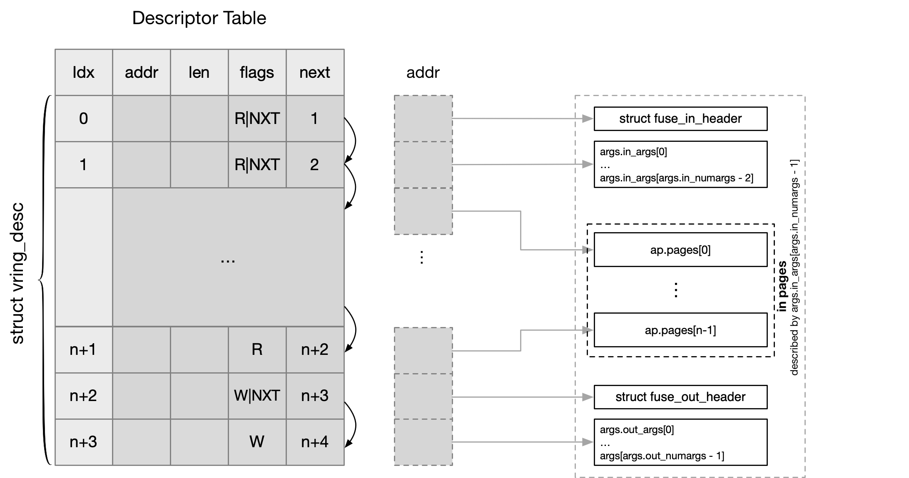

## FUSE Message


Filesystem in Userspace (FUSE) 是 server-client 模型，其中

- kernel 作为 client，user space daemon 作为 server，两者通过 /dev/fuse 通讯
- 或者对于 virtiofs 来说，guest kernel 作为 client，host daemon 作为 server，两者通过 virtio vring 通讯


FUSE 中典型的通讯模型为

```
client --[query]--> server --[reply]--> client 
```


### message prototype

FUSE 协议中 client/server 之间通过 message 进行通讯，通讯的发起方发送 FUSE request (请求)，之后对方回复 FUSE reply (回复)

FUSE Message (包括 FUSE request/FUSE reply) 的格式均为

```
+-----------+
|   heder   |
+-----------+
|   body    |
+-----------+
```

FUSE request 的头部为

```c
struct fuse_in_header {
	uint32_t	len;
	uint32_t	opcode;
	uint64_t	unique;
	uint64_t	nodeid;
	uint32_t	uid;
	uint32_t	gid;
	uint32_t	pid;
	uint32_t	padding;
};
```


FUSE reply 的头部为

```c
struct fuse_out_header {
	uint32_t	len;
	int32_t		error;
	uint64_t	unique;
};
```

body 部分则是 @opcode 特定的，@opcode 描述当前请求的类型

@unique 是一个用于唯一标识 FUSE request 的 ID，当前所有下发 (但尚未完成) 的 FUSE request 必须具有不同的 @unique

FUSE reply 与 FUSE request 必须具有相同的 @unique 字段，这样才能通过 @unique 字段，定位到当前的 FUSE reply 对应的 FUSE request


### send message

FUSE 文件系统中用于下发 FUSE request 的接口有以下两个

```c
int fuse_simple_background(struct fuse_mount *fm, struct fuse_args *args, gfp_t gfp_flags)
ssize_t fuse_simple_request(struct fuse_mount *fm, struct fuse_args *args)
```

调用者需要初始化传入的 struct fuse_args，以描述当前下发的 FUSE request 的相关信息

```c
struct fuse_args {
	uint64_t nodeid;
	uint32_t opcode;
	unsigned short in_numargs;
	unsigned short out_numargs;
	struct fuse_in_arg in_args[3];
	struct fuse_arg out_args[2];
	...
};
```

@opcode 描述了当前下发的 FUSE request 的类型，@nodeid 描述了当前需要对哪个文件 (inode) 执行操作，这个 nodeid 是 LOOKUP 操作过程中 FUSE server 提供的，因而其内部实现是 FUSE server specific 的


接下来的字段描述了 FUSE request 以及对应期待的 FUSE reply 的布局

由于目前 FUSE 协议中，FUSE request 的 body 部分最多包含 3 个不同的元素，FUSE reply 的 body 部分最多包含 2 个不同的元素，而对于某一个具体类型的 FUSE request/FUSE reply，其 body 部分用到的元素数量是不同的，因而 @in_numargs/@out_numargs 就分别描述了当前类型的信息实际用到的元素的数量


FUSE request 的布局为

```
                    args.in_args[0].size args.in_args[1].size args.in_args[2].size
                    <-------------------><------------------><------------------>
+-------------------+-------------------+-------------------+-------------------+
|   fuse_in_header  |       body        |       body        |       body        |
+-------------------+-------------------+-------------------+-------------------+
                    ^                   ^                   ^
                args.in_args[0].value  args.in_args[1].value args.in_args[2].value

```


FUSE reply 的布局为

```
                   args.out_args[0].size  args.out_args[1].size
                    <-------------------><------------------>
+-------------------+-------------------+-------------------+
|  fuse_out_header  |       body        |       body        |
+-------------------+-------------------+-------------------+
                    ^                   ^                   
                args.out_args[0].value  args.out_args[1].value

```


对应地，fuse_req 用于抽象一个 FUSE request 以及对应的 FUSE reply，每个 fuse_args 就用于初始化一个对应的 fuse_req

```c
struct fuse_req {
	/* Input/output arguments */
	struct fuse_args *args;

	/* The request input header */
	struct {
		struct fuse_in_header h;
	} in;

	/* The request output header */
	struct {
		struct fuse_out_header h;
	} out;
	...
};
```

@in/@out 就分别描述 FUSE request 以及对应的 FUSE reply 的头部


### data page

#### message body based

> write

如之前所述，FUSE request 的布局为

```
                    args.in_args[0].size args.in_args[1].size args.in_args[2].size
                    <-------------------><------------------><------------------>
+-------------------+-------------------+-------------------+-------------------+
|   fuse_in_header  |       body        |       body        |       body        |
+-------------------+-------------------+-------------------+-------------------+
                    ^                   ^                   ^
                args.in_args[0].value  args.in_args[1].value args.in_args[2].value

```

三个 body 中的第一个 body 通常存储 opcode specific 的 header，例如 fuse_ioctl_in，剩余的两个 body 可以用于直接传输其他需要传入的参数

```c
struct fuse_args {
	struct fuse_in_arg in_args[3];
	...
};
```

client 在下发 FUSE request 之前，可以通过设置 @in_args[] 参数，来描述 client 需要向 daemon 传递的其他参数

```
in_args[1].size =
in_args[1].value = 
fuse_simple_request(...)
```


```
memory topology in kernel:

args.in_args[0].value --->  +-------------------+ 
                            |       body0       | (struct fuse_ioctl_in)
                            +-------------------+
                            args.in_args[0].size

args.in_args[1].value --->  +-------------------+ 
                            |       body1       |
                            +-------------------+
                            args.in_args[1].size

args.in_args[2].value --->  +-------------------+ 
                            |       body2       |
                            +-------------------+
                            args.in_args[2].size
```

daemon 向 virtiofs 执行 read 操作的时候，就会将上述这些内存依次拷贝到用户态传入的缓存中，此时传入的用户态缓存中的布局为

```
memory topology in user's buffer:
+-------------------+-------------------+-------------------+-------------------+
|   fuse_in_header  |       body0       |       body1       |       body2       |
+-------------------+-------------------+-------------------+-------------------+
```

> read

类似地之前介绍过 FUSE reply 的布局为

```
                   args.out_args[0].size  args.out_args[1].size
                    <-------------------><------------------>
+-------------------+-------------------+-------------------+
|  fuse_out_header  |       body        |       body        |
+-------------------+-------------------+-------------------+
                    ^                   ^                   
                args.out_args[0].value  args.out_args[1].value

```

两个 body 中的第一个 body 通常存储 opcode specific 的 header，例如 fuse_ioctl_out，剩余的一个 body 可以用于直接传输 daemon 需要传入的其他参数

```c
struct fuse_args {
	struct fuse_arg out_args[2];
	...
};
```


client 在下发 FUSE request 之前，可以通过设置 @out_args[] 参数来描述需要从 daemon 读取的其他参数

```
out_args[1].size =
out_args[1].value = 
fuse_simple_request(...)
```


之后 daemon 在读取到数据后，需要将传入的用户态缓存的布局事先准备好

```
memory topology in user's buffer:
+-------------------+-------------------+-------------------+
|  fuse_out_header  |       body0       |       body1       |
+-------------------+-------------------+-------------------+
```

之后 daemon 对 virtiofs 执行 write 操作的时候，就会将上述用户态缓存中的内容依次拷贝到 @out_args[] 描述的内核缓存中

```
memory topology in kernel:

args.out_args[0].value ---> +-------------------+ 
                            |       body0       | (buffer prepared for struct fuse_ioctl_out)
                            +-------------------+
                            args.out_args[0].size

args.out_args[1].value ---> +-------------------+ 
                            |       body1       |
                            +-------------------+
                            args.out_args[1].size

```


#### iovec based

FUSE message 中可用的 body slot 的数量终归是有限的，即 write 的时候连带 header 只有三个 body slot 可用，read 的时候连带 header 只有两个 body slot 可用；如果需要传递的 buffer segment 的数量超过了这些 body slot 的数量，此时就需要用 iovec 来描述需要传递的 buffer segment

此时使用 struct fuse_args_pages 来替代原先的 struct fuse_args 来描述相关的参数

```c
struct fuse_args_pages {
	struct fuse_args args;
	struct page **pages;
	struct fuse_page_desc *descs;
	unsigned int num_pages;
};
```


> write

对 FUSE 挂载的文件系统执行 write 类型的系统调用时，

@in_numargs 仍然描述 in args 的数量，只是前面的几个 in args 仍然通过以下方式由 message body 指定

```
in_args[0].size =
in_args[0].value = 
```

其他所有需要传入的数据则是整合为一个 in arg，此时内核会分配足够数量的 page，并将所有这些需要传入的数据 (包括传入的用户态缓存中的数据) 全部拷贝到这些分配的 page 中；此时 @in_numargs 中的最后一个 in arg 就描述这个整合的 in arg

```
ap.args.in_args[ap.args.in_numargs - 1].size = in_size;
ap.args.in_pages = true;
```

此时使用 struct fuse_args_pages 描述相关的参数，@num_pages 描述实际分配的 page 的数量，@in_size 描述这些 page 中所有有效数据（即用户需要写入的数据）的大小；需要注意的是，用户对 FUSE 挂载的文件系统执行 write 类型的系统调用时，可能会传入多个不连续的 buffer segment，这些 buffer segment 中的数据会全部拷贝到分配的 page 中，此时来自多个 buffer segment 的内容可能会拷贝到同一个 page 中

```
memory topology in kernel:

                +---------------+---------------+
                |               |               |
                |               |               |
                |               |               |
                |     page0     |     page1     |
                |               |               |
                |               |               |
                +---------------+---------------+
                        ^               ^ 
                        |               |
ap.pages[] ---> +---------------+---------------+
                | struct page * | struct page * |
                +---------------+---------------+


```

之后 daemon 对 virtiofs 执行 read 操作的时候，就会将上述这些内存依次拷贝到用户态传入的缓存中，此时传入的用户态缓存中的布局为

```sh
fuse_dev_read
    fuse_dev_do_read
        fuse_copy_args
            fuse_copy_pages
                struct fuse_args_pages *ap = container_of(req->args, ...)
                for each page in @ap.pages[]
                    # copy content of page to user's buffer
```

```
memory topology in user's buffer:
+-------------------+-------------------+-------------------+-------------------+
|   fuse_in_header  |       body0       |       page0       |       page1       |
+-------------------+-------------------+-------------------+-------------------+
```


> read

类似地，对 FUSE 挂载的文件系统执行 read 类型的系统调用时，内核会分配足够数量的 page

@out_numargs 仍然描述 out args 的数量，只是前面的几个 out args 仍然通过以下方式由 message body 指定

```
out_args[0].size =
out_args[0].value = 
```

@out_numargs 中的最后一个 out arg 则描述这个整合的 out arg

```
ap.args.out_args[ap.args.out_numargs - 1].size = out_size;
ap.args.out_pages = true;
```

```
memory topology in kernel:

                +---------------+---------------+
                |               |               |
                |               |               |
                |               |               |
                |     page0     |     page1     |
                |               |               |
                |               |               |
                +---------------+---------------+
                        ^               ^ 
                        |               |
ap.pages[] ---> +---------------+---------------+
                | struct page * | struct page * |
                +---------------+---------------+
```


之后 daemon 在读取到数据后，需要将传入的用户态缓存的布局事先准备好

```
memory topology in user's buffer:
+-------------------+-------------------+-------------------+-------------------+
|  fuse_out_header  |       body0       |       page0       |       page1       |
+-------------------+-------------------+-------------------+-------------------+
```

之后 daemon 对 virtiofs 执行 write 操作的时候，就会将上述用户态缓存中的内容依次拷贝到 @out_args[] 描述的内核缓存中

```sh
fuse_dev_write
    fuse_dev_do_write
        copy_out_args
            fuse_copy_args
                fuse_copy_pages
                    struct fuse_args_pages *ap = container_of(req->args, ...)
                    for each page in @ap.pages[]
                        # copy content in user's buffer to page
```

```
memory topology in kernel:

                +---------------+---------------+
                |               |               |
                |               |               |
                |               |               |
                |     page0     |     page1     |
                |               |               |
                |               |               |
                +---------------+---------------+
                        ^               ^ 
                        |               |
ap.pages[] ---> +---------------+---------------+
                | struct page * | struct page * |
                +---------------+---------------+
```


### virtiofs request

如下图所示是 write 时对应的 virtio request 的布局



如果该 write 请求需要写入 n 个 page，那么该请求就需要消耗 Descriptor Table 中的 (n+4) 个描述符

- FUSE request 的头部，即 struct fuse_in_header，对应一个描述符
- 其后内嵌在 message body 中的所有 in arg 共同对应一个描述符
- 其后每个需要写入的 page 都对应一个描述符
- FUSE reply 的头部，即 struct fuse_out_header，对应一个描述符
- 其后内嵌在 message body 中的所有 out arg 共同对应一个描述符


类似地，下图所示是 read 时对应的 virtio request 的布局


如果该 read 请求需要读取 n 个 page，那么该请求就需要消耗 Descriptor Table 中的 (n+4) 个描述符

- FUSE request 的头部，即 struct fuse_in_header，对应一个描述符
- 其后内嵌在 message body 中的所有 in arg 共同对应一个描述符
- FUSE reply 的头部，即 struct fuse_out_header，对应一个描述符
- 其后内嵌在 message body 中的所有 out arg 共同对应一个描述符
- 其后每个需要读取的 page 都对应一个描述符
