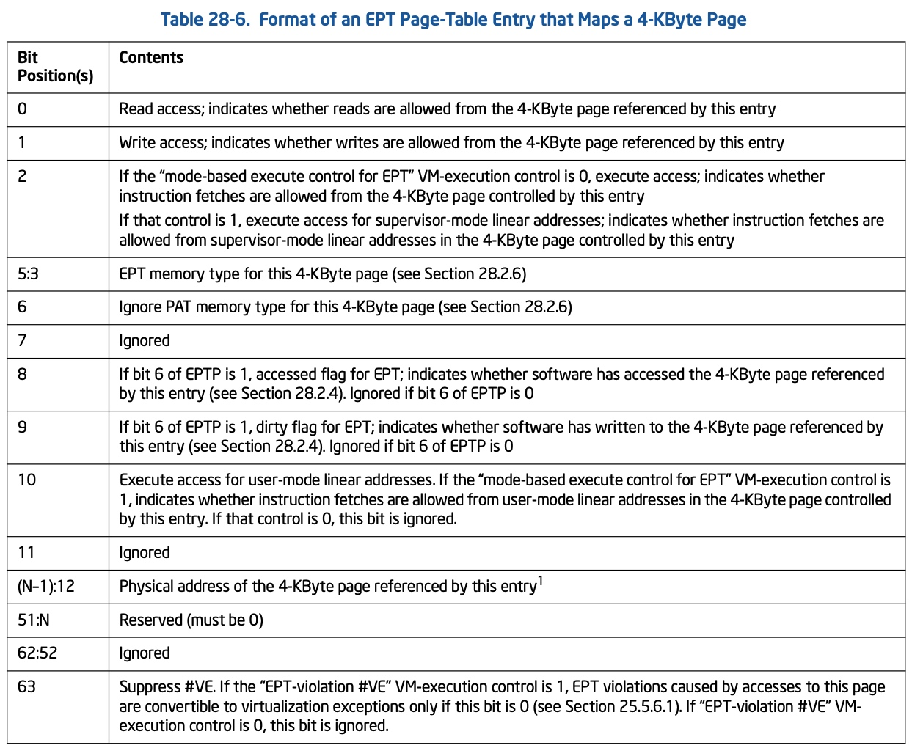
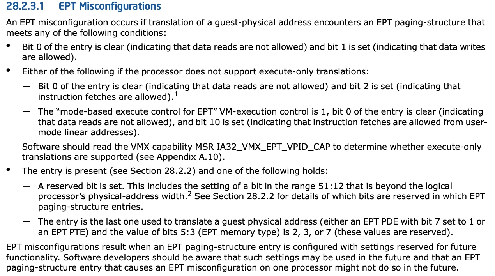

## Arch - Virtual MMIO

之前介绍过 Intel 使用 Extended page table (EPT) 来实现 GPA -> HPA 的翻译，而实际上设备的 MMIO (Memory Mapped IO Address Space) 也是通过 EPT 来进行翻译的，因为 MMIO 本质上也是一段物理地址空间，由 EPT 来实现 GPA -> HPA 的翻译


### qemu: register MMIO regions

之前介绍过，虚拟机初始化的时候 qemu 会通过 KVM_SET_USER_MEMORY_REGION ioctl 将 RAM 内存的地址空间向 KVM 注册，qemu 会将自身分配的一段虚拟地址区间作为 guest 的内存使用，这一段虚拟地址区间就称为一个 kvm_memory_slot

类似地，设备初始化过程中也需要配置设备的 MMIO 地址空间，只是此时并不会调用 KVM_SET_USER_MEMORY_REGION ioctl 向 KVM 注册

```sh
.device_plugged(), i.e. virtio_pci_device_plugged()
    virtio_pci_modern_regions_init
        memory_region_init_io(MemoryRegion *mr, MemoryRegionOps *ops, ...)
```

```sh
.listener.region_add(), i.e. kvm_region_add()
    kvm_set_phys_mem
        if (!memory_region_is_ram(mr)) {
                if (writeable || !kvm_readonly_mem_allowed) {
                    return;  // return directly
                } else ...
        }
        
        # skip following ops
        kvm_set_user_memory_region
            kvm_vm_ioctl(KVM_SET_USER_MEMORY_REGION, ...)
```


### KVM: EPT violations

之后当 guest 第一次访问设备的 MMIO 地址空间时，在使用 EPT 将 GPA 翻译为 HPA 的过程中，由于 EPT entry 都为空，就会触发 EPT violations (VM exits)

```c
static int (*kvm_vmx_exit_handlers[])(struct kvm_vcpu *vcpu) = {
	[EXIT_REASON_EPT_VIOLATION] = handle_ept_violation,
	...
}
```


> 1. address translation

在对应的处理函数中，KVM 首先需要将触发 EPT violations 的 GPA 翻译为 HPA

首先通过 qemu 之前注册的 kvm_memory_slot 将 GPA 翻译为对应的 HVA，但是由于当初 qemu 并没有为 MMIO 类型的地址空间调用 KVM_SET_USER_MEMORY_REGION ioctl 注册对应的 kvm_memory_slot，因而此时实际上是找不到对应的 kvm_memory_slot 的，最终翻译的 HPA 为 KVM_PFN_NOSLOT

```sh
handle_ept_violation
    gpa = vmcs_read64(GUEST_PHYSICAL_ADDRESS);
    kvm_mmu_page_fault
        kvm_mmu_do_page_fault
            vcpu->arch.mmu->page_fault(), i.e., kvm_tdp_page_fault(..., gpa, ...)
                direct_page_fault
                    gfn = gpa >> PAGE_SHIFT // guest page frame number
                    
                    # calculate pfn according to gfn
                    try_async_pf(gfn, gpa, &pfn, &hva, ...)
                        slot = kvm_vcpu_gfn_to_memslot(..., gfn) // returned @slot is actually NULL
                        if !kvm_is_visible_memslot(slot):
                            *pfn = KVM_PFN_NOSLOT;
```


> 2. set EPT entry

接下俩就需要将翻译后的 HPA，即 KVM_PFN_NOSLOT 写入对应的 EPT entry，这里对于 KVM_PFN_NOSLOT 类型的 EPT entry，写入的值实际上是 (KVM_PFN_NOSLOT | @shadow_mmio_value)

```sh
handle_ept_violation
    gpa = vmcs_read64(GUEST_PHYSICAL_ADDRESS);
    kvm_mmu_page_fault
        kvm_mmu_do_page_fault
            vcpu->arch.mmu->page_fault(), i.e., kvm_tdp_page_fault(..., gpa, ...)
                direct_page_fault
                    # 1. calculate pfn according to gfn
                    try_async_pf(gfn, gpa, &pfn, &hva, ...)
                    
                    __direct_map
                        mmu_set_spte
                            if is_noslot_pfn(pfn):
                                mark_mmio_spte
                                    make_mmio_spte
                                        spte |= shadow_mmio_value
                                        spte |= gpa
```


@shadow_mmio_value 是一个全局变量，其初始值在 KVM 模块初始化的时候，被设置为 VMX_EPT_MISCONFIG_WX_VALUE，即 0b'110

```sh
kvm_init
    kvm_arch_hardware_setup
        hardware_setup
            kvm_mmu_set_ept_masks
                @shadow_mmio_value = VMX_EPT_MISCONFIG_WX_VALUE
```


EPT entry 的格式为



因而 VMX_EPT_MISCONFIG_WX_VALUE 实际上是将 MMIO 对应的 EPT entry 的

- bit 0, Read access 为 0，即不具有 read 权限
- bit 1, Write access 为 1，即具有 write 权限
- bit 2, Execute 为 1，即具有 execute 权限

也就是说将 MMIO 对应的 EPT entry 设置为，具有 write/execute 权限，但不具有 read 权限


### KVM: EPT Misconfigurations (Pre)

KVM 在填充好上述 EPT (KVM_PFN_NOSLOT | @shadow_mmio_value) 之后，就会 VM enter 返回到 guest 中，此时 guest 再继续根据 EPT 执行地址翻译，此时由于 EPT entry 显示对应的地址空间具有 write 权限、但不具有 read 权限，就会再次触发 EPT Misconfigurations (VM EXit)



```c
static int (*kvm_vmx_exit_handlers[])(struct kvm_vcpu *vcpu) = {
	[EXIT_REASON_EPT_MISCONFIG] = handle_ept_misconfig,
	...
}
```

EPT Misconfigurations 中首先找到当前触发 VM EXit 的 MMIO 地址空间对应的 kvm_io_device 的 write() 回调函数

```sh
handle_ept_misconfig
    kvm_mmu_page_fault
        x86_emulate_instruction
            x86_emulate_insn
                writeback
                    segmented_write
                        ctxt->ops->write_emulated(), i.e. emulator_write_emulated()
                            emulator_read_write
                                emulator_read_write_onepage
                                    ops->read_write_mmio(), i.e. write_mmio()
                                        vcpu_mmio_write
                                            kvm_iodevice_write
                                                dev->ops->write(), i.e. ioeventfd_write()
```


### qemu: register eventfd

在继续介绍 EPT Misconfigurations 之前，需要介绍 qemu 注册的 eventfd

qemu 的本质需求是拦截 guest 的 MMIO 访问，当 guest 访问 MMIO 从而触发 VM Exit 的时候，就需要调用 qemu 注册的 hook 来处理 guest 的这个 MMIO 访问

因而 qemu 通过 struct kvm_ioeventfd 来描述设备的 MMIO 地址空间 (@addr, @addr+@len)，以及对应的 event fd

设备初始化的时候，guest 中 virtio 设备 probe 过程中会对配置空间中的 VIRTIO_PCI_STATUS 寄存器进行写操作，同样这个操作会触发 EPT Misconfigurations (VM Exit)，此时 qemu 会通过 KVM_IOEVENTFD ioctl 向内核注册该设备的 MMIO 地址空间对应的 struct kvm_ioeventfd

```sh
# guest
virtio_pci_probe
    virtblk_probe
        virtio_device_ready
            config->set_status(dev, status | VIRTIO_CONFIG_S_DRIVER_OK), i.e. vp_set_status() // write VIRTIO_PCI_STATUS register


# qemu
virtio_pci_config_ops.write(), i.e. virtio_pci_config_write()
    virtio_ioport_write
        virtio_pci_start_ioeventfd
            virtio_bus_start_ioeventfd
                VirtioDeviceClass.start_ioeventfd(), i.e. virtio_device_start_ioeventfd_impl()
                    virtio_bus_set_host_notifier
                        event_notifier_init
                            e->rfd = e->wfd = eventfd() // create eventfd
                        
                        VirtioBusClass.ioeventfd_assign(), i.e. virtio_pci_ioeventfd_assign()
                            memory_region_add_eventfd
                                memory_region_transaction_commit
                                    address_space_update_ioeventfds
                                        address_space_add_del_ioeventfds
                                            # call MemoryListener.eventfd_add(), i.e. kvm_io_ioeventfd_add()
                                                fd = e->rfd
                                                kvm_io_ioeventfd_add(fd, ...)
                                                    kvm_set_ioeventfd_pio(fd, ...)
                                                        struct kvm_ioeventfd kick = {
                                                            .addr = addr,
                                                            .len = size,
                                                            .fd = fd,
                                                            ...
                                                        }
                                                        kvm_vm_ioctl(..., KVM_IOEVENTFD, &kick)
```


需要注意的是，KVM_IOEVENTFD ioctl 中设备的这段 MMIO 地址空间对应的 kvm_io_device_ops 为 ioeventfd_ops

```sh
# KVM_IOEVENTFD ioctl
kvm_vm_ioctl(..., KVM_IOEVENTFD, ...)
    kvm_ioeventfd
        kvm_assign_ioeventfd_idx
            kvm_iodevice_init
                kvm_io_device->ops = ioeventfd_ops
            kvm_io_bus_register_dev // register kvm_io_device
```


### KVM: EPT Misconfigurations (Post)

回到 EPT Misconfigurations，KVM 在找到当前触发 VM EXit 的 MMIO 地址空间对应的 kvm_io_device 之后，调用对应的 write() 回调函数

之前介绍过，qemu 通过 KVM_IOEVENTFD ioctl 注册的 kvm_io_device_ops 为 ioeventfd_ops，对应的 write() 回调函数为 ioeventfd_write()，其中就会写对应的 eventfd 以通知睡眠等待的 qemu 进程

```sh
# EPT Misconfigurations
handle_ept_misconfig
    ...
    dev->ops->write(), i.e. ioeventfd_ops->write(), i.e. ioeventfd_write()
        eventfd_signal
            wake_up_locked_poll(&ctx->wqh, EPOLLIN) // wake up
```


qemu 中则有进程对 eventfd 进行 poll 轮询，当 KVM 捕捉到 EPT Misconfigurations 并写 eventfd 的时候，qemu 中的进程就会被唤醒，并调用该设备注册的 MemoryRegionOps 的 write() 回调函数

```sh
virtio_queue_host_notifier_aio_read
    if event_notifier_test_and_clear:
        virtio_queue_notify_aio_vq
            ...
            MemoryRegionOps->write(), e.g. virtio_pci_notify_write()
```


