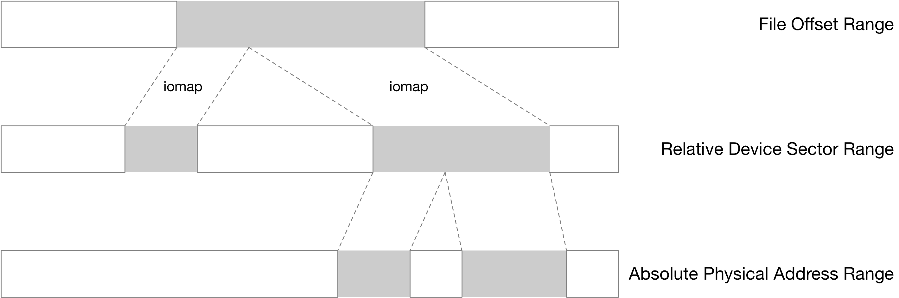
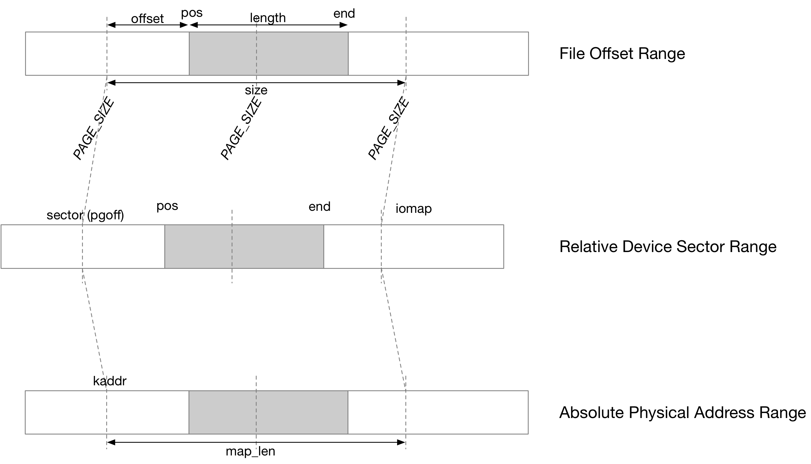

title:'3 DAX - fsdax - Read/Write'
## 3 DAX - fsdax - Read/Write


DAX 模式下文件的 read()/write() 通常实现为 dax_iomap_rw()

```c
ssize_t
dax_iomap_rw(struct kiocb *iocb, struct iov_iter *iter,
		const struct iomap_ops *ops)
```

dax_iomap_rw() 描述将 @iocb->ki_filp 文件的 (@iocb->ki_pos, @iter->count) 描述的 file range 中的数据，传输到 @iter 描述的缓存中


### two loop structure



DAX 需要实现三个地址区间的翻译

1. file range -> sector range

首先需要将相对于文件的偏移，翻译为相对于 DAX 设备的 sector 地址区间，这里会走 iomap 框架，各个文件系统具有各自的实现来实现这一地址翻译，例如 ext4 中是通过 extent 实现的，因而文件系统在调用 dax_iomap_rw() 时需要传入各自的 iomap_ops

这里需要注意的是，一个连续的 file range 区间可能映射为多个 sector range 区间，因而 dax_iomap_rw() 中存在循环结构，iomap_iter() 获取该 file range 映射的下一个 sector range 区间，dax_iomap_iter() 就处理这个 sector range 区间

```sh
dax_iomap_rw
    while (iomap_iter(&iomi, ops) > 0):
        dax_iomap_iter(&iomi, iter);
```


2. sector range -> physical address range

接下来需要将相对于 DAX 设备的 sector 地址区间，翻译为相对于整个系统的物理地址区间，之后将这个物理地址转换为对应的虚拟地址，CPU 通过这个虚拟地址就可以以内存访问的形式，访问 DAX 设备的存储区间

这里同样需要注意的是，一个连续的 sector range 区间可能映射为多个 physical address range 区间，例如 virtiofs DAX 中整个 DAX 设备的 physical address range 区间实际上是划分为 2M 大小的 chunk

因而 dax_iomap_iter() 中也存在循环结构，每个循环结构就处理一个 physical address range 区间

```sh
dax_iomap_iter
    while ... :
        # memcpy
```


### physical address translation

dax_iomap_iter() 负责将相对于 DAX 设备的 sector 地址区间，翻译为相对于整个系统的物理地址区间，下图为 dax_iomap_iter() 的图示



首先将 (pos, length) 描述的 file range 区间按照 PAGE_SIZE 对齐，映射为 (pgoff, size) 描述的 sector range 区间

之后调用 dax_direct_access() 将上述 sector range 区间翻译为对应的 physical address range 区间

其中将 sector range 区间中的 @pgoff 地址翻译为对应的 physical address，并将对应的 virtual address 保存在传入的 @kaddr 参数中，对应的 pfn 保存在传入的 @pfn 参数中

dax_direct_access() 函数的返回值描述映射的 physical address range 区间中，从 kaddr 开始、到区间末尾的这一段长度，即可用的 physical address range 区间的长度，但是不会超过传入的需要映射的 sector range 区间的长度，即 @size

```c
long dax_direct_access(struct dax_device *dax_dev, pgoff_t pgoff, long nr_pages,
		void **kaddr, pfn_t *pfn)
```


以上 sector range 区间到对应的 physical address range 区间的翻译，实际上是调用 dax_ops->direct_access() 回调函数完成的


### memcpy data

在获取到 @kaddr 虚拟地址之后，就可以以内存访问的形式，直接访问 DAX 设备的对应存储区间

这里会调用 dax_ops 的 copy_from_iter()/copy_to_iter() 回调函数实现数据拷贝，但通常只是实现为 memcpy()

```sh
dax_iomap_rw
    iomap_iter
        iomap_ops->iomap_begin() // calculate: file range -> sector range
    dax_iomap_iter
        dax_direct_access
            dax_ops->direct_access() //calculate: sector range -> absolute virtual address

            for WRITE:
                dax_ops->copy_from_iter() // memcpy: from iovec to device
            for READ:
                dax_ops->copy_to_iter() // memcpy: from device to iovec
```


### writeback

DAX 模式下也需要执行 writeback 操作，即需要将处理器缓存中的数据下刷到 NVDIMM

如果用户是通过 write() 系统调用的方式访问文件的，那么每次 write() 过程中，在写入数据之后就会立即执行 cache line flush 操作，这样之后文件 (通过 a_ops->writepages()) 执行 writeback 的时候，就不需要再做 flush 操作

```sh
dax_iomap_rw
    iomap_iter
        iomap_ops->iomap_begin() // calculate: file range -> sector range
    dax_iomap_iter
        dax_direct_access
            dax_ops->direct_access() //calculate: sector range -> absolute virtual address

            for WRITE:
                dax_ops->copy_from_iter() // memcpy: from iovec to device
```

write() 过程中，实际上是调用 dax_ops 的 copy_from_iter() 回调函数实现数据拷贝的；以 NVDIMM 为例，可以看到在执行 write() 的过程中，在写入数据之后就会同步地执行 cache line flush 操作

```sh
dax_ops->copy_from_iter(), e.g. pmem_copy_from_iter()
    _copy_from_iter_flushcache
        memcpy_flushcache
```


此时不会往文件的 address space 插入任何的 mapping entry，也就是说此时文件的 address space 实际是空的，之后文件 (通过 a_ops->writepages()) 执行 writeback 的时候，不会再做 flush 操作

