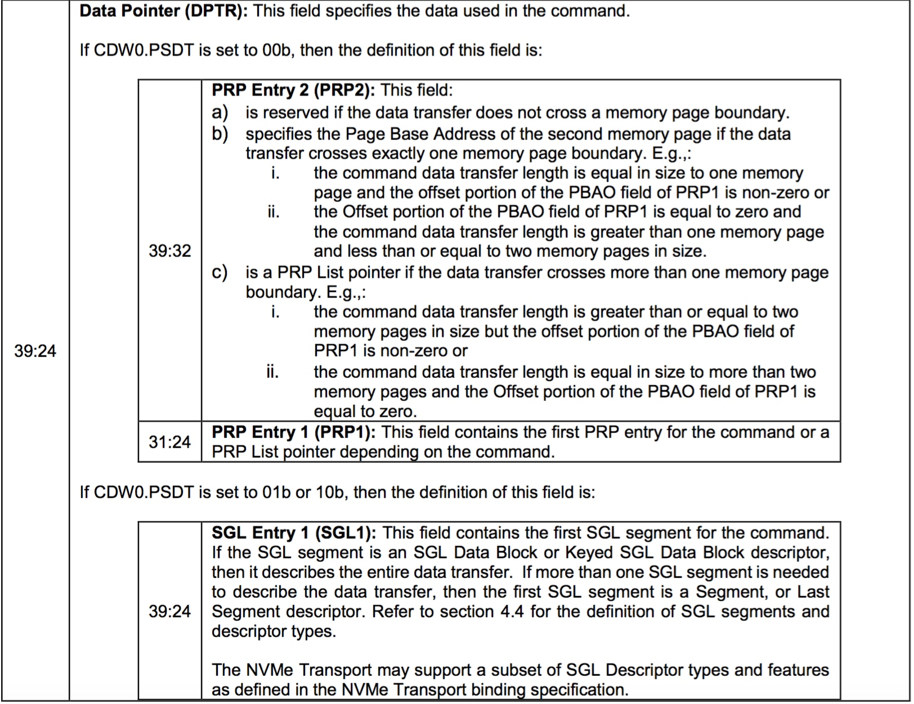

## NVMe - DPTR

command 的 DPTR (Data Pointer) 字段描述需要传输的数据缓冲区，NVMe 中可以使用两种方式描述数据缓冲区，即 PRP (Physical Region Page) 与 SGL (Scatter Gather List)

identify controller 命令返回的 identify data 描述了设备的相关特性，其中的 SGLS (SGL Support) 字段的 bit [1:0] 描述了该设备是否支持 SGL

- bit [1:0] 为 0 表示设备不支持 SGL 特性
- bit [1:0] 为 1 或 2 表示设备支持 SGL 特性

而即使设备支持 SGL 特性

- 对于 NVMe over PCIe，Admin command 必须使用 PRP 格式，IO command 是使用 PRP 还是 SGL，则可以由上层软件，例如内核自行决定
- 对于 NVMe over Fabric，Admin command 和 IO command 都必须使用 SGL 格式

此时 CDW0 (Command DWord0，即 command 的第一个 32 bit) 的 PSDT (PRP or SGL for Data Transfer) 字段 (CDW0[15:14]) 描述当前 command 的 DPTR 是使用 PRP 还是 SGL

- DW0[15:14] = 0b00，表示 DPTR 使用 PRP 格式
- DW0[15:14] = 0b01，表示 DPTR 使用 SGL 格式

### Physical Region Page (PRP)

在 physical region page (PRP) 机制下，每个 PRP entry 只能描述一个 page 中一块连续的内存区间，当 command 需要的数据缓冲区的大小超过一个 page、或者包含多个不连续的 segment 的时候，就需要多个 PRP entry 来描述，此时所有这些 PRP entry 共同组成一个 PRP list

#### PRP entry format

一个 PRP entry 描述一个 page 中一块连续的内存区间，因而它实际上就描述一个 page (或 page 的一部分)，其格式为

"Page Base Address" 字段描述该 page 的 64 bit physical address，"Offset" 字段描述数据缓冲区在该 page 中的偏移；上图中的 n 由 PAGE_SIZE 决定，例如内核中 page 为 4K 大小时，"Offset" 字段就占用 12 bits

由于 "Offset" 字段应该是 4 字节对齐的，因而其 low 2 bits 应该为 0

#### single PRP entry

如果一个 command 的数据缓冲区可以由一个 PRP entry 描述，那么这个 PRP entry 就直接存储在 DPTR.PRP1 字段，此时 PRP entry 的 "Offset" 字段可以不为 0

#### double PRP entry

如果一个 command 的数据缓冲区可以由两个 PRP entry 描述，那么这两个 PRP entry 就直接存储在 DPTR 的 PRP1/PRP2 字段

这里需要注意的是，两个 PRP entry 各自描述的物理内存区间可以连续、也可以不连续，但是第二个 PRP entry 的 Offset 字段必须为 0

#### PRP list

如果两个 PRP entry 也不足以描述数据缓冲区，那么必须由一个 PRP list 来描述这个数据缓冲区，此时 DPTR 的 PRP1 字段存储第一个 PRP entry，剩余的所有 PRP entry 则组成一个 PRP list，PRP2 字段则指向这个 PRP list

此时内核需要分配额外的 page 以存储 PRP list，如果需要的 PRP entry 的数量很多，PRP list 可能存储在多个 page，这些 page 不需要连续，此时上一个 page 的最后一个 PRP entry (64 bit) 就指向下一个 page

类似地，两个相邻 PRP entry 各自描述的物理内存区间可以连续、也可以不连续，但是 PRP list 中所有 PRP entry 的 Offset 字段都必须为 0

### Scatter Gather List (SGL)

SGL 机制下使用 SGL descriptor 来描述一块连续的物理内存区间 (physical segment)，与 PRP 不同的是，一个 PRP entry 描述的连续物理内存区间不能超过一个 page，而一个 SGL descriptor 描述的连续物理内存区间则可以横跨多个 page

当一个 command 需要多个 SGL descriptor 来描述对应的数据缓冲区时，可以使用一块连续的物理内存区间 (例如一个 page) 来存储这多个 SGL descriptor，此时这块存储 SGL descriptor 的连续物理内存区间就称为 SGL segment，因而 SGL segment 实际上就是一个 SGL descriptor 数组

此时 command 的 DPTR 字段的 SGL1 字段就指向这个 SGL segment

#### SGL descriptor

SGL descriptor 的大小为 16 字节，其格式为

其中 SGL Descriptor Type 与 SGL Descriptor Sub Type 字段共同描述该 SGL Descriptor 的类型

以下描述不同类型的 SGL descriptor

#### SGL Data Block descriptor

SGL Data Block descriptor 描述一个 user data block，即描述一个 physical segment

#### SGL Segment descriptor

之前介绍过，当一个 command 需要多个 SGL descriptor 来描述对应的数据缓冲区时，可以使用一块连续的物理内存区间，即 SGL segment，来存储多个 SGL descriptor，具体实现的时候一个 SGL segment 通常实现为一个 page，因而当一个 command 需要的 SGL descriptor 数量超过一个 SGL segment 能够提供的 SGL descriptor 数量时，就需要多个 SGL segment

此时这些多个 SGL segment 就组成了一个 SGL segment 链表，上一个 SGL segment 的最后一个 SGL descriptor 会指向下一个的 ，那么这个 SGL descriptor 就称为 SGL Segment descriptor

即 SGL Segment descriptor 描述链表中当前 SGL segment 的下一个 SGL segment

#### SGL Last Segment descriptor

SGL Last Segment descriptor 与 SGL Segment descriptor 相类似，描述链表中当前 SGL segment 的下一个 SGL segment，但只有链表中的倒数第二个 SGL segment 才会使用 SGL Last Segment descriptor 指向链表的最后一个 SGL segment

#### SGL Bit Bucket descriptor

SGL Bit Bucket descriptor 描述忽略部分读取的数据

#### Keyed SGL Data Block descriptor

#### example

上例中描述从 NVMe 设备存储的 13KB 数据中，读取其中的 11KB，并保存在 3 个分散的 physical segment 中

### Strategy

对于 NVMe over PCIe，Admin command 必须使用 PRP 格式，IO command 是使用 PRP 还是 SGL，则可以由上层软件自行决定

内核中会计算一个 request 中 average segment size，如果其小于 sgl_threshold，那么就使用 PRP 格式

通过 "nvme.sgl_threshold" 模块参数来指定 sgl_threshold，默认值为 32K
