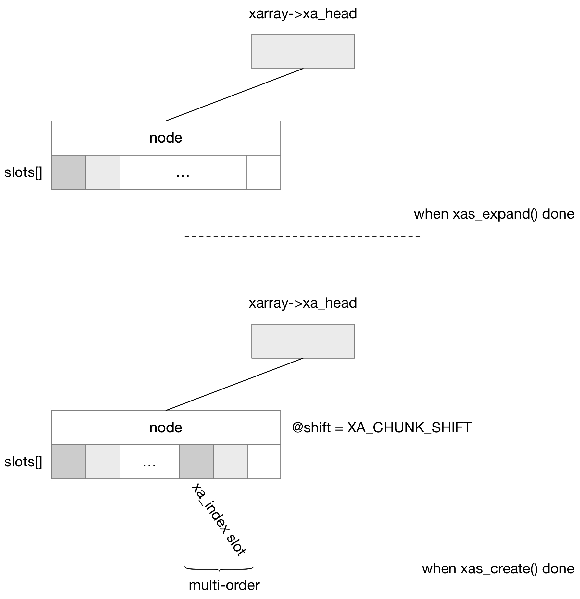

## XArray - multi-order entry

此前 radix tree 中，multi-order entry 除第一个 slot 之外的其他 slot 都指向第一个 slot，此时这些 slot 存储的是第一个 slot 的地址

而在 xarray 中，multi-order entry 除第一个 slot 之外的其他 slot 同样指向第一个 slot

此时 sibling 的低 2 bit 仍然是 10，表示这是一个 internal entry，而高 bit 则存储 multi-order entry 的第一个 slot 在所在的 xa_inode 的 @slots[] 数组中的偏移 (offset)，由于每个 node 的 @slots[] 数组的大小为 64，因而其取值范围是 [0, 62]

```
+---------------------------------------+----+
|                   0-62                | 10 |
+---------------------------------------+----+
```

```
 * 0-62: Sibling entries
```

此时 sibling 的判断变成

```c
static inline bool xa_is_sibling(const void *entry)
{
	return IS_ENABLED(CONFIG_XARRAY_MULTI) && xa_is_internal(entry) &&
		(entry < xa_mk_sibling(XA_CHUNK_SIZE - 1));
}
```


#### xas_store

如果需要存储 multi-order entry，那么需要描述该 multi-order entry 为 2^order 个 slot 大小，其实际上是设置 xa_state 的 @xa_sibs 字段为 (2^order - 1)

```c
XA_STATE_ORDER(xas, xarray, index, order);
xas_store(xas, entry);
```

```sh
# xas->xa_index = ..., with xa->xa_head pointing to an internal node
xas_store
    xas_create
        xas_expand
            # expand xarray, so that the tree is tall enough
            xas->xa_node = level 1 node (xa->xa_head)
            # return (xa->xa_head->shift + XA_CHUNK_SHIFT)
        
        # exapnd xarray, so that the tree is wide enough
        # xas->xa_node, xas->xa_offset pointing to corresponding slot
    
    node   = xas->xa_node;
    offset = xas->xa_offset
    slot   = &node->slots[offset]
    
    # for the first slot in this multi-order entry
    *slot = entry // store entry into corresponding slot
    
    # for the remaining slots in this multi-order entry, for each slot
    *slot = xas->xa_offset
```

同样地 xas_expand() 中会扩展 xarray，使得扩展后的 xarray tree 足够高能够容纳得下当前需要插入的 index，只是之前非 multi-order 的情况下，是扩展 xarray 使其足够容纳 xas->xa_index index，而 multi-order 的情况下，则是 扩展 xarray 使其足够容纳 (xas->xa_index + xas->xa_sibs - 1) index

之后回到 xas_create() 中则是和之前一样，扩展 xarray，使得扩展后的 xarray tree 足够宽能够容纳得下 (xas->xa_index + xas->xa_sibs - 1) index；xas_create() 返回的时候，(xas->xa_node, xas->xa_offset) 就指向 xas->xa_index slot

最终 xas_store() 中就会设置这个 multi-order entry

1. order < XA_CHUNK_SHIFT

当 multi-order entry 的 size 小于 node 的时候


2. order == XA_CHUNK_SHIFT

当 multi-order entry 的 size 刚好等于 node 的时候


3. order > XA_CHUNK_SHIFT

当 multi-order entry 的 size 是 node 的整数倍的时候

```c
XA_STATE_ORDER(xas, xarray, index, order);
    .xa_index = index
    .xa_shift = order - (order % XA_CHUNK_SHIFT)
    .xa_sibs  = (1U << (order % XA_CHUNK_SHIFT)) - 1)
```

XA_STATE_ORDER() 初始化 xas 的时候，例如一个 node 可以容纳 64 个 slot (XA_CHUNK_SHIFT 为 6) 的时候，当 order 为 7 (multi-order entry 大小为 128) 的时候，@xa_shift 为 6，@xa_sibs 为 1；相当于转化成一个 size 为 2 (@xa_sibs + 1) 的 multi-order entry，此时该 multi-order entry 中的每个 slot 实际上代表原先的 64 (2 ^ @xa_shift) 个 slot



此时 xas_create() 中 expand xarray 的时候，就不会再创建最底层的 node，而只是存储转化后的 multi-order entry


#### xas_load

此时如果 @index 指向 multi-order entry 中的其中一个 slot，那么 xas_load() 最终返回的是 multi-order entry，即该 multi-order entry 的起始 slot 中存储的值

```c
XA_STATE_ORDER(xas, xarray, index, order);
xas_load(xas, entry);
```


#### find_lock_entries

改用 xarray 接口之后，VFS 常用的 pagevec_lookup_entries() 接口变为 find_lock_entries() 接口，用于在文件的 address space 中查找 [@start, @end] page offset 范围内的 (page cache) slot

这里 @start 相当于是 radix tree 的 index，单位一般是 PAGE_SIZE

```c
unsigned find_lock_entries(struct address_space *mapping, pgoff_t start,
		pgoff_t end, struct pagevec *pvec, pgoff_t *indices)
```


最终找到的 slot 保存在传入的 @pvec.pages[] 数组中，@pvec.nr 描述 @pvec.pages[] 数组中实际保存的 slot 的数量

```c
struct pagevec {
	unsigned char nr;
	struct page *pages[PAGEVEC_SIZE];
	...
};
```

此外在传入的 @indices[] 数组中保存 @pvec.pages[] 数组中保存的各个 slot 对应的 index，例如 @pvec.pages[index] 保存的 slot 对应的 index 即为 @indices[index]


这里需要注意的是，引入 multi-order entry 后，上述接口的行为 (开启 fsdax 时，文件的 address space 中存储的 PMD entry 就是 multi-order entry)


与之前的 pagevec_lookup_entries() 接口一样，此时 @pvec.pages[] 中整个 PMD entry 还是只占用一个元素，@indices[] 中对应的 index 实际上是该 PMD entry 的第一个 slot 对应的 index

```
start     index                                  index+5
--------+-------+-------+-------+-------+-------+-------+-------
   ...  |       |       |       |       |       |       |  ...     
--------+-------+-------+-------+-------+-------+-------+-------
           PTE  <---------- PMD entry ---------->  PTE
         entry 1                                 entry 2

pvec.pages[]:   PTE entry 1,    PMD entry,      PTE entry
indices[]:      index,          index+1,        index+5
```


如果 @start 指向 PMD entry 中间的某个 slot，那么 @pvec.pages[] 中还是会返回整个 PMD entry，但是与之前的 pagevec_lookup_entries() 接口不同的是，此时 @indices[] 中对应的 index 就是 @start，也就是 @start 指向的 PMD entry 的中间一个 slot 对应的 index

```
         index                                  index+5
--------+-------+-------+-------+-------+-------+-------+-------
   ...  |       |       |       |       |       |       |  ...     
--------+-------+-------+-------+-------+-------+-------+-------
                                        ^
                                        start
           PTE  <---------- PMD entry ---------->  PTE
         entry 1                                 entry 2

pvec.pages[]:   PMD entry,      PTE entry
indices[]:      index+4,        index+5
```
