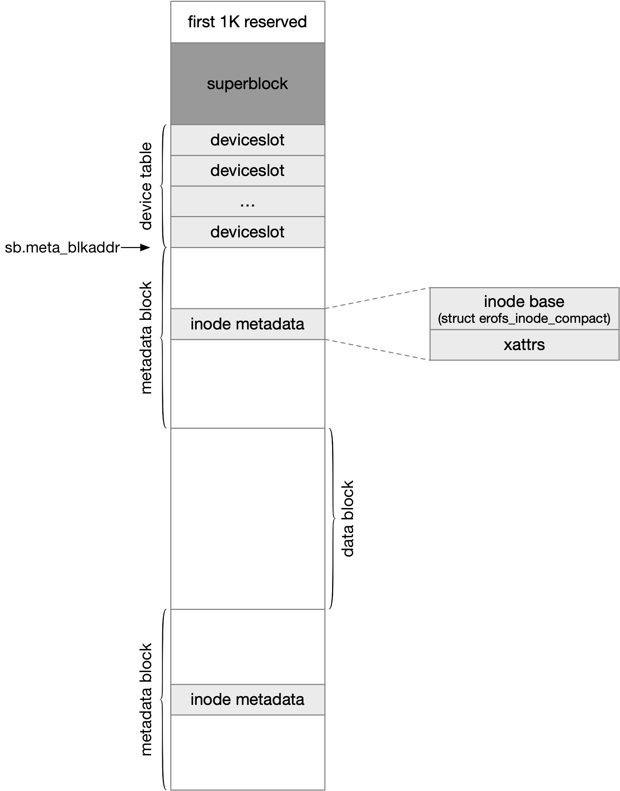

title:'EROFS'
## EROFS

EROFS (Enhanced Read-Only FileSystem) 的 on-disk 磁盘格式为



剩余的存储空间划分为 metadata area 与 data area 两部分，metadata area 部分可以只是一个 metadata block，也可以划分为多个 metadata block；类似地，data area 部分可以只是一个 data block，也可以划分为多个 data block

metadata area 部分存储文件的元数据，包括 on-disk inode (即 struct erofs_inode_compact)、xattr 等；data area 部分则存储文件的数据

```c
struct erofs_super_block {
	
	__le32 meta_blkaddr;	/* start block address of metadata area */
	
	/* inode slot unit size in bit shift */
	unsigned char islotbits;
	...
};
```

superblock 的 @meta_blkaddr 字段描述 metadata area 的起始物理地址，以 block 为单位，EROFS 中 block 都是 4KB 大小的


```c
struct erofs_inode_compact {
	__le32 i_ino;           /* only used for 32-bit stat compatibility */
	...
};
```

@i_ino 描述文件的 inode number

因而通常使用以下公式计算一个文件对应的 on-disk inode (即 struct erofs_inode_compact)

```
meta_blkaddr + nid << islotbits
```

之前介绍过，metadata block 可以与 data block 交替排布，此时 node id 会在整个 bdev 地址空间 (包括 data block) 中均匀排布，只是 data block 地址空间内的 node id 相当于是一个 hole，并不真正呈现给用户

也就是说两个 metadata block 中，相邻的两个 node id 并不连续

```
                nid M               nid M+X
----+----------------+--------------+----------------+----
    | metadata block |  data block  | metadata block | 
----+----------------+--------------+----------------+----
    ^
@meta_blkaddr    
```


### data layout

inode 的 @i_format 描述文件的 data layout 即文件数据的组织形式

```c
struct erofs_inode_compact {
	__le16 i_format;	/* inode format hints */
	...
};
```

EROFS 中数据排布是以 block 为单位的，这里的 block 是 EROFS 文件系统中的 block 的概念，其大小是固定的 EROFS_BLKSIZ，实际上是 (1 << PAGE_SHIFT)，也就是和系统中的物理页的大小一致

x86 架构下物理页大小是统一的 4K，因而 block 也都是 4K 大小；arm 架构下物理页可以大于 4K，此时 block 的大小也会超过 4K


erofs 中通过 erofs_map_blocks() 来实现 block mapping 地址映射

```c
static int erofs_map_blocks(struct inode *inode,
			    struct erofs_map_blocks *map, int flags)
```

struct erofs_map_blocks 用于存储地址映射过程中的上下文信息，在调用 erofs_map_blocks() 之前，调用者需要设置 @map 的 @m_la/m_llen 字段以描述需要映射的虚拟地址区间

erofs_map_blocks() 返回后，@map 的 @m_pa/m_plen 字段就描述映射的结果，即对应的物理地址区间

```c
struct erofs_map_blocks {
	erofs_off_t m_pa, m_la;
	u64 m_plen, m_llen;
	...
};
```

#### plain

@i_format 为 EROFS_INODE_FLAT_PLAIN 时，文件的**所有**数据直接顺序排列在 data block 中，此时 @raw_blkaddr 指向文件数据的起始地址 (以 block 为单位)

```c
struct erofs_inode_compact {
	union {
		__le32 raw_blkaddr;
		...
	} i_u;
	...
};
```


此时文件数据的起始地址是 block 对齐的，同时文件数据的大小即 @i_size 可以不按照 block 对齐，但是文件数据的结尾部分仍然会占用一个完整的 block


#### inline

@i_format 为 EROFS_INODE_FLAT_INLINE 时，文件数据的前面几个按照 block 对齐的部分直接顺序排列在 data block 中，剩余的部分则是直接存储在 inode metadata 之后，此时 @raw_blkaddr 指向文件数据的起始地址 (以 block 为单位)

```c
struct erofs_inode_compact {
	union {
		__le32 raw_blkaddr;
		...
	} i_u;
	...
};
```


此时文件数据的起始地址是 block 对齐的


#### chunk

单个文件的数据也可以划分为一个个的 chunk (chunk 的大小是 block 的整数倍)，各个 chunk 存储在磁盘上的物理地址可以不连续

```c
struct erofs_inode_compact {
	union {
		...
		/* for chunk-based files, it contains the summary info */
		struct erofs_inode_chunk_info c;
	} i_u;
	...
};
```

```c
struct erofs_inode_chunk_info {
	__le16 format;		/* chunk blkbits, etc. */
	__le16 reserved;
};
```

@format 的 bit 5 描述 chunk 的组织形式

@format 的 low 5 bits 描述 chunk size，此时 chunk size 为 (1 << (PAGE_SHIFT + format_low_5_bits))


##### chunk blkaddr array

@format 的 bit 5 为 0 的时候，inode metadata 之后存储一个 u32 数组，数组中的每一个 u32 实际上就存储文件数据的每一个 chunk 的地址 (以 block 为单位)


每个 chunk 的起始地址必须以 block 对齐，而不必按照 chunk 对齐

同时每个文件的前面几个 chunk 都是足额的 chunk size，但是最后一个 chunk 的大小可以不足额，但必须是 block 的整数倍


##### chunk index

@format 的 bit 5 为 1 的时候，inode metadata 之后存储的是 struct erofs_inode_chunk_index 数组，数组中的每一个 struct erofs_inode_chunk_index 描述文件数据的每一个 chunk 的地址 (以 block 为单位)

此时文件的各个 chunk 可以分布在多设备中

```c
struct erofs_inode_chunk_index {
	__le16 advise;		/* always 0, don't care for now */
	__le16 device_id;	/* back-end storage id (with bits masked) */
	__le32 blkaddr;		/* start block address of this inode chunk */
};
```


与之前一样，每个 chunk 的起始地址必须以 block 对齐，而不必按照 chunk 对齐

同时每个文件的前面几个 chunk 都是足额的 chunk size，但是最后一个 chunk 的大小可以不足额，但必须是 block 的整数倍


### multi-device

EROFS 支持同一个文件系统存储在多个 bdev 上。此时含有 superblock 的设备称为 primary device，primary device 中维护一个 device table 以描述其他的设备

```c
struct erofs_super_block {
	__le32 feature_incompat;
	__le16 extra_devices;	/* # of devices besides the primary device */
	__le16 devt_slotoff;	/* startoff = devt_slotoff * devt_slotsize */
	...
};
```

此时 @feature_incompat 字段必须设置有 EROFS_FEATURE_INCOMPAT_DEVICE_TABLE 标记

@extra_devices 字段描述 device table 中描述的设备的数量

@devt_slotoff 字段描述 device table 的起始地址为 （@devt_slotoff * EROFS_DEVT_SLOT_SIZE）


device table 主要维护一个个的 deviceslot，这里的每一个 deviceslot 就描述除 primary device 以外的一个 extra device

```c
struct erofs_deviceslot {
	union {
		u8 uuid[16];		/* used for device manager later */
		u8 userdata[64];	/* digest(sha256), etc. */
	} u;
	__le32 blocks;			/* total fs blocks of this device */
	__le32 mapped_blkaddr;		/* map starting at mapped_blkaddr */
	u8 reserved[56];
};
```

@blocks 描述当前 deviceslot 描述的 extra device 的大小

on-disk deviceslot 中并不维护设备的路径信息，使用多设备的 erofs 在挂载的时候，必须通过 "-o device=<path>" 挂载参数，依次输入这些 extra device 的路径信息；此时该挂载参数中 extra device 的顺序，必须与这些设备在 device table 中的顺序一一对应


此时 in-memory superblock 使用 idr tree 来管理所有的 extra device

```c
struct erofs_sb_info {
	struct erofs_dev_context *devs;
	...
}
```

```c
struct erofs_dev_context {
	struct idr tree;
	unsigned int extra_devices;
	...
};
```


#### single flat address space

多设备也有多种使用模式，一种是兼容非 chunk 模式，即在非 chunk 模式下使用多设备，此时镜像中并没有多设备的概念，即所有 deviceid 均默认为 0，此时相当于所有设备 (包括 primary device 与 extra device) 共同组成一个统一的地址空间

```
+-------------------+
|                   |
|   primary device  |
|                   |
+-------------------+   <--- @mapped_blkaddr of extra device 1
|                   |
|   extra device 1  |
|                   |
+-------------------+   <--- @mapped_blkaddr of extra device 2
|                   |
|   extra device 2  |
|                   |
+-------------------+
```

此时 primary device 位于这个统一地址空间的起始部分，其余各个 extra device 在对应 deviceslot 的 @mapped_blkaddr 字段描述其在这个统一地址空间中的偏移

```c
struct erofs_deviceslot {
	__le32 mapped_blkaddr;		/* map starting at mapped_blkaddr */
	u8 reserved[56];
};
```

此时文件数据的物理地址就会在这个统一的地址空间中寻址


#### seperate address space

另一种是在 chunk 模式下使用多设备，此时各个设备的地址空间是相互分开并独立的，此时这些 extra device 在对应 deviceslot 中的 @mapped_blkaddr 字段必须为 0

```
+-------------------+   +-------------------+   +-------------------+
|                   |   |                   |   |                   |
|   primary device  |   |   extra device 1  |   |   extra device 2  |
|                   |   |                   |   |                   |
+-------------------+   +-------------------+   +-------------------+
```

此时文件数据的物理地址就在这些相分离的地址空间中寻址

```c
struct erofs_inode_chunk_index {
	__le16 advise;		/* always 0, don't care for now */
	__le16 device_id;	/* back-end storage id (with bits masked) */
	__le32 blkaddr;		/* start block address of this inode chunk */
};
```

@device_id 用于指定对应的 device，如果该字段为 0，那么就是 primary device，否则就是 extra device，此时 (@device_id - 1) 就是对应的 extra device 在 idr tree 中的编号

@blkaddr 就描述了对应的文件数据在 @device_id 指定的设备中的物理地址
