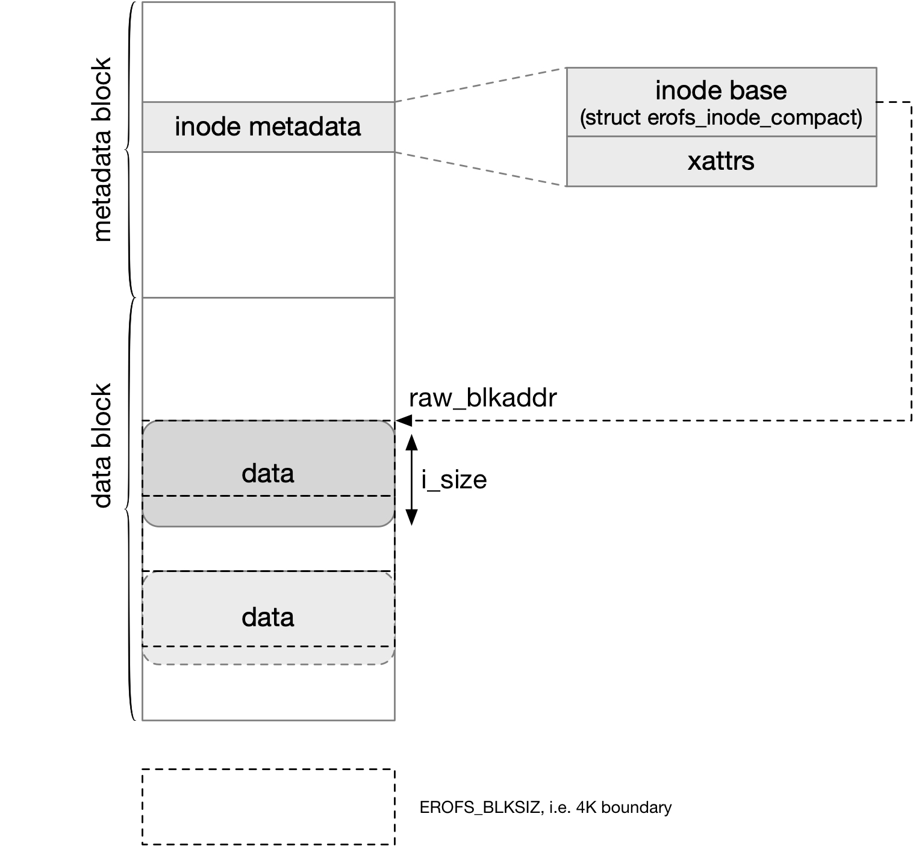
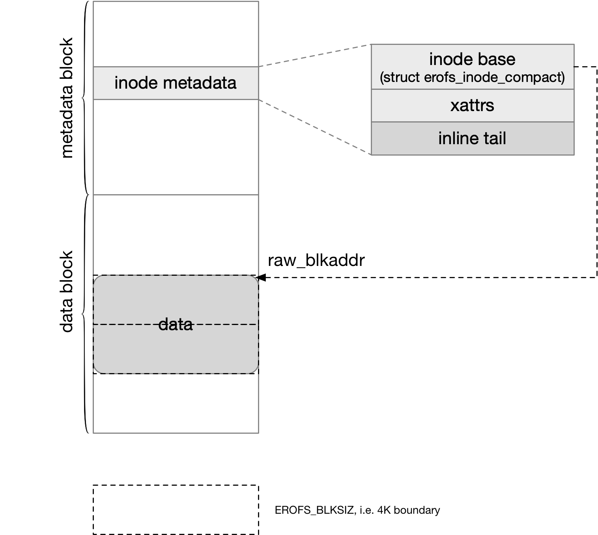
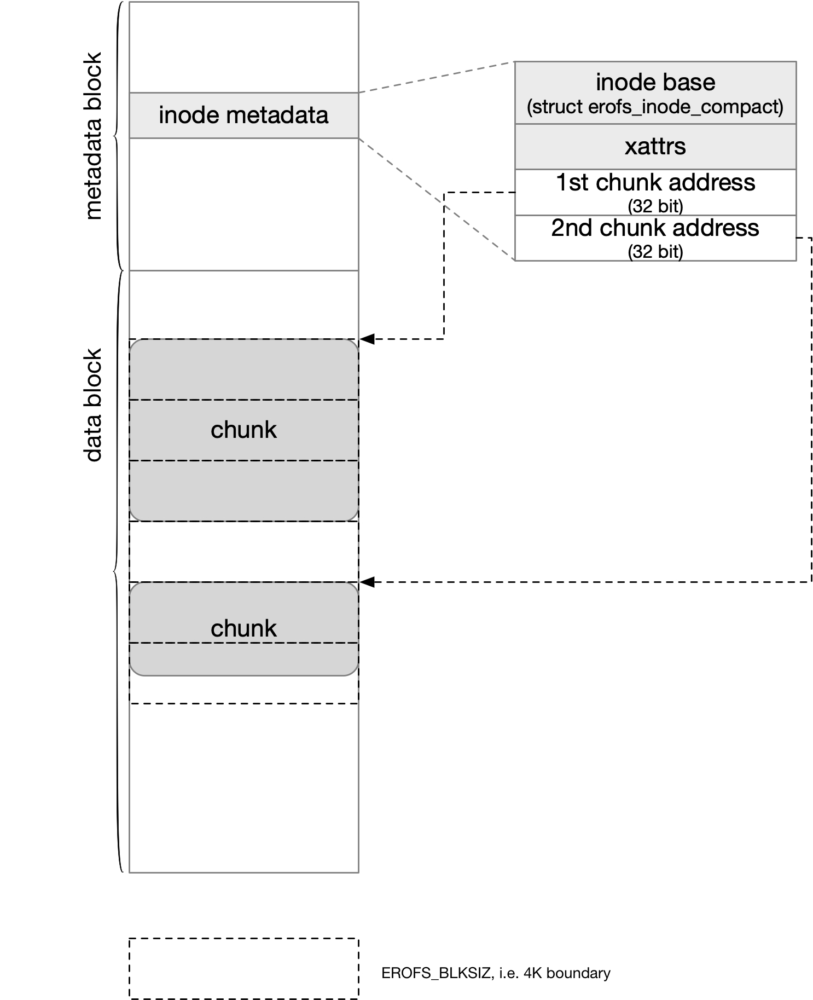
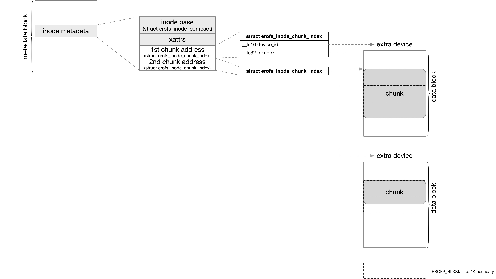

title:'EROFS - Spec - 02 Data Layout'
## EROFS - Spec - 02 Data Layout


inode 的 @i_format 的 bit 1~3 描述文件的 data layout 即文件数据的组织形式，EROFS 中数据排布是以 block 为单位的

```c
struct erofs_inode_compact {
	__le16 i_format;	/* inode format hints */
	...
};
```


### plain

@i_format 为 EROFS_INODE_FLAT_PLAIN 时，文件的**所有**数据直接顺序排列在 data block 中，此时 @raw_blkaddr 指向文件数据的起始地址，以 block 为单位

```c
struct erofs_inode_compact {
	union {
		__le32 raw_blkaddr;
		...
	} i_u;
	...
};
```



此时文件数据的大小即 @i_size 可以不按照 block 对齐，但是文件数据的结尾部分仍然会占用一个完整的 block


### inline

@i_format 为 EROFS_INODE_FLAT_INLINE 时，文件数据的前面几个按照 block 对齐的部分直接顺序排列在 data block 中，剩余的部分则是直接存储在 inode metadata 之后，此时 @raw_blkaddr 指向文件数据的起始地址，以 block 为单位

```c
struct erofs_inode_compact {
	union {
		__le32 raw_blkaddr;
		...
	} i_u;
	...
};
```



> inline data 和 inode metadata 部分不一定存储在同一个 block 内，可能存储在相邻的两个 block 内
>
> 但是 inline data 肯定位于同一个 block 中，即 inline data 不能跨越 block boundary


### chunk

单个文件的数据也可以划分为一个个的 chunk (chunk 的大小是 block 的整数倍)，各个 chunk 存储在磁盘上的物理地址可以不连续

```c
struct erofs_inode_compact {
	union {
		...
		/* for chunk-based files, it contains the summary info */
		struct erofs_inode_chunk_info c;
	} i_u;
	...
};
```

```c
struct erofs_inode_chunk_info {
	__le16 format;		/* chunk blkbits, etc. */
	__le16 reserved;
};
```

@format 的 bit 5 描述 chunk 的组织形式

@format 的 low 5 bits 描述 chunk size，此时 chunk size 为 (1 << (PAGE_SHIFT + format_low_5_bits))


#### chunk blkaddr array

@format 的 bit 5 为 0 的时候，inode metadata 之后存储一个 u32 数组，数组中的每一个 u32 实际上就存储文件数据的每一个 chunk 的地址 (以 block 为单位)



每个 chunk 的起始地址必须以 block 对齐，而不必按照 chunk 对齐

同时每个文件的前面几个 chunk 都是足额的 chunk size，但是最后一个 chunk 的大小可以不足额，但必须是 block 的整数倍


#### chunk index

@format 的 bit 5 为 1 的时候，inode metadata 之后存储的是 struct erofs_inode_chunk_index 数组，数组中的每一个 struct erofs_inode_chunk_index 描述文件数据的每一个 chunk 的地址 (以 block 为单位)

此时文件的各个 chunk 可以分布在多设备中

```c
struct erofs_inode_chunk_index {
	__le16 advise;		/* always 0, don't care for now */
	__le16 device_id;	/* back-end storage id (with bits masked) */
	__le32 blkaddr;		/* start block address of this inode chunk */
};
```



与之前一样，每个 chunk 的起始地址必须以 block 对齐，而不必按照 chunk 对齐

同时每个文件的前面几个 chunk 都是足额的 chunk size，但是最后一个 chunk 的大小可以不足额，但必须是 block 的整数倍


