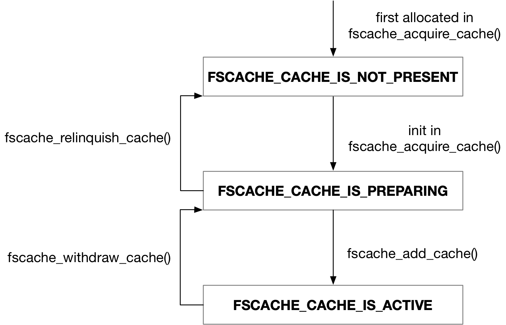

title:'fscache - 1 object'
## fscache - 1 object


### cache




#### init

```sh
cachefiles_add_cache
    fscache_acquire_cache
        # find cache with @name with FSCACHE_CACHE_IS_NOT_PRESENT state
        # or allocate a new cache with FSCACHE_CACHE_IS_NOT_PRESENT state
        
        if cache's state is not FSCACHE_CACHE_IS_NOT_PRESENT:
            return error 
        # switch state to FSCACHE_CACHE_IS_PREPARING

    fscache_add_cache
        # switch state to FSCACHE_CACHE_IS_ACTIVE
```


backend 调用 fscache_acquire_cache() 创建 cache，@name 描述需要创建的 cache 的 tag name，会保存在创建的 fscache_cache 的 @name 字段

```c
struct fscache_cache *fscache_acquire_cache(const char *name)
```

```c
struct fscache_cache {
	...
	char			*name;
};
```

fscache 框架使用 @fscache_caches 全局链表管理所有的 fscache_cache


> cache lookup

在注册 cache 的过程中，会调用 fscache_lookup_cache() 在 @fscache_caches 全局链表，即所有已经注册的 cache 中寻找名称为 @name 的 cache，如果链表中已经存在相同名称的 cache，那么就复用这个 cache (但是这个 cache 必须处于 FSCACHE_CACHE_IS_NOT_PRESENT 状态)；否则创建并注册一个新的名称为 @name 的 cache

```
fscache_acquire_cache
    fscache_lookup_cache(@name, ...)
```

1. 如果 @name 不为空，那么

- 优先寻找名称为 @name 的 cache
- 其次寻找 @fscache_caches 全局链表中的第一个名称为空的 cache，并将该 cache 的名称设置为 @name
- 否则创建并注册一个名称为 @name 的新 cache

2. 如果 @name 为空，那么

- 优先寻找名称同样为空的 cache
- 其次寻找 @fscache_caches 全局链表中的第一个名称不为空的 cache
- 否则创建并注册一个名称为空的新 cache


#### withdraw

```sh
cachefiles_withdraw_cache
    fscache_withdraw_cache
        # switch state to FSCACHE_CACHE_IS_WITHDRAWN
    
    fscache_relinquish_cache
        # switch state to FSCACHE_CACHE_IS_NOT_PRESENT
        fscache_put_cache
            # if @ref decreased to 0:
                # remove cache from @fscache_caches list
                # free cache's memory
```


#### refcount

cache 维护以下两个计数

```c
struct fscache_cache {
	refcount_t		ref;
	atomic_t		n_accesses;	/* Number of in-progress accesses on the cache */
	...
};
```

##### ref

@ref 相当于 internal (weak) 计数，该计数变为 0 时会释放 struct fscache_cache 结构体

> initial refcount

在注册 cache 的时候，会在 @fscache_caches 全局链表，即所有已经注册的 cache 中寻找名称为 @name 的 cache

如果链表中不存在相同名称的 cache，那么就创建一个新的 cache

```sh
cachefiles_add_cache
    fscache_acquire_cache
        # find cache with @name
        # if not matched, allocate a new cache
            fscache_alloc_cache
                refcount_set(&cache->ref, 1) // initial refcount
``` 


如果链表中已经存在相同名称的 cache，那么就复用这个 cache，这个时候就会增加这个 cache 的 @ref 计数作为 initial refcount

```sh
cachefiles_add_cache
    fscache_acquire_cache
        # find cache with @name
        # if matched
            fscache_get_cache_maybe // inc refcount
```


> refcount held by volume

同时 cache 下的每个 volume 会维护一份对该 cache 的引用计数；在 volume 销毁 (volume 的引用计数变为 0) 的时候，移除这份对 cache 的引用计数

```sh
fscache_acquire_volume
    # allocate and init volume
    fscache_alloc_volume
        fscache_lookup_cache(@cache_name, ...)
            # find matched cache, and inc cache's refcount
```

```
fscache_put_volume
    # dec @ref and if @ref decreased to 0:
        fscache_free_volume
            # free volume
            fscache_put_cache // dec refcount
```


> drop initial refcount

最终释放 cache 的时候会减去 initial refcount

```sh
cachefiles_withdraw_cache    
    fscache_relinquish_cache
        fscache_put_cache // dec refcount
```


> cleanup

当 @ref 计数减为 0 的时候，就会释放 struct fscache_cache 结构体

```sh
fscache_put_cache
    # dec refcount
    # if @ref decreased to 0:
        # remove cache from @fscache_caches list
        # free cache's memory
```


##### n_accesses

@n_accesses 相当于 external (strong) 计数，描述当前有多少 volume 正在引用该 cache，从而实现 1) cache 做 withdraw 操作，与 2) 在某个 cache 下注册一个 volume 这两个操作的同步

> initial refcount

```sh
cachefiles_add_cache
    fscache_add_cache
        atomic_inc_return(&cache->n_accesses) // initial refcount
``` 


> register volume

上层文件系统在调用 fscache_acquire_volume() 注册 volume 的时候，会增加对应的 cache 的 @n_accesses 计数，以表明当前存在 volume 需要该 cache；之后当上述 volume 成功注册完成的时候，就会相应地减去该计数

```sh
fscache_acquire_volume
    # allocate and init volume
    
    fscache_create_volume
        fscache_begin_cache_access // inc refcount
        # schedule volume->work

# worker
fscache_create_volume_work
    cache->ops->acquire_volume(), e.g., cachefiles_acquire_volume()
        # allocate and init 'struct cachefiles_volume'
        # mkdir for volume under '<root>/cache/'

    fscache_end_cache_access // dec refcount
```


> drop initial refcount

cache 执行 withdraw 操作的时候，就会减去 initial refcount

```
cachefiles_withdraw_cache    
    fscache_withdraw_cache
        # dec @n_accesses refcount
```


> wait on refcount

cache 的 @n_accesses 计数实际上就是为了实现 1) cache 做 withdraw 操作，与 2) 在某个 cache 下注册一个 volume 这两个操作的同步

cache 在做 withdraw 操作的时候，必须等到 @n_accesses 计数变成 0 的时候，才能继续执行一些实质性的销毁操作，例如调用 cachefiles_withdraw_objects()

```
cachefiles_withdraw_cache    
    fscache_withdraw_cache
        # cache state: FSCACHE_CACHE_IS_ACTIVE -> FSCACHE_CACHE_IS_WITHDRAWN
        # dec @n_accesses refcount
        # wait until @n_accesses become 0
    
    # withdraw cache, e.g. cachefiles_withdraw_objects()
```

之前介绍过，当 volume 成功注册完成的时候，就会减去 @n_accesses 计数；此时当 @n_accesses 计数减为 0 的时候，就需要通知 cache 的 withdraw 操作

```sh
fscache_acquire_volume
    # allocate and init volume
    
    fscache_create_volume
        # schedule volume->work

# worker
fscache_create_volume_work
    cache->ops->acquire_volume(), e.g., cachefiles_acquire_volume()
        # allocate and init 'struct cachefiles_volume'
        # mkdir for volume under '<root>/cache/'

    fscache_end_cache_access
        # dec refcount
        # if decreased to 0:
            # wakeup waiters on @n_accesses
```


### volume

volume 是一组 cookie 的集合，一般每个使用 fscache 的上层文件系统注册一个 volume


#### init

上层文件系统调用 fscache_acquire_volume() 注册 volume

```c
struct fscache_volume *fscache_acquire_volume(const char *volume_key,
					      const char *cache_name,
					      u64 coherency_data)
```

fscache 框架使用 @fscache_volumes 全局链表管理所有的 fscache_volume

```sh
# mount
fscache_acquire_volume
    # allocate and init volume
    fscache_alloc_volume
    
    fscache_create_volume
        test_and_set_bit(FSCACHE_VOLUME_CREATING, &volume->flags)
        # schedule volume->work

# worker
fscache_create_volume_work
    cache->ops->acquire_volume(), e.g., cachefiles_acquire_volume()
        # allocate and init 'struct cachefiles_volume'
        # mkdir for volume under '<root>/cache/'
    clear_bit_unlock(FSCACHE_VOLUME_CREATING, &volume->flags)
```


> match with cache

当前创建的 volume 保存在 @cache_name 描述的 cache 之下，这里也是调用 fscache_lookup_cache() 寻找名称为 @cache_name 的 cache

```
fscache_alloc_volume
    fscache_lookup_cache(@cache_name, ...)
```

1. 如果 @name 不为空，那么

- 优先寻找名称为 @name 的 cache
- 否则创建并注册一个名称为 @name 的新 cache

2. 如果 @name 为空，那么

- 优先寻找名称同样为空的 cache
- 其次寻找 @fscache_caches 全局链表中的第一个名称不为空的 cache
- 否则创建并注册一个名称为空的新 cache


> volume key

@volume_key 字符串用于在系统范围内唯一标识一个 volume，保存在 volume 的 @key 字段

```c
struct fscache_volume {
	unsigned int			key_hash;	/* Hash of key string */
	char				*key;		/* Volume ID, eg. "afs@example.com@1234" */
	...
};
```

此时 @key 指向的内存区间布局如下所示

- 起始的一个 u8 描述传入的 @volume_key 字符串的长度
- 随后存储传入的 @volume_key 字符串

```
strlen()
   of       
@volume_key                              padding
+-------+-------------------------------+-------+
|       |     @volume_key (string)      |       |
+-------+-------------------------------+-------+
   u8                                       
```

fscache 会对 @key 指向的内存作 hash 运算，最终得到的 hash 值保存在 @key_hash 字段，并根据该 hash 值将该 volume 添加到 @fscache_volume_hash 全局 hash table 中


#### relinquish

```c
void fscache_relinquish_volume(struct fscache_volume *volume,
			       u64 coherency_data,
			       bool invalidate)
```

```
fscache_relinquish_volume
    test_and_set_bit(FSCACHE_VOLUME_RELINQUISHED, &volume->flags)
    fscache_put_volume
        # dec @ref refcount
        # if @ref decreased to 0:
            fscache_free_volume
```


#### refcount

volume 维护以下两个计数

```c
struct fscache_volume {
	refcount_t			ref;
	atomic_t			n_accesses;	/* Number of cache accesses in progress */
	...
}
```

##### ref

@ref 相当于 internal (weak) 计数，该计数变为 0 时会释放 struct fscache_volume 结构体

> initial refcount

```sh
fscache_acquire_volume
    # allocate and init volume
    fscache_alloc_volume
        refcount_set(&volume->ref, 1) // initial refcount
```

> register volume

在注册 volume 的时候，会增加 volume 的 @ref 计数；这个 volume 注册完成的时候，会对应地减去计数

```sh
fscache_acquire_volume
    # allocate and init volume
    fscache_alloc_volume
    
    fscache_create_volume
        fscache_get_volume // inc refcount
        # schedule volume->work

# worker
fscache_create_volume_work
    cache->ops->acquire_volume(), e.g., cachefiles_acquire_volume()
        # allocate and init 'struct cachefiles_volume'
        # mkdir for volume under '<root>/cache/'
    fscache_put_volume // dec refcount
```


> refcount held by cookie

同时 volume 下的每个 cookie 会维护一份对该 volume 的引用计数；在 cookie 销毁 (cookie 的引用计数变为 0) 的时候，移除这份对 volume 的引用计数

```sh
fscache_acquire_cookie
    fscache_hash_cookie
        fscache_get_volume
```

```
fscache_put_cookie
	# dec_and_test(&cookie->ref, ...)
		# if refcount decreased to 0
			fscache_put_volume
```

> drop initial refcount

volume 做 relinquish 操作的时候，就会减去 initial refcount

```
fscache_relinquish_volume
    test_and_set_bit(FSCACHE_VOLUME_RELINQUISHED, &volume->flags)
        fscache_put_volume // dec @ref refcount
```


> cleanup

当 @ref 计数减为 0 的时候，就会释放 struct fscache_volume 结构体

```
fscache_put_volume
    # dec @ref refcount
    # if @ref decreased to 0:
        fscache_free_volume
            cache->ops->free_volume()
            # remove volume from hash table
            # remove volume from @fscache_volumes list
```


##### n_accesses

@n_accesses 相当于 external (strong) 计数，描述当前有多少 cookie 正在引用该 volume，从而实现 1) volume 做 withdraw 操作，与 2) 在某个 volume 下注册一个 cookie 这两个操作的同步


> initial refcount

```sh
cachefiles_add_cache
    fscache_add_cache
        atomic_inc_return(&cache->n_accesses) // initial refcount
``` 


> register cookie

上层文件系统在调用 fscache_use_cookie() 发起对 cookie 的 lookup 操作的时候，会增加对应的 volume 的 @n_accesses 计数，以表明当前存在 cookie 需要该 volume；之后当 cookie 的 lookup 操作完成的时候，就会相应地减去这个计数

```
# open
fscache_use_cookie
    fscache_begin_lookup
        fscache_begin_volume_access // inc refcount
    fscache_queue_cookie // schedule cookie->work

# worker
fscache_cookie_worker
    fscache_cookie_state_machine
        # cookie is in FSCACHE_COOKIE_STATE_LOOKING_UP state
        fscache_perform_lookup
            cache->ops->lookup_cookie(), e.g. cachefiles_lookup_cookie()
                cachefiles_cook_key
                cachefiles_look_up_object
            
            cookie->state = FSCACHE_COOKIE_STATE_ACTIVE state
            
            fscache_end_volume_access // dec refcount
```


> drop initial refcount

cache 执行 withdraw 操作的时候，会对该 cache 下的每个 volume 执行 withdraw 操作，此时就会减去 initial refcount

```sh
cachefiles_withdraw_cache
    cachefiles_withdraw_volumes
        fscache_withdraw_volume
            # dec @n_accesses refcount
    
```


> wait on refcount

volume 的 @n_accesses 计数实际上就是为了实现 1) volume 做 withdraw 操作，与 2) 在某个 volume 下注册一个 cookie 这两个操作的同步

volume 在做 withdraw 操作的时候，必须等到 @n_accesses 计数变成 0 的时候，才能继续执行一些实质性的销毁操作

```
cachefiles_withdraw_cache    
    cachefiles_withdraw_volumes
        fscache_withdraw_volume
            # dec @n_accesses refcount
            # wait until @n_accesses become 0
    
    # withdraw volume
```

之前介绍过，当 cookie 成功注册完成的时候，就会减去 @n_accesses 计数；此时当 @n_accesses 计数减为 0 的时候，就需要通知 volume 的 withdraw 操作

```
# open
fscache_use_cookie
    fscache_begin_lookup
        fscache_begin_volume_access // inc refcount
    fscache_queue_cookie // schedule cookie->work

# worker
fscache_cookie_worker
    fscache_cookie_state_machine
        # cookie is in FSCACHE_COOKIE_STATE_LOOKING_UP state
        fscache_perform_lookup
            cache->ops->lookup_cookie(), e.g. cachefiles_lookup_cookie()
                cachefiles_cook_key
                cachefiles_look_up_object
            
            cookie->state = FSCACHE_COOKIE_STATE_ACTIVE state
            
            fscache_end_volume_access
                # dec refcount
                # if decreased to 0:
                    # wakeup waiters on @n_accesses
```


### cookie


#### init

上层文件系统调用 fscache_acquire_cookie() 注册 cookie，一般为每个 inode 注册一个对应的 cookie

```c
struct fscache_cookie *fscache_acquire_cookie(struct fscache_volume *volume,
					      u8 advice,
					      const void *index_key,
					      size_t index_key_len,
					      const void *aux_data,
					      size_t aux_data_len,
					      loff_t object_size)
```

@volume 描述当前创建的 cookie 所在的 volume

fscache 框架使用 @fscache_cookies 全局链表管理所有的 fscache_cookie


@index_key 指向的一块内存用于在系统范围内唯一标识一个 cookie，保存在 cookie 的 @key 字段

```c
struct fscache_cookie {
	void			*key;		/* Index key */
	u32				key_hash;	/* Hash of volume, key, len */
	...
}
```

fscache 会对 @key 指向的内存作 hash 运算，最终得到的 hash 值保存在 @key_hash 字段，并根据该 hash 值将该 cookie 添加到 @fscache_cookie_hash 全局 hash table 中


@object_size 描述文件的大小，如果该参数为 0，那么 cookie 会置上 FSCACHE_COOKIE_NO_DATA_TO_READ 标记


#### relinquish

```c
void fscache_relinquish_cookie(struct fscache_cookie *cookie, bool retire)
```

#### refcount

cookie 内部维护以下三个引用计数

```c
struct fscache_cookie {
	refcount_t			ref;
	atomic_t			n_active;	/* number of active users of cookie */
	atomic_t			n_accesses;	/* Number of cache accesses in progress */
	...
}
```

##### ref

cookie 的 @ref 计数用于 struct fscache_cookie 结构体的生命周期的管理

```c
struct fscache_cookie {
	refcount_t			ref;
	...
}
``` 

> initial refcount

上层文件系统会调用 fscache_acquire_cookie() 注册 cookie

```sh
fscache_acquire_cookie
    fscache_alloc_cookie
        refcount_set(&cookie->ref, 1); // initial refcount
```


> drop initial refcount

上述最后一个 fput 后续还会触发 iput，而最后一个 iput 执行过程中会调用 s_ops->evict_inode() 回调函数，其中需要调用 fscache_relinquish_cookie() 以执行 fscache_acquire_cookie() 的逆操作，这里会调度 cookie state machine 执行 withdraw 操作，并 drop @cookie->ref 的初始计数以释放该 cookie 占用的内存

```sh
# close file (inode cleanup)
s_ops->evict_inode()
    fscache_relinquish_cookie(cookie, @retire)
        # cookie->flags: set FSCACHE_COOKIE_RELINQUISHED
        # cookie->flags: set FSCACHE_COOKIE_DO_RELINQUISH
        fscache_drop_withdraw_cookie
            __fscache_withdraw_cookie
                fscache_end_cookie_access
                    # schedule cookie state machine

        fscache_put_cookie // drop initial refcount
```


> cleanup

```
fscache_put_cookie
    # drop @cookie->ref initial refcount
    # if @cookie->ref refcount decreased to 0
    fscache_free_cookie // free 'struct fscache_cookie'
```


##### n_accesses

@n_accesses 计数描述当前有多少实例正在访问该 cache file，例如正在对该 cache file 执行 read/write IO，从而实现 1) cookie 做 withdraw 操作，与 2) 对该 cookie 做 IO 操作这两个操作的同步


> refcount held by IO

因而 @n_accesses 计数只存在于 IO 执行过程中，在执行 IO 前调用的 fscache_begin_operation() 会增加 @n_accesses 计数，IO 完成后调用的 fscache_end_operation() 则会减去 @n_accesses 计数

```sh
fscache_begin_operation
    fscache_begin_cookie_access
        # inc @cookie->n_accesses refcount
        
# do read/write IO

fscache_end_operation
    netfs_cache_ops->end_operation(), i.e. cachefiles_end_operation()
        fscache_end_cookie_access
            # dec @cookie->n_accesses refcount
```


> wait on refcount

cookie 在做 withdraw 操作的时候，等到 @n_accesses 计数变成 0 的时候才会调度 state machine，真正执行 withdraw 操作

```
__fscache_withdraw_cookie
    # if @n_access decreased to 0:
        # kick off cookie's state machine
```

之前描述过，当 cookie 的 IO 操作完成的时候，会相应地减去 @n_accesses 计数，当 @n_accesses 计数变成 0 的时候会调度 state machine，以执行 withdraw 操作

```
fscache_end_operation
    netfs_cache_ops->end_operation(), i.e. cachefiles_end_operation()
        fscache_end_cookie_access
            # dec @cookie->n_accesses refcount
            # if @n_access decreased to 0:
                # kick off cookie's state machine
```


