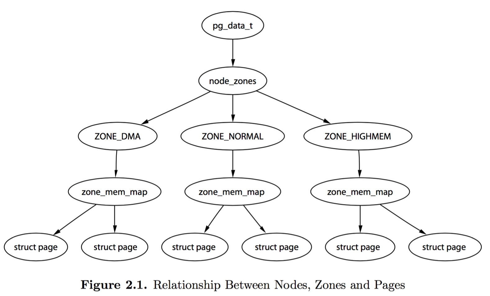
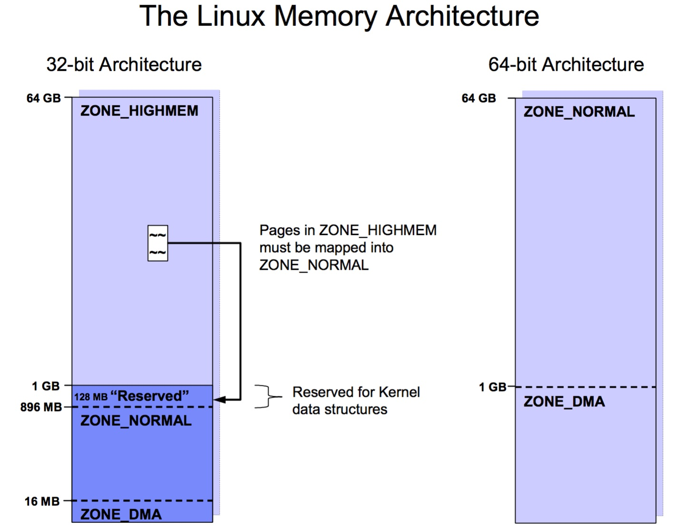

title:'MM - 01 Memory Hierarchy'
## MM - 01 Memory Hierarchy

Linux 使用节点（node）、管理区（zone）以及页帧（page frame）的分层模型对物理内存进行管理




### Node

在一致内存访问（Uniform Memory Access, UMA）模型中，CPU 对不同内存单元具有相同的访问时间

而在非一致内存访问（Non-Uniform Memory Access, NUMA）模型中，CPU 对不同内存单元具有不同的访问时间，根据 CPU 对不同内存单元访问时间的不同，系统的物理内存被划分为几个节点（node）；内核使用 struct pglist_data 数据结构抽象 node

```c
typedef struct pglist_data {
	int node_id;
	
	/*
	 * node_zones contains just the zones for THIS node. Not all of the
	 * zones may be populated, but it is the full list. It is referenced by
	 * this node's node_zonelists as well as other node's node_zonelists.
	 */
	struct zone node_zones[MAX_NR_ZONES];

	/*
	 * node_zonelists contains references to all zones in all nodes.
	 * Generally the first zones will be references to this node's
	 * node_zones.
	 */
	struct zonelist node_zonelists[MAX_ZONELISTS];

	int nr_zones; /* number of populated zones in this node */
	...
} pg_data_t;
```

@node_id 描述该节点的 ID

@node_zones[] 数组维护该节点中的所有 zone，@nr_zones 就描述该节点包含的 zone 的数量


```c
typedef struct pglist_data {
	unsigned long node_start_pfn;
	unsigned long node_present_pages; /* total number of physical pages */
	unsigned long node_spanned_pages; /* total size of physical page
					     range, including holes */
	...
} pg_data_t;
```

@node_start_pfn 描述该节点的起始 pfn
@node_spanned_pages 描述该节点的所有 page frame 的数目，包括 holes
@node_present_pages 描述该节点的所有可用的 page frame 的数目，不包括 holes


NUMA 架构下使用全局的 node_data[] 数组来维护系统中的所有 node

```c
struct pglist_data *node_data[MAX_NUMNODES] __read_mostly;
```


### Zone

由于有些 page frame 在硬件上存在一些限制

- old ISA 只能对 low 16M RAM 进行 DMA 操作 (ZONE_DMA)
- 32 bit 架构下内核地址空间只具有 1GB 的地址空间 (ZONE_NORMAL)

因而通常将一个内存节点划分为多个区（zone），以描述不同区的 page frame 的性质

```c
enum zone_type {
	ZONE_DMA,
	ZONE_DMA32,
	ZONE_NORMAL,
	ZONE_HIGHMEM,
	ZONE_MOVABLE,
	__MAX_NR_ZONES
};
```

zone | 描述
---- | ----
ZONE_DMA | 用于外围设备的 DMA 操作
ZONE_DMA32 | 用于 32 位设备的 DMA 操作
ZONE_NORMAL | 常规内存区
ZONE_HIGHMEM | 高端内存区，在 32 位系统中不能直接映射到线性地址空间的高端内存部分，在 64 位系统中该区为空




典型 32 位系统的物理内存划分为三个内存管理区：

管理区 | 地址范围
------|------
ZONE_DMA | 前 16MB
ZONE_NORMAL | 16MB～896MB
ZONE_HIGHMEM	 | >896MB

而对于 64 位系统，x86_64 架构下 direct mapping area 可以一直延伸至 64TB，因而通常不再存在高端内存

内核使用 struct zone 数据结构抽象 zone

> ZONE_DMA

由于 old ISA 设备只能对特定地址范围内的内存进行 DMA 操作，ZONE_DMA 描述符合这一特性的内存区域，其范围是架构相关的

```
Architecture		                      Limit
-----------------------------------------------------------
parisc, ia64, sparc                     <4G
s390                                    <2G
arm                                     Various
alpha                                   Unlimited or 0-16MB
i386, x86_64 and multiple other arches  <16M
```


> ZONE_DMA32

ZONE_DMA32 主要用于 x86_64 架构，该架构需要两个 DMA zone 即 ZONE_DMA 与 ZONE_DMA32，其中 ZONE_DMA 用于 old ISA 设备，即只能对 low 16 MB RAM 进行 DMA 操作的设备，而 ZONE_DMA32 用于只能对 low 4 GB RAM 进行 DMA 操作的 32 bit 设备


> ZONE_NORMAL/ZONE_HIGHMEM

对于 32 位系统，由于 Linux 内核只能直接访问物理内存的前 1GB（通常为 896MB），因而将物理内存中前 896MB 之后的内存称为高端内存即 ZONE_HIGHMEM，Linux 内核通过将高端内存动态映射至 896MB ~ 1GB 的线性地址空间以访问高端内存


### Page

页是内核管理物理内存的最小单位，内核使用 struct page 数据结构描述一个物理页

PAGE_SIZE 描述物理页的大小，x86_64 架构下物理页的大小总是 4KB，arm 64 架构下物理页的大小可以为 4/16/64KB

将物理地址空间按照 PAGE_SIZE 的粒度进行编号，即得到 page frame number (PFN)，由于内存与其他设备共享同一个物理地址空间，因而内存的起始 pfn 不必从 0 开始计数

get_order(size) 用于计算容纳 @size 字节的数据需要的物理页的数量，若 get_order(size) 函数的返回值为 n，则存储 @size 字节的缓存需要 2^n 个 page

PAGE_ALIGN(addr) 将虚拟地址 addr 向上进行对齐
PFN_ALIGN(addr) 将物理地址 addr 向上进行页对齐

PFN_UP(addr) 将物理地址 addr 转变为页帧号，并向上对齐
PFN_DOWN(addr) 将物理地址 addr 转变为页帧号，并向下对齐
