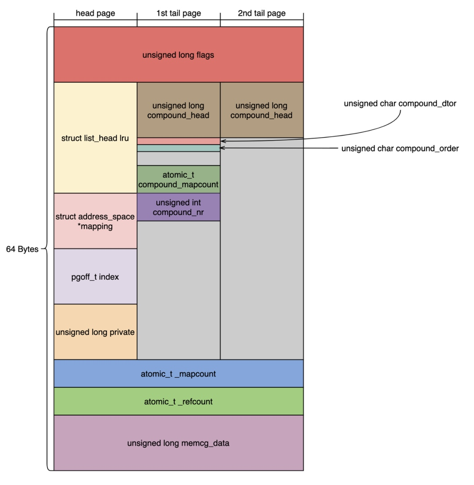

## MM - Compound Page

我们知道开启大页的时候，一个 page table entry 可以直接映射为一块大于 4KB 的连续物理内存区间，但是在 x86_64 架构下一个 struct page 只能描述 4KB 大小的物理内存 (PAGE_SHIFT 总是 12)，因而此时就需要多个 struct page 来描述这一段 (大于 4KB 的) 连续物理内存区间，但同时所有这些 struct page 又必须当成一个整体来对待，也就是所谓的 compound page

正如上所述，compound page 实际上就是多个 struct page 来描述一段 (大于 4KB 的) 连续物理内存区间，所有这些 struct page 当成一个整体来对待

compound page 主要用于 huge page (包括 hugetlbfs、transparent huge page)，也适用于其他有 huge buffer 管理需求的场景，但是不能用于 page cache

> aarch64 架构下，一个 struct page 描述的物理内存大小可以大于 4KB，因而可能没有 compound page 的需求



[image source](https://mp.weixin.qq.com/s/H4CWwG1qURTIyoqEi7Bp7w?spm=ata.21736010.0.0.762a6f4cN0xHoD)


如上所述 compound page 包含了一组 struct page，其中的第一个 page 称为 `head page`，其余的所有 page 称为 `tail page`

两者通过 struct page 的 @flags 字段进行区分，head page 标记有 PG_head，tail page 则标记有 PG_tail

所有 tail page 的 @lru.next 字段复用于 @compound_head 字段，指向 head page

第一个 tail page 的 @lru.prev 字段复用于 @compound_order 字段，存储 compound page 的大小，即 order，这是因为 head page 的 struct page 已经没有空间来存储这些信息


zoned page frame allocator 通过 __GFP_COMP 标志来分配 compound pages

```c
pages = alloc_pages(__GFP_COMP, 2);
```
