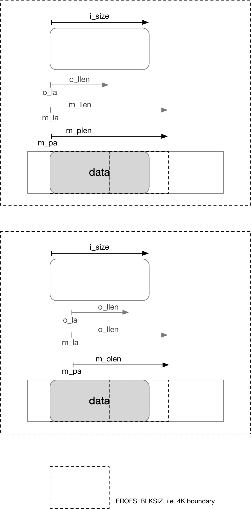

title:'EROFS - map'
## EROFS - map

erofs 中通过 erofs_map_blocks() 来实现 block mapping 地址映射

```c
static int erofs_map_blocks(struct inode *inode,
			    struct erofs_map_blocks *map, int flags)
```

struct erofs_map_blocks 用于存储地址映射过程中的上下文信息，在调用 erofs_map_blocks() 之前，调用者需要设置 @map 的 @m_la/m_llen 字段以描述需要映射的虚拟地址区间

erofs_map_blocks() 返回后，@map 的 @m_flags/@m_pa/@m_plen 字段就描述映射的结果

- @m_flags 字段不包含 EROFS_MAP_MAPPED，说明 @m_la/m_llen 虚拟地址区间实际上是一个 hole
- @m_flags 字段包含 EROFS_MAP_MAPPED，说明 @m_la/m_llen 虚拟地址区间映射为对应的物理地址区间，此时 @m_pa/m_plen 就描述对应的物理地址区间

```c
struct erofs_map_blocks {
	erofs_off_t m_pa, m_la;
	u64 m_plen, m_llen;

	unsigned int m_flags;
	...
};
```


### data layout

#### EOF

当 @m_la 大于等于 @i_size 即 EOF (End Of File) 的时候

- input: m_la, m_llen
- output:
    - m_plen = 0
    - m_llen = 0


上图中 o_la/o_llen 指代 erofs_map_blocks() 调用前 m_la/m_llen 字段的值；m_la/m_llen 则为 erofs_map_blocks() 调用后这两个字段的值；在一些情况下 erofs_map_blocks() 会修改 m_la/m_llen 字段的值


#### plain

plain (flat + non-inline) layout 下数据格式为


地址映射的结果为



即此时 m_la 保持不变，而 m_llen 向数据占用的最后一个 block 的右边界对齐


#### inline

inline (flat + inline) layout 下数据格式为


地址映射的结果为


当 o_la 不在 tail 区间时，映射的规则与之前介绍的 plain 模式下的相类似，即 m_la 保持不变，而 m_llen 向非 tail 区间占用的最后一个 block 的右边界对齐

而当 o_la 在 tail 区间时，m_la 仍然保持不变，而 m_llen 向 tail 区间的右边界对齐，此时需要注意的是 tail 区间并不会占用一个完整的 block，因而 m_llen 并不会向 block 的右边界对齐


#### chunk

chunk layout 下数据格式为


此时因为涉及到 multidev，@m_deviceid 描述映射的地址区间所在的设备的编号

```c
struct erofs_map_blocks {
	...
	unsigned short m_deviceid;
};
```


地址映射的结果为


此时 m_la 会向左向 chunk 的左边界对齐，而 m_pa 就是 chunk 的左边界

同时 m_llen 会向右向 chunk 的右边界对齐；如果当前的 chunk 是文件的最后一个 chunk，那么这个 chunk 可能存不满数据，但是会占用一个完整的 block，因而这种情况下 m_llen 不是向 chunk 的右边界对齐的，而是向 block 的右边界对齐

