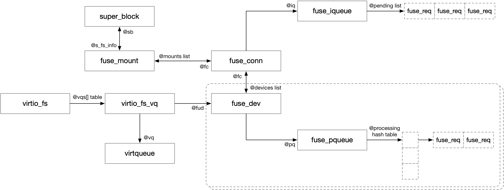

title:'virtiofs Routine'
## virtiofs Routine




#### 1. guest: probe virtiofs device

```sh
virtio_driver->probe(), i.e., virtio_fs_probe()
    # allocate virtio_fs
    virtio_fs_setup_vqs
        # find all virtqueues, stored in @fs->vqs[].vq
    virtio_fs_add_instance(fs)
        # add virtio_fs into @virtio_fs_instances global list
```


#### 2. guest: mount virtiofs

```sh
fs_context_operations->get_tree(), i.e., virtio_fs_get_tree()
    # allocate "struct fuse_conn" @fc
    # allocate "struct fuse_mount" @fm 
    
    virtio_fs_fill_super       
        fuse_conn_init // init fuse_conn
            @iq.ops = virtio_fs_fiq_ops
            @iq.priv = virtio_fs
        virtio_fs_fill_super
            # for each virtqueue, allocate and init fuse_dev
                @fs->vqs[].fud = fuse_dev_alloc
            
            fuse_fill_super_common
                # allocate root indoe and root dentry
            
            # for each fuse_dev of each virtqueue
                fuse_dev_install // add fuse_dev to @fc->devices list
            
            fuse_send_init
```


#### 3. guest: send FUSE request

这一步和之前描述的步骤是一样的，guest 内部调用 fuse_simple_background()/fuse_simple_request() 接口下发请求，此时会将下发的 FUSE 请求转换为 virtio 请求添加到 virtqueue 中，并通知 host 处理，同时将该 FUSE 请求添加到 @fpq->processing hash table 中

```sh
fuse_simple_background()/fuse_simple_request()
    __fuse_request_send(req)
        queue_request_and_unlock(fiq, req)
            # add @req to @fiq->pending list
            fiq->ops->wake_pending_and_unlock(fiq), e.g., virtio_fs_wake_pending_and_unlock() for virtio_fs_fiq_ops
                # get one request from @fiq->pending list
                virtio_fs_enqueue_req
                    # add request to virtqueue
                    # add request to @fpq->processing hash table                
                    virtqueue_notify // kick the device
```


#### 4. guest: receive FUSE reply

当 host daemon 完成该 FUSE 请求之后，会调度 @done_work worker 线程处理这些完成的 FUSE 请求

```sh
# virtio IRQ
virtio_fs_vq_done
    # schedule @done_work worker

# @done_work worker
virtio_fs_requests_done_work
    # for each completed request in this virtio queue
        # remove request from @fpq->processing hash table
        virtio_fs_request_complete
            fuse_request_end(req)
                test_and_set_bit(FR_FINISHED, &req->flags)
                if req->args->end() defined:
                    req->args->end(fm, req->args, req->out.h.error)
```


