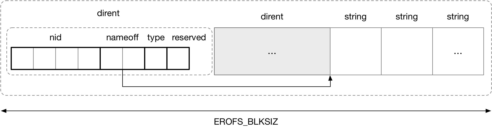

title:'EROFS - Spec - dirent'
## EROFS - Spec - dirent


```c
/* dirent sorts in alphabet order, thus we can do binary search */
struct erofs_dirent {
	__le64 nid;     /* node number */
	__le16 nameoff; /* start offset of file name */
	__u8 file_type; /* file type */
	__u8 reserved;  /* reserved */
} __packed;
```

EROFS 的 dirent 在磁盘上的布局如下



dirent 元数据和 name 字符串分开存储，以每个 EROFS_BLKSIZ 为单元，dirent 集中存储在 EROFS_BLKSIZ 的前端，而 name 字符串 (不包含 '\0') 则集中存储在 EROFS_BLKSIZ 的后端；dirent 的 @nameoff 字段则描述该 dirent 对应的 name 字符串在所在的 EROFS_BLKSIZ 中的偏移