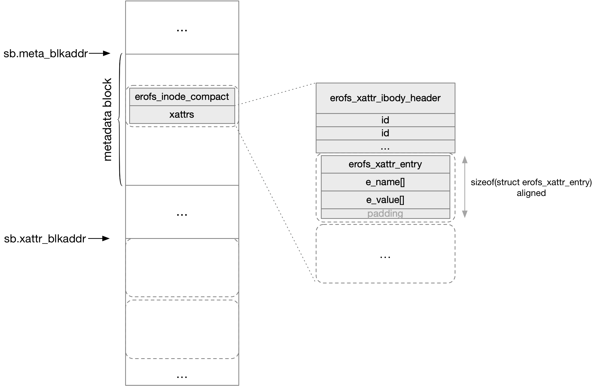

title:'EROFS - Spec - xattr'
## EROFS - Spec - xattr


### xattr entry

struct erofs_xattr_entry 抽象一个 xattr

```c
struct erofs_xattr_entry {
	__u8   e_name_len;      /* length of name */
	__u8   e_name_index;    /* attribute name index */
	__le16 e_value_size;    /* size of attribute value */
	/* followed by e_name and e_value */
	char   e_name[];        /* attribute name */
};
```

在磁盘格式上，紧接着 struct erofs_xattr_entry 结构体存储该 xattr 的 name/value 字符串

- name

xattr 的 name 字符串紧接着存储在 struct erofs_xattr_entry 结构体之后

需要注意的是，erofs 当前仅支持以下 namespace 的 xattr

```
user.
trusted.
security.
system.posix_acl_access
system.default
```

因而 erofs_xattr_entry 的 @e_name_index 字段存储当前 xattr 所在的 namespace 对应的 index 编号

```c
/* Name indexes */
#define EROFS_XATTR_INDEX_USER              1
#define EROFS_XATTR_INDEX_POSIX_ACL_ACCESS  2
#define EROFS_XATTR_INDEX_POSIX_ACL_DEFAULT 3
#define EROFS_XATTR_INDEX_TRUSTED           4
#define EROFS_XATTR_INDEX_LUSTRE            5
#define EROFS_XATTR_INDEX_SECURITY          6
```

同时紧接着 erofs_xattr_entry 后面存储的 name 字符串也不是完整的 name 字符串，而是移除对应的 xattr namespace prefix 之后的字符串

这样 @e_name_index 以及后面存储的 name 字符串组合在一起，才能描述一个完整的 name 字符串，从而节省 xattr 在磁盘上的存储空间

同时 @e_name_len 字段描述该 name 字符串的长度 (不包含 '\0')


例如要存储 "user.xattrname" xattr，那么其对应的 erofs_xattr_entry 为：

```
.e_name_index = EROFS_XATTR_INDEX_USER, i.e. 1
stored name string is "xattrname"
.e_name_len = strlen("xattrname"), i.e. 9
```

例如要存储 "system.posix_acl_access" xattr，那么其对应的 erofs_xattr_entry 为：

```
.e_name_index = EROFS_XATTR_INDEX_POSIX_ACL_ACCESS, i.e. 2
stored name string is empty
.e_name_len = 0
```


- value

erofs_xattr_entry 中紧接着 name 字符串存储的是 value

由于 xattr 的 value 不限于字符串格式，也有可能是 binary 格式的，因而@e_value_size 描述的是 value 的大小；因而如果 value 是字符串格式的，那么erofs_xattr_entry 中存储的 value 就是完整的字符串 (包含 '\0')，同时 @e_value_size 描述的是 value 字符串的大小 (包含 '\0')


EROFS 中的 xattr 有 shared 和 inline 两种布局

### shared xattr

shared 布局是指 EROFS 文件系统中的所有文件的 xattr (即 struct erofs_xattr_entry) 都集中存储在一块区间

所有 inode 都引用这一块区间内的一个个 xattr entry，这样如果两个 inode 有完全相同的 xattr (包括 name/value)，那么这个 xattr 实际上只需要在 shared xattr 区间存储一份，从而节省磁盘空间


 > shared xattr 区间内存储的各个 xattr entry (包括 struct erofs_xattr_entry 以及其后的 name/value) 是按照 sizeof(struct erofs_xattr_entry) 即 4 字节对齐的，即两个 xattr entry 之间会填充 padding 以确保每个 xattr entry 的起始地址是 sizeof(struct erofs_xattr_entry) 的整数倍
>
> shared xattr 区间内存储的所有 xattr entry 是经过排序的，整个 xattr entry (包括 name/value 以及 e_name_len/e_value_size) 作为排序的 key
>
> 对应单个 xattr entry 来说，erofs_xattr_entry 是不可能跨越 block boundary 的，但随后的 name/value 都是有可能跨越 block boundary 的


> 此外整个 shared xattr 区间的起始地址不一定是 block size 对齐的，它只确保是 sizeof(struct erofs_xattr_entry) 对齐，也就是说 shared xattr 区间的起始部分不一定占用一个完整的 block

superblock 的 @xattr_blkaddr 描述了 shared xattr 区间的起始块地址所在的 block 地址

```c
struct erofs_super_block {
	__le32 xattr_blkaddr;	/* start block address of shared xattr area */
	...
};
```


- xattr ID

shared xattr 区间内的每个 xattr entry 都对应一个区间内的编号 (ID)，从而方便 inode 通过 ID 来索引其中对应的 xattr

xattr 的 ID 的计算方式为

```
id = offset_in_shared_xattr_area / sizeof(struct erofs_xattr_entry)
```

其中 offset_in_shared_xattr_area 为该 xattr entry 在 shared xattr 区间内的偏移 (以 shared xattr 区间的起始地址所在 block 的 0 偏移处为基准)，这样是为了方便后续通过 xattr 的 ID 快速计算该 xattr entry 在磁盘中的地址

```
addr = sb->xattr_blkaddr * blksize + id * sizeof(struct erofs_xattr_entry)
```


- shared ID array (of inode)

在 shared 布局中，紧随 erofs_xattr_ibody_header 之后存储的是一个 shared ID (u32) array，其中的每个 u32 相当于一个 ID，索引上述 shared xattr 区间内的一个 xattr

```c
/*
 * inline xattrs (n == i_xattr_icount):
 * erofs_xattr_ibody_header(1) + (n - 1) * 4 bytes
 *          12 bytes           /                   \
 *                            /                     \
 *                           /-----------------------\
 *                           |  erofs_xattr_entries+ |
 *                           +-----------------------+
 * inline xattrs must starts in erofs_xattr_ibody_header,
 * for read-only fs, no need to introduce h_refcount
 */
struct erofs_xattr_ibody_header {
	__le32 h_reserved;
	__u8   h_shared_count;
	__u8   h_reserved2[7];
	__le32 h_shared_xattrs[];       /* shared xattr id array */
};
```

@h_shared_xattrs[] 就是这个 shared ID array
@h_shared_count 描述这个数组的大小 (包含的 shared ID 的数量)


inode metadata 中的 xattr 部分 (包含 erofs_xattr_ibody_header 和 shared ID array) 的大小为

```
sizeof(struct erofs_xattr_ibody_header) +
                  sizeof(__u32) * (i_xattr_icount - 1)
```

```c
/* 32-byte reduced form of an ondisk inode */
struct erofs_inode_compact {

/* 1 header + n-1 * 4 bytes inline xattr to keep continuity */
	__le16 i_xattr_icount;
	...
}
```

因而 shared 布局下，shared ID array 就相当于包含 (i_xattr_icount - 1) 个 shared ID

之所以这么设计 @i_xattr_icount 字段，是因为 erofs_xattr_ibody_header 和 shared ID 一样都是 4 字节，因而实际上 xattr 部分的大小等价为 (i_xattr_icount * 4)

> erofs_xattr_ibody_header 不会跨越 block boundary
> 
> shared xattr index array 作为一个整体是可能跨越 block boundary 的，但是数组中的单个 shared xattr index (4 字节) 是不会跨越 block boundary 的


### inline xattr

erofs 也支持 inline xattr 优化，即 xattr entry 紧接着存储在 inode 后面，这样 inode 和 xattr 存储在同一个 block 中，这样运行过程中读取 xattr 的时候不需要再读取额外的 block，从而提升性能

但是 inline xattr 相对于 shared xattr 布局会占用更多磁盘空间，因而用户可以通过 mkfs.erofs 的 `-x` 参数控制 inline/shared xattr 的分布情况

```
-x #
    Specify the upper limit of an xattr which is still inlined. The default is 2. Disable storing xattrs if < 0.
```

mkfs.erofs 的 `-x` 参数指定了一个阈值；对于特定一个 xattr，如果该 xattr 被 (不同 inode) 引用的次数超过该阈值，那么这个 xattr 就是 shared xattr 布局，否则是 inline xattr 布局

该阈值默认为 2，即至少三个 inode 引用同一个 xattr 时，该 xattr 才会是 shared xattr 布局

如果 `-x` 参数指定的阈值小于 0，那么相当于是关闭 xattr 支持




此时 inline xattr 紧接着存储在 shared ID array 后面（如果 shared ID array 为空，那么紧接着存储在 erofs_xattr_ibody_header 后面）

> 此时 xattr entry 的最后同样会填充 padding 以确保每个 xattr entry 是按照 sizeof(struct erofs_xattr_entry) 对齐的
> 
> 与 shared xattr 区间内的单个 xattr entry 类似，对于单个 inline xattr entry 来说，erofs_xattr_entry 是不可能跨越 block boundary 的，但随后的 name/value 都是有可能跨越 block boundary 的


此时 inode metadata 中的 xattr 部分 (包含 erofs_xattr_ibody_header、shared ID array、inline xattr) 的大小仍然为

```
sizeof(struct erofs_xattr_ibody_header) +
                  sizeof(__u32) * (i_xattr_icount - 1)
```

> 考虑到 erofs_xattr_ibody_header、erofs_xattr_entry 和 shared ID 都是 4 字节，因而实际上 xattr 部分的大小等价为 (i_xattr_icount * 4)