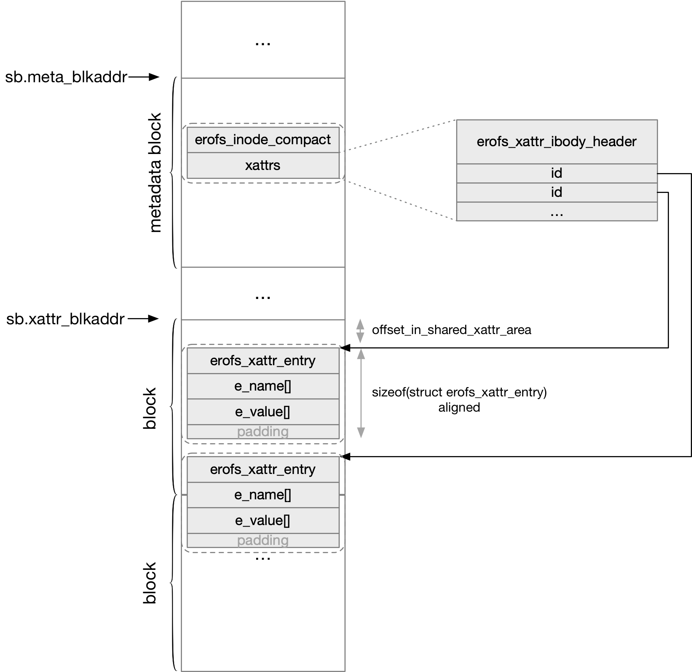

title:'EROFS - xattr'
## EROFS - xattr


struct erofs_xattr_entry 抽象一个 xattr

```c
struct erofs_xattr_entry {
	__u8   e_name_len;      /* length of name */
	__u8   e_name_index;    /* attribute name index */
	__le16 e_value_size;    /* size of attribute value */
	/* followed by e_name and e_value */
	char   e_name[];        /* attribute name */
};
```

在磁盘格式上，紧接着 struct erofs_xattr_entry 结构体存储该 xattr 的 name/value 字符串

@e_name_index 描述该 xattr.name 的前缀，例如 EROFS_XATTR_INDEX_USER 就对应名称为 "user.XXX" 的 xattr

```c
/* Name indexes */
#define EROFS_XATTR_INDEX_USER              1
#define EROFS_XATTR_INDEX_POSIX_ACL_ACCESS  2
#define EROFS_XATTR_INDEX_POSIX_ACL_DEFAULT 3
#define EROFS_XATTR_INDEX_TRUSTED           4
#define EROFS_XATTR_INDEX_LUSTRE            5
#define EROFS_XATTR_INDEX_SECURITY          6
```

@e_name_len/@e_value_size 则分别描述 name/value 的长度


EROFS 中的 xattr 有 shared 和 inline 两种布局

### shared xattr

shared 布局是指 EROFS 文件系统中的所有文件的 xattr (即 struct erofs_xattr_entry) 都集中存储在一块区间，该区间的起始块地址由 superblock 的 @xattr_blkaddr 描述

该区间内的所有 xattr (即 struct erofs_xattr_entry) 从 ID 0 开始编号，各个文件通过 ID 来索引其中的 xattr




在 shared 布局中，紧随 erofs_xattr_ibody_header 之后存储的是一个 shared ID (u32) array，其中的每个 u32 相当于一个 ID，索引上述区间内的一个 xattr

```c
/*
 * inline xattrs (n == i_xattr_icount):
 * erofs_xattr_ibody_header(1) + (n - 1) * 4 bytes
 *          12 bytes           /                   \
 *                            /                     \
 *                           /-----------------------\
 *                           |  erofs_xattr_entries+ |
 *                           +-----------------------+
 * inline xattrs must starts in erofs_xattr_ibody_header,
 * for read-only fs, no need to introduce h_refcount
 */
struct erofs_xattr_ibody_header {
	__le32 h_reserved;
	__u8   h_shared_count;
	__u8   h_reserved2[7];
	__le32 h_shared_xattrs[];       /* shared xattr id array */
};
```

@h_shared_xattrs[] 就是这个 shared ID array，@h_shared_count 描述这个数组的大小 (包含的 shared ID 的数量)


inode metadata 中的 xattr 部分 (包含 erofs_xattr_ibody_header 和 shared ID array) 的大小为

```
sizeof(struct erofs_xattr_ibody_header) +
                  sizeof(__u32) * (i_xattr_icount - 1)
```

```c
/* 32-byte reduced form of an ondisk inode */
struct erofs_inode_compact {

/* 1 header + n-1 * 4 bytes inline xattr to keep continuity */
	__le16 i_xattr_icount;
	...
}
```

因而 shared 布局下，shared ID array 就相当于包含 (i_xattr_icount - 1) 个 shared ID


另外 erofs_inode 的 @xattr_isize 字段就缓存了 inode metadata 中的 xattr 部分的大小

```c
struct erofs_inode {
	unsigned short xattr_isize;
	...
}
```

```sh
if i_xattr_icount == 0:
    xattr_isize = 0;
else:
    xattr_isize = sizeof(struct erofs_xattr_ibody_header) +
                  sizeof(__u32) * (i_xattr_icount - 1);
```


### inline xattr

xattr (即 struct erofs_xattr_entry) 可以紧接着存储在 shared ID array 后面，也就是 inline 布局


此时 inode metadata 中的 xattr 部分 (包含 erofs_xattr_ibody_header、shared ID array、inline xattr) 的大小仍然为

```
sizeof(struct erofs_xattr_ibody_header) +
                  sizeof(__u32) * (i_xattr_icount - 1)
```

```c
/* 32-byte reduced form of an ondisk inode */
struct erofs_inode_compact {

/* 1 header + n-1 * 4 bytes inline xattr to keep continuity */
	__le16 i_xattr_icount;
	...
}
```

也就是说此时 inline xattr 的大小换算成 u32 的倍数之后仍然包含在 @i_xattr_icount 中