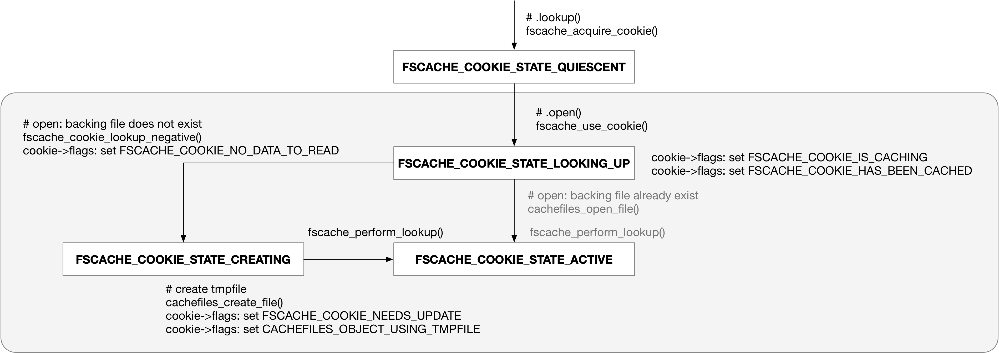
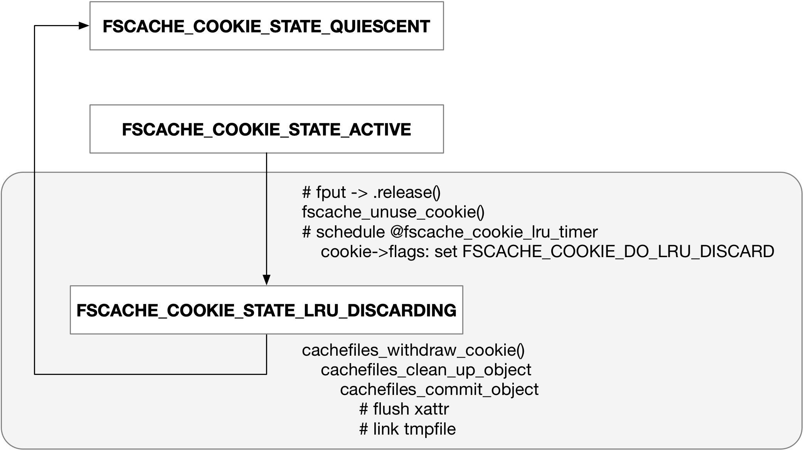
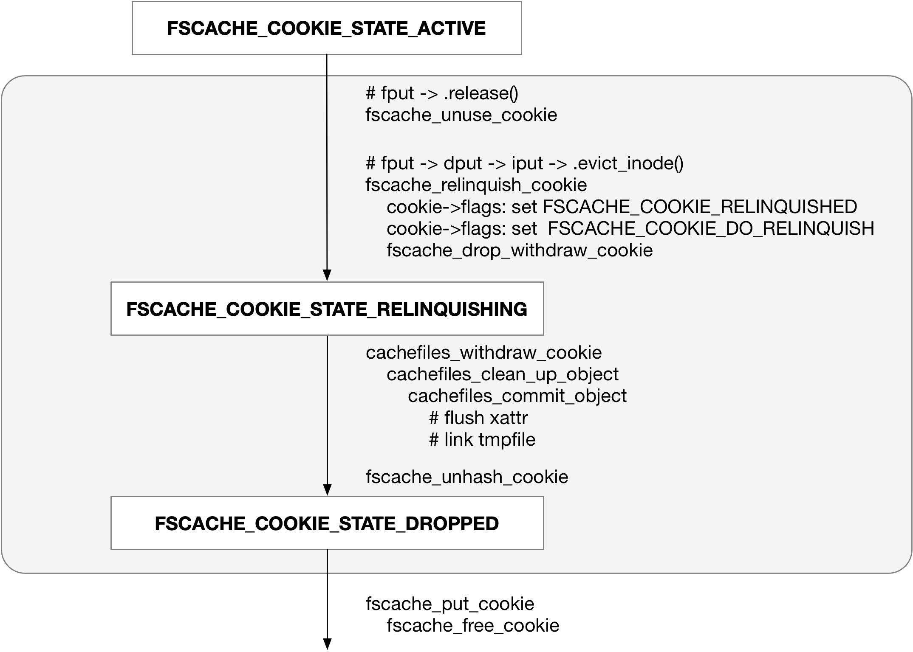
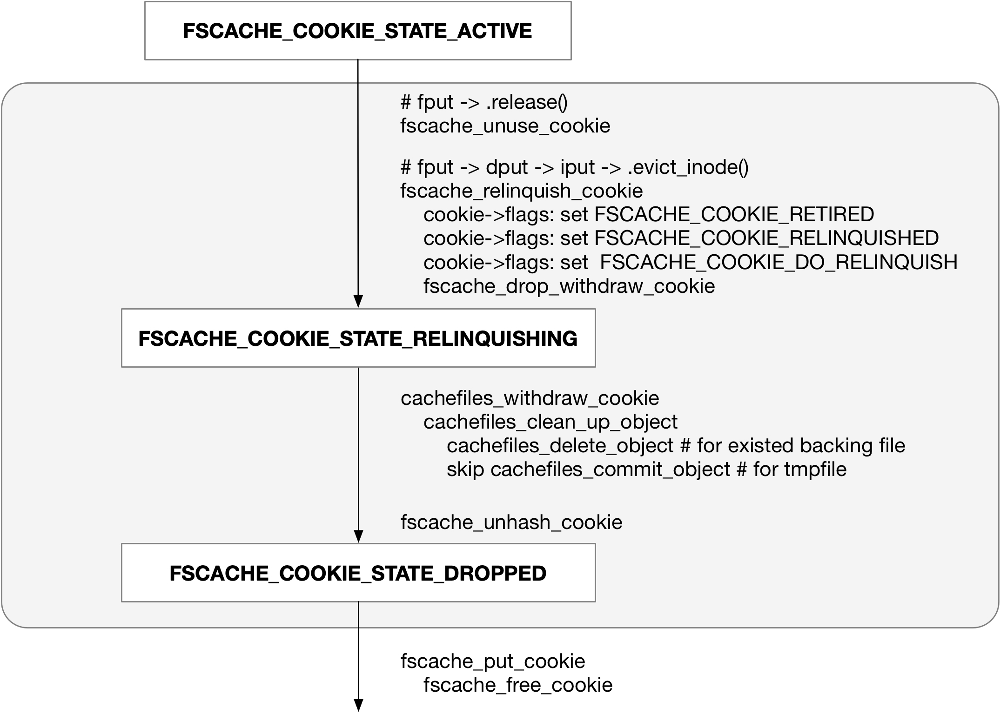
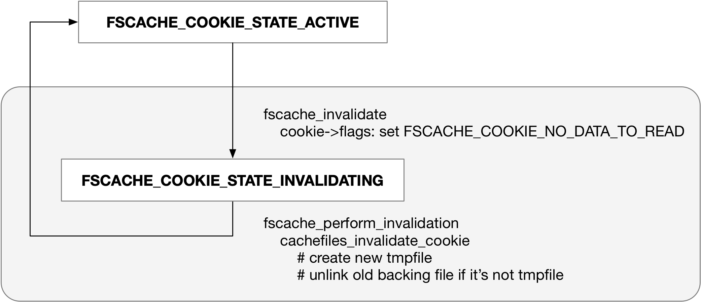

title:'fscache - 2 Routine'
## fscache - 2 Routine


#### 0. register cache

cachefiles 内核模块会注册 /dev/cachefiles 设备文件

用户态的 cachefilesd 进程对该设备文件写入 "dir"，以设置 backing 文件的根目录

```
cachefiles_daemon_write
    # process "dir" cmd
    cachefiles_daemon_dir
        cache->rootdirname = dir
```

用户态的 cachefilesd 进程对该设备文件写入 "bind"

```
cachefiles_daemon_write
    # process "bind" cmd
    cachefiles_daemon_bind
        cachefiles_add_cache
            fscache_acquire_cache # allocate cache
            fscache_add_cache # register cache
                cache->ops = cachefiles_cache_ops       
```


#### 1. register volume

volume 是一组 cookie 的集合，一般每个使用 fscache 的上层文件系统注册一个 volume

```sh
# mount
nfs_get_tree_common
    nfs_get_cache_cookie
        nfs_fscache_get_super_cookie
            fscache_acquire_volume // register superblock's volume
```

fscache_acquire_volume() 需要传入 @key 参数来唯一标识当前创建的这个 volume，nfs 中这个 key 的格式为

```
"nfs,<ver>,<family>,<port>,<address>,<fsidH>,<fsidL>*<,param>[,<uniq>]"
```


fscache_acquire_volume() 过程中会通过 worker 调用 cache->ops->acquire_volume() 回调函数，例如 cachefiles 中需要为当前注册的 volume 创建相应的目录

需要注意的是，fscache_acquire_volume() 在调度 worker 之后就会立即返回，而不会等待 worker 执行完成，即 worker 完全是异步执行的；这一过程中 fscache_acquire_volume() 在调度 worker 之前会将 volume 置上 FSCACHE_VOLUME_CREATING 标记，worker 在调用 cache->ops->acquire_volume() 回调函数完成之后，会清除该标记

```sh
# mount
fscache_acquire_volume
    # allocate and init volume
    
    fscache_create_volume
        # schedule volume->work

# worker
fscache_create_volume_work
    cache->ops->acquire_volume(), e.g., cachefiles_acquire_volume()
        # allocate and init 'struct cachefiles_volume'
        # mkdir for volume under '<root>/cache/'
```

cachefiles 中会在 '<root>/cache/' 目录下为当前注册的 volume 创建相应的目录，其格式为 "I<volume_key>"，其中 <volume_key> 为 volume 的名称，即 fscache_acquire_volume() 传入的 @volume_key 参数

同时在 "I<volume_key>" 目录下创建 256 个子目录，其命名格式为 "@%02x", i=0~255


#### 2. register cookie

上层文件系统一般为每个 inode 注册一个对应的 cookie

```sh
# mount
nfs_get_tree_common
    nfs_get_root
        nfs_fhget
            nfs_fscache_init_inode
                fscache_acquire_cookie // register root inode's data cookie
```

```sh
# .lookup
nfs_lookup
    nfs_fhget
        nfs_fscache_init_inode
            fscache_acquire_cookie // register inode's data cookie
```


#### 3. open file



##### 3.1 lookup cache file

open 文件的时候，需要调用 fscache_use_cookie() 增加 cookie 的 @n_active 计数

如果对于某个 cookie，当前是第一次调用 fscache_use_cookie()，那么还会调用 cache->ops->lookup_cookie() 回调函数，以寻找该 cookie 对应的 cache file

这里会调度 worker 执行 cache->ops->lookup_cookie() 回调函数；类似地这里的 worker 也是异步执行的，当 worker 执行完毕的时候，cookie 会转变为 FSCACHE_COOKIE_STATE_ACTIVE 状态

```sh
# open
nfs_open
    nfs_fscache_open_file
        fscache_use_cookie
            # inc @cookie->n_active refcount
            
            # cookie is in FSCACHE_COOKIE_STATE_QUIESCENT state
            fscache_begin_lookup
                cookie->state = FSCACHE_COOKIE_STATE_LOOKING_UP state 
                cookie->flags |= FSCACHE_COOKIE_IS_CACHING
                cookie->flags |= FSCACHE_COOKIE_HAS_BEEN_CACHED
            
            fscache_queue_cookie // schedule cookie->work

# worker
fscache_cookie_worker
    fscache_cookie_state_machine
        # cookie is in FSCACHE_COOKIE_STATE_LOOKING_UP state
        fscache_perform_lookup
            cache->ops->lookup_cookie(), e.g. cachefiles_lookup_cookie()
                cachefiles_cook_key
                cachefiles_look_up_object
            
            cookie->state = FSCACHE_COOKIE_STATE_ACTIVE state
```

> backing file 路径

之前介绍过，volume 注册的时候，cachefiles 会在 '<root>/cache/' 目录下创建格式为 "I<volume_key>" 的目录，同时在该目录下创建 256 个子目录

每个 cookie 会有一个对应的 backing file，这些 backing file 会均匀分布在这 256 个子目录中；对于某个特定的 cookie，其 @key_hash (u32) 存储对应的 hash 值，其实际上是根据 cookie 的 key 进行 hash 运算得来的，将该 hash 值对于 256 作一个 hash 映射 (hash_value % 256)，就得到了该 cookie 对应的 backing file 应该保存在哪个子目录下


> backing file 尚未创建

open 文件的时候，会调用 cache->ops->lookup_cookie() 回调函数，cachefiles 下如果当前执行 lookup 操作的 cookie 对应的 backing file 尚未创建，那么会创建一个 tmpfile 文件，这个文件的大小会被设置为 @cookie->object_size

```sh
fscache_perform_lookup
    cache->ops->lookup_cookie(), e.g. cachefiles_lookup_cookie()
        cachefiles_cook_key
        cachefiles_look_up_object
            # corresponding backing file not created yet
            cachefiles_create_file
                # create tmpfile
```

需要注意的是，tmpfile 文件刚创建的时候，此时文件的路径还不在之前描述的对应的 fan 子目录下，而是在 tmp filesystem 统一的临时目录下


> backing file 已经存在

上述调用 cache->ops->lookup_cookie() 回调函数的过程中，如果当前执行 lookup 操作的 cookie 对应的 backing file 已经存在，那么就会直接打开该文件

```sh
fscache_perform_lookup
    cache->ops->lookup_cookie(), e.g. cachefiles_lookup_cookie()
        cachefiles_cook_key
        cachefiles_look_up_object
            # corresponding backing file already exist
            cachefiles_open_file
                # open backing file
                
                cachefiles_check_auxdata
                    # read "CacheFiles.cache" xattr
```

cachefiles 下的 backing file 都会打上 "CacheFiles.cache" xattr，其值为

```
+---------------------------+---------------+
|   struct cachefiles_xattr |   aux_data    |
+---------------------------+---------------+
```

其中 cachefiles_xattr.type 为 CACHEFILES_COOKIE_TYPE_DATA；紧随 struct cachefiles_xattr 其后的是该 cookie 的 aux_data


此时在 open 文件，从而调用 cache->ops->lookup_cookie() 回调函数的过程中，如果 cookie 对应的 backing file 已经存在，那么此时就会检查该 backing file 的 "CacheFiles.cache" xattr 的值是否有效，主要包括

- 检查 backing file 的 "CacheFiles.cache" xattr 中存储的 aux_data 与 fscache_acquire_cookie() 传入的 @aux_data 是否一致
- 检查 backing file 的 "CacheFiles.cache" xattr 中存储的 object_size 与 fscache_acquire_cookie() 传入的 @object_size 是否一致

只有以上都保持一致，该 backing file 的一致性检查才算通过


##### 3.2 open file

之后再 open 文件的时候，同样会调用 fscache_use_cookie()，但此时只是增加 cookie 的 @n_active 计数

```sh
# open
nfs_open
    nfs_fscache_open_file
        fscache_use_cookie
            # inc @cookie->n_active refcount
```


#### 4. IO path

##### 4.1 read

```sh
# .readpage()
netfs_readpage(..., xxx_netfs_read_request_ops)
    # allocate and init 'struct netfs_read_request'
        ops->init_rreq() if defined
    
    ops->begin_cache_operation() if defined
        fscache_begin_read_operation
            fscache_begin_operation(..., FSCACHE_WANT_PARAMS)
                cache->ops->begin_operation(), e.g. cachefiles_begin_operation()
                    # @cres (struct netfs_cache_resources) is actually @cache_resources of previously allocated 'struct netfs_read_request'
                    # @want_state = FSCACHE_WANT_PARAMS
                    
                    cres->ops = &cachefiles_netfs_cache_ops
                    cres->cache_priv2 = 'struct file' of corresponding backing file

    netfs_rreq_submit_slice // submit sub requests
        netfs_rreq_prepare_read
            netfs_cache_prepare_read
                cres->ops->prepare_read(), e.g. cachefiles_prepare_read()
```

###### NETFS_FILL_WITH_ZEROES

如果当前访问的数据范围超过了文件的大小，即 EOF 访问，那么此时直接对需要访问的数据范围作填零处理

```sh
netfs_rreq_submit_slice
    netfs_rreq_prepare_read
        netfs_cache_prepare_read
            cres->ops->prepare_read(), e.g. cachefiles_prepare_read()
                # if read past EOF, return NETFS_FILL_WITH_ZEROES
    
    # since source == NETFS_FILL_WITH_ZEROES
    netfs_read_from_cache
        __set_bit(NETFS_SREQ_CLEAR_TAIL, &subreq->flags)
        netfs_subreq_terminated
            # since NETFS_SREQ_CLEAR_TAIL set
            netfs_clear_unread // fill zero
```


###### NETFS_DOWNLOAD_FROM_SERVER

如果 block 对应在 backing file 中是 hole，此时就必须从远端拉取

```sh
netfs_rreq_submit_slice
    netfs_rreq_prepare_read
        netfs_cache_prepare_read
            cres->ops->prepare_read(), e.g. cachefiles_prepare_read()
                # if FSCACHE_COOKIE_NO_DATA_TO_READ set in cookie->flags (the backing file is completely empty),
                # or the range covered by sub request is completely hole (fully miss)
                    __set_bit(NETFS_SREQ_WRITE_TO_CACHE, &subreq->flags)
                    return NETFS_DOWNLOAD_FROM_SERVER

    # since source == NETFS_DOWNLOAD_FROM_SERVER
    netfs_read_from_server
        netfs_ops->issue_op(subreq)
            # fetch data from remote, store into netpage
```

这里会调用 netfs 自己实现的 issue_op() 回调函数以从远端拉取数据，此时拉取的数据会直接存储在 netfs_readpage() 传入的 @folio 中，即将数据读取到 netfs 中的一个 page cache 中

这里下发的 subrequest 是异步完成的，当 subrequest 完成的时候会给整个 request 标记上 NETFS_RREQ_WRITE_TO_CACHE

```sh
# when data has been fetched
netfs_subreq_terminated
    # since NETFS_SREQ_WRITE_TO_CACHE set in &subreq->flags
    set_bit(NETFS_RREQ_WRITE_TO_CACHE, &rreq->flags)
```

之后当这个 request 对应的所有 subrequest 都完成的时候，就需要将从远端拉取的数据，缓存到 backing file 中

```sh
netfs_readpage
    atomic_set(&rreq->nr_rd_ops, 1); // initial refcount

    # for each sub request
    netfs_rreq_submit_slice
        netfs_rreq_prepare_read
        atomic_inc(&rreq->nr_rd_ops) // inc refcount
        
        # fetch data, i.e. read from cache or remote
        
    # wait for all sub requests completion
    wait_var_event(&rreq->nr_rd_ops, atomic_read(&rreq->nr_rd_ops) == 1)
    
    netfs_rreq_assess
        # since NETFS_RREQ_WRITE_TO_CACHE set in &rreq->flags
        netfs_rreq_write_to_cache
            netfs_rreq_do_write_to_cache
                # iterate all sub requests, and for each sub request marked with NETFS_SREQ_WRITE_TO_CACHE
                cres->ops->prepare_write(subreq), e.g. cachefiles_prepare_write()
                    # reserve block for backing backing file if block not allocated yet
        
                # DIRECT write data from netpage (from netfile's address_space) to backing backing file    
                cres->ops->write(), e.g. cachefiles_write()
```

这里对所有带有 NETFS_SREQ_WRITE_TO_CACHE 标记的 subrequest，即 NETFS_DOWNLOAD_FROM_SERVER 类型的 subrequest，调用 cache backend 实现的 write() 回调函数，以将数据回写到 backing file 中

这里是通过 DIRECT write 直接将 netfs 的 page cache 中的数据写到 backing file 中


###### NETFS_READ_FROM_CACHE

如果 block 对应的数据已经在 backing file 中 ready，那么直接从 backing file 读取就好

```sh
netfs_rreq_submit_slice
    netfs_rreq_prepare_read
        netfs_cache_prepare_read
            cres->ops->prepare_read(), e.g. cachefiles_prepare_read()
                # if the range covered by sub request is completely ready (fully hit)
                return NETFS_READ_FROM_CACHE

    # since source == NETFS_READ_FROM_CACHE
    netfs_read_from_cache
        netfs_cache_ops->read(), e.g. cachefiles_read()
            vfs_iocb_iter_read // DIRECT read from backing backing file
            return -EIOCBQUEUED
```

这里会通过 DIRECT read，直接将数据从 backing file 读取到 netfs_readpage() 传入的 @folio 中，即将数据读取到 netfs 中的一个 page cache 中

这里下发的 subrequest 是异步完成的

```sh
# async completion
cachefiles_read_complete
    netfs_cache_read_terminated
        netfs_subreq_terminated
```


netfs_cache_ops->read() 回调函数的 @read_hole 描述对 backing file 的 hole 的处理方式

NETFS_READ_HOLE_IGNORE 会直接向 backing file 发起 DIRECT IO，而无论对应的 file offset 区间内是否存在 hole，此时 backing file 所在的文件系统在处理该 DIRECT IO (例如 iomap_dio_rw()) 的时候，检测到该区间内存在 hole 时，就会将 page 内该 hole 对应的区域清为 0

NETFS_READ_HOLE_CLEAR 和 NETFS_READ_HOLE_FAIL 两种情况下都会对 backing file 执行 SEEK_DATA llseek 操作，以判断对应的 file offset 区间内是否存在 hole。如果存在 hole，对于 NETFS_READ_HOLE_FAIL 来说，当前的 read 操作会直接返回 -ENODATA 错误；而对于 NETFS_READ_HOLE_CLEAR 来说，将 page 内该 hole 对应的区域清为 0


因而 NETFS_READ_HOLE_IGNORE 与 NETFS_READ_HOLE_CLEAR 虽然都会将 page 内 hole 对应的区域清为 0，但是两者的区别是：

NETFS_READ_HOLE_CLEAR 是通过 SEEK_DATA llseek 操作来判断对应的 file offset 区间内是否存在 hole，此时不会向 backing file 所在的文件系统下发 DIRECT IO，但是这里会多一次 llseek 操作，因而适用于事先不清楚该 file offset 区间内是否存在 hole 的情况

而 NETFS_READ_HOLE_IGNORE 则是直接向 backing file 所在的文件系统下发 DIRECT IO，在处理该 DIRECT IO 的过程中检测到 hole 的时候，才会将 page 内 hole 对应的区域清为 0，因而适用于事先确定该 file offset 区间内不存在 hole 的情况


###### incomplete sub request

之前介绍过 subrequest 的 @len 字段描述其需要读取的数据长度

```c
struct netfs_read_subrequest {
	size_t			len;		/* Size of the I/O */
	...
}
```

无论是直接从 backing file 读取数据，还是从远端拉取数据，实际成功读取到的数据都可能小于 @len

fscache 中可以通过 netfs_subreq_terminated() 执行 subrequest 的 completion 操作，@transferred_or_error 就描述此次该 subrequest 成功读取到的数据长度，即传入的 @transferred_or_error 参数有可能小于 @len

```c
void netfs_subreq_terminated(struct netfs_read_subrequest *subreq,
			     ssize_t transferred_or_error,
			     bool was_async)
```

此时 subrequest 的 @transferred 字段描述截止当前，该 subrequest 已经成功读取的数据大小

```c
struct netfs_read_subrequest {
	size_t			transferred;	/* Amount of data transferred */
	...
}
```

此时 subrequest 的 completion 操作中，如果实际读取的数据小于 @len，那么该 subrequest 就会标记为 NETFS_SREQ_SHORT_READ，整个 reqeust 会标记为 NETFS_RREQ_INCOMPLETE_IO

```sh
# when data has been fetched
netfs_subreq_terminated
    subreq->transferred += transferred_or_error;
    
    if subreq->transferred < subreq->len:
        __set_bit(NETFS_SREQ_SHORT_READ, &subreq->flags);
        set_bit(NETFS_RREQ_INCOMPLETE_IO, &rreq->flags);
```

之后当所有 subrequest 完成的时候，netfs_readpage() 中检查到存在 incomplete request，就会对所有标记为 NETFS_SREQ_SHORT_READ 的 subrequest 重新发起 read 操作

```sh
netfs_readpage
    # for each sub request
    netfs_rreq_submit_slice
        netfs_rreq_prepare_read
        
        # fetch data, i.e. read from cache or remote
        
    # wait for all sub requests completion
    wait_var_event(&rreq->nr_rd_ops, atomic_read(&rreq->nr_rd_ops) == 1) 
    
    netfs_rreq_assess
        if test_bit(NETFS_RREQ_INCOMPLETE_IO, &rreq->flags):
            netfs_rreq_perform_resubmissions
                # for each subrequest marked with NETFS_SREQ_SHORT_READ:
                    netfs_rreq_short_read
                        netfs_read_from_cache()/netfs_read_from_server()
```

因而对于一个 subrequest 来说，当前真正需要读取的数据范围实际上是，[start + transferred, start + len]

```c
struct netfs_read_subrequest {
	loff_t			start;		/* Where to start the I/O */
	size_t			len;		/* Size of the I/O */
	size_t			transferred;	/* Amount of data transferred */
	...
}
```

###### req completion

之前描述过，一个 struct netfs_read_request 可能会拆分为多个 struct netfs_read_subrequest

每个 subrequest 完成的时候都会调用 netfs_subreq_terminated()，其中减小 @rreq->nr_rd_ops 计数；最终当所有 subrequest 都完成的时候，也就是 @rreq->nr_rd_ops 计数变为 1 (initial refcount) 的时候，会唤醒一直等待在那边的 netfs_readpage()

```sh
# when data has been fetched for each subreq
netfs_subreq_terminated
    atomic_dec_return(&rreq->nr_rd_ops) // dec refcount
    
    # if currently @rreq->nr_rd_ops has decreasedto '1'
    # (all sub requests completed, there's initial refcount only)
    wake_up_var(&rreq->nr_rd_ops)
```


netfs_readpage() 在下发完所有 subrequest 的时候，需要等待所有的 subrequest 完成，也就是等待 @nr_rd_ops 计数变为 1 (initial refcount)；之后会调用 netfs_rreq_assess()，其中就会给对应的 page 置上 PG_locked/PG_uptodate 标记

```sh
netfs_readpage
    atomic_set(&rreq->nr_rd_ops, 1); // initial refcount

    # for each sub request
    netfs_rreq_submit_slice
        netfs_rreq_prepare_read
        atomic_inc(&rreq->nr_rd_ops) // inc refcount
        
        # fetch data, i.e. read from cache or remote
        
    # wait for all sub requests completion
    wait_var_event(&rreq->nr_rd_ops, atomic_read(&rreq->nr_rd_ops) == 1)
    
    netfs_rreq_assess
        netfs_rreq_unlock
            folio_mark_uptodate(folio)
            folio_unlock(folio)
```    


##### 4.2 write

buffer write 的时候只是将数据写入 netpage 中，之后只是将 cookie 标记上 FSCACHE_COOKIE_LOCAL_WRITE

FSCACHE_COOKIE_LOCAL_WRITE 描述曾经对 cookie 执行过 write 操作

```sh
# f_op->write_iter()
    a_ops->write_begin()
        # check if netpage ready, read from remote server or cache if not
        netfs_write_begin

# buffer write
# write to netpage

# .write_end()
    folio_mark_dirty
        mapping->a_ops->set_page_dirty()
            fscache_set_page_dirty
                node->i_state |= I_PINNING_FSCACHE_WB
                fscache_use_cookie(cookie, true)
                    # initial state: cookie is in FSCACHE_COOKIE_STATE_ACTIVE state
                    # cookie->flags: set FSCACHE_COOKIE_LOCAL_WRITE
                    # cookie->flags: set FSCACHE_COOKIE_DO_PREP_TO_WRITE
                    # schedule worker

# worker
fscache_cookie_worker
    # since FSCACHE_COOKIE_DO_PREP_TO_WRITE bit is set
    fscache_prepare_to_write
        cache->ops->prepare_to_write(), e.g. cachefiles_prepare_to_write()
            # basically do nothing
```


之后等到回写的时候，把 netpage 中的数据回写到远端 server，同时也回写到本地的缓存文件中

```sh
# writeback routine, a_ops->writepage()
    # writeback to remote server
    
    # also writeback to backing backing file
    fscache_write_to_cache
        # allocate and init 'struct fscache_write_request'
        
        fscache_begin_operation(..., FSCACHE_WANT_PARAMS)
            cache->ops->begin_operation(), e.g. cachefiles_begin_operation()
                # @cres (struct netfs_cache_resources) is actually @cache_resources of previously allocated 'struct fscache_write_request'
                # @want_state = FSCACHE_WANT_PARAMS
                
                cres->ops = &cachefiles_netfs_cache_ops
                cres->cache_priv2 = 'struct file' of corresponding backing file
        
        cres->ops->prepare_write(), e.g. cachefiles_prepare_write()
            # reserve block for backing backing file if block not allocated yet
        
        # writeback data from netpage to backing backing file    
        fscache_write
             cres->ops->write(), e.g. cachefiles_write()
                # DIRECT write to backing backing file
```


#### 5. close file


##### 5.1 n_active

@n_active 计数描述当前有多少实例打开了该 cache file

```c
struct fscache_cookie {
	atomic_t			n_active;	/* number of active users of cookie */
	...
}
```

netfs 在 open 文件的时候，都需要调用 fscache_use_cookie()，其中就会增加 cookie 的 @n_active 计数

```sh
f_op->open()
    fscache_use_cookie
        # inc @cookie->n_active refcount
```


当 file 的最后一个引用计数变为 0 (通过 fput)，从而调用 f_ops->release() 回调函数的时候，这其中需要调用 fscache_unuse_cookie()，以执行 open 时调用的 fscache_use_cookie() 的逆操作

大部分情况下，fscache_unuse_cookie() 都只是减去 @n_active 计数

```sh
fput
    ____fput
        file->f_op->release()
            fscache_unuse_cookie
                # dec @cookie->n_active refcount
```


##### 5.2 withdraw




而当 @n_active 计数减为 0 的时候，会将 cookie 添加到 @fscache_cookie_lru 全局链表，并调度 @fscache_cookie_lru_timer，定时为 fscache_lru_cookie_timeout 即 10s

```sh
# .release()
fscache_unuse_cookie
    # dec @cookie->n_active refcount
    
    # if @cookie->n_active decreased to 0
    fscache_unuse_cookie_locked
        cookie->unused_at = jiffies;
        # add this cookie into @fscache_cookie_lru list
        # schedule @fscache_cookie_lru_timer
```

定时到来的时候，@fscache_cookie_lru_timer 就会依次处理 @fscache_cookie_lru 链表中的 cookie，其中如果 cookie 的 @n_accesses 计数已经变为 0，那么就调度 cookie state machine 以清理该 cookie

```sh
# timer
fscache_cookie_lru_timed_out
    # schedule @fscache_cookie_lru_work

# worker
fscache_cookie_lru_worker
    # for each cookie in @fscache_cookie_lru list
        fscache_cookie_lru_do_one(cookie)
            # cookie->flags: set FSCACHE_COOKIE_DO_LRU_DISCARD
            __fscache_withdraw_cookie
                # if @cookie->n_accesses is already 0
                    # schedule fscache_cookie_state_machine
```


在 cookie state machine 中就会调用 cache->ops->withdraw_cookie() 回调函数，其中会调用 cachefiles_commit_object()

这里主要是给 cache file 设置上 "CacheFiles.cache" xattr，其中包含该 cookie 的 aux_data、object_size 等元数据信息

同时之前描述 open 文件的时候，会对该文件对应的 cache file 执行 lookup 操作，如果此时该 cache file 尚未创建，那么会创建一个 tmpfile 文件；此时 close 文件的时候，会通过 link() 调用将该 tmpfile 文件 link 到对应的 fan 子目录下

最后会对 cache file 执行 close 操作

```sh
fscache_cookie_state_machine
    # cookie is in FSCACHE_COOKIE_STATE_ACTIVE state
    # since FSCACHE_COOKIE_DO_LRU_DISCARD is set in cookie->flags
    cookie->state = FSCACHE_COOKIE_STATE_LRU_DISCARDING
    
    # cookie is in FSCACHE_COOKIE_STATE_LRU_DISCARDING state
    cache->ops->withdraw_cookie(), e.g. cachefiles_withdraw_cookie()
            cachefiles_clean_up_object
                cachefiles_commit_object
                    # if FSCACHE_COOKIE_NEEDS_UPDATE is set, i.e. cache file previously not exist and thus newly created,
                    # or FSCACHE_COOKIE_LOCAL_WRITE is set, i.e. previously write to netpage
                    cachefiles_set_object_xattr
                        # set "CacheFiles.cache" xattr of cache file
                    
                    cachefiles_commit_tmpfile
                        # link a temporary file into its rightful place under corresponding fan subdir
                        # cookie->flags: clear CACHEFILES_OBJECT_USING_TMPFILE
                    
                # close cache file

    # clear FSCACHE_COOKIE_DO_LRU_DISCARD in cookie->flags
    cookie->state = FSCACHE_COOKIE_STATE_QUIESCENT
```

最后 cookie 的状态会重置为 FSCACHE_COOKIE_STATE_QUIESCENT，之后当上层文件系统再次 open 文件的时候，会再次调用 fscache_use_cookie()，从而再次触发 cookie 的 lookup 操作，从而再次将 cookie 设置为 FSCACHE_COOKIE_STATE_ACTIVE 状态


##### 5.3 relinquish 



上述对文件 close 之后，最后一个 fput 会触发定时器调用 cache->ops->withdraw_cookie()，以对 cache file 执行 withdraw 操作，即之前的 cache->ops->lookup_cookie() 的逆操作，这里主要是将之前 cache->ops->lookup_cookie() 中打开的 cache file 给 close 掉

上述流程执行完成后，cookie 的状态又恢复为 cache->ops->lookup_cookie() 执行前的 FSCACHE_COOKIE_STATE_QUIESCENT；如果之后又对文件执行 open 操作，那么就会重新执行一遍 "3.1 lookup cache file" 中的流程


上述最后一个 fput 后续还会触发 dput，但此时 dentry 的计数变为 0 时一般并不会释放这个 dentry，而只是转变为 unused dentry；实际上只有在卸载文件系统或者内存回收时才会释放这些计数为 0 的 dentry，此时会触发 iput；而最后一个 iput 执行过程中会调用 s_ops->evict_inode() 回调函数

```sh
fput
    ____fput
        file->f_op->release()
            fscache_unuse_cookie
                # dec @cookie->n_active refcount
                # if @cookie->n_active decreased to 0
                    # withdraw cookie (add cookie into @fscache_cookie_lru list)
            
            dput(file->f_path.dentry)
                # switch to unused dentry
            
# umount
kill_sb(), that is, kill_block_super
    generic_shutdown_super
        shrink_dcache_for_umount
            do_one_tree
                shrink_dcache_parent
                    shrink_dentry_list
                        __dentry_kill
                            dentry_unlink_inode
                                iput(dentry->d_inode)
                                    # decrease @i_count reference count
                                    # if @i_count decreased to zero
                                    iput_final 
                                        # evict
                                            s_op->evict_inode()
```

s_ops->evict_inode() 回调函数中需要调用 fscache_relinquish_cookie() 以执行 fscache_acquire_cookie() 的逆操作，这里同样会调度 cookie state machine 执行 withdraw 操作，并 drop @cookie->ref 的初始计数
       
```                         
s_ops->evict_inode()
    fscache_relinquish_cookie(cookie, @retire)
        # cookie->flags: set FSCACHE_COOKIE_RELINQUISHED
        # cookie->flags: set FSCACHE_COOKIE_DO_RELINQUISH
        fscache_drop_withdraw_cookie
            # remove from @fscache_cookie_lru list
            __fscache_withdraw_cookie
                # if @cookie->n_accesses is already 0
                    # schedule cookie state machine

        fscache_put_cookie // drop @ref initial refcount
```


这其中执行 withdraw 操作的过程中，如果调用 fscache_relinquish_cookie() 的时候，这个 cookie 已经被 @fscache_cookie_lru_timer 执行过 withdraw 操作了，那么此时基本不执行什么操作

```sh
# cookie state machin
fscache_cookie_state_machine
    # cookie is in FSCACHE_COOKIE_STATE_QUIESCENT state
    # since FSCACHE_COOKIE_DO_RELINQUISH is set
    cookie->state = FSCACHE_COOKIE_STATE_RELINQUISHING
    
    # cookie is in FSCACHE_COOKIE_STATE_RELINQUISHING state
    fscache_unhash_cookie // unhash cookie
    cookie->state = FSCACHE_COOKIE_STATE_DROPPED state
```


而如果调用 fscache_relinquish_cookie() 的时候，这个 cookie 还没有被 @fscache_cookie_lru_timer 执行过 withdraw 操作，那么此时会调用 cache->ops->withdraw_cookie() 以对该 cookie 执行 withdraw 操作

```sh
# cookie state machin
fscache_cookie_state_machine
    # cookie is in FSCACHE_COOKIE_STATE_ACTIVE state
    # since FSCACHE_COOKIE_DO_LRU_DISCARD is not set,
    # while FSCACHE_COOKIE_DO_RELINQUISH is set
    cookie->state = FSCACHE_COOKIE_STATE_RELINQUISHING state
    
    # cookie is in FSCACHE_COOKIE_STATE_RELINQUISHING state
    cache->ops->withdraw_cookie(), e.g. cachefiles_withdraw_cookie()
            cachefiles_clean_up_object
                cachefiles_commit_object
                    ...
                # close cache file
    
    # cookie is in FSCACHE_COOKIE_STATE_RELINQUISHING state
    fscache_unhash_cookie // unhash cookie
    cookie->state = FSCACHE_COOKIE_STATE_DROPPED state
```


上述介绍到 fscache_relinquish_cookie() 中会 drop @cookie->ref 的初始计数；但此时 cookie 的 @ref 计数还不是 0，因为在此之前在调度 cookie state machine 的时候，已经加上了一个临时计数

后面 state machine 执行结束的时候，会减去调度 cookie state machine 之前加上的一个临时计数，此时当 @ref 计数变为 0 的时候，才会触发 cookie 的释放

```                         
s_ops->evict_inode()
    fscache_relinquish_cookie(cookie, @retire)
        fscache_drop_withdraw_cookie
            __fscache_withdraw_cookie
                # if @cookie->n_accesses is already 0
                    fscache_queue_cookie
                        fscache_get_cookie // inc @ref refcount
                        # schedule cookie state machine

        fscache_put_cookie // drop @ref initial refcount


# cookie state machin
fscache_cookie_worker
    fscache_cookie_state_machine
        cache->ops->withdraw_cookie(), e.g. cachefiles_withdraw_cookie()
            cachefiles_clean_up_object
                cachefiles_commit_object
                    ...
                # close cache file
        ...
        fscache_unhash_cookie // unhash cookie
        cookie->state = FSCACHE_COOKIE_STATE_DROPPED state

    fscache_put_cookie
        # dec @ref refcount
        # if @ref refcount decreased to 0
            fscache_free_cookie // free 'struct fscache_cookie'
```


##### 5.4 retire cache file



```c
void fscache_relinquish_cookie(struct fscache_cookie *cookie, bool retire)
```

同时值得注意的是，fscache_relinquish_cookie() 的 @retire 参数描述是否丢弃 cache file

当 @retire 参数为 false 时，fscache_relinquish_cookie() 函数的执行路径如之前描述的，会执行 cachefiles_commit_object()，以将 tmpfile link 到对应的 fan 子目录下，从而使得 cache file 存储到磁盘上

而当 @retire 参数为 true 时，fscache_relinquish_cookie() 函数的执行路径如下所示，此时不会执行 cachefiles_commit_object()，也就是说 cache file 不会存储到磁盘上，之后 inode eviction 流程中该 tmpfile 就会被移除

```sh
s_ops->evict_inode()
    fscache_relinquish_cookie(cookie, @retire)
        # if @retire is true
            # cookie->flags: set FSCACHE_COOKIE_RETIRED
        # cookie->flags: set FSCACHE_COOKIE_RELINQUISHED
        # cookie->flags: set FSCACHE_COOKIE_DO_RELINQUISH
        fscache_drop_withdraw_cookie
            __fscache_withdraw_cookie
                # schedule cookie state machine

# cookie state machine
fscache_cookie_state_machine
    # cookie is in FSCACHE_COOKIE_STATE_ACTIVE state
    # since FSCACHE_COOKIE_DO_RELINQUISH is set
    cookie->state = FSCACHE_COOKIE_STATE_RELINQUISHING state
    
    # cookie is in FSCACHE_COOKIE_STATE_RELINQUISHING state
    cache->ops->withdraw_cookie(), e.g. cachefiles_withdraw_cookie()
        cachefiles_clean_up_object
            # since FSCACHE_COOKIE_RETIRED bit is set
                # if CACHEFILES_OBJECT_USING_TMPFILE is set:
                    # cachefiles_commit_object() is not called
                # else:
                    cachefiles_delete_object // delete cache file

    cookie->state = FSCACHE_COOKIE_STATE_DROPPED state
```


#### 6. invalidate



在网络文件系统中，当第三方修改文件导致 client 接收到 server 的通知，文件被改变的时候，client 就需要对该文件对应的缓存文件执行 invalidate 操作，其本质上是将该文件之前的缓存 (backing file) 丢弃掉，并新建一个新的 backing file 重新开始缓存 

```sh
fscache_invalidate
    # cookie->flags: set FSCACHE_COOKIE_NO_DATA_TO_READ
    cookie->state = FSCACHE_COOKIE_STATE_INVALIDATING
    
# cookie state machine
fscache_cookie_state_machine
    # cookie is in FSCACHE_COOKIE_STATE_INVALIDATING state
    fscache_perform_invalidation
        cache->ops->invalidate_cookie(), i.e. cachefiles_invalidate_cookie()
            # create new tmpfile as the new backing file
            cookie->state = FSCACHE_COOKIE_STATE_ACTIVE // this cookie can be reused now
            cachefiles_bury_object // delete old backing file
```

#### 7. resize

当上层文件系统的文件执行 truncate 操作时，需要调用 fscache_resize_cookie() 

```sh
fscache_resize_cookie
    # cookie->flags: set FSCACHE_COOKIE_NEEDS_UPDATE
    ops->resize_cookie(..., new_size), i.e. cachefiles_resize_cookie()
        # if new_size < old_size:
            cachefiles_shorten_object
                vfs_truncate // truncate backing file to new_size
            cookie->object_size = new_size
        # else:
            cookie->object_size = new_size // simply update cookie->object_size to new_size
```


#### 8. culling

cachefilesd 可以通过 write /dev/cachefiles 设置 brun/bcull/bstop frun/fcull/fstop 水位线，当 cachefiles 的缓存文件占用的空间超过这个水位线的时候，fscache 就会受到限制

具体来讲，当缓存文件所在的文件系统的可用空间下降到 *cull 水位线以下的时候，cachefiles 需要通知 cachefilesd，由 cachefilesd 来删除一些缓存文件，来腾出一些空间，直到可用空间恢复到 *run 水位线以上

当缓存文件所在的文件系统的可用空间下降到 *stop 水位线以下的时候，cachefiles 就会停止创建新的缓存文件、或往缓存文件写数据等，直到可用空间恢复到 *stop 水位线以上


之前介绍到，当缓存文件的可用空间下降到 *cull 水位线以下的时候，需要由 cachefilesd 来删除一些缓存文件，其具体过程是，cachefilesd 会向 /dev/cachefiles 写入 "cull <file>" 命令

```
cachefiles_cull
    if this backing file marked with S_KERNEL_FILE, i.e. it's still in use:
        return -EBUSY
    
    cachefiles_bury_object
        for non-directory backed backing file:
            vfs_unlink // delete this file directly
        
        for directory backed backing file:
            vfs_rename // move into the graveyard for userspace to delete
```

但是 "cull <file>" 命令只能删除当前没有被使用 (例如没有正在被 open) 的缓存文件，其中是通过文件的 S_KERNEL_FILE 标记来判断需要被删除的文件当前有没有正在被使用


upper fs 在 open 文件的时候，会将对应的 backing file 置上 S_KERNEL_FILE 标记

```sh
fscache_perform_lookup
    cache->ops->lookup_cookie(), e.g. cachefiles_lookup_cookie()
        cachefiles_cook_key
        cachefiles_look_up_object
            # corresponding backing file already exist
            cachefiles_open_file
                cachefiles_mark_inode_in_use
                    inode->i_flags |= S_KERNEL_FILE // Mark the backing file as being a cache file
                
                # open backing file
```


upper fs 在 close 文件的时候，会清除对应的 backing file 的 S_KERNEL_FILE 标记

```sh
# close file (inode cleanup)
s_ops->evict_inode()
    fscache_relinquish_cookie(cookie, @retire)
        fscache_drop_withdraw_cookie
            __fscache_withdraw_cookie
                fscache_end_cookie_access
                    # schedule cookie->work

# worker
fscache_cookie_worker
    fscache_cookie_state_machine
        # since FSCACHE_COOKIE_DO_RELINQUISH is set
        # cookie's state transform to FSCACHE_COOKIE_STATE_RELINQUISHING state
        
        cache->ops->withdraw_cookie(cookie), e.g. cachefiles_withdraw_cookie()
            cachefiles_clean_up_object
                cachefiles_unmark_inode_in_use
                    inode->i_flags &= ~S_KERNEL_FILE
```


