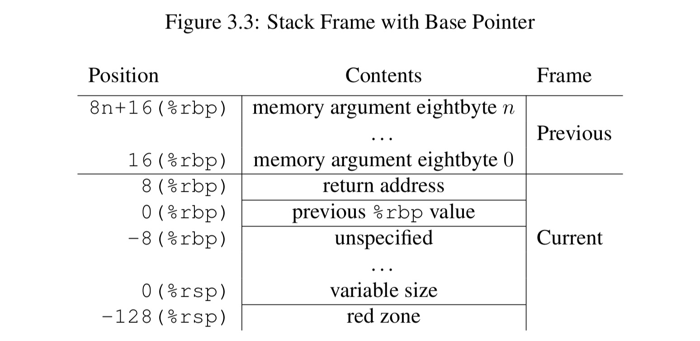

title: 'Arch - x86 Procedure Call Convention'
## Intel Arch - Procedure Call Convention

> System V Application Binary Interface from AMD64 Architecture Processor Supplement

本文描述的 x86_64 procedure call ABI 最初来源于 AMD x86_64 架构，之后的 Intel 64 架构也遵从该约定


### Register Usage


当调用子函数时，对于 integer 类型的参数

- RDI\RSI\RDX\RCX\R8\R9 这六个 64 bit general register 用于参数传递，因而子函数的前六个参数会依次传入这些寄存器
- 剩余的参数按照从右到左的顺序，依次保存到栈上


当子函数返回时，对于 integer 类型的参数

- 当子函数的返回值为 64 bit 时，使用 RAX 存储返回值
- 当子函数的返回值为 128 bit 时，使用 RAX 与 RDX 共同存储返回值


对于所有的 64 bit general register

- RDI\RSI\RDX\RCX\R8\R9 这 6 个寄存器用于传递子函数的参数
- RAX\RDX 用于返回子函数的返回值
- R10\R11 用于调用过程中临时使用
- 其余的 RBP\RBX\R12~R15 寄存器不用于 procedure call


#### callee-saved & caller-saved

callee-saved 和 caller-saved 实际上描述了 procedure call 过程中由谁（caller 还是 callee）负责保存和恢复寄存器的值。procedure call 过程中

- 由 caller 负责保存和恢复的寄存器，就称为 caller-saved 寄存器；procedure call 过程中，这些寄存器会保存在 caller 的栈帧中
- 由 callee 负责保存和恢复的寄存器，就称为 callee-saved 寄存器；procedure call 过程中，这些寄存器会保存在 callee 的栈帧中


例如 x86 64 bit procedure call 过程中

RAX\RCX\RDX\RDI\RSI\R8~R11 寄存器都用于保存 procedure call 的相关参数，caller（父函数）在调用 callee（子函数）的时候，需要在父函数的栈帧中保存这些寄存器的值；当子函数返回时，父函数需要恢复之前在父函数栈帧上保存的这些寄存器的值。因而这些寄存器实际为 caller-saved 寄存器。

而其余的 RBP\RBX\R12~R15 寄存器不用于 procedure call，而仍用于 general register，caller（父函数）在调用 callee（子函数）的时候，父函数不会在栈中保存这些寄存器的值，当子函数运行的时候，这些寄存器仍保留为父函数运行时这些寄存器的值，因而子函数会把 RBP\RBX\R12~R15 寄存器的值都先保存到子函数的栈帧中，之后子函数就可以覆盖这些寄存器的值了；之后在子函数返回之前，子函数会从子函数的栈帧中取出这些寄存器的值并进行恢复；等到子函数返回时，父函数看到的这些寄存器的值，仍然是父函数运行时这些寄存器的值。因而这些寄存器实际为 callee-saved 寄存器。


### Procedure Call Routine

1. 父函数调用子函数的过程中

- 保护现场
    - 在父函数的栈帧保存 RAX\RCX\RDX\RDI\RSI\R8~R11 这些寄存器的值
- 传递参数
    - RDI\RSI\RDX\RCX\R8\R9 这 6 个寄存器用于传递子函数的参数，因而子函数的前 6 个参数会依次传入这些寄存器
    - 当子函数的参数数量超过 6 个时，剩余的参数按照从右到左的顺序，依次保存到父函数栈帧上
- Intel 64 使用 call 指令完成子函数的调用，call 指令执行过程中，处理器硬件会
    - 将 RIP 寄存器的值即 return instruction pointer 保存到当前的栈帧上
    - 将跳转的子函数的地址加载到 RIP，之后即开始跳转执行该子函数


2. 刚刚跳转到子函数时

- 子函数需要保存 RBP 的值，即父函数的 stack frame base address，此时 RSP 即指向该父函数的 stack frame base address，此时将 RBP 更新为 RSP 的值，以开始一个新的栈帧，即子函数的栈帧底部存储父函数的 stack frame base address
- 当子函数需要使用 RBX\R12~R15 寄存器存储子函数中的局部变量时，需要事先保护现场，即在子函数的栈帧中保存这些寄存器的值
- 之后获取传递的参数
    - 首先通过 general register 获取最多 6 个参数
    - 当子函数的参数数量超过 6 个时，剩余的参数保存在父函数的栈帧上，此时可以通过 RBP 从父函数的栈帧上依次读取剩余的参数
- 之后即开始执行子函数中的逻辑


3. 子函数执行结束后，需要返回到父函数

- 恢复现场
    - 子函数的栈帧中保存 RBX\R12~R15 寄存器的值，此时现将栈帧中存储的值恢复到对应的寄存器中
    - 子函数的栈帧底部存储父函数的 RBP 值，因而将 RBP 寄存器的值更新为父函数的 RBP 值，从而恢复父函数的栈帧
- Intel 64 使用 ret 指令完成子函数的返回，ret 指令执行过程中，处理器硬件会
    - 父函数的栈帧的顶部存储返回地址（此时 RSP 寄存器即指向父函数的顶部），此时处理器硬件会根据 RSP 获取返回地址，并将其加载到 RIP，从而跳转回到父函数
    

4. 子函数返回到父函数之后，父函数需要

- 回退 RSP 的值，以清理之前父函数栈帧上保存的子函数参数
- 恢复现场，即恢复之前在父函数栈帧上保存的 RAX\RCX\RDX\RDI\RSI\R8~R11 这些寄存器的值


### Stack Frame



stack 向下增长，RSP 指向最后一个分配的单元

- RBP 保存当前函数的栈帧的基地址，即高地址；RSP 指向当前函数的栈帧的顶部，即低地址
- 当前函数栈帧的底部存储父函数的 RBP，而当前函数栈帧底部的前一个内存单元则存储返回地址，即调用当前函数的指令的下一条指令的地址


> 如何根据 stack frame 反推函数的参数

首先看单独一个 stack frame，下面是 fuse_lookup() 函数的 stack frame

```
 #6 [ffffc90021fe7bb8] fuse_lookup at ffffffff813f955e
    ffffc90021fe7bc0: d_alloc_parallel+157 0000000000000000
    ffffc90021fe7bd0: 0000000000000000 0000000000000000
    ffffc90021fe7be0: 0000000000000000 000062f0fecc0000
    ffffc90021fe7bf0: 000062f0fecc0000 ee54000000000000
    ffffc90021fe7c00: 0000082cee54082c 0000000000000000
    ffffc90021fe7c10: 0000000000000000 0000000151800000
    ffffc90021fe7c20: 0000000000000000 00000018c2760000
    ffffc90021fe7c30: 0000000cbb850000 0000000006680000
    ffffc90021fe7c40: 00006054271d0000 000062f0fecc0000
    ffffc90021fe7c50: [ffff8898917fa820:dentry] 0000000000000009
    ffffc90021fe7c60: [ffff8898900dedd0:dentry] ffffc90021fe7dc0
    ffffc90021fe7c70: __lookup_slow+134
 #7 [ffffc90021fe7c70] __lookup_slow at ffffffff812578e6
    ffffc90021fe7c78: ffffc90021fe7d00 ffffffff00000000
    ...
```

之前描述过，x86 架构下父函数通过 call 指令调用子函数 fuse_lookup()，而 call 命令会自动将返回地址压入子函数的栈帧中，作为子函数 (即 fuse_lookup()) 的栈帧的底部

```
 #6 [ffffc90021fe7bb8] fuse_lookup at ffffffff813f955e
    ...
    ffffc90021fe7c70: __lookup_slow+134                     <---- This two line
 #7 [ffffc90021fe7c70] __lookup_slow at ffffffff812578e6    <---- is same
    ...
```

然后反汇编 fuse_lookup()

```
/home/huanghang.huang/mydir/huanghang.huang/pvm-guest-tongyi-kernel/debug-sysbench/kernel-4.19/fs/fuse/dir.c: 351
0xffffffff813f9520 <fuse_lookup>:       call   0xffffffff81a01740 <__fentry__>
0xffffffff813f9525 <fuse_lookup+5>:     push   %r13
0xffffffff813f9527 <fuse_lookup+7>:     push   %r12
0xffffffff813f9529 <fuse_lookup+9>:     mov    %rsi,%r13
0xffffffff813f952c <fuse_lookup+12>:    push   %rbp
0xffffffff813f952d <fuse_lookup+13>:    push   %rbx
0xffffffff813f952e <fuse_lookup+14>:    mov    %rdi,%rbp
0xffffffff813f9531 <fuse_lookup+17>:    sub    $0x90,%rsp
```

可以看到刚进入 fuse_lookup() 的时候，分别将 r13/r12/rbp/rbx 入栈，因而根据栈帧就可以推断出刚进入 fuse_lookup() 的时候这些寄存器的值

```
 #6 [ffffc90021fe7bb8] fuse_lookup at ffffffff813f955e
    ...
    ffffc90021fe7c50: [ffff8898917fa820:dentry] 0000000000000009
                        rbx                         rbp
    ffffc90021fe7c60: [ffff8898900dedd0:dentry] ffffc90021fe7dc0
                        r12                         r13
    ffffc90021fe7c70: __lookup_slow+134
```

因而根据其父函数 (即 __lookup_slow()) 的反汇编，如果调用 fuse_lookup() 时，__lookup_slow() 函数的参数有保存在 r13/r12/rbp/rbx 寄存器中，那么就可以推断出 __lookup_slow() 函数的值
