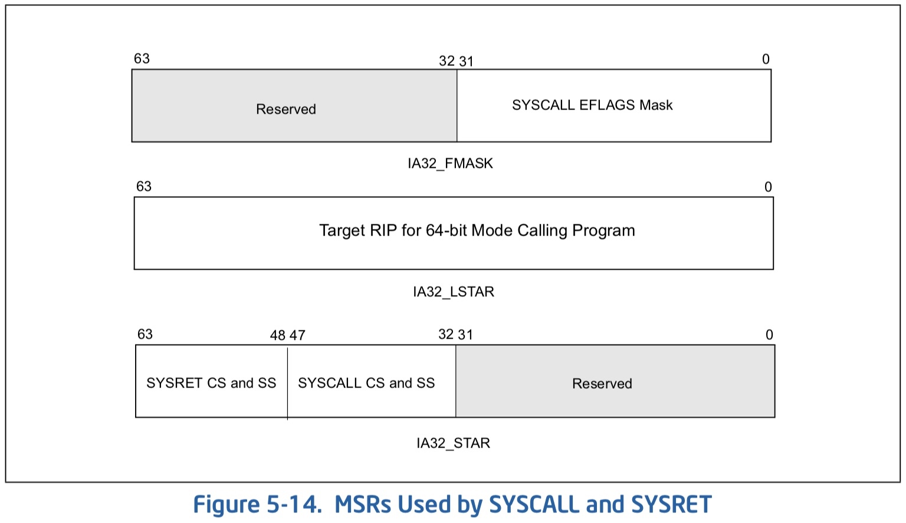

title: 'Arch - x86 Linux Kernel Convention'
## Arch - x86 Linux Kernel Convention

Procedure Call Convention 描述用户态内父函数调用子函数，或内核态内父函数调用子函数时，参数传递的一套约定。而 Linux Kernel Convention 则描述用户态通过 syscall 或 exception 陷入内核态时，参数传递的一套约定。


### Background

x86_64 架构下支持 SYSCALL/SYSRET 指令实现 fast system call，同时在 MSR 中新增 IA32_LSTAR/IA32_STAR/IA32_FMASK 寄存器以支持上述指令的实现

#### MSR

MSR (Model-Specific Register) 描述系统的相关功能实现，使用 RDMSR/WRMSR 指令对 MSR 寄存器进行读写。Intel 64 架构下新增 IA32_LSTAR/IA32_STAR/IA32_FMASK 寄存器，以支持 SYSCALL / SYSRET 指令的实现




> IA32_LSTAR

用户态程序执行 SYSCALL 指令后，会进入 privilege level 0 (内核态) 执行内核中 syscall 的入口函数，IA32_LSTAR (IA-32e Mode System Call Target Address Register) 即用于保存该入口函数的地址，64 bit

> IA32_STAR

IA32_STAR (System Call Target Address Register)

> IA32_FMASK

IA32_FMASK (System Call Flag Mask)


#### SYSCALL

SYSCALL 指令执行过程中，处理器硬件会自动执行

- RFLAGS 保存到 R11
- 根据 RIP 寄存器的值计算下一条执行指令的地址，将该地址保存到 RCX
- 接下来进入 privilege-level 0，并
    - RIP 的值来自 IA32_LSTAR
    - CS 的值来自 IA32_STAR[32:47]
    - SS 的值来自 (IA32_STAR[32:47] + 8)

#### SYSRET

SYSRET 指令返回到 64 bit priviledge-level 3 过程中，处理器硬件会自动执行

- RIP 的值来自 RCX，即之前保存的下一条执行的指令地址
- CS 的值来自 (IA32_STAR[48:63] + 16)
- SS 的值来自 (IA32_STAR[48:63] + 8)
- RFLAGS 的值来自 R11


### Linux Kernel Convention

之前介绍了 Linux Kernel Convention 是描述用户态通过 syscall 或 exception 陷入内核态时，参数传递的一套约定。

> 调用 syscall 时

- RAX 传递 syscall number
- 依次使用 RDI\RSI\RDX\R10\R8\R9 传递 syscall 的前 6 个参数
- syscall 最多只能有 6 个参数，因而没有参数需要传递到栈上

- 用户程序执行 SYSCALL 指令以调用 syscall，该过程中处理器硬件会自动
    - 将 RFLAGS 保存到 R11
    - 根据 RIP 寄存器的值计算下一条执行指令的地址，将该地址保存到 RCX

Linux Kernel Convention 使用 RDI\RSI\RDX\R10\R8\R9 传递 syscall 的前 6 个参数，相比于 Procedure Call Convention，RCX 被替换为了 R10，这是因为 SYSCALL 指令执行过程中，处理器硬件会占用 RCX 寄存器用于保存返回地址


> syscall 返回时

- 由 RAX 传递 syscall 的返回值，0 表示成功，负数表示失败

- 内核中执行 SYSRET 指令返回到用户态，此时处理器硬件会自动
    - RIP 的值来自 RCX，即之前保存的下一条执行的指令地址
    - RFLAGS 的值来自 R11


### Kernel Entry

#### init IA32_STAR/IA32_LSTAR

系统初始化阶段，start_kernel()->trap_init()->cpu_init()->syscall_init()

```c
void syscall_init(void)
{
	wrmsr(MSR_STAR, 0, (__USER32_CS << 16) | __KERNEL_CS);
	wrmsrl(MSR_LSTAR, (unsigned long)entry_SYSCALL_64);
	
	...

	/* Flags to clear on syscall */
	wrmsrl(MSR_SYSCALL_MASK,
	       X86_EFLAGS_TF|X86_EFLAGS_DF|X86_EFLAGS_IF|
	       X86_EFLAGS_IOPL|X86_EFLAGS_AC|X86_EFLAGS_NT);
}
```

其中将 entry_SYSCALL_64 函数的地址保存到 IA32_LSTAR 寄存器

用户程序执行 SYSCALL 指令时，处理器硬件会自动将 IA32_LSTAR 寄存器的值转移到 RIP 寄存器，因而其实际执行 entry_SYSCALL_64 函数


#### Intel 64 ptregs

```c
struct pt_regs {
/*
 * C ABI says these regs are callee-preserved. They aren't saved on kernel entry
 * unless syscall needs a complete, fully filled "struct pt_regs".
 */
	unsigned long r15;
	unsigned long r14;
	unsigned long r13;
	unsigned long r12;
	unsigned long bp;
	unsigned long bx;
/* These regs are callee-clobbered. Always saved on kernel entry. */
	unsigned long r11;
	unsigned long r10;
	unsigned long r9;
	unsigned long r8;
	unsigned long ax;
	unsigned long cx;
	unsigned long dx;
	unsigned long si;
	unsigned long di;
/*
 * On syscall entry, this is syscall#. On CPU exception, this is error code.
 * On hw interrupt, it's IRQ number:
 */
	unsigned long orig_ax;
/* Return frame for iretq */
	unsigned long ip;
	unsigned long cs;
	unsigned long flags;
	unsigned long sp;
	unsigned long ss;
/* top of stack page */
};
```

其中

- SS 保存在栈底部，即保存在高地址
- R15 保存在栈顶部，即保存在低地址


#### entry_SYSCALL_64

> 1

```s
/*
 * 64-bit SYSCALL instruction entry. Up to 6 arguments in registers.
 *
 * This is the only entry point used for 64-bit system calls.  The
 * hardware interface is reasonably well designed and the register to
 * argument mapping Linux uses fits well with the registers that are
 * available when SYSCALL is used.
 *
 * SYSCALL instructions can be found inlined in libc implementations as
 * well as some other programs and libraries.  There are also a handful
 * of SYSCALL instructions in the vDSO used, for example, as a
 * clock_gettimeofday fallback.
 *
 * 64-bit SYSCALL saves rip to rcx, clears rflags.RF, then saves rflags to r11,
 * then loads new ss, cs, and rip from previously programmed MSRs.
 * rflags gets masked by a value from another MSR (so CLD and CLAC
 * are not needed). SYSCALL does not save anything on the stack
 * and does not change rsp.
 *
 * Registers on entry:
 * rax  system call number
 * rcx  return address
 * r11  saved rflags (note: r11 is callee-clobbered register in C ABI)
 * rdi  arg0
 * rsi  arg1
 * rdx  arg2
 * r10  arg3 (needs to be moved to rcx to conform to C ABI)
 * r8   arg4
 * r9   arg5
 * (note: r12-r15, rbp, rbx are callee-preserved in C ABI)
 *
 * Only called from user space.
 *
 * When user can change pt_regs->foo always force IRET. That is because
 * it deals with uncanonical addresses better. SYSRET has trouble
 * with them due to bugs in both AMD and Intel CPUs.
 */

ENTRY(entry_SYSCALL_64)
```

当用户态程序调用 libc 发起 syscall 时，libc 会按照 Linux Kernel Convention 设置相应的寄存器，即

- RDI\RSI\RDX\R10\R8\R9 寄存器用于保存 syscall 的六个参数
- RAX 用于保存 syscall number


之后 libc 中会执行 SYSCALL 指令以发起 syscall，此时处理器硬件会自动设置相应的寄存器

- R11 保存 RFLAGS 的值
- RCX 保存返回地址，即根据 RIP 寄存器的值计算的下一条执行指令的地址


> 2

```s
	/*
	 * Interrupts are off on entry.
	 * We do not frame this tiny irq-off block with TRACE_IRQS_OFF/ON,
	 * it is too small to ever cause noticeable irq latency.
	 */
	SWAPGS_UNSAFE_STACK
	SWITCH_KERNEL_CR3_NO_STACK
```

> 3

```s
	/*
	 * A hypervisor implementation might want to use a label
	 * after the swapgs, so that it can do the swapgs
	 * for the guest and jump here on syscall.
	 */
GLOBAL(entry_SYSCALL_64_after_swapgs)

	movq	%rsp, PER_CPU_VAR(rsp_scratch)
	movq	PER_CPU_VAR(cpu_current_top_of_stack), %rsp
```

SYSCALL 指令执行时，硬件并没有自动保存 RSP，因而需要由软件保存 RSP，此时将当前进程的 RSP 的值保存到 per-CPU 变量 rsp_scratch

之后将内核栈加载到 RSP 寄存器


> 3

```s
	/* Construct struct pt_regs on stack */
	pushq	$__USER_DS			/* pt_regs->ss */
	pushq	PER_CPU_VAR(rsp_scratch) /* pt_regs->sp */
	pushq	%r11				/* pt_regs->flags */
	pushq	$__USER_CS			/* pt_regs->cs */
	pushq	%rcx				/* pt_regs->ip */
	pushq	%rax				/* pt_regs->orig_ax */
	pushq	%rdi				/* pt_regs->di */
	pushq	%rsi				/* pt_regs->si */
	pushq	%rdx				/* pt_regs->dx */
	pushq	%rcx				/* pt_regs->cx */
	pushq	$-ENOSYS			/* pt_regs->ax */
	pushq	%r8				/* pt_regs->r8 */
	pushq	%r9				/* pt_regs->r9 */
	pushq	%r10				/* pt_regs->r10 */
	pushq	%r11				/* pt_regs->r11 */
```

在内核栈上构造 pt_regs，保护现场，即保存用户态 (priviledge-level 3) 下各个寄存器的值

```s
	sub	$(6*8), %rsp			/* pt_regs->bp, bx, r12-15 not saved */
```

为 R12-R15、RBP、RBX 预留空间


> 4

syscall handler 的调用过程实现有两个版本

- 汇编版本的 fast path 即 entry_SYSCALL_64_fastpath
- C 函数版本的 slow path 即 entry_SYSCALL64_slow_path

```s
	/*
	 * If we need to do entry work or if we guess we'll need to do
	 * exit work, go straight to the slow path.
	 */
	movq	PER_CPU_VAR(current_task), %r11
	testl	$_TIF_WORK_SYSCALL_ENTRY|_TIF_ALLWORK_MASK, TASK_TI_flags(%r11)
	jnz	entry_SYSCALL64_slow_path
```

检查 thread_info 的标志位是否存在 trace 相关的标志

- 若存在这些标志则在调用 syscall handler 之前还需要执行 trace 相关的操作，这些操作实现为 C 函数，因而必须调用 slow path
- 若没有则可以直接执行 fast path


> 5 fast path

```s
entry_SYSCALL_64_fastpath:
	/*
	 * Easy case: enable interrupts and issue the syscall.  If the syscall
	 * needs pt_regs, we'll call a stub that disables interrupts again
	 * and jumps to the slow path.
	 */
	TRACE_IRQS_ON
	ENABLE_INTERRUPTS(CLBR_NONE)
```

打开中断


> 6

```s
#if __SYSCALL_MASK == ~0
	cmpq	$__NR_syscall_max, %rax
#else
	andl	$__SYSCALL_MASK, %eax
	cmpl	$__NR_syscall_max, %eax
#endif
```

rax 寄存器保存 syscall number，此时检查 syscall number 是否超出范围


```s
	ja	1f				/* return -ENOSYS (already in pt_regs->ax) */
	movq	%r10, %rcx
```

若 syscall number 超出范围，则跳转执行之后定义的第一个 label 1 处


> 7 call syscall handler

若之前检查 syscall number 在合法范围内，则直接调用执行 syscall table 中 syscall number 对应的 syscall handler

```s
	/*
	 * This call instruction is handled specially in stub_ptregs_64.
	 * It might end up jumping to the slow path.  If it jumps, RAX
	 * and all argument registers are clobbered.
	 */
	call	*sys_call_table(, %rax, 8)
```


> save return value of syscall

对应的 syscall handler 执行完成之后，将返回值保存到栈中

```s
	movq	%rax, RAX(%rsp)
```


`arch/x86/entry/calling.h` 中定义

```c
#define RAX		10*8
```

因而以上汇编指令实际为

```s
	movq	%rax, 80(%rsp)
```

80(%rsp) 是 Intel 指令中一种地址的编码格式，即 <displacement>(<base-address>) 的实际地址为 (<base-address> + <displacement>)，因而 80(%rsp) 实际描述地址 (%rsp + 80)

之前在 kernel stack 中构造完 pt_regs 之后，RSP 寄存器指向 pt_regs 中的 R15，因而地址 (%rsp + 80) 实际指向 pt_regs 中的 RAX


> 8 return to user

之前检查到 syscall number 超出范围时，会跳转执行之后定义的第一个 label 1 处以返回到用户态；或者 syscall handler 执行结束后也会执行 label 1 以返回到用户态

```s
1:

	/*
	 * If we get here, then we know that pt_regs is clean for SYSRET64.
	 * If we see that no exit work is required (which we are required
	 * to check with IRQs off), then we can go straight to SYSRET64.
	 */
	DISABLE_INTERRUPTS(CLBR_NONE)
	TRACE_IRQS_OFF
	movq	PER_CPU_VAR(current_task), %r11
	testl	$_TIF_ALLWORK_MASK, TASK_TI_flags(%r11)
	jnz	1f
```
	
检查当前 thread_info 的标志位是否有 trace 相关的标志，若有则说明当前在返回到用户态之前还要执行 trace 相关的操作，此时需要跳转到之后的 1 label 处，其中执行 syscall_return_slowpath

> return to user slow path

```s
1:
	/*
	 * The fast path looked good when we started, but something changed
	 * along the way and we need to switch to the slow path.  Calling
	 * raise(3) will trigger this, for example.  IRQs are off.
	 */
	TRACE_IRQS_ON
	ENABLE_INTERRUPTS(CLBR_NONE)
	SAVE_EXTRA_REGS
	movq	%rsp, %rdi
	call	syscall_return_slowpath	/* returns with IRQs disabled */
	jmp	return_from_SYSCALL_64
```

> return to user fast path

```s
	LOCKDEP_SYS_EXIT
	TRACE_IRQS_ON		/* user mode is traced as IRQs on */
	movq	RIP(%rsp), %rcx
	movq	EFLAGS(%rsp), %r11
	RESTORE_C_REGS_EXCEPT_RCX_R11
```

否则将之前在 kernel stack上保存的 下一条执行指令地址 以及 REFLAGS 寄存器的值，即 pt_regs 中的 RIP、FLAGS 字段恢复到 RCX、R11 寄存器中


```s
	/*
	 * This opens a window where we have a user CR3, but are
	 * running in the kernel.  This makes using the CS
	 * register useless for telling whether or not we need to
	 * switch CR3 in NMIs.  Normal interrupts are OK because
	 * they are off here.
	 */
	SWITCH_USER_CR3
	movq	RSP(%rsp), %rsp
	USERGS_SYSRET64
```

最后返回到用户态


> 9 slow path

slow path 中调用执行 do_syscall_64

```s
entry_SYSCALL64_slow_path:
	/* IRQs are off. */
	SAVE_EXTRA_REGS
	movq	%rsp, %rdi
	call	do_syscall_64		/* returns with IRQs disabled */
```

> 10 do_syscall_64

`arch/x86/entry/common.c` 中定义 do_syscall_64

```c
__visible void do_syscall_64(struct pt_regs *regs)
{
	struct thread_info *ti = current_thread_info();
	unsigned long nr = regs->orig_ax;

	enter_from_user_mode();
	local_irq_enable();

	if (READ_ONCE(ti->flags) & _TIF_WORK_SYSCALL_ENTRY)
		nr = syscall_trace_enter(regs);

	/*
	 * NB: Native and x32 syscalls are dispatched from the same
	 * table.  The only functional difference is the x32 bit in
	 * regs->orig_ax, which changes the behavior of some syscalls.
	 */
	if (likely((nr & __SYSCALL_MASK) < NR_syscalls)) {
		regs->ax = sys_call_table[nr & __SYSCALL_MASK](
			regs->di, regs->si, regs->dx,
			regs->r10, regs->r8, regs->r9);
	}

	syscall_return_slowpath(regs);
}
```

slow path 中在调用执行 syscall table 中 syscall number 对应的 syscall handler 前后，还会执行 trace 相关的操作


