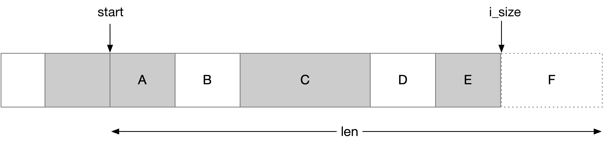

title:'netfs - request'
## netfs - request


#### netfs_io_request

struct netfs_io_request 描述对 @inode/@mapping 缓存文件 (@start, @len) 区间执行的一次 IO request

```c
struct netfs_io_request {
	struct inode		*inode;		/* The file being accessed */
	struct address_space	*mapping; /* The mapping being accessed */

	size_t			len;		/* Length of the request */
	loff_t			start;		/* Start position */
	...
};
```


一个 request 可以拆分为多个 subrequest，struct netfs_read_subrequest 就描述一个 subrequest

```c
struct netfs_read_subrequest {
	loff_t			start;		/* Where to start the I/O */
	size_t			len;		/* Size of the I/O */
	...
}
```

request 的 @subrequests 链表就组织其对应的所有 subrequest

```c
struct netfs_read_request {
	struct list_head	subrequests; /* Requests to fetch I/O from disk or net */
	...
};
```


下图描述了一个 request 拆分为 A/B/C/D/E/F 多个 subrequest 的情形




- A/C/E 为 NETFS_READ_FROM_CACHE，对应的数据已经在 backing file 中 ready，因而直接从 backing file 读取就好
- B/D 为 NETFS_DOWNLOAD_FROM_SERVER，对应在 backing file 中是 hole，此时就必须从远端拉取
- F 为 NETFS_FILL_WITH_ZEROES，属于 EOF 访问，此时直接填零处理


### refcount management

#### nr_outstanding

之前介绍过一个 request 可能拆分为多个 subrequest，此时 request 的 @nr_outstanding 计数描述了这个 request 对应的 subrequest 中，还有多少 subrequest 还没有完成；当 @nr_outstanding 计数变为 0 的时候，就说明这个 request 对应的所有 subrequest 都已经完成了

```c
struct netfs_read_request {
	atomic_t		nr_outstanding;	/* Number of ops in progress */
	...
};
```

request 处理过程中，每次下发一个 subrequest 的时候，都会增加 @nr_outstanding 计数

```sh
netfs_read_folio
    # allocate request
    
    netfs_begin_read
        atomic_set(&rreq->nr_outstanding, 1); // initial refcount
    
        # for each sub request
        netfs_rreq_submit_slice
            netfs_rreq_prepare_read
            atomic_inc(&rreq->nr_outstanding) // inc refcount
            # submit each subrequest

        atomic_dec_and_test(&rreq->nr_outstanding) // drop initial refcount
```    

下发的 subrequest 可以是异步的，此时下发完所有 subrequest 之后，需要等待所有的 subrequest 完成；每个 subrequest 完成的时候，在 completion 操作中会减去 @nr_outstanding 计数

```sh    
# on subrequest completion
netfs_subreq_terminated
    # completion operation
    
    atomic_dec_return(&rreq->nr_outstanding) // dec refcount
    
    # if @nr_outstanding decreased to 0 (all subrequests completed):
        netfs_rreq_terminated(rreq, ...)
```


当 @nr_outstanding 计数变为 0 的时候，就说明这个 request 对应的所有 subrequest 都已经完成了，此时就会执行该 request 的 completion 操作，例如对该 request 范围内的 folio 设置 PG_uptodate 以及 unlock 操作

```sh
# @nr_outstanding refcount decreased to 0
netfs_rreq_terminated(rreq, ...)
    netfs_rreq_assess(rreq, ...)
        netfs_rreq_unlock_folios(rreq) // mark PG_uptodate and unlock
        netfs_rreq_completed(rreq, ...)
            netfs_clear_subrequests
            netfs_put_request
```    


#### subrequest's lifecycle

subrequest 的 @ref 计数用于实现 subrequest 的生命周期管理

```c
struct netfs_io_subrequest {
	refcount_t		ref;
	...
}
```

subrequest 一开始的计数为 2，其中一个为 initial refcount (subrequest 完成的时候减去，无论是 error path 中提前完成该 subrequest，还是最终该 subrequest 异步完成的时候)

另一个计数是来自 @rreq->subrequests 链表的引用，subrequest 分配出来后就会添加到 @rreq->subrequests 链表中，此时会持有一个对该 subrequest 的引用，后面整个 request 完成、从而清理 @rreq->subrequests 链表中的 subrequest 的时候，就会减去该引用

```sh
netfs_read_folio
    # allocate request
    netfs_begin_read    
        # for each sub request
        netfs_rreq_submit_slice
            # allocate subrequest
                refcount_set(&subreq->ref, 2) // initial refcount
            
            # add this subrequest into @rreq->subrequests list
            atomic_inc(&rreq->nr_outstanding)
            ...

            # submit each subrequest
```


每个 subrequest 完成的时候，会调用 netfs_put_subrequest() 减去该 subrequest 的初始计数，此时这个 subrequest 的计数变为 1，因而此时还不会触发该 subrequest 的清理，此时这些 subrequest 仍然保存在 @rreq->subrequests 链表中

之前介绍过，每个 subrequest 完成的时候，在 completion 操作中会减去 @nr_outstanding 计数；当最后一个 subrequest 完成的时候，@nr_outstanding 计数变为 0，此时就会触发 request 的 completion 操作，其中对于 @rreq->subrequests 链表中的每个 subrequest 调用 netfs_put_subrequest() 以减去该 subrequest 的计数，这个时候 subrequest 的计数就会减为 0，从而触发 subrequest 的回收

```sh    
# on subrequest completion
netfs_subreq_terminated
    # completion operation
    atomic_dec_return(&rreq->nr_outstanding)
    # if @nr_outstanding decreased to 0:
        netfs_rreq_terminated(rreq, ...)
            netfs_rreq_assess(rreq, ...)
                netfs_rreq_unlock_folios(rreq) // mark PG_uptodate and unlock
                netfs_rreq_completed(rreq, ...)
                    netfs_clear_subrequests(rreq, ...)
                        # for each subrequest in @rreq->subrequests list:
                            # remove this subrequest from list
                            netfs_put_subrequest(subreq, ...) // decrease ref referred by @subrequests list

    netfs_put_subrequest(subreq, ...) // drop initial refcount
        __refcount_dec_and_test(&subreq->ref, ...) 
        # if decreased to 0:
            netfs_free_subrequest
                kfree(subreq)
```


#### request's lifecycle

request 的 @ref 计数用于实现 request 的生命周期管理

```c
struct netfs_io_request {
	refcount_t		ref;
	...
}
```


一开始分配 request 的时候有一个初始计数

```sh
netfs_read_folio
    # allocate request
        refcount_set(&rreq->ref, 1) // initial refcount
    netfs_begin_read    
        # for each sub request
        netfs_rreq_submit_slice
            # submit each subrequest
```

每个 subrequest 维护一份对该 request 的引用

```sh
netfs_read_folio
    # allocate request
    netfs_begin_read    
        # for each sub request
        netfs_rreq_submit_slice
            # allocate subrequest
                refcount_set(&subreq->ref, 2)
                subreq->rreq = rreq
                netfs_get_request(rreq, ...) // inc refcount
            
            # add this subrequest into @rreq->subrequests list
            atomic_inc(&rreq->nr_outstanding)
            ...

            # submit each subrequest
```


subrequest 的计数减为 0 的时候，在回收 subrequest 的过程中，就会减去 subrequest 对该 request 的引用

```
# completion of request
netfs_rreq_completed(rreq, ...)
    netfs_clear_subrequests(rreq, ...)
        # for each subrequest in @rreq->subrequests list:
            # remove this subrequest from list
            netfs_put_subrequest(subreq, ...)
                __refcount_dec_and_test(&subreq->ref, ...) 
                # if decreased to 0:
                    netfs_free_subrequest
                        kfree(subreq)
                        netfs_put_request(rreq, ...) // decrease ref referred by subrequest
```

当 request 的所有 subrequest 完成的时候，即 @nr_outstanding 计数变为 0 的时候，就会触发该 request 的 completion 操作，其中就会减去该 request 的初始计数，从而使得 request 的计数变为 0，从而触发 request 的回收

```
# completion of request
netfs_rreq_completed(rreq, ...)
    netfs_clear_subrequests(rreq, ...)
        # for each subrequest in @rreq->subrequests list:
            # remove this subrequest from list
            netfs_put_subrequest(subreq, ...)
                __refcount_dec_and_test(&subreq->ref, ...) 
                # if decreased to 0:
                    netfs_free_subrequest
                        kfree(subreq)
                        netfs_put_request(rreq, ...) // decrease ref referred by subrequest

    netfs_put_request(rreq, ...) // drop initial refcount
        # if decreased to 0:
            netfs_free_request
                netfs_clear_subrequests
                kfree(rreq)
```


### netfs_rreq_unlock_folios